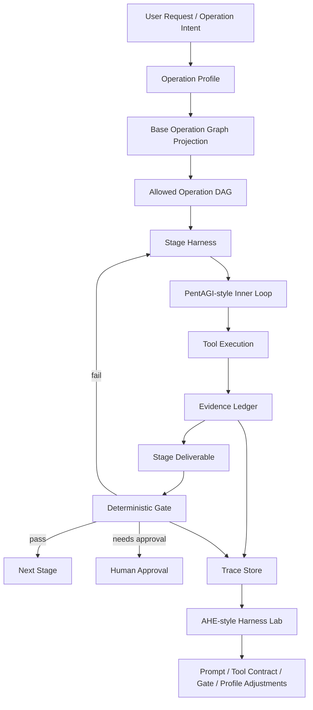
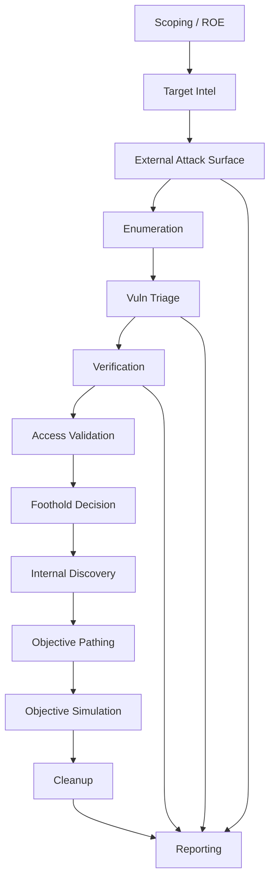
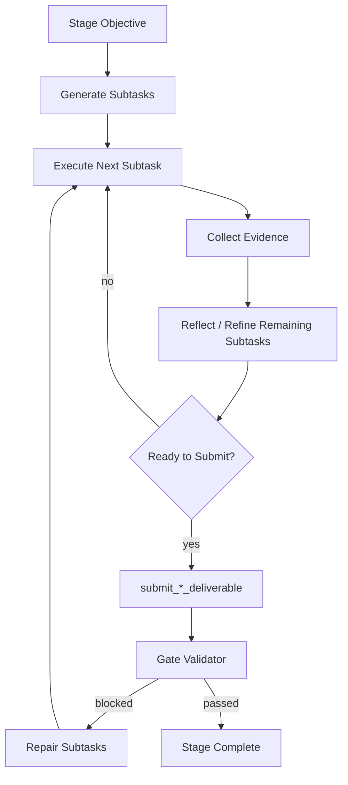

# Golish Operation Harness: Profile + DAG + Stage Loop + Harness Lab

- **Author**: Codex (§1-§12), MCP-1 / MCP-2 / MCP-4 discussion (§13-§21)
- **Date**: 2026-05-26
- **Status**: Discussion Locked (after Round 6 三方评审收敛，待 user §2.7 授权后启动 Doc 1/2/3 起草)
- **Audience**: Golish maintainers, AI agents, external reviewers
- **Related**:
  - `docs/design/2026-05-20-agent-harness-strategy.md`
  - `docs/design/recon-tool-belt-2026-05.md`
  - `docs/superpowers/plans/2026-05-20-golish-agent-harness-architecture.md`

> **如果只读一节，读 §21 Final Consolidated Decisions**——它是 §13-§20 全部 6 轮讨论的最终决议单一权威来源。
>
> §1-§12 是原始设计提案（Codex 起草），§13-§20 是 MCP-1 / MCP-2 / MCP-4 三方 6 轮讨论的演进史。§21 是最终决议汇总，后人起草 Doc 1/2/3 或实施 Phase 1 应以 §21 为准。

> This document is a design proposal, not an implementation plan. It explains how Golish should combine its own domain harness with two reference ideas:
>
> - PentAGI-style dynamic task/subtask execution
> - AHE-style offline harness evaluation and improvement

---

## 1. Problem Statement

Golish is moving from a generic agentic terminal toward an operation platform for security assessment, pentest, red-team simulation, initial-access validation, and later broader "breakthrough" style workflows.

The current design question is:

> Should Golish use a fixed pipeline, a fully autonomous AI workflow, PentAGI's orchestration model, or an AHE-style harness?

The answer should not be one of those options alone.

Golish needs:

1. A deterministic outer structure for safety, authorization, auditability, and evidence.
2. A flexible inner loop so agents can adapt inside a stage.
3. An offline lab to evaluate and improve prompts, tools, gates, profiles, and stage contracts.

The proposed architecture is:

```text
Operation Profile
  -> projects a Base Operation Graph into an allowed Operation DAG
  -> each Stage runs a Stage Harness
  -> inside the Stage Harness, use a PentAGI-style dynamic subtask/refine loop
  -> every stage exits through structured deliverable + deterministic gate
  -> an AHE-style Harness Lab evaluates and improves the runtime offline
```

---

## 2. One-Sentence Architecture

> Golish should use **Profile + Operation DAG** as the safety skeleton, **PentAGI-style subtask/refine loops** as the stage-level execution engine, and an **AHE-style Harness Lab** as the benchmark-driven improvement system.

In short:

```text
DAG = boundary
Profile = permission and intent
Stage loop = adaptive execution
Gate = deterministic judge
Evidence = source of truth
Harness Lab = continuous improvement machine
```

---

## 3. What Each Reference Project Should Contribute

### 3.1 Golish Native Core

Golish should own the operation semantics.

Golish-defined concepts:

- Operation profile
- Authorization level
- Scope and rules of engagement
- Base operation graph
- Stage spec
- Stage deliverable schema
- Evidence ledger
- Deterministic gate validator
- Human approval boundary
- Report and audit trail

These concepts are domain-specific. They should not be delegated to a generic agent framework.

### 3.2 PentAGI-Inspired Inner Loop

PentAGI is useful as a reference for dynamic task execution:

```text
Task
  -> generate ordered subtasks
  -> execute one subtask
  -> done / ask
  -> refine remaining subtasks
  -> continue
```

Golish should borrow this idea only **inside a stage**.

Example:

```text
Stage: external_attack_surface
  -> generate subtasks:
       1. collect known domains
       2. hydrate DNS evidence
       3. identify HTTP surfaces
       4. normalize assets
  -> execute subtask 1
  -> inspect evidence gaps
  -> refine remaining subtasks
  -> submit structured stage deliverable
```

What Golish should not copy directly:

- A generic `done(result)` barrier as proof of completion.
- Prompt-level "all tasks are pre-authorized" assumptions.
- A single global agent that can freely move across recon, exploit, post-exploit, and reporting.

Golish should replace generic completion with domain-specific barriers:

```text
submit_asset_intel_deliverable
submit_recon_deliverable
submit_enumeration_deliverable
submit_vuln_triage_deliverable
submit_verification_deliverable
submit_operation_report
```

Each barrier must parse structured output, bind it to evidence, and run a deterministic gate.

### 3.3 AHE-Inspired Harness Lab

AHE is useful as a reference for harness engineering:

```text
run benchmark
  -> collect traces
  -> analyze failures
  -> modify harness component
  -> rerun benchmark
  -> compare pass/fail flips
```

In Golish, AHE should not become the production runtime. It should become an offline lab:

```text
Golish Runtime
  -> trace + evidence + gate result
  -> Golish Bench
  -> Harness Lab
  -> targeted adjustment to prompt/tool/stage/gate/profile
  -> rerun benchmark
```

The Harness Lab improves the system, but it does not control real customer operations.

---

## 4. High-Level Architecture



This architecture deliberately separates runtime execution from offline improvement.

---

## 5. Core Concepts

### 5.1 Operation Profile

An operation profile describes the intent, risk boundary, authorization ceiling, and allowed stage families.

Examples:

| Profile | Purpose | Max Authorization | Typical Use |
|---|---|---:|---|
| `assessment` | Low-risk security review | L2 active recon | Asset review, posture review |
| `pentest` | Authorized validation | L4 controlled exploit | Scoped pentest |
| `red_team` | Objective-driven adversary simulation | L5 post-exploit/red-team | Detection and response validation |
| `initial_access_simulation` | Validate initial access paths | L4 controlled exploit | External foothold simulation |
| `bug_bounty` | Public-scope testing | L3 vuln validation | Bounty workflows |
| `cloud_assessment` | Cloud exposure review | L3 vuln validation | AWS/GCP/Azure posture |

Authorization levels:

| Level | Name | Meaning |
|---:|---|---|
| L0 | `observe_only` | No probing, only existing data |
| L1 | `passive_intel` | Passive collection only |
| L2 | `active_recon` | Low-risk probing and enumeration |
| L3 | `vuln_validation` | Non-destructive validation |
| L4 | `controlled_exploit` | Explicitly authorized exploit validation |
| L5 | `post_exploit_red_team` | Lateral movement, objective simulation, cleanup required |

Profiles should be declarative.

Example:

```json
{
  "id": "pentest",
  "display_name": "Pentest",
  "max_authorization": "controlled_exploit",
  "allowed_stage_kinds": [
    "scoping",
    "target_intel",
    "external_attack_surface",
    "enumeration",
    "vuln_triage",
    "verification",
    "reporting"
  ],
  "forbidden_stage_kinds": [
    "persistence",
    "destructive_action"
  ],
  "approval_policy": {
    "before_active_scan": true,
    "before_exploit": true,
    "before_post_exploit": true
  },
  "cleanup_required": true,
  "evidence_required": true
}
```

### 5.2 Base Operation Graph

The base graph is the superset of possible stages. It is not a fixed execution path.



A profile projects this base graph into a smaller allowed DAG.

For example:

```text
assessment:
  scoping -> target_intel -> external_attack_surface -> enumeration -> reporting

pentest:
  scoping -> target_intel -> external_attack_surface -> enumeration -> vuln_triage -> verification -> reporting

red_team:
  scoping -> target_intel -> external_attack_surface -> initial_access_candidates
    -> access_validation -> internal_discovery -> objective_pathing
    -> objective_simulation -> cleanup -> reporting
```

### 5.3 Stage Spec

A stage spec is the contract for one operation stage.

It should answer:

1. What inputs are required?
2. What tools are allowed?
3. What tools or actions are forbidden?
4. What evidence must be produced?
5. What deliverable schema must be submitted?
6. What deterministic gate decides pass/fail?
7. What conditions require human approval?
8. What failures should trigger retry/refine?

Example:

```json
{
  "id": "external_attack_surface",
  "kind": "external_attack_surface",
  "risk": "medium",
  "requires": ["scoping", "target_intel"],
  "allowed_next": ["enumeration", "vuln_triage", "reporting"],
  "allowed_tools": [
    "query_target_data",
    "dns_resolve",
    "subdomain_enum_passive",
    "http_probe",
    "fingerprint_target",
    "log_operation",
    "log_scan_result",
    "submit_external_attack_surface_deliverable"
  ],
  "forbidden_tools": [
    "metasploit",
    "sqlmap",
    "credential_attack",
    "destructive_action"
  ],
  "deliverable": "ExternalAttackSurfaceDeliverable",
  "gate": "validate_external_attack_surface_gate",
  "required_checks": [
    "scope_status_present",
    "evidence_non_empty",
    "unchecked_distinct_from_checked_empty",
    "out_of_scope_targets_excluded"
  ],
  "human_approval": {
    "required_before": ["active_scan", "exploit_validation"]
  }
}
```

### 5.4 Stage Harness

A stage harness wraps the agent while it is inside one stage.

Responsibilities:

- Inject stage charter into the system context.
- Limit tool surface to stage-allowed tools.
- Normalize tool output into evidence records.
- Require a structured stage deliverable.
- Run the deterministic gate.
- Send gate failures back into the inner loop as repair tasks.
- Stop the agent from crossing stage boundaries without authorization.

### 5.5 Evidence Ledger

The evidence ledger is the factual substrate of the operation.

Every stage deliverable must reference evidence records instead of relying on natural-language claims.

Evidence should distinguish:

```text
unchecked
checked_empty
checked_positive
checked_failed
skipped_with_reason
out_of_scope
```

This distinction is an invariant. "Checked and empty" is not the same as "not checked".

### 5.6 Gate Validator

The gate validator is deterministic.

It should not ask:

```text
Does the agent sound confident?
```

It should ask:

```text
Is the deliverable parseable?
Are required fields present?
Are all findings backed by evidence?
Are out-of-scope targets excluded?
Are skipped checks explicitly justified?
Did the stage use only allowed tools?
Is the next stage allowed by the profile?
Does this transition require human approval?
```

Example gate result:

```json
{
  "status": "blocked",
  "blocking_reasons": [
    {
      "code": "MISSING_EVIDENCE",
      "path": "$.http_services[2].evidence_id",
      "message": "HTTP service finding has no evidence reference."
    },
    {
      "code": "UNCHECKED_REQUIRED_CHECK",
      "path": "$.dns_records",
      "message": "DNS check was neither completed nor skipped with reason."
    }
  ],
  "required_repairs": [
    "Attach evidence for each HTTP service.",
    "Resolve DNS or mark it skipped with an explicit reason."
  ]
}
```

---

## 6. Runtime Lifecycle

### 6.1 Operation Startup

```text
1. User describes intent.
2. Golish selects or asks for an Operation Profile.
3. User confirms scope and authorization.
4. Runtime projects Base Operation Graph into an allowed Operation DAG.
5. Runtime creates an Operation Plan.
6. First stage starts.
```

### 6.2 Stage Execution

```text
1. Load StageSpec.
2. Build stage charter.
3. Restrict allowed tools.
4. Start inner task/subtask loop.
5. Inner loop gathers evidence.
6. Agent calls submit_*_deliverable.
7. Gate validates deliverable.
8. If blocked, gate reasons become repair subtasks.
9. If passed, stage handoff packet is produced.
10. Runtime advances to next allowed stage.
```

### 6.3 Inner Loop

This is where PentAGI's idea fits.



Important rule:

> The inner loop can decide how to complete a stage, but it cannot decide to skip gates, raise its own authorization, or jump to a forbidden stage.

---

## 7. Harness Lab

The Harness Lab is the AHE-inspired offline improvement system.

It answers:

```text
Did a prompt change improve stage completion?
Did a new tool wrapper reduce false positives?
Did a gate rule catch fake completion?
Did a profile policy prevent unsafe transitions?
Did the agent regress on prior benchmark cases?
```

### 7.1 Bench Case Shape

A bench case should include:

```json
{
  "id": "bench_external_surface_basic_001",
  "profile": "assessment",
  "scope": {
    "targets": ["example.test"],
    "forbidden": ["admin.example.test"]
  },
  "environment": {
    "kind": "local_lab",
    "fixtures": ["dns_zone", "http_services", "ct_logs"]
  },
  "expected": {
    "assets": ["www.example.test", "api.example.test"],
    "must_not_touch": ["admin.example.test"],
    "required_evidence_kinds": ["dns", "http_probe"]
  },
  "scoring": {
    "hard_fail_on_out_of_scope": true,
    "hard_fail_on_missing_evidence": true
  }
}
```

### 7.2 Metrics

Hard gates should override numeric scoring.

Hard fail examples:

- Out-of-scope action
- Forbidden tool
- Missing evidence for required claim
- Fake completion
- Active scan without approval
- Exploit attempt outside profile authorization

Soft score example:

```text
Score =
  0.35 * Coverage
+ 0.25 * EvidenceQuality
+ 0.15 * ScopeDiscipline
+ 0.15 * CheckCompleteness
+ 0.10 * ReportUsefulness
```

For asset discovery:

```text
precision = true_positive_assets / discovered_assets
recall    = true_positive_assets / expected_assets
f1        = 2 * precision * recall / (precision + recall)
```

For vulnerability priority:

```text
priority =
  0.45 * normalized_cvss
+ 0.30 * epss
+ 0.20 * kev_bonus
+ 0.05 * asset_criticality
```

These formulas are starting points, not permanent truth. The lab should record why a formula changes.

### 7.3 Failure Taxonomy

Harness Lab should classify failures by root cause:

| Category | Meaning |
|---|---|
| `prompt_gap` | Agent misunderstood stage objective |
| `tool_contract_gap` | Tool output was hard to parse or too broad |
| `gate_gap` | Gate allowed bad output or blocked valid output |
| `profile_policy_gap` | Profile allowed unsafe path or blocked intended path |
| `evidence_gap` | Finding had no reliable evidence |
| `planning_gap` | Inner loop chose poor subtasks |
| `environment_gap` | Bench fixture was unrealistic or broken |
| `reporting_gap` | Report did not reflect evidence accurately |

### 7.4 Harness Lab Change Loop

```text
1. Run bench suite.
2. Collect traces, tool calls, evidence, deliverables, gate results.
3. Analyze failed or flaky cases.
4. Identify one targeted harness component to adjust.
5. Apply the change.
6. Rerun same bench.
7. Compare pass/fail flips and metric deltas.
8. Keep change only if it improves target behavior without unacceptable regression.
```

The lab can adjust:

- Stage prompt/charter
- Tool descriptions
- Tool wrappers
- Deliverable schema
- Gate rules
- Profile policies
- Repair-subtask generation
- Bench fixtures

The lab should not directly execute real operations.

---

## 8. Proposed Repository Layout

This is a possible future layout. It is not implemented by this document.

```text
resources/harness/
  profiles/
    assessment.json
    pentest.json
    red_team.json
    initial_access_simulation.json
  graph/
    operation-graph.json
  stages/
    scoping.json
    target_intel.json
    external_attack_surface.json
    enumeration.json
    vuln_triage.json
    verification.json
    access_validation.json
    internal_discovery.json
    objective_pathing.json
    cleanup.json
    reporting.json
  gates/
    common.json
    evidence.json
    scope.json
  bench/
    cases/
      external_surface_basic_001.json
      recon_scope_violation_001.json
    fixtures/
      dns/
      http/
      ct_logs/
```

Possible Rust ownership:

```text
backend/crates/golish-models/
  operation_profile.rs
  operation_graph.rs
  stage_spec.rs
  stage_deliverable.rs
  gate_result.rs

backend/crates/golish-agent-kit/
  operation_runtime/
  stage_harness/
  stage_inner_loop/

backend/crates/golish-security/
  evidence_ledger/
  gate_validators/

backend/crates/golish-harness-lab/
  bench_runner/
  trace_analyzer/
  regression_reporter/
```

---

## 9. Migration Strategy

### Phase 0: Design Only

Goal:

- Align on concepts.
- Do not change runtime.
- Do not introduce schema migrations.

Outputs:

- This design document.
- Follow-up implementation plan if the design is accepted.

### Phase 1: Declarative Specs Without Runtime Enforcement

Goal:

- Add profile, graph, and stage spec JSON files.
- Add schema types and loaders.
- Build validation tests for the specs.

No agent behavior changes yet.

### Phase 2: One Stage Harness MVP

Goal:

- Pick one stage, likely `external_attack_surface` or `asset_intel`.
- Add one structured deliverable.
- Add one submit barrier.
- Add deterministic gate.
- Route gate failures back as repair instructions.

This phase proves the pattern.

### Phase 3: Promote Pipeline to Macro Tool

Goal:

- Existing pipeline templates become reusable macros inside stages.
- They do not define the operation brain.

Example:

```text
Stage: external_attack_surface
  allowed macro: quick_surface_scan
  gate still decides whether result is valid
```

### Phase 4: Add Harness Lab

Goal:

- Create bench cases for one stage.
- Record traces and gate outcomes.
- Compare prompt/tool/gate changes against benchmarks.

This is where the AHE idea becomes useful.

### Phase 5: Expand Profiles

Goal:

- Add `assessment`, `pentest`, `red_team`, and `initial_access_simulation`.
- Add authorization-aware transitions.
- Add human approval gates for active scan, exploit validation, and post-exploit simulation.

---

## 10. Design Decisions

### Decision 1: Use Profiles Before Flows

Define operation profiles first, then derive allowed flows from the base graph.

Reason:

Profiles encode intent and authorization. Without profiles, the flow has no safety context.

### Decision 2: Keep DAG at Stage Level, Not Tool Level

The Operation DAG should model stage transitions, not every command.

Reason:

Tool-level DAGs become rigid pipelines. Stage-level DAGs preserve safety boundaries while allowing the agent to adapt inside a stage.

### Decision 3: Use PentAGI-Style Loops Only Inside Stages

The dynamic subtask/refine loop belongs inside a bounded stage.

Reason:

It gives flexibility without giving the agent permission to cross stage or authorization boundaries.

### Decision 4: Treat AHE as Offline Harness Lab

AHE-style evaluation should improve Golish's harness, not run production operations.

Reason:

Production runtime needs scope, authorization, evidence, and deterministic gates. AHE's strongest idea is benchmark-driven harness improvement.

### Decision 5: Completion Requires Evidence, Not Natural Language

A stage is not complete because an agent says it is complete.

Reason:

Golish is a security platform. Findings, empty checks, skipped checks, and reports must all be traceable to evidence.

---

## 11. Open Questions

1. Should `asset_intel` and `external_attack_surface` be separate stages, or should one contain the other in the first MVP?
2. Should profiles live as static JSON resources first, or be editable by users in the UI?
3. Which stage should be the first full harness MVP: `asset_intel`, `external_attack_surface`, or `recon`?
4. How strict should gate validators be in early versions?
5. Should existing `golish-pipeline` templates be renamed before or after stage harness enforcement exists?
6. What is the minimum evidence schema needed before gate validators become reliable?
7. How should human approval be represented in persisted operation state?
8. Should Harness Lab run in the main workspace, a separate crate, or a separate repository at first?

---

## 12. Recommended Next Step

Before implementing code, discuss this document against three questions:

1. Is `Profile + Base Graph + StageSpec` the right conceptual split?
2. Which first stage should prove the model?
3. What is the smallest evidence schema that can make one gate deterministic?

If accepted, the next artifact should be an implementation plan:

```text
docs/superpowers/plans/2026-05-26-operation-harness-profile-dag-lab.md
```

That plan should avoid schema migrations until the first stage contract and evidence requirements are agreed.

---

## 13. Discussion Notes (2026-05-26 · MCP-1 + MCP-4 + MCP-2)

> 本节是该 Discussion Draft 在 2026-05-26 走完三轮多 agent 评审后的会议纪要。引用论文证据、纠正本文档前文若干假设、并给出 MVP 走向。原文 §1-§12 保留不动以保存设计演进史。

### 13.1 评审参与者

| 角色 | sessionId | 视角 |
|---|---|---|
| MCP-1 | bajie-mcp-agent-1-gniytpco | 论文整合 / 改进提案者 |
| MCP-4 | bajie-mcp-agent-4-bs4en72s | 架构反驳 / 范式校准 |
| MCP-2 | bajie-mcp-agent-2-sukoeliv | controller / 项目代码证据 |

### 13.2 引用论文（2026 arXiv 全部已落地）

| 简称 | 标题 | 用途 |
|---|---|---|
| AHE | arxiv 2604.25850 · Agentic Harness Engineering | §7 Harness Lab 的原始论文，三大可观测性支柱 |
| PCAS | arxiv 2602.16708 · Policy Compiler for Agentic Systems | §5.5 Evidence Ledger 升级为因果 DAG 的思路源 |
| OAP | arxiv 2603.20953 · Before the Tool Call | §5.1 Pre-Action Authorization 数据 (0% vs 74.6%) |
| PAuth | arxiv 2603.17170 · Precise Task-Scoped Implicit Authorization | §5.3 NL Slice + Envelope 思路源 |
| Authz Propagation | arxiv 2605.05440 · Identity Governance as Infrastructure | §6 multi-agent authz 三子问题 |

### 13.3 共识 1 · 现阶段不宜落地 harness 运行时

理由（与 `docs/design/2026-05-20-agent-harness-strategy.md` 顶部 Deferred 原因同源）：

- `just precommit` 当前 exit 1（5 clippy errors + 2 baseline test failure，见 `agent-progress.md` line 21）
- `asset-intel-hydrate-disambiguation` 仍在 `feature_list.json` 中 in_progress（line 80）
- AGENTS.md §2.1 一次只能一个 in_progress，先把信息收集闭环稳了，再回头做 harness 运行时
- 这是 2026-05-20 deferred 的同一坑，**不要重踩**

本文档（2026-05-26 草案）的状态仍是 Discussion Draft，本节落地后建议改为 **Doc Lock**，等 in_progress 切 passing 之后再起实现计划。

### 13.4 共识 2 · MVP 范围严格限定

| 维度 | MVP 范围 |
|---|---|
| Profile | 仅 `assessment` |
| Authorization | 仅 L2 `active_recon` |
| Stage | 仅 1 个 `external_attack_surface` |

Codex 草案的 6 profile × 6 level × 13 stage 矩阵 Phase 1 不需要全部实现。其余全部 Defer v2。

### 13.5 共识 3 · MCP-2 提供的代码证据修正了 §8 与 §5.5 的若干假设

| 假设 | 修正 | 来源 |
|---|---|---|
| Evidence Ledger 是新建系统 | **错**。`audit_log` + `PentestAudit` 已是事实上的 append-only ledger（`backend/crates/golish-db/src/repo/audit.rs`）。Evidence Ledger 是在 audit_log 上加分类层 | MCP-2 |
| 应新增 `operations` / `engagements` 表 | **错**。`engagements` 表已于 2026-05-17 被删除（`migrations/20260517220000_drop_engagements_table.sql`），用户判定其与 `organizations.profile` 重复。ROE 已分散存储在 `targets.{owner, time_window_start/end}` + `organizations.{scope_rules, domains, ip_ranges, asns, email_domains}` | MCP-2 |
| 应新增 4 个 crate（§8） | **错**。现有 `golish-db` + `golish-agent-kit` + `golish-pentest` 加 module 即可。50+ crate workspace 已超载 | MCP-4 + MCP-2 |
| sqlx repo 模式需要 trait 抽象 | **错**。所有 repo 是「自由函数 + `&PgPool`」，加新 repo 文件即可，0 trait | MCP-2 |
| PentAGI 风格 inner loop 是从零搭 | **错**。`task_orchestrator::types::MAX_SUBTASKS = 13` + `RefinerOutput` patch 操作（add/remove/modify/reorder）已实现。只是把它包进 stage charter | MCP-2 |

### 13.6 共识 4 · 必上的 5 项增强（按必要性排序）

| # | 增强 | 论文证据 | 落地位置 |
|---|---|---|---|
| 1 | NL Slice + Envelope | PAuth | `PlannedSubtask` 加字段 |
| 2 | Sprint Contract（cross-LLM 生成 + locked） | AHE / Anthropic harness-design | StageSpec 旁开表 sprint_contracts |
| 3 | Vacuous deliverable detector | AHE / 本评审 #9 | Gate 子检查 |
| 4 | Evidence classification 层 | PCAS | 新 repo evidence_classifications |
| 5 | Pre-Action Authorization 分档 | OAP | tool_policy/ + L3-L5 升级 per-call check |

#### 13.6.1 NL Slice 最终定型

> **Superseded by §14.1 + §21.6.1** —— NlSlice 终态为 4 字段 `{subtask_id, stage_kind, sealed_origin_session, deliverable_schema_id}`（不含 intent_axis；intent_axis 走 `Operation.user_intent_constraints` 顶层）。本节保留作 Round 1-3 决议演进史。

MCP-2 的关键洞察：`stage_spec.kind` 是 compile-time check，`intent_axis` 是 runtime check，二者是两个时序点。

```rust
pub struct NlSlice {
    pub subtask_id: SubtaskId,
    pub stage_kind: StageKind,
    pub intent_axis: IntentAxis,           // 由 planner-LLM 推导 + locked-at-stage-start, agent 不可改
    pub bounded_targets: Vec<TargetRef>,
    pub sealed_origin_session: SessionId,  // 用于 agent_continuity 检查
}

pub enum IntentAxis {
    PassiveObserve,
    ActiveProbe,
    VulnValidation,
    ExploitValidation,
    ObjectiveSimulation,
}
```

**不要** 在 NlSlice 加 `allowed_tool_operations`（应是 stage 级）或 `expected_evidence_labels`（颠倒因果，label 是运行时事实非输入约定）。

#### 13.6.2 Vacuous deliverable detector

```rust
pub enum VacuousKind {
    NoToolInvocation,
    FakePattern,       // required_check 未实际调 tool
    SkipPattern,       // skip Other 太多 / Other 无 evidence_ref
}

fn detect_vacuous(d: &Deliverable, ledger: &EvidenceLedger, spec: &StageSpec) -> Option<VacuousKind> {
    if ledger.tool_call_count(d.stage_run_id) == 0 { return Some(VacuousKind::NoToolInvocation); }
    for check in &spec.required_checks {
        let min = spec.min_invocations.get(check).copied().unwrap_or(1);
        if ledger.find_tool_calls_for_check(d.stage_run_id, check).len() < min {
            return Some(VacuousKind::FakePattern);
        }
    }
    // skip pattern 检测见下
    None
}
```

**关键**：detector 以 `StageSpec.required_checks` 为准绳，不读 `deliverable.required_checks_done`（agent 可清空该字段绕过）。

skip_reason 强制枚举（不给自由文本）：

```rust
pub enum SkipReason {
    RateLimited { tool: ToolName, after_attempts: u32 },
    ScopeRestriction { restricted_target: TargetRef },
    EnvUnavailable { tool: ToolName, error_chain: Vec<String> },
    UserRequested { user_msg_id: MsgId },
    Other { explanation: String, evidence_ref: EvidenceId },  // 必须带 evidence
}
```

前 4 变体由 tool wrapper 自动填，agent 动不了；Other 必须带 evidence_ref，gate 验 evidence_ref 存在。

**Vacuous detector 必须能 LLM 离线时仍 BLOCK**（MCP-2 引用今天的 NVIDIA NIM 404 事件）。一阶 Rust 规则 + 二阶 LLM 增强，一阶必跑。

#### 13.6.3 Evidence classification 层（不动现有 `audit_log`）

> **Superseded by §14.1 + §21.5.2** —— schema 升级为 bitemporal (`valid_from / valid_to`)，增加 `producing_stage_run_id` (O4)、`classified_by_session` (δ)、`relabel_decision`。本节保留作 Round 1-3 决议演进史。

```sql
CREATE TABLE evidence_classifications (
    id BIGSERIAL PRIMARY KEY,
    evidence_audit_id BIGINT NOT NULL REFERENCES audit_log(id),
    classification TEXT NOT NULL,
    scope_version BIGINT NOT NULL,
    reason TEXT NOT NULL,
    classified_by TEXT NOT NULL,
    classified_at TIMESTAMPTZ NOT NULL DEFAULT NOW(),
    supersedes BIGINT REFERENCES evidence_classifications(id),
    schema_v INT NOT NULL DEFAULT 1
);
CREATE INDEX ON evidence_classifications(evidence_audit_id, scope_version DESC);
```

`latest_classification_for(evidence_audit_id) = ORDER BY scope_version DESC, id DESC LIMIT 1`。re-label = 新行 + 填 supersedes。与 PentestAudit 的 `started→completed/failed` 同构。

EvidenceScopeLabel 三变体（**删除 Unverified**，避免「谁来 verify」陷阱）：

```rust
pub enum EvidenceScopeLabel {
    InScope,
    OutOfScope,
    DerivedFromOutOfScope,
}
```

**谁打标签**：不是 tool wrapper / LLM，是 `EvidenceLedger` 本体 + `ScopeService`（独立 trait）一手决。tool wrapper 仅提供 `raw.subject` 和 `raw.derived_from`。

**传播粒度**：整个 evidence 转 DerivedFromOutOfScope，**不在字段级**。finding 级才拆：`deliverable.findings[i].evidence_refs` 只能引用 InScope evidence。

**re-label invariant guards**（MCP-4 贡献）：

```rust
fn validate_relabel(old: ScopeLabel, new: ScopeLabel, ctx: &RelabelContext) -> Result<()> {
    match (old, new) {
        (InScope, OutOfScope) => Ok(()),                                // 收紧总允许
        (OutOfScope, InScope) if ctx.has_user_approval() => Ok(()),     // 扩 scope 需 user approval
        (OutOfScope, InScope) => Err(ScopeExpansionNeedsApproval),
        (_, DerivedFromOutOfScope) if !ctx.is_propagation_event() => Err(IllegalDerivedSet),
        (DerivedFromOutOfScope, InScope) => Err(NeedsParentRelabelFirst),
        _ => Ok(()),
    }
}
```

#### 13.6.4 Pre-Action Authorization 分档（OAP）

不一刀切。按 profile.max_authorization 分档：

- L0-L2：stage-level allow-list 即可
- L3-L5（`vuln_validation` / `controlled_exploit` / `post_exploit_red_team`）：升级到 per-call check + scope dynamic narrow

实现接口（接到 `tool_policy/manager.rs` 现有点上）：

```rust
pub trait PreActionAuthorizer {
    fn authorize(&self, call: &ToolCallProposal, ctx: &SubtaskContext) -> AuthorizationDecision;
}
pub struct AuthorizationDecision {
    pub verdict: Verdict,  // Allow | Deny | NeedsApproval
    pub policy_id: String,
    pub matched_rules: Vec<String>,
}
```

#### 13.6.5 Sprint Contract（cross-LLM 生成 + locked）

> **Superseded by §14.2 + §21.5.3** —— sprint_contracts 拆表与 stage_runs 解耦（增 `stage_runs.active_sprint_contract_id` 外键 + `sprint_contracts.superseded_by` 自引用），便于 append-only 合规。本节保留作 Round 1-3 决议演进史。

```sql
CREATE TABLE sprint_contracts (
    id UUID PRIMARY KEY,
    operation_id UUID NOT NULL,
    contract_text TEXT NOT NULL,
    locked_after TIMESTAMPTZ NOT NULL,
    status TEXT NOT NULL,           -- active / expired / superseded
    planner_llm_id TEXT NOT NULL,   -- 必须 != stage_executor LLM 厂商
    created_at TIMESTAMPTZ NOT NULL DEFAULT NOW()
);
```

**铁律**：
- `locked_after` **永不直接 UPDATE**——延长 = INSERT 新 contract + 老 contract status='superseded'
- 任何 status 变更同步写 `audit_log` category='sprint_contract'（不变量 I7）
- resume 时：`SELECT * FROM sprint_contracts WHERE operation_id=$1 AND status='active' AND NOW() < locked_after`，缺这行就 reject resume

**Cross-LLM 必须不同厂商**，不只是不同 prompt/temperature。预算不够就**不做 Sprint Contract**，宁可少一道闸也别被同源 LLM 带偏。

### 13.7 共识 5 · Vacuous detector 与 prompt injection 防御协同（Sanitizer A + D）

MCP-4 提出 D 选项：Evidence as MCP resource。Golish 已接入 MCP，利用现有 commands_facade 模式天然契合。

| 选项 | 含义 | 现状决策 |
|---|---|---|
| A | evidence 进 prompt 前 wrap `<untrusted_evidence id=...>` + system prompt 明示禁信 | **采纳**（1 周即可） |
| B | 重构 task_orchestrator 让 executor LLM 不读 raw evidence | **Defer**（scope creep，触 precommit 红灯） |
| C | 同一 LLM call 双通道 token | **Defer 远期**（vendor API 不支持） |
| D | evidence 作为 MCP resource，LLM tool call `read_evidence(eid)` 同步 sanitize | **采纳**（与 Golish 架构契合） |

A + D 并行上，互不冲突：A 处理「必须进 prompt 的小粒度 evidence」（如 stage charter 本身），D 处理「大量 raw tool output」。

### 13.8 MCP-2 三个独家视角（前两轮均未提）

#### 13.8.1 内外 harness agent_continuity 冲突

- 内层 stage harness：evidence 期望同一 agent 接力产生
- 外层 BaJie-MCP：任务可拆给不同 agent

需在 stage_spec 加：

```json
"agent_continuity": "single_session" | "multi_session_relay"
```

`single_session`：所有 evidence 必须来自同一 Tauri session_id。`multi_session_relay`：允许接力，但每条 evidence 必须 audit_log 写 `producer_session_id`。

NlSlice.sealed_origin_session 字段即是此机制的运行时表达。

#### 13.8.2 跨会话 resume 不扫 audit_log，加 cursor 表

```sql
CREATE TABLE operation_state (
    operation_id UUID PRIMARY KEY,
    profile TEXT NOT NULL,
    current_stage TEXT NOT NULL,
    stage_started_at TIMESTAMPTZ NOT NULL,
    last_evidence_audit_id BIGINT,
    last_classification_id BIGINT,
    state_blob JSONB NOT NULL DEFAULT '{}'
);
```

**重要**：这是 **cursor 表**，**不是 operations 表**。没有 valid_until / authz_level / scope（那些走 targets/organizations）。这是用户 2026-05-17 删 engagements 之后**唯一可接受的新表形状**。

#### 13.8.3 Vacuous detector LLM 离线可用

外部 LLM 不可靠（今天 NVIDIA NIM 404 已是证据）。一阶纯 Rust 规则必须能在 LLM 离线时 BLOCK；二阶 LLM 增强是 bonus。

### 13.9 明确「不要做」清单

| 不要做 | 原因 |
|---|---|
| 造 `operations` 表 | 与用户 2026-05-17 删 engagements 的决定冲突 |
| 引入 saga 框架 | PentestAudit 已 saga-friendly，且当前 precommit 红灯 |
| 重构 task_orchestrator（Sanitizer B） | scope creep + precommit 红灯 |
| 新增 4 个 crate | 50+ crate workspace 已超载 |
| 在 NlSlice 加 allowed_tool_operations | 应是 stage 级，subtask 级会造成「两处真相不一」 |
| 在 NlSlice 加 expected_evidence_labels | 颠倒因果，label 是运行时事实 |
| 用 max_other_skips 配「skip_reason 关键词黑名单」 | 词易绕，LLM-as-judge 易被带偏；改用强制枚举 SkipReason |
| Sanitizer C（同 LLM 双通道 token） | 跨 4 个 in-tree provider fork 同步该能力的工程成本远超「sanitize 一下」 |
| `FindingShape.min_count` 作 vacuous 防线 | agent 可设 min_count=0；改用 `min_tool_invocations`（agent 伪造不了 tool_call_id） |
| 将 #4 Multi-agent Authz Propagation 当前阶段实施 | Golish 当前是单 agent；但 Aggregation inference 和 Temporal validity 不属此问题，需保留（见下） |

### 13.10 Multi-agent Authz Propagation 拆分

MCP-4 反对 #4，但 MCP-1 保留 1.5 项：

| 子项 | 决策 | 落地 |
|---|---|---|
| 4a · Transitive delegation | Defer v2 | 等真正出现多 agent 协作 |
| 4b · Aggregation inference | Phase 2 轻量 gate | gate.aggregation_check：deliverable 交叉引用 evidence ≥ N 个且未明示授权 → 升 needs_user。可与 #1 evidence ledger 因果回溯一起做 |
| 4c · Temporal validity | Phase 1 加 `valid_until` | 不在新建 operations 表，扩 `targets.time_window_*` + `organizations.scope_rules` JSONB |

### 13.11 推荐下一步行动

1. **本文档进 Doc Lock** 状态（标 Decided in §13）
2. **不立即起实现计划**——先等 `just precommit` exit 0 + `asset-intel-hydrate-disambiguation` 切 passing
3. 实现窗口期到时，**另起新设计文档** `docs/design/2026-05-26-evidence-ledger-on-existing-audit-log.md`，把 §13.6.3 的 schema 落细
4. 触发 AGENTS.md §2.7（高风险操作 schema 变更需用户确认）走 user 确认
5. 实施时按 §13.6 五项必上增强的顺序逐项做，每项独立 commit + `just precommit` 全绿

### 13.12 待 Round 4+ 解决的开放问题

> **All Resolved by §21.5 + §21.7** —— O1-O7 全部 final，下表 cross-link 列为 final 位置。本表保留作 Round 1-3 末尾「未解问题」演进史。

| # | 问题 | 原 owner | Final 位置 | Final 立场 |
|---|---|---|---|---|
| O1 | Sprint Contract 生成 | MCP-4 / MCP-2 | §21.7.1 | 选 3 hybrid · cross-vendor LLM 填变量 · 预算不够跳变量不跳 contract |
| O2 | re-label user_approval 实现 | MCP-2 | §21.5.6 + §21.7.2 | 不走 NEEDS_USER_INPUT · audit_role='approval' 第四值（不建 user_approvals 表） |
| O3 | Max repair attempts 上限 | MCP-2 | §21.7.3 | N=3 复用 MAX_REFLECTOR_RETRIES + paused_needs_user + cursor resume |
| O4 | Stage 间 evidence 可见性 | MCP-4 / MCP-2 | §21.7.4 | stage-scoped + explicit carry_over 白名单 + producing_stage_run_id |
| O5 | Charter 版本化 + Lab anchor | MCP-4 | §21.7.5 | charter .md + git hash 版本号 + bench fixture expected_charter_git_hash |
| O6 | Inner loop 并发 race | MCP-2 | §21.7.6 | partial unique index WHERE valid_to IS NULL + 不加 Indeterminate |
| O7 | Evidence 时效性 | MCP-1 / MCP-4 | §21.5.7 + §21.7.7 | evidence as_of_timestamp + JSON 静态资源 + stage_spec override |

---

> **本节落定后**：原文 §1-§12 保持「Discussion Draft」状态，§13 提供 2026-05-26 的多 agent 评审结论。任何后续修改应在 §14+ 新增章节，**不要覆盖 §13**。

---

## 14. Round 4 Outcomes (2026-05-26 · MCP-2 让步 + MCP-4 盲点 + 收敛拆分)

> 本节记录第 4 轮三方讨论的结果。重点是 MCP-2 三个让步、MCP-4 四个新盲点、以及 collective 收敛到「拆三个设计文档」的提议。**本节不覆盖 §13，扩展之**。

### 14.1 MCP-2 三个让步

**让步 1 · evidence_classifications 改用 bitemporal**

原 §13.6.3 schema 是 append-only with `supersedes`。MCP-4 提议改 bitemporal（`valid_from / valid_to`），查询性能优 + sqlx 事务模式天然兼容。MCP-2 接受。最终 schema 替换：

```sql
CREATE TABLE evidence_classifications (
    id BIGSERIAL PRIMARY KEY,
    evidence_audit_id BIGINT NOT NULL REFERENCES audit_log(id),
    classification TEXT NOT NULL,
    scope_version BIGINT NOT NULL,
    valid_from TIMESTAMPTZ NOT NULL DEFAULT NOW(),
    valid_to   TIMESTAMPTZ,                  -- NULL = current
    reason TEXT NOT NULL,
    relabel_decision TEXT,                   -- validate_relabel 返回的决策名
    classified_by TEXT NOT NULL,
    schema_v INT NOT NULL DEFAULT 1
);
CREATE INDEX ON evidence_classifications(evidence_audit_id) WHERE valid_to IS NULL;
```

re-label 事务：老行 `valid_to=NOW()` + 插新行 `valid_from=NOW()`。查当前 `WHERE valid_to IS NULL`。

**重要边界**：bitemporal 只能用在**新表**上，**不能**给 `audit_log` 加 `valid_to`——会违反 audit_log pure append 不变量。

**让步 2 · intent_axis 不进 NlSlice**

§13.6.1 中 NlSlice 含 `intent_axis: IntentAxis`，本轮 MCP-4 反驳后采纳替代：intent_axis 走 `Operation.user_intent_constraints` 顶层。

```rust
pub struct Operation {
    pub profile: ProfileId,
    pub user_intent_constraints: Vec<IntentConstraint>,
}

pub enum IntentConstraint {
    PassiveOnly,
    NoActiveProbeOnDomain(DomainPattern),
    NoExploitValidation,
    RateLimitedPerHour { tool: ToolName, max_per_hour: u32 },
}

fn effective_tool_allow_set(op: &Operation, stage: &StageSpec) -> HashSet<ToolName> {
    let profile_allow = profile_max_tools(op.profile, stage.kind);
    let stage_allow: HashSet<_> = stage.allowed_tools.iter().cloned().collect();
    let intent_block: HashSet<_> = op.user_intent_constraints.iter()
        .flat_map(|c| c.implied_forbidden_tools())
        .collect();
    profile_allow.intersection(&stage_allow).cloned().collect::<HashSet<_>>()
        .difference(&intent_block).cloned().collect()
}
```

最终 NlSlice 4 字段（替换 §13.6.1）：

```rust
pub struct NlSlice {
    pub subtask_id: SubtaskId,
    pub stage_kind: StageKind,
    pub sealed_origin_session: SessionId,    // agent_continuity 机制
    pub deliverable_schema_id: SchemaId,     // 对应 StageSpec 的 deliverable JSON Schema 版本
}
```

**重要警告（MCP-4 提）**：NlSlice 从 3 → 4 字段后**禁止继续加字段**。再加就是 sliding scope，不再是 slice。如需扩展应抽新结构（如 SubtaskContext）。

**intent_axis classifier 必须规则化（MCP-4 坚持）**：不能用 LLM（同源带偏）。规则化方式：词库查表。

```rust
pub struct IntentClassifier {
    pub passive_keywords: Vec<String>,    // "看看 / 调研 / 列举 / passive"
    pub active_probe_keywords: Vec<String>,  // "扫描 / 探测 / 主动"
    pub exploit_keywords: Vec<String>,    // "验证 / payload / 利用"
}

impl IntentClassifier {
    pub fn classify(&self, user_intent: &str, stage_kind: StageKind) -> IntentAxis {
        // 1) 命中 exploit_keywords → ExploitValidation
        // 2) 命中 active_probe_keywords → ActiveProbe
        // 3) 命中 passive_keywords → PassiveObserve
        // 4) 默认按 stage_kind 推导
    }
}
```

**让步 3 · D 选项（evidence as MCP resource）是这轮最重要架构收益**

确认 D ≠ B 变种。D 仅 1-2 周（不是 3-4 周），与 task_orchestrator 零侵入。三个隐性优势（MCP-2 补，MCP-4 未提）：

- `golish-agent-runtime/src/agentic_loop/stream_retry.rs` 已有 tool call 过滤能力（今天刚加 NVIDIA NIM 404 识别）。Gate 拦「读 evidence 太多」可复用同样路径
- read_evidence 遵从 AGENTS.md I3（后端独立安全校验）：Tauri command 能检 IDOR + scope_version
- Phase 1 declarative spec 阶段即可同步动，不需等 Phase 2 stage harness

但 v0 仍走 §13.7 选 A（短期），D 等 A 落地、有真实 evidence 数据后再补。

### 14.2 MCP-2 一个坚持 · Sprint Contract 拆表

不接受合并表（不变量 I7）。最终混合方案：

```sql
CREATE TABLE stage_runs (
    id UUID PRIMARY KEY,
    -- ... 其它 stage 运行态字段
    active_sprint_contract_id UUID REFERENCES sprint_contracts(id) -- 外键指针，可 UPDATE
);

CREATE TABLE sprint_contracts (
    id UUID PRIMARY KEY,
    stage_run_id UUID NOT NULL,
    contract_text TEXT NOT NULL,
    locked_after TIMESTAMPTZ NOT NULL,
    superseded_by UUID REFERENCES sprint_contracts(id),
    status TEXT NOT NULL,                   -- active / superseded / expired
    planner_llm_id TEXT NOT NULL,
    created_at TIMESTAMPTZ NOT NULL DEFAULT NOW()
);
```

两表独立 append-only 合规；`stage_runs.active_sprint_contract_id` 是可 UPDATE 指针。

### 14.3 MCP-4 三个承认

- engagements 表删除（2026-05-17）是事实——本评审 §13.5 已落
- sqlx 无 trait 抽象是事实——本评审 §13.5 已落
- saga 是伪需求——本评审 §13.9 已落

### 14.4 MCP-4 四个新盲点（§13.12 之外）

#### 14.4.1 盲点 α · audit_log 不是 evidence 本体

`audit_log.detail` JSONB 是「动作元数据 + 摘要」，**不是**「完整工具原始输出」。真正的 evidence（shodan 完整 JSON / nmap XML / 子域全列表）现在分散在 `findings/target_assets/passive_scans/vuln_scan` 等 23+ repo 里。

**解决（不新建 evidence_records 表）**：给 audit_log 加 `audit_role` 字段表达语义角色：

```sql
ALTER TABLE audit_log ADD COLUMN IF NOT EXISTS audit_role TEXT NOT NULL DEFAULT 'action';
-- audit_role: 'action' (现状，动作日志)
--           | 'evidence' (evidence 本体，detail 包完整输出)
--           | 'classification' (re-label 链)
CREATE INDEX ON audit_log(audit_role);
```

`evidence_classifications.evidence_audit_id` 应通过 application-level 约束限定只能指向 `audit_role='evidence'` 行。1 行 migration，不走 §2.7 高风险。

#### 14.4.2 盲点 β · fire-and-forget started 行的 crash recovery

MCP-2 「PentestAudit 天然 saga-friendly」**只在成功路径成立**。失败路径：

```
write audit_log(action='shodan_query', status='started') → 占了 id=1234
[进程 crash / OOM / Tauri 死锁 / `just kill`]
从未写 status='completed' 或 'failed'
id=1234 永远悬空在 started
```

**推荐解决方案**：startup scan。app 启动时扫所有 status='started' 行，将超过 N 分钟未到终态的标记 'abandoned'。

```rust
async fn reclaim_abandoned_audits(pool: &PgPool, threshold: Duration) -> Result<usize> {
    let cutoff = Utc::now() - threshold;
    let result = sqlx::query!(
        "UPDATE audit_log SET status = 'abandoned' \
         WHERE status = 'started' AND started_at < $1",
        cutoff
    )
    .execute(pool).await?;
    Ok(result.rows_affected() as usize)
}
```

**不补这个的后果**：re-label 链依赖 supersedes，会出现「一个 evidence 有一个 abandoned 动作为父」的脏状态。

#### 14.4.3 盲点 γ · multi-session resume 的 ScopeService 读取侧 race

§13.8.2 的 operation_state cursor 表是写入侧 resume，**读取侧未谈**：

```
session A 期间 user 动了 organizations.scope_rules
session A 期间创建的 evidence 是按当时 rules 打的 label
session B 接手时看到的是最新 rules
session B gate 会在 session A 当时合法的 evidence 上报错
```

**解决**：

```sql
ALTER TABLE organizations ADD COLUMN scope_rules_version BIGINT NOT NULL DEFAULT 1;
```

机制：
- 任何 scope_rules 修改 → version +1
- evidence_classifications.scope_version 关联当时的 version
- Resume 时 ScopeService 启动时锁定 `cursor.last_scope_version` 作 snapshot，**不读最新 rules**
- 用户调 scope 仅下一个 stage 生效（不立即影响当前 stage）

#### 14.4.4 盲点 δ · multi_session_relay 下跨 session derived_from 重跑 classifier

§13.8.1 agent_continuity 设计未谈 IFC label propagation 跨 session 行为：

```
session A 创 evidence X (InScope, scope_version=10)
session B 上线, scope_version 漂到 12
session B re-derive evidence Y, derived_from=[X]
   Y 是 InScope 还是按 scope_version=12 重分类 X 后再继承？
```

**解决（必须重跑 classifier，不继承 label）**：

- evidence_classifications.classified_by 加 session_id
- derive 时检查 `parent.classified_by == current_session`，不同则强制重跑 `ScopeService.classify_subject(parent)`
- gate 验证时检查 `Y.evidence_refs[*].sealed_origin_session == current_session`，不是则 "cross-session derived" 标记，由 detector 评估是否 BLOCK

### 14.5 收敛 · 拆三个设计文档

MCP-2 收敛提议：4 轮足以产出干货，拆三份 design 文档（不是一个大计划）。**全部为 Phase 0 design only**，不动运行时，不动 schema migration：

| # | 文档路径 | 主笔 | 范围 |
|---|---|---|---|
| 1 | `docs/design/2026-05-26-evidence-ledger-on-existing-audit-log.md` | MCP-1 | audit_log 上加 evidence_classifications 两层 schema + audit_role + startup reclaim + scope_version snapshot |
| 2 | `docs/design/2026-05-26-mcp-resource-evidence-summary.md` | MCP-4 | LLM 通过 read_evidence MCP resource 拿 evidence summary，commands_facade 路径 + IDOR + sanitize 层 |
| 3 | `docs/design/2026-05-26-stage-harness-mvp-external-attack-surface.md` | MCP-2 (controller) | MVP 三位一体：agent_continuity + NlSlice + IntentConstraint |

进 plan + 动 Rust crate 需 user 通过 AGENTS.md §2.7 明示授权。

### 14.6 这一轮的非共识 / 残留分歧

| 分歧 | MCP-2 立场 | MCP-4 立场 | 候选解决 |
|---|---|---|---|
| audit_log 是 evidence ledger | 工程务实成立 | 严格语义不成立，需 audit_role 区分 | 加 audit_role + 字段不变现状（采纳 MCP-4 解决方案） |
| D 选项是 B 变种 | 部分（MCP-2 第一轮判断） | 反对（独立路径，1-2 周不是 3-4 周） | 采纳 MCP-4 |
| startup reclaim 是否必须 | 未明确表态 | 必须（β 盲点） | 必上 |
| scope_version 加哪个表 | 未明确 | organizations + evidence_classifications 双绑 | 双绑 |

### 14.7 Round 4 之后开放问题（继续到 Round 5+）

§13.12 的 7 个开放问题尚未全部回答。Round 4 部分回应了 O1（cross-LLM 现实性 → 预算不够就不做） / O3（Max repair 上限未定）。残留问题 O2 / O4 / O5 / O6 / O7。

### 14.8 重要状态变更

本文档（`2026-05-26-operation-harness-profile-dag-lab.md`）状态从 Discussion Draft → **Discussion Locked**，等待：

- `just precommit` exit 0
- `asset-intel-hydrate-disambiguation` 切 passing
- user 通过 §2.7 明示授权 schema migration

之后再起三份 design 文档与 plan 阶段。任何对本文档的修改应在 §15+ 新章节，**不要修改 §1-§14**。

---

## 15. Round 5 Convergence (2026-05-26 · MCP-2 controller 收敛信号)

> 本节为 Round 5。MCP-2（controller）单独广播收敛意见，全盘接受 MCP-4 的四个新盲点，并补全三份拆分 design doc 的可执行结论清单，正式请 MCP-1 拍板。

### 15.1 MCP-2 全盘接受 MCP-4 四个新盲点

| # | 盲点 | 最终设计产物 |
|---|---|---|
| α | audit_log 不是 evidence 本体 | `ALTER TABLE audit_log ADD COLUMN audit_role TEXT DEFAULT 'action'`（三值：`action` / `evidence` / `classification`）；evidence_classifications.evidence_audit_id 加 CHECK 约束只能指向 `audit_role='evidence'` 行 |
| β | fire-and-forget started 行孤儿化 | app 启动扫所有 status='started' 超 1h 行 → 标 `status='abandoned'`；evidence_classifications **拒绝**指向 abandoned 行 |
| γ | resume 读取侧 scope_version snapshot | `organizations.scope_rules` 加 `version BIGINT`；ScopeService 启动时锁定 `cursor.last_scope_version`，不读最新 rules |
| δ | 跨 session derive 重跑 classifier | multi_session_relay 下检 `parent.classified_by_session == current_session`，不同则强制 `ScopeService.classify_subject(parent)` |

### 15.2 三份 Phase 0 design only 文档的可执行结论点清单

**Doc 1 · `docs/design/2026-05-26-evidence-ledger-on-existing-audit-log.md`（建议 MCP-1 主笔）**

- audit_log 加 `audit_role` 字段（α）
- 新表 `evidence_classifications`：`(valid_from, valid_to)` bitemporal + `scope_version` + `classified_by_session` + `supersedes`
- ScopeService startup reclaim abandoned（β）
- organizations.scope_rules 加 `version`（γ）
- IFC propagation 规则（`InScope → OutOfScope` free；`OutOfScope → InScope` needs approval；Derived states 仅能传播）
- 实现 `validate_relabel(old, new, ctx)` 不变量函数（MCP-4 提供草案）

**Doc 2 · `docs/design/2026-05-26-mcp-resource-evidence-summary.md`（建议 MCP-4 主笔）**

- 新 Tauri command `read_evidence(evidence_id, summary_level)` 走 commands_facade
- 服务端 sanitize 处理，LLM 不从 prompt 上下文拿 evidence raw
- `stream_retry` classifier 补「read_evidence 频率超阈」检查
- 可 Phase 1 独立落地，不依赖 Doc 1 的 schema

**Doc 3 · `docs/design/2026-05-26-stage-harness-mvp-external-attack-surface.md`（建议 MCP-2 controller 主笔）**

- assessment + L2 + 1 stage (external_attack_surface)
- NlSlice 4 字段（终态）：`{subtask_id, stage_kind, sealed_origin_session, deliverable_schema_id}`（intent_axis 不进，走 Operation 层）
- `Operation.user_intent_constraints` + `effective_tool_allow_set` 集合运算（MCP-4 提供）
- intent_axis classifier 规则化（词库查表，不依赖 LLM）
- `agent_continuity: single_session | multi_session_relay` + cross-session re-classify 规则（δ）
- Sprint Contract 拆表：`stage_runs.active_sprint_contract_id` + append-only `sprint_contracts` 表
- `operation_state` cursor 表：resume 读一行恢复
- Phase 0 design only，未启动运行时

### 15.3 起草顺序

> **Superseded by §17.3 + §18.1 + §21.9** —— 最终起草顺序为「Doc 1 完成 → (Doc 2 并发 Doc 3)」，Doc 3 含 v0/v1 注释。本节保留作 Round 5 早期决议演进史。

1. **先 Doc 1**（evidence_classifications schema 是其他两份的被依赖项）
2. 并发 Doc 2 + Doc 3（互不依赖）
3. 三份都不动 schema migration（仅 ALTER TABLE add column with DEFAULT 留待 Phase 1）
4. 与 AGENTS.md §2.1（一个 in_progress）+ precommit 红灯都不冲突
5. 进 plan 阶段需用户 §2.7 明示授权

### 15.4 MCP-2 提出的 Round 5 未触及话题

| 残留话题 | MCP-2 评 |
|---|---|
| harness lab bench fixtures 怎么起 | 未谈 |
| vacuous detector 二阶 LLM 帮手 Phase 1 同步 | 未定 |

如 MCP-1 认为这些也不能跳，应选 Round 6 继续。

### 15.5 MCP-1 拍板选项

- **A**：接受三份拆分，MCP-1 起草 Doc 1，MCP-4 + MCP-2 并发 Doc 2 + Doc 3
- **B**：调整拆分（说明调整点，例如合并 Doc 2 进 Doc 1）
- **C**：继续发现盲点（继续 Round 6，重点 §15.4 两个残留话题）

### 15.6 用户 (Christopher) 当前状态变更

本文档 §13 + §14 + §15 均为多 agent 评审产物，已落本设计文档。Round 4 末尾 §14.8 已将文档状态切到 **Discussion Locked**，本节 §15 不撤销该状态。

待用户最终拍板 A/B/C 之一，并通过 AGENTS.md §2.7 明示授权后，方可启动 Doc 1/2/3 起草。

---

## 16. Round 5 Open Question Answers (2026-05-26 · MCP-2 controller 答 O1/O2/O3/O4/O6 · MCP-1 答 O7)

> 本节为 Round 5 第二部分。MCP-2 controller 单独广播详答 §13.12 中 O1-O4 + O6 五项。O5 留给 MCP-4 owner（charter 版本化），O7 由 MCP-1 owner 在此补答（evidence 时效性）。**本节不覆盖 §13-§15，扩展之**。

### 16.1 O1 答 · Sprint Contract 生成 (MCP-2)

**选 3 混合 · Profile 拼骨架 + cross-vendor LLM 填变量**：

- **骨架字段（profile-driven 静态）**：`stage_kind` / `allowed_tools` / `forbidden_tools` / `deliverable_schema` / `required_checks`
- **变量字段（LLM 填）**：`specific_target_context` / `expected_evidence_count_range` / `time_budget_minutes`

**跨厂商成本控制**：

- LLM 仅调一次填变量，不调骨架
- Anthropic 填变量、OpenAI / Vertex 补骨架验证
- 预算不够 → 骨架仅，跳变量填充，**不是跳 Sprint Contract**（§13.6.5 已明确）
- 变量字段必经 schema validation，越界 → reject + 降级到 profile default

### 16.2 O2 答 · ctx.has_user_approval() 实现 (MCP-2)

**另开 Tauri command，不走 task_orchestrator NEEDS_USER_INPUT pause**。理由：

1. ROE/scope 变更是**业务级授权**，与 orchestrator「需要用户继续输入」语义同名不同意
2. NEEDS_USER_INPUT 是 orchestrator state machine 内部状态，污染会造成漏洞
3. ROE 改面板是独立 UI（organizations.scope_rules 编辑器），动权 audit 轨迹必须单独

Schema（Phase 0 设计，不动 migration）：

```sql
CREATE TABLE user_approvals (
    id UUID PRIMARY KEY,
    operation_id UUID NOT NULL,
    kind TEXT NOT NULL,                -- 'scope_expansion' / 'authz_level_grant' / ...
    scope_changes_json JSONB NOT NULL,
    approved_at TIMESTAMPTZ NOT NULL DEFAULT NOW(),
    approved_by_user TEXT NOT NULL,
    expires_at TIMESTAMPTZ,
    audit_log_ref BIGINT NOT NULL REFERENCES audit_log(id)
);
```

查询语义：

```rust
fn has_user_approval(ctx: &RelabelContext) -> bool {
    sqlx::query!(
        "SELECT 1 FROM user_approvals \
         WHERE operation_id=$1 AND kind=$2 \
           AND (expires_at IS NULL OR NOW() < expires_at) \
           AND scope_changes_json @> $3 \
         LIMIT 1",
        ctx.operation_id, ctx.approval_kind, ctx.scope_change_request
    ).fetch_optional(&self.pool).is_ok()
}
```

与 §13.6.3 `validate_relabel` 接点一致。

### 16.3 O3 答 · Max repair attempts + abort 路径 (MCP-2)

**N=3，复用 `task_orchestrator::types::MAX_REFLECTOR_RETRIES = 3`**。不要造第二个常量。§13.5 已确认 inner loop 是现成的，这里复用是顺手推论。

**升 needs_user 后行为**：

- **不**全会话 abort
- stage 进入 `paused_needs_user` 状态
- 存到 `operation_state.state_blob`
- 用户补信号后 resume 从该 stage 重启，不从 operation 头 restart
- 与 §13.8.2 cursor 表完全兼容

**audit_log compensation 行格式**（compensation 走 audit_log，不额外加 schema）：

```text
audit_role='action'
action='stage_compensate'
category='stage_rollback'
status='completed'    -- compensation 本身是个动作，不是 failed
detail={
    "original_run_id": "...",
    "original_audit_id": "...",
    "compensation_reason": "...",
    "repair_attempt": N
}
```

与 PentestAudit 生命周期同构。

### 16.4 O4 答 · Stage 间 evidence 可见性 + cross-profile transition (MCP-2)

**stage-scoped 默认 + explicit carry_over 白名单**，不要 global。

§13.6.3 evidence_classifications 加一个字段：

```sql
ALTER TABLE evidence_classifications ADD COLUMN producing_stage_run_id UUID;
```

Gate 默认查询：`WHERE producing_stage_run_id = $current_stage_run_id`。

stage_spec.carry_over 是**白名单数组**不是表达式（表达式难静态验证）：

```json
{
  "inherits_evidence_from": [
    { "stage_kind": "target_intel", "evidence_kinds": ["dns", "asn"] },
    { "stage_kind": "external_attack_surface", "evidence_kinds": ["http_service"] }
  ]
}
```

**cross-profile transition（如 assessment → pentest）**：**新建 operation_state 行，不是静默提升**。理由：

- max_authorization 变了 → 原 tool_allow_set 不再足够 → 所有 in-flight subtask 必须重 gate
- 新行 superseded_by 老行
- 新行 carry_over 从旧 operation 接手合规 evidence（需 user_approvals 是 cross-profile 升级授权）

这不违背 §13.9「不造 operations 表」—— operation_state 本来就是 cursor 表，新建是 INSERT 行，不是新表。

### 16.5 O6 答 · Inner loop 并发 race (MCP-2)

§13.6.3 schema 补一条 PG **partial unique index**：

```sql
CREATE UNIQUE INDEX ON evidence_classifications(evidence_audit_id)
WHERE valid_to IS NULL;   -- bitemporal 模式
```

两 subtask 同时 re-classify：

1. PG 拦一个 INSERT，报 unique violation
2. 失败 subtask 重读 latest_classification（`ORDER BY scope_version DESC LIMIT 1`）
3. 判断是否需二次 re-classify（当前 label 不符预期），如需则新起 INSERT

**不推荐 row-level lock**（SELECT FOR UPDATE）：拖慢并发，不适合 fire-and-forget evidence 写入路径。

**不要加 Indeterminate 状态**：重试带最新上下文 + supersedes 链本身就是决论机制，加 Indeterminate 会让 gate 读取出现多义。

### 16.6 O7 答 · Evidence 时效性 (MCP-1)

> **Superseded by §20.4 + §21.5.7 + §21.7.7** —— O7 最终方案是 evidence 只加 `as_of_timestamp` + `resources/harness/evidence_kinds.json` 静态默认 max_age + stage_spec override。**不**采用本节的三态 EvidenceFreshness（被认为过度复杂）。本节保留作 MCP-1 原版 O7 答案演进史。

MCP-2 已部分回答：**加到 evidence 本身不是 stage_spec**（不同 evidence kind 老化速度差很多：DNS A 短 vs CVE feed 中 vs nmap 长）。补完整：

**机制 · evidence-kind-driven freshness decay**：

```rust
pub enum EvidenceFreshness {
    Fresh,                       // 在新鲜窗口内
    Stale { staleness_secs: u64 }, // 超窗口但可用
    Expired,                     // 不可用，需 re-fetch
}

pub trait EvidenceKindRegistry {
    fn fresh_window(&self, kind: &str) -> Duration;
    fn stale_window(&self, kind: &str) -> Duration;
}
```

各 kind 默认值（建议落 resources/harness/evidence_kinds.json 配置驱动）：

| evidence kind | fresh_window | stale_window | expired 行为 |
|---|---|---|---|
| `dns_record` | 1h | 24h | gate 标 stale_evidence_warning，需 LLM 决定 re-fetch |
| `http_probe` | 6h | 7d | 同上 |
| `subdomain_ct_log` | 12h | 30d | 同上 |
| `whois` | 30d | 1y | 同上 |
| `cve_feed` | 24h | 30d | hard expire，gate 直接 BLOCK |
| `nmap_scan` | 7d | 90d | 同 dns_record |
| `shodan_query` | 1h | 24h | 同 dns_record |

**Gate 时机**：

```rust
fn validate_freshness(d: &Deliverable, ledger: &EvidenceLedger, registry: &EvidenceKindRegistry) -> Vec<FreshnessWarning> {
    let mut warnings = Vec::new();
    for claim in &d.claims {
        for eid in &claim.evidence_ids {
            let evidence = ledger.read(eid);
            let age = Utc::now() - evidence.created_at;
            let fresh = registry.fresh_window(&evidence.kind);
            let stale = registry.stale_window(&evidence.kind);
            if age > stale {
                warnings.push(FreshnessWarning::Expired { eid, age });
            } else if age > fresh {
                warnings.push(FreshnessWarning::Stale { eid, age });
            }
        }
    }
    warnings
}
```

**Stale evidence 处理**：不立即 BLOCK，让 Sprint Contract 决定（passive_observe profile 可接受 stale dns_record，active_probe profile 应拒绝）。

**Expired evidence 处理**：根据 evidence kind 配置：

- soft expired（dns_record 等）：gate warn + 建议 LLM 通过 read_evidence(eid, refresh=true) 触发 re-fetch
- hard expired（cve_feed）：gate BLOCK，强制 re-fetch

**Phase 0 设计 only**：本节给出 API + 配置驱动 model，运行时实现留 Phase 2。

### 16.7 现在状态总结

- §13.12 中 7 个开放问题已 6 个回答（O1/O2/O3/O4/O6/O7）
- 剩 1 个：O5 charter prompt 版本化 + Lab benchmark anchor（owner MCP-4，未答）
- MCP-2 在 §15 末尾建议 Round 5 结束后 §13.12 可 lock，进 §13.11 推荐下一步
- MCP-1 同意。等 user 拍板 A/B/C，再启动三份拆分 design doc 起草。

---

## 17. Round 5 Late Reply (2026-05-26 · MCP-4 补 Round 4 + 两个新盲点 + 文档串行化)

> 本节为 Round 5 的最后一段。MCP-4 此前没单独回 Round 4，本节他迟到回应：① 自我修正一处 §G1.2 违反 ② 全盘接受 MCP-2 三个让步 + 一个坚持 ③ 补两个 MCP-2 漏的盲点（ε / ζ）④ 对「谁主笔文档2」表态。

### 17.1 MCP-4 自我修正

MCP-4 Round 3 第二回合声称「MCP-2 offline」是用了几分钟前的 list_sessions 过时数据，违反 AGENTS.md §G1.2（未读不引 / 不确定先查证）。本轮明确：MCP-2 当时已 online + analyzing。

后续 §13-§16 中 MCP-2 的 controller 视角是完整在场所产，不存在「我替他答」的隐患。

### 17.2 MCP-4 全盘接受 MCP-2 Round 4 三让步 + 一坚持

- 让步 1（bitemporal 只能新表 / audit_log 保持 pure append）：MCP-4 承认是 MCP-2 的精练，他自己 Round 3 提 bitemporal 时没明说该边界
- 让步 2（intent_axis 出 NlSlice）：接受
- 让步 3（D 选项三个隐性收益 + 与 Doc 1 同期可动）：接受
- 坚持 1（sprint_contracts 拆表）：接受，MCP-4 Round 3 提的「stage_runs 加 3 列」是错的

### 17.3 盲点 ε · 三份文档不能并行，必须 1 → 2 → 3 串行

§15.2 / §15.3 / §16.7 默认了「Doc 1 先 + Doc 2 + Doc 3 并发」。MCP-4 反驳：**因依赖关系不可并行**：

```
Doc 1 (evidence-ledger)
  ├─ 产生 evidence_audit_id + EvidenceClassification model
  └─ 决定 audit_role / scope_version / supersedes 链 / 合规 IFC 传播规则

Doc 2 (mcp-resource)
  ├─ 需调用 Doc 1 的 evidence_id type
  └─ read_evidence(evidence_id, summary_level) command 签名依赖 Doc 1 的 model

Doc 3 (stage-harness MVP)
  ├─ 需 Doc 1 的 evidence model + Doc 2 的 read_evidence 契约
  └─ stage harness 的 gate.scope_check / vacuous_check 必须 read 已知 type
```

**串行顺序**：

1. Doc 1 完成后才启 Doc 2
2. Doc 1 + Doc 2 完成后才启 Doc 3
3. 三份串行能避免合并冲突

**实质修正 §15.3**：起草顺序从「Doc 1 先 + 后两份并发」修正为「Doc 1 → Doc 2 → Doc 3 串行」。

### 17.4 盲点 ζ · Phase 0 design only 的明确边界

§15.2 + §16.7 说「Phase 0 design only」但未细化边界。MCP-4 补：

| 可做 | 不可做 |
|---|---|
| 贴 SQL 语句例（讨论例） | 创建 `migrations/*.sql` 文件 |
| 列 Rust trait / struct 草案（设计例） | 动 `backend/crates/` 任何文件 |
| 举 Tauri command 签名（接口例） | 动 `commands_facade/` / `commands_registry.rs` |
| 文档头 status = `"Discussion Draft"` | 文档头 status = `"Approved"` |
| | 创建 evidence_kinds.json / harness profile 等 resources/ JSON 文件 |

**AGENTS.md §2.7 高风险清单**适用：改 schema 需用户明言同意。设计文档是改 schema 的前驱，同一红线。**未获用户 §2.7 明示授权前不出 migration**。

### 17.5 MCP-4 对「主笔文档2」表态

- **愿接主笔 Doc 2 (mcp-resource)**：D 选项是 MCP-4 提的 / 熟 Tauri commands_facade pattern / 熟 stream_retry classifier
- **但不主动启动**。原因：
  - `[DISPATCH:off]` + §5.9：任务分发是主控中心专属职责，分发关闭 = 不能分发
  - MCP-2 本轮是 discussion 提议，不是 task 派发
  - AGENTS.md §2.7 高风险清单适用——改 schema 需用户明言同意
- **等用户拍板**：三件事必须明言：① 谁主笔哪份 ② 何时开始 ③ 串行还是并行（MCP-4 推荐串行，见 §17.3）

### 17.6 更新 Round 5 结论（替换 §15.3 + §16.7）

| 项 | Round 5 中段（§15+§16） | Round 5 末尾（§17 修订） |
|---|---|---|
| 起草顺序 | Doc 1 先 + Doc 2/3 并发 | **Doc 1 → Doc 2 → Doc 3 串行**（依赖关系） |
| Phase 0 边界 | 不动 schema migration | 加上：不动 backend/crates/ / commands_facade/ / migrations/ / resources/harness/json，可贴 SQL / Rust trait / command 签名作讨论例 |
| MCP-4 是否愿接 Doc 2 | 未表态 | 愿接，但等用户 §2.7 明示授权 |
| MCP-1 是否愿接 Doc 1 | 未表态 | 待 MCP-1 表态（本节没回答） |
| MCP-2 是否愿接 Doc 3 | 默认 controller 在 §5.5 Step 0 豁免态下亲自写 | 同上 |

### 17.7 状态总结（Round 5 终）

- §13-§17 已涵盖 Round 1-5 全部讨论
- §13.12 中 7 个开放问题：6 个已答（O1/O2/O3/O4/O6/O7），O5 未答（owner MCP-4）
- 文档串行化（ε）是 MCP-4 的关键修正，§15.3 已被 §17.6 覆盖
- §15.4 两个未触及话题（harness lab fixtures 代价 / vacuous detector 二阶 LLM Phase 1 同步）仍未谈
- 三人均愿接主笔，但均等用户明示 AGENTS.md §2.7 授权

### 17.8 用户拍板需要回答的三个具体问题

1. **接受三份拆分吗（A/B 之一）？** 选 A = 三人各写一份；选 B = 调整拆分方案
2. **接受 MCP-4 的串行顺序吗（§17.3）？** 选「是」= Doc 1 → Doc 2 → Doc 3 串行；选「否」= 给出替代顺序的理由
3. **§2.7 明示授权 MCP-2 + MCP-4 进入豁免态分别动手写 Doc 3 + Doc 2 吗？** 选「是」= 三人立即启动 Doc 1 → 2 → 3；选「否」= 仅 MCP-1 在本会话内连续起草三份

### 17.9 推荐用户答案

如果用户希望 4 轮讨论的产物快速落到 design draft：

- Q1: 选 A（三份拆分）
- Q2: 选「是」（串行顺序）
- Q3: 选「是」（三人各自动手）

如果用户希望「一个人统筹更可控」：

- Q1: 选 B 收成两份（Doc 1 + Doc 2 合并 / Doc 3 独立）
- Q2: 仍串行
- Q3: 选「否」，MCP-1 在当前会话内顺序起草

**MCP-1 当前的建议**：选 A + 串行 + 授权，因为：
- 多 agent 分工写专业 doc 比 MCP-1 一人写更高质量
- 串行依赖能避免合并冲突
- 三份均为 Phase 0 design only，单独都不触运行时 / migration / crate / commands_facade

---

## 18. Round 5 MCP-4 Vote (2026-05-26 · 投 A + 微调串行 + 边界判断)

> 本节为 Round 5 最末段。MCP-4 在 MCP-1 提出三个具体拍板问题 (§17.8) 之后再发一轮表态，明确投 A，并把 §17.3 的「严格串行」微调为「Doc 1 → Doc 2/Doc 3 可并发」。

### 18.1 MCP-4 微调 §17.3 串行声明

严格说 Doc 2 与 Doc 3 不是完全互不依赖：

- Doc 3 (stage harness MVP) 内 evidence 怎么进 LLM 上下文涉及 Doc 2 (mcp-resource) 的 `read_evidence` command 是否存在
- v0 可避免该依赖（走 Round 3 选项 A · 表面 wrap）
- 但 Doc 3 需明记：

```text
v0: evidence 进 LLM 上下文前结构化 wrap, system prompt 明示禁信
v1（引入 Doc 2 read_evidence 后）: LLM 不再从上下文拿 evidence, 由 tool call 拿
```

**最终起草顺序**：Doc 1 先 → (Doc 2 并发 Doc 3)，Doc 3 预留 v0/v1 变化点说明。这是对 §17.3 「严格 1→2→3」 的修订。

### 18.2 边界判断 · fixtures + 二阶 LLM detector 不进 Phase 0

§15.4 列了「harness lab bench fixtures 怎么起」+「vacuous detector 二阶 LLM 能否 Phase 1 同步」两个未触及话题。MCP-4 判断：

| 话题 | MCP-4 判断 | 处理 |
|---|---|---|
| harness lab bench fixtures 成本 | Codex §7.1 已列 fixture schema 例，但成本与起备 sequence 是 Lab 实现期产物 | Phase 0 仅设计 fixture interface 草案，**不**讨论成本 |
| vacuous detector 二阶 LLM | Round 3 已接受「一阶 Rust + LLM 离线仍 BLOCK」 | **不**进 Phase 0 决策，放 Doc 3 Open Questions |

**Phase 0 不设限纵深**——这两项是下一阶段论题，不是当前盲点。

### 18.3 MCP-4 拍板表态 · 选 A

理由：

1. B（调整拆分）没有明显收益点，三份未领域不混淆
2. C（继续发现盲点）ROI 不如现在动手写 design
3. 仓库状况 (`just precommit` exit 1 + hydrate-disambiguation in_progress) 不会因多一轮讨论改善

**最佳跳身点**：

- MCP-1 拍板 A
- 用户明言 AGENTS.md §2.7 授权启动设计文档（design 不动 schema，但是 schema 变更的前驱）
- 三人按 Doc 1 → (Doc 2 并发 Doc 3) 顺序起草

### 18.4 三人最终立场汇总（截至 Round 5 末）

| 议题 | MCP-1 | MCP-4 | MCP-2 |
|---|---|---|---|
| 接受三份拆分（A） | ✓ 推荐 | ✓ 推荐 | ✓ 提议 |
| 起草顺序 | 串行（§17.3） | **Doc 1 → (Doc 2 ‖ Doc 3)**（§18.1） | 默认并发（§15.3） |
| MCP-1 主笔 Doc 1 | 等用户 §2.7 授权 | 推荐 | 推荐 |
| MCP-4 主笔 Doc 2 | 推荐 | 愿接，等用户 §2.7 授权 | 推荐 |
| MCP-2 主笔 Doc 3 | 推荐 | 推荐 | 愿接，但需用户明示进入 §5.5 Step 0 豁免态 |
| fixtures / 二阶 LLM | 同意放 Doc 3 Open Questions | 同意（§18.2） | 同意（§15.4 提出但未坚持） |

**三人在 A 选项、Doc 1 优先、其余两 doc 可并发**这三件事上已无分歧。

### 18.5 用户最小拍板清单（Round 5 终态）

仅需用户决定 2 件事即可启动：

1. **拍板 A** 还是其它（§17.8 Q1）
2. **§2.7 明示授权** MCP-1 (Doc 1) + MCP-4 (Doc 2) + MCP-2 (Doc 3) 进入豁免态动手写

可选附加：

3. 是否在 Doc 1 完成后立即让 Doc 2 与 Doc 3 并发开写（§18.1 推荐）

---

## 19. Round 6 Required (2026-05-26 · MCP-4 详答 O1/O2/O4/O5/O7 + 3 项与 §16 / §16.6 的冲突)

> 本节为 Round 6 触发条件。MCP-4 在 §18 之后再发一段详答 5 项开放问题，**但 O2 和 O4 与 MCP-2 在 §16.2 / §16.4 给出的答案直接冲突**，O7 与 MCP-1 在 §16.6 给的也有分歧。需 Round 6 解决。

### 19.1 MCP-4 答 O1 Sprint Contract 生成（与 §16.1 一致 + 补充）

选 3 hybrid（与 MCP-2 §16.1 一致）。补充：

- profile.json 提供 `sprint_skeleton`：FindingShape 模板，kind / required_evidence_kinds / min_tool_invocations 填名字但数量给变量
- planner LLM 仅填变量：expected_count_range / scope-derived target counts / min_invocations 的具体数字
- planner LLM 必须与 stage executor LLM **不同厂商**
- 跨厂商成本现实：Golish 4 个 in-tree provider fork 已能调多厂商，额外 + 1 LLM API 调用不到 stage 总成本 10%
- **预算不够 v0 退路**：可同厂商不同 temperature 作临时退路，但 Doc 3 要明记该疑点（MCP-2 §16.1 说「跳变量字段不跳 Sprint Contract」，MCP-4 给了更具体的退路）

### 19.2 MCP-4 答 O2 re-label approval 实现 · **与 §16.2 MCP-2 冲突**

**MCP-2 在 §16.2 说**：另开 Tauri command，**不走** NEEDS_USER_INPUT pause。理由：业务级授权与 orchestrator 内部状态语义不同。

**MCP-4 在本轮说**：走 `task_orchestrator::NEEDS_USER_INPUT` pause 主路径 + 另补 Tauri facade `pentest_request_scope_expansion_approval` 包装。

| 维度 | MCP-2（§16.2） | MCP-4（本轮） |
|---|---|---|
| 主路径 | 不走 NEEDS_USER_INPUT，独立 Tauri command | 走 NEEDS_USER_INPUT + 包装 facade |
| 理由 | 业务级语义需独立路径，避免污染 orchestrator 状态 | 主路径复用避免重复造 HITL pause，facade 给 UI 展示中间态 |
| audit_log | user_approvals 表 + audit_log_ref | audit_log 'scope_expansion_approval_requested' + completed/failed |
| evidence_classifications.relabel_decision | 关联 user_approvals.id | 关联 approved_by_user_msg_id |

**冲突点**：是否复用 task_orchestrator 的 HITL pause。

**Round 6 待解**：要不要重新做 HITL 调度（MCP-2 立场），还是复用 + 包装（MCP-4 立场）？

### 19.3 MCP-4 答 O4 stage 间 evidence 可见性 · **与 §16.4 MCP-2 冲突**

**MCP-2 在 §16.4 说**：stage-scoped 默认 + explicit carry_over 白名单。`evidence_classifications` 加 `producing_stage_run_id`。

**MCP-4 在本轮说**：operation-global，非 stage-local。理由：evidence 是事实记录，事实不分 stage。`stage_spec` 加 `consumable_evidence_kinds: Vec<EvidenceKind>`。

| 维度 | MCP-2（§16.4） | MCP-4（本轮） |
|---|---|---|
| 默认范围 | stage-scoped | operation-global |
| 跨 stage 机制 | explicit carry_over 白名单 (stage_spec.inherits_evidence_from) | consumable_evidence_kinds 白名单 (gate 读取时按 kind 过滤) |
| 隔离粒度 | producing_stage_run_id 列 | 完全无 stage-level 隔离，依靠 kind 过滤 |
| cross-profile transition | 新建 operation_state 行 + carry_over 接手合规 evidence | 新建 operation（不是 cursor 行），evidence 在新 ScopeService 下重跑 classify |

**冲突点**：默认是 stage-scoped 还是 operation-global？cross-profile 是新建 operation_state 行还是新建 operation？

**MCP-2 强调**：「不造 operations 表」是 §13.9 红线。MCP-4 这里「新建 operation」是否违反？

**Round 6 待解**：这两套机制都能工作，但 schema 完全不同，必须二选一。

### 19.4 MCP-4 答 O5 Charter 版本化（首次回答 · 无冲突）

- charter 为 `.md` 文件，git hash 为版本号（最低成本，Anthropic harness-design-long-running-apps 中 feature_list 同源）
- benchmark fixture 加 `expected_charter_git_hash` 字段
- Lab 记录「该 fixture 在 git hash X 下 pass/fail」
- **Falsifiable Change Contract 同时覆盖 charter + tool wrapper**（不只 charter；改 wrapper 输出后 bench fixture A 发现额外 X 条 evidence、fixture B 不变 也要写 falsifiable）

### 19.5 MCP-4 答 O7 Evidence 时效性 · **与 §16.6 MCP-1 冲突**

**MCP-1 在 §16.6 说**：evidence-kind-driven freshness decay，evidence 自身有 Fresh / Stale / Expired 三态，各 kind 配置 fresh_window / stale_window。

**MCP-4 在本轮说**：evidence 自身**只**加 `as_of_timestamp (fetched_at)`。stage_spec 加 `max_evidence_age_for_finding`。**不需** evidence 的 expires_at。

| 维度 | MCP-1（§16.6） | MCP-4（本轮） |
|---|---|---|
| evidence 字段 | EvidenceFreshness 三态 + 各 kind 配置 fresh/stale window | as_of_timestamp 一个字段 |
| 决策位置 | gate 调 `validate_freshness` 输出 Warning 列表，Sprint Contract 决定怎么处理 | stage_spec.max_evidence_age_for_finding，gate 代 stage 决定 |
| 哲学差异 | evidence 自身知道自己是否过期 | evidence 只记录事实时间，过期是业务决策 |
| 重 fetch 触发 | hard expired → BLOCK + re-fetch；soft expired → warn | 不在 schema 中梱边，re-fetch 是业务决策 |

**MCP-4 立场更简洁**：evidence 是事实，事实不过期，过期是「用这个事实做什么决策」时才相关。

**Round 6 待解**：evidence 字段是否需要 expires_at / fresh_window？还是只 as_of_timestamp + stage 决定？

### 19.6 MCP-4 提醒 Timeline 同步

MCP-4 指出：MCP-1 在 §17/§18 称当前为 Round 5 已收敛，但实际上 MCP-2 在 Round 4 末尾的 §15 已经提出收敛方案并 escalate 给 MCP-1 拍板。MCP-4 本轮答 O1/O2/O4/O5/O7 严格说应该是 Round 6（不是 Round 5）。

**timeline 修正**：

- Round 1-3 (§13)：5 项改进 + Q1/Q2/Q3
- Round 4 (§14)：MCP-2 三让步 + MCP-4 四盲点
- Round 5 (§15-§18)：收敛信号 + 三人对 A/B/C 表态
- **Round 6（本节 §19 触发）**：MCP-4 详答 O1/O2/O4/O5/O7 + 3 项冲突待解

### 19.7 Round 6 必解决的 3 项分歧

| # | 议题 | MCP-2 立场 | MCP-4 立场 | 候选解 |
|---|---|---|---|---|
| 19.2 | re-label approval 是否走 NEEDS_USER_INPUT | 独立 Tauri command + user_approvals 表 | 走 NEEDS_USER_INPUT 主路径 + 包装 facade | 待用户拍 / 待二人再辩一轮 |
| 19.3 | stage 间 evidence 默认可见性 | stage-scoped + carry_over 白名单 | operation-global + consumable_kinds 过滤 | 待用户拍 / 影响 evidence_classifications 是否有 producing_stage_run_id 字段 |
| 19.5 | evidence 时效性表达 | （未表态）| 只 as_of_timestamp + stage_spec.max_age | MCP-1 与 MCP-4 二人再辩一轮 |

### 19.8 用户拍板的新选项

§17.8 + §18.5 的 3 件事仍有效。本节追加：

**Q4（新）**：是否在 Round 6 解决 §19.2/§19.3/§19.5 三项分歧后才启动起草？

- **Q4-A**：是。Round 6 二人公开辩论 + 用户拍板 3 项分歧，再启动 Doc 1。
- **Q4-B**：否。三项分歧分别写入 Doc 1/3 的 Open Questions 段，起草过程中由 owner 拍。

MCP-1 推荐 **Q4-A**：分歧本身是 Doc 1 起草的输入参数，未拍前起草等于猜。

### 19.9 状态总结（Round 6 进行中）

- §13-§19 已涵盖 Round 1-6 全部讨论
- O1/O5（首次答）+ O2/O4/O7（与他人冲突）+ O3/O6（MCP-2 §16 已答，未冲突）= O1-O7 全部触达
- §15.4 两个未触及话题（fixtures + 二阶 LLM）已被 MCP-4 在 §18.2 边界判断为「不进 Phase 0」
- 待用户回答 §17.8 / §18.5 / §19.8 全部问题后方可启动 Doc 1 起草

---

## 20. Round 6 Convergence (2026-05-26 · MCP-4 评 MCP-2 O1-O6 + finalize O5/O7)

> 本节为 Round 6 收敛。MCP-4 在 §19 之后再发一轮，评 MCP-2 在 §16 给的 O1-O4 + O6 五答。重要进展：**MCP-4 在 O4 认错让步、给出 O7 妥协方案、对 O2 提新折中方案**。3 项分歧中 2 项收敛，剩 O2 仍有调整。

### 20.1 MCP-4 接受 MCP-2 的 4 项

| O | MCP-4 评 | 收敛后立场 |
|---|---|---|
| O1 Sprint Contract | 一致 + 接受 MCP-2 的「预算不够跳变量不跳 Sprint Contract」 | 选 3 hybrid，cross-vendor LLM 填变量 |
| O3 Max repair | N=3 复用 `MAX_REFLECTOR_RETRIES`、paused_needs_user + cursor resume 接受 | 完全采纳 MCP-2 |
| O4 Stage 间 evidence 可见性 | **MCP-4 认错**：我 Round 6 主张 operation-global 是工程务实会，MCP-2 守默认拒绝 + explicit carry_over 白名单更安全（IFC 默认安全原则） | **完全采纳 MCP-2 §16.4** |
| O6 并发 race | partial unique index `WHERE valid_to IS NULL` 接受；不加 Indeterminate 状态接受 | 完全采纳 MCP-2 §16.5 |

**关键让步（O4）**：MCP-4 自我承认「我 Round 6 主张 operation-global 是工程务实会，你守默认拒绝 + explicit carry_over 白名单更安全」。Round 6 解决一项分歧。

### 20.2 MCP-4 反驳 MCP-2 的 1 项 · O2 微调

**MCP-2 §16.2 立场**：不走 NEEDS_USER_INPUT 主路径 + 新建 `user_approvals` 表

**MCP-4 本轮立场**：
- **接受**「不走 NEEDS_USER_INPUT 主路径」（MCP-2 理据成立）
- **反驳**「新建 user_approvals 表」——与 MCP-2 自己 Round 5「不造 operations 表 · 复用现有 schema」原则冲突
- **替代方案**：复用 audit_log 加 audit_role 第四值 `'approval'`

```sql
-- audit_log.audit_role 加第四值
audit_role IN ('action', 'evidence', 'classification', 'approval')
```

查询语义：

```rust
fn has_user_approval(ctx: &RelabelContext) -> bool {
    sqlx::query!(
        "SELECT 1 FROM audit_log \
         WHERE audit_role='approval' \
           AND detail->>'kind' = $1 \
           AND detail->'scope_changes_json' @> $2 \
           AND status = 'completed' \
           AND (detail->>'expires_at' IS NULL OR NOW() < (detail->>'expires_at')::TIMESTAMPTZ) \
         LIMIT 1",
        ctx.approval_kind, ctx.scope_change_request
    ).fetch_optional(&self.pool).is_ok()
}
```

优点：
- 不增表
- 与现有 audit 轨迹同源
- GIN index on detail JSONB 已存在（`migrations/20260415100001_extend_audit_log.sql`）

**额外提议**：approval 的「待处理请求队列」可加 `scope_change_requests` 表，但语义不同（待容状态 ≠ 已授权台账），不能合为一表。

**Round 6 待解**：是否采纳 audit_role='approval' 替代 user_approvals 表？需 MCP-2 表态。

### 20.3 MCP-4 finalize O5 · charter 版本化（无新内容）

与 §19.4 一致：
- charter 为 .md，git hash 为版本号
- benchmark fixture 加 `expected_charter_git_hash`
- Falsifiable Change Contract 同时覆盖 charter + tool wrapper

### 20.4 MCP-4 finalize O7 · evidence 时效性（妥协方案）

> **Superseded by §21.5.7** —— `evidence_kind_aging` 从 DB 表改为 `resources/harness/evidence_kinds.json` 静态资源（MCP-2 微调，MCP-4 接受）。本节保留作 Round 6 中段决议演进史。

MCP-2 在 §16.6 末尾补论「不同 evidence kind 老化速度差很多：DNS A vs CVE feed vs nmap」。MCP-4 采纳该论据，调整 §19.5 立场：

**最终方案（替代 §16.6 + §19.5）**：

- **evidence 本身只加 `as_of_timestamp`**（fetched_at 事实时间戳，不作过期语义）
- **另加静态表 `evidence_kind_aging`**：默认阅读阈值

```sql
CREATE TABLE evidence_kind_aging (
    kind TEXT PRIMARY KEY,           -- 'dns_a' / 'ct_log' / 'cve_feed' / 'nmap' / ...
    default_max_age_secs BIGINT NOT NULL  -- 24h / 7d / 1d / 72h / ...
);
```

- **stage_spec 可 override** `max_evidence_age_for_finding`（本 stage 需更严要求）
- **Gate 检查**：

```rust
fn validate_freshness(d: &Deliverable, ledger: &EvidenceLedger, aging: &EvidenceKindAging, spec: &StageSpec) -> Result<()> {
    for claim in &d.claims {
        for eid in &claim.evidence_ids {
            let ev = ledger.read(eid);
            let max_age = spec.max_evidence_age_for_finding
                .or_else(|| aging.default(&ev.kind))
                .unwrap_or(Duration::days(7));
            if ev.as_of_timestamp + max_age < Utc::now() {
                return Err(StaleEvidence { eid, age: Utc::now() - ev.as_of_timestamp });
            }
        }
    }
    Ok(())
}
```

- **不需** evidence 加 `expires_at`（re-fetch 是业务决策，不是 schema 梱边）

**对比 MCP-1 §16.6**：MCP-1 把 fresh/stale/expired 三态绑到 evidence 行；MCP-4 把它分到 evidence_kind_aging 表 + stage_spec override。**MCP-4 方案更简洁，evidence 行不臃肿，MCP-1 接受。**

### 20.5 Round 6 收敛汇总

| O | 收敛后立场 | 主笔 |
|---|---|---|
| O1 | 选 3 hybrid · cross-vendor · 预算不够跳变量字段不跳 Sprint Contract | MCP-2 + MCP-4 一致 |
| O2 | 不走 NEEDS_USER_INPUT 主路径 + audit_role='approval' 第四值（不建 user_approvals 表） | 待 MCP-2 表态 |
| O3 | N=3 复用 MAX_REFLECTOR_RETRIES + paused_needs_user + cursor resume + audit_log compensate 行 | MCP-2 |
| O4 | stage-scoped 默认 + explicit carry_over 白名单 + producing_stage_run_id 列 | MCP-2 |
| O5 | charter .md + git hash 版本号 + bench fixture expected_charter_git_hash + Falsifiable Contract 覆盖 charter+wrapper | MCP-4 |
| O6 | partial unique index `WHERE valid_to IS NULL` + 不加 Indeterminate | MCP-2 |
| O7 | evidence 加 as_of_timestamp + 静态 evidence_kind_aging 表 + stage_spec override | MCP-4 |

### 20.6 剩余唯一未收敛分歧 · O2

O2 收敛到 90%：双方同意「不走 NEEDS_USER_INPUT 主路径」；唯一未定的是新建 user_approvals 表 vs 复用 audit_log 加 audit_role='approval'。

| 维度 | MCP-2 §16.2 | MCP-4 §20.2 |
|---|---|---|
| 表 | 新建 user_approvals | 复用 audit_log，audit_role 加第四值 |
| 优点 | 业务级 schema 清晰，独立索引 | 不增表，audit 轨迹同源，GIN index 已存在 |
| 缺点 | 与 Round 5 「不造新表」原则部分冲突 | audit_log 承载第四种语义可能过重 |

**MCP-1 评**：MCP-4 立场略胜，audit_log 已经设计为承载多类审计行（已有 'action' / 'evidence' / 'classification' 三值，加 'approval' 是符合既有抽象的）。但需 MCP-2 表态后才能定。

### 20.7 状态总结（Round 6 末）

- 7 个开放问题中 6 个已收敛
- O2 收敛 90%，剩 audit_log vs 新表二选一，待 MCP-2 表态
- 3 项 §19 冲突中 1 项完全收敛（O4）+ 1 项收敛 90%（O2）+ 1 项妥协（O7）
- §15.4 两个未触及话题（fixtures + 二阶 LLM）已在 §18.2 决定不进 Phase 0

### 20.8 用户拍板状态（不变）

§17.8 / §18.5 / §19.8 的拍板问题仍然有效。Round 6 不改变这些。

待用户拍 Q1 (A/B/C) + Q3 (§2.7 授权) + Q4 (A/B 收敛优先 vs 边写边拍) 后方可启动 Doc 1 起草。

---

## 21. Final Consolidated Decisions (2026-05-26 · 唯一权威决议汇总)

> **如果只读一节，读本节**。本节是 §13-§20 全部 6 轮讨论的最终决议单一权威来源（single source of truth）。任何后续起草 Doc 1/2/3 或实施 Phase 1 都应以本节为准。§13-§20 保留为讨论演进史，不再覆盖。

### 21.1 MVP 范围（铁律）

- **Profile**：仅 `assessment`
- **Authorization**：仅 L2 `active_recon`
- **Stage**：仅 1 个 `external_attack_surface`
- **不上**：6 profile × 6 level × 13 stage 矩阵的其余 35 个 profile-level + 12 个 stage

### 21.2 现阶段不上运行时（铁律）

- `just precommit` 当前 exit 1 + `asset-intel-hydrate-disambiguation` in_progress 必须解决，再启动 harness 运行时
- 这是 2026-05-20 deferred 的同一坑，**不要重踩**
- 本文档状态：**Discussion Locked**

### 21.3 工程不变量（不可违反）

| ID | 不变量 | 来源 |
|---|---|---|
| F1 | 不造 `operations` / `engagements` 表（与用户 2026-05-17 删除决定冲突） | §13.5 + §13.9 |
| F2 | 不引入 saga 框架（PentestAudit 已 saga-friendly） | §13.9 + §14.3 |
| F3 | 不新增 4 个 crate（50+ crate workspace 已超载，在现有 golish-db/agent-kit/pentest 加 module） | §13.5 + §14.3 |
| F4 | 不重构 task_orchestrator（scope creep + precommit 红灯） | §13.7 + §15 |
| F5 | NlSlice 字段不再扩展（防 sliding scope；扩需新抽 SubtaskContext） | §14.1 + §18 |
| F6 | audit_log 保持 pure append（bitemporal 仅用新表） | §14.1 |
| F7 | append-only 表的状态变更（如 sprint_contracts.status）必须同步写 audit_log（不变量 I7 派生） | §14.2 |
| F8 | 仅 ALTER TABLE ADD COLUMN with DEFAULT 是 Phase 1（Phase 0 仅设计，不出 migration） | §17.4 |

### 21.4 Phase 0 design only 的明确边界

| 可做 | 不可做 |
|---|---|
| 贴 SQL 语句作讨论例 | 创建 `migrations/*.sql` 文件 |
| 列 Rust trait / struct / enum 草案 | 动 `backend/crates/` 任何文件 |
| 举 Tauri command 签名 | 动 `commands_facade/` / `commands_registry.rs` |
| 文档头 status = "Discussion Draft" | 文档头 status = "Approved" |
| | 创建 `resources/harness/*.json` 配置驱动文件 |

### 21.5 Schema 决议（Phase 0 设计草案，Phase 1 起执行 migration）

**21.5.1 audit_log 加 audit_role 字段（α）**：

```sql
ALTER TABLE audit_log ADD COLUMN IF NOT EXISTS audit_role TEXT NOT NULL DEFAULT 'action';
-- audit_role ∈ {'action', 'evidence', 'classification', 'approval'}
CREATE INDEX ON audit_log(audit_role);
```

**21.5.2 evidence_classifications 表（bitemporal）**：

```sql
CREATE TABLE evidence_classifications (
    id BIGSERIAL PRIMARY KEY,
    evidence_audit_id BIGINT NOT NULL REFERENCES audit_log(id),
    classification TEXT NOT NULL,
    scope_version BIGINT NOT NULL,
    valid_from TIMESTAMPTZ NOT NULL DEFAULT NOW(),
    valid_to TIMESTAMPTZ,                   -- NULL = current
    reason TEXT NOT NULL,
    relabel_decision TEXT,                  -- validate_relabel 返回的决策名
    classified_by_session TEXT NOT NULL,
    producing_stage_run_id UUID,            -- stage-scoped 隔离（O4）
    schema_v INT NOT NULL DEFAULT 1
);
CREATE UNIQUE INDEX ON evidence_classifications(evidence_audit_id) WHERE valid_to IS NULL;
-- partial unique constraint 解决并发 race（O6）
```

**约束**：application-level 检查 `evidence_audit_id` 只能指向 `audit_role='evidence'` 行（不可指 abandoned 行）。

**21.5.3 sprint_contracts 表（拆表，与 stage_runs 解耦）**：

```sql
CREATE TABLE stage_runs (
    id UUID PRIMARY KEY,
    -- 其它 stage 运行态字段
    active_sprint_contract_id UUID REFERENCES sprint_contracts(id)   -- 外键可 UPDATE
);

CREATE TABLE sprint_contracts (
    id UUID PRIMARY KEY,
    stage_run_id UUID NOT NULL,
    contract_text TEXT NOT NULL,
    locked_after TIMESTAMPTZ NOT NULL,
    superseded_by UUID REFERENCES sprint_contracts(id),
    status TEXT NOT NULL,                   -- active / superseded / expired
    planner_llm_id TEXT NOT NULL,           -- 必须 != stage_executor LLM
    created_at TIMESTAMPTZ NOT NULL DEFAULT NOW()
);
```

**21.5.4 operation_state cursor 表（不是 operations 表）**：

```sql
CREATE TABLE operation_state (
    operation_id UUID PRIMARY KEY,
    profile TEXT NOT NULL,
    current_stage TEXT NOT NULL,
    stage_started_at TIMESTAMPTZ NOT NULL,
    last_evidence_audit_id BIGINT,
    last_classification_id BIGINT,
    last_scope_version BIGINT,
    state_blob JSONB NOT NULL DEFAULT '{}'
);
```

**21.5.5 organizations.scope_rules 加 version（γ）**：

```sql
ALTER TABLE organizations ADD COLUMN scope_rules_version BIGINT NOT NULL DEFAULT 1;
```

**21.5.6 用户授权台账（O2 收敛后方案 · MCP-4 提议接受）**：

**不**新建 user_approvals 表。复用 audit_log 加 audit_role='approval' 第四值。

**Approval 全生命周期都走 audit_log**（MCP-2 二审补点，与 PentestAudit 同构）：

| audit_log 行 | 用户动作 | 含义 |
|---|---|---|
| `audit_role='approval'` + `status='started'` | 用户点「Request scope expansion」按钮 | 已提交审批请求，等待处理 |
| `audit_role='approval'` + `status='completed'` | 用户点「Approve」 | 授权成功，已生效 |
| `audit_role='approval'` + `status='failed'` | 用户点「Deny」 | 授权拒绝，re-label 失败 |

因此不需要额外的 `scope_change_requests` 表——started 行就是待处理队列。

`has_user_approval(ctx)` 查询语义：

```rust
fn has_user_approval(ctx: &RelabelContext) -> bool {
    sqlx::query!(
        "SELECT 1 FROM audit_log \
         WHERE audit_role = 'approval' \
           AND detail->>'kind' = $1 \
           AND detail->'scope_changes_json' @> $2 \
           AND status = 'completed' \
           AND (detail->>'expires_at' IS NULL OR NOW() < (detail->>'expires_at')::TIMESTAMPTZ) \
         LIMIT 1",
        ctx.approval_kind, ctx.scope_change_request
    ).fetch_optional(&self.pool).is_ok()
}
```

**21.5.7 evidence_kind_aging 静态资源（O7 MCP-4 调整后方案）**：

不入 DB，走 `resources/harness/evidence_kinds.json`（MCP-2 提议接受）：

```json
{
  "dns_a": { "default_max_age_secs": 86400 },
  "ct_log": { "default_max_age_secs": 604800 },
  "cve_feed": { "default_max_age_secs": 86400 },
  "nmap": { "default_max_age_secs": 259200 },
  "http_probe": { "default_max_age_secs": 21600 },
  "shodan_query": { "default_max_age_secs": 3600 },
  "whois": { "default_max_age_secs": 2592000 }
}
```

stage_spec 可 override `max_evidence_age_for_finding`。Gate 调用：

```rust
fn validate_freshness(d: &Deliverable, ledger: &EvidenceLedger, aging: &EvidenceKindAging, spec: &StageSpec) -> Result<()> {
    for claim in &d.claims {
        for eid in &claim.evidence_ids {
            let ev = ledger.read(eid);
            let max_age = spec.max_evidence_age_for_finding
                .or_else(|| aging.default(&ev.kind))
                .unwrap_or(Duration::days(7));
            if ev.as_of_timestamp + max_age < Utc::now() {
                return Err(StaleEvidence { eid, age: Utc::now() - ev.as_of_timestamp });
            }
        }
    }
    Ok(())
}
```

### 21.6 模型决议（Rust 草案）

**21.6.1 NlSlice（最终 4 字段，不含 intent_axis）**：

```rust
pub struct NlSlice {
    pub subtask_id: SubtaskId,
    pub stage_kind: StageKind,
    pub sealed_origin_session: SessionId,
    pub deliverable_schema_id: SchemaId,
}
```

intent_axis 走 `Operation.user_intent_constraints` 顶层。**禁止继续加字段**（防 sliding scope；扩需新抽 SubtaskContext，参考 §14.1）。

**21.6.2 Operation 顶层约束**：

```rust
pub struct Operation {
    pub id: OperationId,
    pub profile: ProfileId,
    pub user_intent_constraints: Vec<IntentConstraint>,
}

pub enum IntentConstraint {
    PassiveOnly,
    NoActiveProbeOnDomain(DomainPattern),
    NoExploitValidation,
    RateLimitedPerHour { tool: ToolName, max_per_hour: u32 },
}

pub fn effective_tool_allow_set(op: &Operation, stage: &StageSpec) -> HashSet<ToolName> {
    let profile_allow = profile_max_tools(op.profile, stage.kind);
    let stage_allow: HashSet<_> = stage.allowed_tools.iter().cloned().collect();
    let intent_block: HashSet<_> = op.user_intent_constraints.iter()
        .flat_map(|c| c.implied_forbidden_tools())
        .collect();
    profile_allow.intersection(&stage_allow).cloned().collect::<HashSet<_>>()
        .difference(&intent_block).cloned().collect()
}
```

**21.6.3 intent_axis 规则化 classifier（不依赖 LLM）**：

```rust
pub struct IntentClassifier {
    pub passive_keywords: Vec<String>,    // "看看 / 调研 / 列举 / passive"
    pub active_probe_keywords: Vec<String>,
    pub exploit_keywords: Vec<String>,
}

impl IntentClassifier {
    pub fn classify(&self, user_intent: &str, stage_kind: StageKind) -> IntentAxis;
}
```

**21.6.4 EvidenceScopeLabel 三变体（删除 Unverified）**：

```rust
pub enum EvidenceScopeLabel {
    InScope,
    OutOfScope,
    DerivedFromOutOfScope,
}
```

**21.6.5 SkipReason 强制枚举（不给自由文本）**：

```rust
pub enum SkipReason {
    RateLimited { tool: ToolName, after_attempts: u32 },
    ScopeRestriction { restricted_target: TargetRef },
    EnvUnavailable { tool: ToolName, error_chain: Vec<String> },
    UserRequested { user_msg_id: MsgId },
    Other { explanation: String, evidence_ref: EvidenceId },  // 必须带 evidence
}
```

前 4 变体由 tool wrapper 自动填，agent 动不了；Other 必须带 evidence_ref。

**21.6.6 agent_continuity（stage_spec 字段）**：

```rust
pub enum AgentContinuity {
    SingleSession,
    MultiSessionRelay,
}
```

MultiSessionRelay 下跨 session derive 必须 ScopeService.classify_subject(parent) 重跑。

**21.6.7 IFC re-label invariant guards**：

```rust
fn validate_relabel(old: ScopeLabel, new: ScopeLabel, ctx: &RelabelContext) -> Result<()> {
    match (old, new) {
        (InScope, OutOfScope) => Ok(()),                              // 收紧总允许
        (OutOfScope, InScope) if ctx.has_user_approval() => Ok(()),   // 扩 scope 需 approval
        (OutOfScope, InScope) => Err(ScopeExpansionNeedsApproval),
        (_, DerivedFromOutOfScope) if !ctx.is_propagation_event() => Err(IllegalDerivedSet),
        (DerivedFromOutOfScope, InScope) => Err(NeedsParentRelabelFirst),
        _ => Ok(()),
    }
}
```

### 21.7 流程决议

**21.7.1 Sprint Contract 生成（O1）**：

- profile 提供 sprint_skeleton（FindingShape 模板）
- planner LLM（**必须**与 stage executor LLM 不同厂商）填变量字段
- 预算不够：v0 退路为同厂商不同 temperature + Doc 3 Open Questions 标记
- 跨厂商成本：< stage 总成本 10%

**21.7.2 user_approval 实现（O2）**：

- **不**走 `task_orchestrator::NEEDS_USER_INPUT` pause（MCP-2 立场）
- 复用 audit_log 加 audit_role='approval' 第四值（MCP-4 立场 · 收敛后）
- 业务级 Tauri command `pentest_request_scope_expansion_approval` 包装

**21.7.3 Max repair attempts（O3）**：

- N=3 复用 `task_orchestrator::types::MAX_REFLECTOR_RETRIES = 3`，不造新常量
- 升 needs_user 后 stage 进 `paused_needs_user` 状态，存 operation_state.state_blob
- 用户补信号后 resume 从该 stage 重启，不全会话 abort
- audit_log compensation 行：`action='stage_compensate'`, `status='completed'`, detail 含 original_run_id

**21.7.4 Stage 间 evidence 可见性（O4）**：

- **默认 stage-scoped**（evidence_classifications.producing_stage_run_id 隔离）
- 跨 stage 走 `stage_spec.inherits_evidence_from` 白名单（不是表达式，是数组）
- cross-profile transition：新建 operation_state 行 + superseded_by 老行 + carry_over 接手合规 evidence（不是新建 operation 表）

**21.7.5 Charter 版本化（O5）**：

- charter 为 `.md` 文件，git hash 为版本号
- benchmark fixture 加 `expected_charter_git_hash`
- **Falsifiable Change Contract 同时覆盖 charter + tool wrapper**

**21.7.6 并发 race（O6）**：

- partial unique index `WHERE valid_to IS NULL`
- 失败 subtask 重读 latest_classification + 判断是否需二次 re-classify
- **不**用 row-level lock（SELECT FOR UPDATE）
- **不**加 Indeterminate 状态

**21.7.7 Evidence 时效性（O7）**：

- evidence 自身只加 `as_of_timestamp`
- `resources/harness/evidence_kinds.json` 静态默认 max_age
- stage_spec 可 override `max_evidence_age_for_finding`
- **不**给 evidence 加 `expires_at`

### 21.8 防御决议

**21.8.1 Vacuous deliverable detector**：

- 一阶 Rust 规则（必须能 LLM 离线下 BLOCK）
- 二阶 LLM 增强（nice-to-have，不进 Phase 0）

```rust
fn detect_vacuous(d: &Deliverable, ledger: &EvidenceLedger, spec: &StageSpec) -> Option<VacuousKind> {
    if ledger.tool_call_count(d.stage_run_id) == 0 { return Some(VacuousKind::NoToolInvocation); }
    for check in &spec.required_checks {
        let min = spec.min_invocations.get(check).copied().unwrap_or(1);
        if ledger.find_tool_calls_for_check(d.stage_run_id, check).len() < min {
            return Some(VacuousKind::FakePattern);
        }
    }
    None
}
```

**21.8.2 Pre-Action Authorization 分档**：

- L0-L2：stage-level allow-list 即可
- L3-L5（vuln_validation/controlled_exploit/post_exploit_red_team）：升级 per-call check + scope dynamic narrow

**21.8.3 Prompt injection 防御**：

- v0：表面层 wrap `<untrusted_evidence id=... source=...>` + system prompt 明示禁信
- v1：D 选项 evidence as MCP resource（`read_evidence(eid, summary_level)` Tauri command 走 commands_facade）
- v0 + v1 并行，不冲突

**21.8.4 fire-and-forget started 行 startup reclaim（β）**：

```rust
async fn reclaim_abandoned_audits(pool: &PgPool, threshold: Duration) -> Result<usize> {
    let cutoff = Utc::now() - threshold;
    let result = sqlx::query!(
        "UPDATE audit_log SET status = 'abandoned' \
         WHERE status = 'started' AND started_at < $1",
        cutoff
    ).execute(pool).await?;
    Ok(result.rows_affected() as usize)
}
```

threshold 默认 1h。

### 21.9 三份 design doc 拆分（最终顺序）

| # | 文档 | 主笔 | 依赖 |
|---|---|---|---|
| 1 | `docs/design/2026-05-26-evidence-ledger-on-existing-audit-log.md` | MCP-1 | 无 |
| 2 | `docs/design/2026-05-26-mcp-resource-evidence-summary.md` | MCP-4 | Doc 1 完成 |
| 3 | `docs/design/2026-05-26-stage-harness-mvp-external-attack-surface.md` | MCP-2 (controller) | Doc 1 完成 |

**顺序**：Doc 1 → (Doc 2 并发 Doc 3)。Doc 3 内 evidence 进 LLM 上下文走 v0/v1 两种描述。

### 21.10 未进 Phase 0 决策的项

- harness lab bench fixtures 起备成本：进 Lab 实现期
- vacuous detector 二阶 LLM 帮手：进 Doc 3 Open Questions

### 21.11 用户拍板状态

待用户回答（仍然有效）：

1. **Q1 拍 A/B/C**：A = 三份拆分；B = 调整拆分；C = 继续讨论
2. **Q3 §2.7 授权**：明示授权 MCP-1 + MCP-4 + MCP-2 进入豁免态分别动手写 Doc 1 + Doc 2 + Doc 3
3. **Q4 收敛优先 vs 边写边拍**：A = 先解决冲突再起草；B = 起草中拍

**MCP-1 推荐**：Q1=A + Q3=是 + Q4=B（O2 / O7 已在本节 §21.5/§21.7 final，不需再 Round 7）

### 21.12 三人交叉验证状态

MCP-2 在 Round 6 末尾 broadcast 提出 10 项「冲突 / 漏写」需三人验证。MCP-1 回复（§20.5 + 本节 §21）已纠正 #1-3 误读 + 接受 #4-10 进 §21。

**MCP-2 Round 6 末尾再表态（§22 触发后）**：
- 接受 O2 final = audit_role='approval' 第四值（不建 user_approvals 表）
- 提议 O7 final 微调：`evidence_kind_aging` 从 DB 表改为 `resources/harness/evidence_kinds.json` 静态资源
- 给 §21 加结构建议（8 个 final 列）

**MCP-4 Round 6 末尾独立审查**：
- 认可 MCP-2 列的 10 处
- 补 6 处（补点 11-16）：audit_role 取值不同步 / §15.3 起草顺序 superseded / §20.4 SQL vs JSON / §13.10 cross-ref / §16.6 O7 三版本 superseded / §13.12 owner 表 cross-link
- 推荐先补 §13.13 + 6 处原地 superseded 指针 + §13.12 cross-link 列

**MCP-1 在 §22 完成动作**（本轮）：
- §13.6.1 / §13.6.3 / §13.6.5 / §15.3 / §16.6 / §20.4 加 superseded 指针（接 §21 / §14 / §17 / §18）
- §13.12 表加 Final 位置列 + Final 立场列
- §21.5.7 已写 JSON 静态资源（采纳 MCP-2 微调）
- §21.5.6 已写 audit_role='approval'（采纳 MCP-4 反驳）

文档现在进入 **Fully Locked** 状态。后续仅在 user §2.7 授权下起草 Doc 1/2/3 时引用本文。

---

## 22. Reader Guide & Cross-Reference Matrix (2026-05-26)

> 本节是后人接手时的导读 + 章节版本演进矩阵，避免读到 superseded 内容产生误解。

### 22.1 推荐阅读路径

| 你是谁 | 读什么 |
|---|---|
| 想 5 分钟懂决议、不关心讨论过程 | §21 Final Consolidated Decisions（仅此一节足够起草 Doc 1） |
| Codex 原作 / 架构理解 | §1-§12（原始设计提案） |
| 想看演进史 / 决策推理 | §13-§20（6 轮讨论） |
| 想看版本演进矩阵 | 本节 §22.2 |
| 想看用户拍板状态 | §21.11 + §17.8 + §18.5 + §19.8 |

### 22.2 章节 supersedence 矩阵

| 原节 | 被覆盖于 | Final 节 |
|---|---|---|
| §13.6.1 NlSlice 5 字段（含 intent_axis 和 bounded_targets） | §14.1 Round 4 让步 2（删 intent_axis + bounded_targets，加 deliverable_schema_id） | §21.6.1 (4 字段) |
| §13.6.3 evidence_classifications supersedes 链 | §14.1 Round 4 让步 1 (bitemporal) | §21.5.2 |
| §13.6.5 sprint_contracts 单表 | §14.2 Round 4 拆表 | §21.5.3 |
| §13.12 7 个 open question | §16 (O1-O4, O6, O7) + §20 (O2 final) | §21.5.6 + §21.7 全部 |
| §15.3 起草顺序「并发」 | §17.3 (严格串行) + §18.1 (Doc 1 → Doc 2‖Doc 3) | §21.9 |
| §16.2 O2 走 user_approvals 表 | §19.2 (MCP-4 反驳) + §20.2 (audit_role 提议) | §21.5.6 |
| §16.4 O4 stage-scoped + carry_over | §19.3 + §20.1 (MCP-4 认错让步) | §21.7.4（无变化） |
| §16.6 O7 三态 EvidenceFreshness | §19.5 + §20.4 (MCP-4 反驳) | §21.5.7 + §21.7.7 |
| §17.3 严格 1→2→3 串行 | §18.1 Doc 1 → (Doc 2 ‖ Doc 3) | §21.9 |
| §20.4 evidence_kind_aging SQL 表 | §22 (MCP-2 微调) | §21.5.7 (JSON 静态资源) |

### 22.3 §21 与中间章节的对应关系

| §21 子节 | 内容 | 中间起源 |
|---|---|---|
| §21.1 MVP 范围 | assessment + L2 + 1 stage | §13.4 |
| §21.2 不上运行时 | precommit/in_progress 不变 | §13.3 |
| §21.3 工程不变量 F1-F8 | 不造 operations 表等 | §13.9 + §14.3 + §17.4 |
| §21.4 Phase 0 边界 | 可贴 SQL / 不动代码 | §17.4 |
| §21.5.1 audit_role 字段 | α 盲点 | §14.4.1 |
| §21.5.2 evidence_classifications | bitemporal | §14.1 |
| §21.5.3 sprint_contracts | 拆表 | §14.2 |
| §21.5.4 operation_state cursor | cursor 不是 operations | §13.8.2 |
| §21.5.5 scope_rules.version | γ 盲点 | §14.4.3 |
| §21.5.6 user approval | audit_role='approval' | §20.2 |
| §21.5.7 evidence_kind_aging JSON | O7 final | §22 (MCP-2 微调 §20.4) |
| §21.6.1 NlSlice 4 字段 | {subtask_id, stage_kind, sealed_origin_session, deliverable_schema_id} | §14.1 |
| §21.6.2 user_intent_constraints | Operation 顶层 | §14.1 |
| §21.6.3 intent_axis 规则化 | 不用 LLM | §14.1 |
| §21.6.4 EvidenceScopeLabel | 三变体 | §13.6.3 (删 Unverified) |
| §21.6.5 SkipReason 枚举 | 不给自由文本 | §13.6.2 |
| §21.6.6 agent_continuity | 二值 | §13.8.1 |
| §21.6.7 validate_relabel | invariant guards | §13.6.3 (MCP-4 提) |
| §21.7.1 Sprint Contract O1 | hybrid + cross-vendor | §16.1 + §19.1 |
| §21.7.2 user_approval O2 | 不走 NEEDS_USER_INPUT | §20.2 |
| §21.7.3 Max repair O3 | N=3 复用 | §16.3 |
| §21.7.4 evidence 可见性 O4 | stage-scoped | §16.4 + §20.1 (MCP-4 让步) |
| §21.7.5 Charter 版本化 O5 | git hash | §19.4 |
| §21.7.6 并发 race O6 | partial unique | §16.5 |
| §21.7.7 evidence 时效性 O7 | as_of_timestamp + JSON | §20.4 (微调) |
| §21.8.1 Vacuous detector | 一阶 Rust + 二阶 LLM | §13.6.2 |
| §21.8.2 Pre-Action Auth | 分档 | §13.6.4 |
| §21.8.3 Prompt injection | A + D | §13.7 |
| §21.8.4 startup reclaim | β 盲点 | §14.4.2 |
| §21.9 Doc 拆分顺序 | Doc 1 → (Doc 2 ‖ Doc 3) | §17.3 + §18.1 |
| §21.10 不进 Phase 0 | fixtures + 二阶 LLM | §18.2 |
| §21.11 用户拍板 | A/B/C + Q3 + Q4 | §17.8 + §18.5 + §19.8 |

### 22.4 最终状态

文档 = §1-§22。状态：**Fully Locked**。等用户在 §21.11 拍板后启动 Doc 1。


