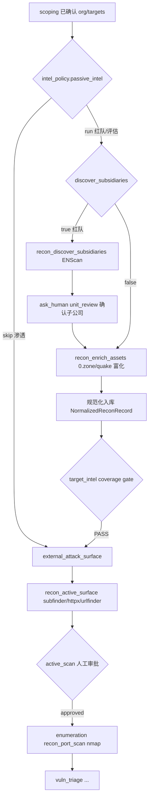

# Intel 阶段 · AI 驱动 + 按 Task 模式分流 + 复用同事 recon 引擎 设计

> 目的：把 harness 的 **target_intel（被动情报）/ external_attack_surface（主动测绘）阶段**从「AI 只会调零散 CLI recon 工具、同事那套 provider 侦察引擎只有 GUI 按钮能驱动」改造成 **AI 驱动 + 复用同事的 recon 引擎 + 按 profile 分流（红队/渗透跑哪段由模式决定）+ 现有 gate 天然生效**。最终前端那批 recon 按钮退化为过渡，AI 成为唯一编排者。
>
> 关联背景：`docs/design/2026-06-06-scoping-per-mode-gate-hitl.md`（scoping 同款 per-mode 改造，本设计直接对称复制其成功模式）、`docs/design/2026-05-26-stage-harness-mvp-external-attack-surface.md`（stage/profile 总纲）、`docs/design/2026-06-05-attack-surface-ceiling-raising.md`（上限方向）。
> 证据来源：本文件 §1 每条均为 2026-06-06 本会话亲自读真实代码核对（带文件:行号）。日期：2026-06-06。
> 方案选型：用户 2026-06-06 拍板 **Option B（按 harness 阶段拆）** —— 被动闭环（ENScan 子公司发现 / 0.zone·quake·fofa 字段富化 / ASN + 规范化入库）包成 `target_intel` 工具；主动部分（subfinder/amass/httpx/urlfinder/nmap）归 `external_attack_surface` + `enumeration`（本就是受 gate 的主动阶段）。复用同事引擎，门禁天然生效，红队/渗透按 profile 决定跑哪段。

---

## 0. 决策（TL;DR）

- **问题**：仓库里有**两套并行、彼此不通**的侦察系统：
  1. **harness 阶段流**（AI agent 驱动）：`scoping → target_intel → external_attack_surface → enumeration → …`，AI 在 `target_intel` 只能调 `recon/dns`、`recon/subdomain` 这类零散工具；
  2. **organization_recon / asset_intel**（同事做的，**只有 Tauri GUI 按钮能调**）：会查 ENScan_GO（爱企查/天眼查找子公司）+ 0.zone/quake/fofa/hunter/shodan（找域名/IP/ICP/APP/小程序/邮箱）+ ASN + 规范化入库，是真正能打的被动闭环。
  整个 `golish-agent-runtime` 里**没有任何 agent 工具调到第 2 套** → AI 自主流程根本用不上同事的引擎。
- **方向（Option B，用户拍板）**：
  1. **复用引擎、不重写**：把第 2 套的两个引擎入口（被动 `run_providers_for_org` / 主动 `run_active_collection`）包成 **agent 工具**，注册进 Task specialist 工具集（和 scoping 那次加 `manage_organizations`/`manage_targets` 完全同一套路）。
  2. **按 harness 阶段拆**：被动闭环（子公司发现 + 字段富化 + ASN + 入库）落 `target_intel`；主动探测（subdomain/http/url-history）落 `external_attack_surface`，端口扫描（nmap）落 `enumeration`。各 stage 现有 gate（证据/覆盖/min_invocations + active_scan 人工审批）**天然生效**。
  3. **profile 驱动分流**：仿照 `scoping_policy`，给 profile 加 `intel_policy` 块，决定 `target_intel` 跑哪些相位：红队 = 子公司发现 + 字段富化；渗透 = 跳过（assets 明确，直奔主动）。prompt 构造与（可选的）gate hook 都读它。
  4. **前端按钮退化**：`asset_intel_*` / `organization_recon_*` 的 GUI 入口在 AI 路径稳定后移除（分期 P2），底层服务保留给 agent 工具复用。
- **非目标**：不重写同事的 recon 引擎；不改 recon 的产物/入库格式（`NormalizedReconRecord` / `persist_normalized_records` 复用）；不引入新 DB 表；不动 scoping 的 per-mode 成果。
- **分期**：P0 = 被动 agent 工具（子公司/字段）+ `intel_policy` + prompt 分流 + 接 `target_intel`，红队/渗透跑通；P1 = 主动 agent 工具接 `external_attack_surface`/`enumeration` + ASN 工具 + 证据对齐 gate；P2 = 移除前端 recon 按钮 + 可观测。

---

## 1. 现状勘验（本会话亲自核对真实代码）

| 环节 | 现状 | 真实落点（已核 2026-06-06） | 缺口 |
|---|---|---|---|
| harness target_intel spec | 全模式共用一份 | `resources/harness/stages/target_intel.json`：被动 L1，`expected_techniques: GOLISH-INTEL-{DNS,WHOIS,ASN,CT,SUBDOMAIN,OSINT}`，`coverage_complete` gate，`allowed_tool_types:[recon/dns,recon/subdomain,recon/osint,recon/url-history]` | **不分红队/渗透；不接同事引擎** |
| external_attack_surface spec | 主动测绘，受 gate | `stages/external_attack_surface.json`：`allowed_tool_types:[recon/dns,recon/subdomain,recon/http,recon/url-history,recon/visual]`，`min_invocations:{dns_resolve,http_probe,subdomain_enum_passive}`，`human_approval.required_before:[active_scan,exploit_validation]` | 端口扫描不在此（在 enumeration） |
| enumeration spec | 主动端口/目录 | `stages/enumeration.json`：`allowed_tool_types:[recon/port-scan,recon/http,recon/crawler,web/fuzzer]` | nmap 归此 |
| pentest profile | 含 target_intel | `resources/harness/profiles/pentest.json` L9-17：`allowed_stage_kinds` **包含 `target_intel`** | 渗透现在被迫走被动；需 `intel_policy` 标 skip |
| 被动引擎 | 完整、仅 GUI | `golish-recon-app/src/asset_intel/service/hydrate.rs:118` `run_providers_for_org(sink,pool,cfg,scan_tools,providers,org,name,config)`：跑 CliJson(ENScan)/HttpJson(0.zone…)，**相位由调用方传入已过滤 providers 决定**，写 candidates+profile 入库，返 `AssetIntelRun` | **agent 侧无工具** |
| 相位选择 | 现成 | `asset_intel/capability.rs:160-206`：`select_subsidiary_providers`（仅 `subsidiaries` 能力=enscan-go）/ `select_enrichment_providers`（非 subsidiaries=0.zone/fofa/quake/hunter/shodan） | 仅被 GUI 命令调 |
| 主动引擎 | 完整、仅 GUI | `organization_recon/active.rs:91` `run_active_collection(...)`；`planned_tasks` L1605：每根域 subfinder+amass(`-passive`)、每主机 nmap(常用端口)+httpx、每 URL urlfinder；scope 过滤 + 自动装工具 + 解析为 `NormalizedReconRecord` | **整块，需按工具拆到两个 stage**；agent 侧无工具 |
| 子公司发现命令 | GUI | `asset_intel/commands.rs:194` `asset_intel_hydrate_subsidiaries`（discovery 子集）→ `run_providers_for_org` | 仅 Tauri |
| 字段富化命令 | GUI | `asset_intel/commands.rs:266+` `asset_intel_enrich_organization`/`_batch`（enrichment 子集） | 仅 Tauri |
| org 四阶段 runner | GUI 编排 | `organization_recon/runner.rs:793` 栅栏 `PassiveInternet→ActiveCollection→Processing→Persistence`；`EnterpriseIntel`（子公司）枚举存在但**不在栅栏** | 整段由 `organization_recon_start_run` 触发，AI 调不到 |
| 命令注册 | 全是 GUI 命令 | `golish/src/commands_registry.rs:149-152`：`asset_intel_*` / `organization_recon_*` 全是 `#[tauri::command]` | agentic loop 零引用 |
| 规范化/入库 | 现成 | `organization_recon/normalize.rs`（`merge_normalized_records`/`normalize_record_key`）+ `persistence.rs::persist_normalized_records` | 复用，不动 |
| agent 工具先例 | scoping 已铺路 | `golish-pentest-app/src/pentest_bridge/manage_organizations.rs` + `manage_targets.rs`（pentest-app 直接调 recon 服务/repo，注册进 Task specialist） | **直接照搬此模式加 recon 工具** |
| scoping per-mode | 已成功落地 | `harness/profile.rs:53-135` `ScopingPolicy`；`subtask_phases/execute.rs:1847` `scoping_policy_for_ctx`、L1865-1908 prompt 分流、L1492-1505 gate hook 注入 | **本设计对称复制** |

> **核心洞察**：能打的 recon 引擎（子公司+字段+主动+入库）**全部已存在且经过测试**，唯一缺口是「只有按钮能驱动」。本设计 = 把引擎包成 agent 工具 + 按 harness 阶段归位 + profile 分流，**不造新引擎**。和 scoping 改造同构，风险可控。

---

## 2. 目标 / 非目标

**目标**
1. AI（在 harness 阶段流里）能驱动同事的 recon 引擎，无需人点按钮。
2. `target_intel` = 被动闭环：红队先 ENScan 找子公司（人确认）→ 0.zone/quake 等富化字段 → 入库 → 过 gate。
3. `external_attack_surface` / `enumeration` = 主动：subdomain/http/url-history（外面）+ port-scan（枚举），复用 `run_active_collection`，受现有 active_scan 人工审批 gate。
4. 红队 / 渗透按 `intel_policy`（profile 字段）决定 `target_intel` 跑哪段：红队全跑，渗透 skip（资产从 scoping 已确认，直奔主动）。
5. 前端 recon 按钮可移除（P2），底层服务保留。

**非目标**
- 不重写 recon 引擎 / 不改产物与入库格式。
- 不引入新 DB 表 / 不改 schema。
- 不动 scoping per-mode、不动其他 stage 的语义 gate（只复用）。
- 不在 P0 改 `ExecutionMode`（Chat/Task）与 profile 选择链路。

---

## 3. 提议设计

### 3.1 总体流程

```
Task 模式输入（已带 profile）
 → scoping（已 per-mode：红队列单位候选→人确认；渗透确认 target 列表）
 → target_intel（按 intel_policy 分流）
     红队：recon_discover_subsidiaries（ENScan）→ ask_human 确认子公司
           → recon_enrich_assets（0.zone/quake/fofa…）富化字段 → 规范化入库
           → claims/coverage 引证 evidence → 过 coverage_complete gate
     渗透：intel_policy=skip → 不调被动 provider，直接产出最小 deliverable 过 gate
           （或 DAG 直接跳过 target_intel，§3.4 二选一）
 → external_attack_surface（主动 subdomain/http/url）：recon_active_surface
     → 受 active_scan 人工审批 gate
 → enumeration（端口）：recon_port_scan(nmap) → vuln_triage → …
```

### 3.2 per-mode `intel_policy`（profile 新字段）

每个 `profiles/*.json` 新增 `intel_policy` 块（与 `scoping_policy` 同级、同序列化风格）：

| profile | passive_intel | discover_subsidiaries | enrich_assets | active_surface |
|---|---|---|---|---|
| **pentest** | **skip** | false | false | true |
| **red_team** | **run** | **true** | true | true |
| **assessment** | run | false | true | true |
| **bug_bounty** | run | false | true | true |
| **cloud_assessment** | run | false | true（云资产相关 provider）| true |
| **smoke** | skip | false | false | false |

字段语义：
- `passive_intel`：`run`（跑被动 target_intel）/ `skip`（渗透：资产明确，跳过被动）。
- `discover_subsidiaries`：是否先做 ENScan 子公司发现（红队 true）。
- `enrich_assets`：是否做字段富化（0.zone/quake/…）。
- `active_surface`：是否进入主动测绘（external_attack_surface/enumeration）。

> 设计自洽：渗透 `passive_intel=skip` 对齐用户「渗透没有被动扫描、资产明确直奔主动」；红队 `discover_subsidiaries=true` 对齐「先找子公司再找字段」。

### 3.3 新增 agent 工具（复用现有引擎，壳放 `pentest_bridge`）

仿照 `manage_organizations`/`manage_targets`，在 `golish-pentest-app/src/pentest_bridge/` 新增 recon 工具，底层直接调 `golish-recon-app` 的服务：

| 工具名 | 作用 | 复用的底层 | 落 stage |
|---|---|---|---|
| `recon_discover_subsidiaries` | 按公司名 ENScan 查子公司，产候选交人确认 | `select_subsidiary_providers` + `run_providers_for_org` | target_intel |
| `recon_enrich_assets` | 按 org 富化域名/IP/ICP/APP/邮箱字段 | `select_enrichment_providers` + `run_providers_for_org` | target_intel |
| `recon_active_surface` | subdomain/http/url-history 主动测绘 | `run_active_collection`（subfinder/amass/httpx/urlfinder 子集）| external_attack_surface |
| `recon_port_scan` | 端口扫描 | `run_active_collection`（nmap 子集）或独立 nmap 调用 | enumeration |

> **主动引擎拆分**：`run_active_collection` 目前是整块（`planned_tasks` 同时排 subfinder/amass/nmap/httpx/urlfinder）。P1 需让其接受「工具子集」参数（或抽 `plan_tasks_for(kinds)`），使 `recon_active_surface` 只排 subdomain/http/url、`recon_port_scan` 只排 nmap —— 对齐两个 stage 各自的 `allowed_tool_types`。这是本设计唯一需要动同事引擎签名的点（加参数，不改逻辑）。

工具入参/出参用 ts-rs 同步（I5）；所有写操作绑定 `project_path` 做 IDOR 校验（I2）；evidence 走 `NormalizedReconRecord` + 现有 ledger，供 gate 引证（I7）。

### 3.4 渗透「跳过被动」两种接法

- **(A) DAG 投影删除**：`pentest.json` 的 `allowed_stage_kinds` 去掉 `target_intel` → DAG 上 scoping 直接到 external_attack_surface。最干净，但要确认 `external_attack_surface.json` 的 `requires_stages:[scoping,target_intel]` 同步放宽（否则被 require 卡住）。
- **(B) intel_policy=skip 空跑**：保留 stage，AI 据 `passive_intel=skip` 产「assets confirmed in scoping, passive intel not applicable」的 deliverable，coverage 标 `not_applicable`+note 过 gate。改面小、保留可观测，但多一次空跑。
- **推荐 (B)**：与 scoping 注入式同构、改面最小、可灰度；若后续渗透确定永不跑被动，再演进到 (A)。

### 3.5 prompt 分流（对称 scoping）

`synthesize_stage_subtask` 的 `K::TargetIntel` 分支接 `intel_policy`（线程化方式同 `scoping_policy_for_ctx`）：
- `passive_intel=skip` → 指令「资产已在 scoping 确认，本阶段不做被动收集，coverage 记 not_applicable 后 submit」。
- `discover_subsidiaries=true` → 指令「先 `recon_discover_subsidiaries(company)` 列子公司，`ask_human(unit_review)` 交人确认，确认后对每个单位…」。
- `enrich_assets=true` → 指令「对确认的组织调 `recon_enrich_assets` 富化域名/IP/APP 字段，每条结论引 evidence」。
`external_attack_surface` / `enumeration` 分支接 `recon_active_surface` / `recon_port_scan`，强调先过 active_scan 人工审批。

### 3.6 影响面 / 受影响文件

| 文件 | 改动 | 风险 |
|---|---|---|
| `resources/harness/profiles/*.json`（7 个）| 加 `intel_policy` 块 | 低（serde default 兼容旧无此字段）|
| `harness/profile.rs` | `IntelPolicy` 类型 + `Profile.intel_policy`（serde default）| 低 |
| `task_orchestrator/subtask_phases/execute.rs` | `intel_policy_for_ctx` + `synthesize_stage_subtask` 的 intel/surface 分支 | 中（与 scoping 共热点，注意冲突）|
| `task_orchestrator/prompts/mod.rs` | `stage_charter` intel 段按 policy | 中（文案）|
| `pentest_bridge/recon_*.rs`（新，4 个工具）| 包同事引擎 | 中（IDOR / 跨 crate 调 recon-app 服务）|
| `golish-recon-app/asset_intel`、`organization_recon/active.rs` | 暴露服务给 pentest-app（pub）；`run_active_collection` 加工具子集参数 | 中（动引擎签名，不动逻辑）|
| `execution_mode/modes/task.rs` + `tool_list.rs` | 注册 4 个新工具 | 低 |
| `pentest.json` / `external_attack_surface.json`（若选 §3.4-A）| DAG/require 调整 | 中 |
| 前端 recon 按钮（P2）| 移除 `asset_intel_*`/`organization_recon_*` UI | 中（删 UI，需用户确认）|

---

## 4. 数据流图



---

## 5. 错误处理 / 边界

- **provider 无 key / 配额耗尽**：复用引擎现有 `provider_status`（Failed/Unavailable）→ AI 据返回如实记 coverage `blocked`+note，不伪造 `found`（I8）。
- **ENScan 未装 / 不可用**：`run_active_collection` 已有自动装工具 + 失败落 `active_tool_*` 错误码；被动 CliJson 同理透传，AI 记 blocked。
- **渗透 skip 但 AI 误调被动工具**：工具按 stage 注册即可（target_intel 阶段才挂被动工具）；或 prompt 明确禁止。
- **IDOR**：4 个工具写库一律绑 `project_path` + org 归属校验。
- **scope 外资产**：`run_active_collection` 已有 `ActiveScopeSet` 过滤（只接受 in-scope host/root）；被动富化写回时复用 `target_value_belongs_to_organization` 归属过滤。
- **smoke**：`passive_intel=skip`+`active_surface=false`，最短路径。

---

## 6. 风险 / 回滚

- **R1 动 `run_active_collection` 签名**：加工具子集参数可能影响 GUI runner 调用点。缓解：参数给默认值（不传=全跑，保 GUI 行为），新工具显式传子集。
- **R2 跨 crate 暴露**：recon-app 的 `run_providers_for_org`/`run_active_collection` 现为 `pub(crate)`，需提为 `pub`（或加 facade）。缓解：用窄 facade 函数暴露，不泄漏内部类型。
- **R3 与 scoping 改 execute.rs 热点冲突**：本改集中在 `K::TargetIntel`/`K::ExternalAttackSurface` 分支 + 一个 `intel_policy_for_ctx`，与 scoping 改面相邻但不重叠。
- **R4 删前端按钮**（P2）：高风险删 UI，必须用户显式确认（AGENTS.md §2.7）；底层服务保留，可回滚。
- **回滚**：`intel_policy` 缺省 = 保守（passive_intel=run）；工具不注册即回到旧「AI 只有零散 recon 工具」。

---

## 7. 验证策略（DoD 摘要）

- **单测**：`intel_policy` serde（旧 JSON 默认）；`select_subsidiary_providers`/`select_enrichment_providers` 已有测试复用；新工具 `parameters()` schema 纯函数测试；`run_active_collection` 工具子集参数（只排 subdomain vs 只排 nmap）。
- **集成**：红队「给公司名」→ `recon_discover_subsidiaries` 出候选 → 模拟确认 → `recon_enrich_assets` 写字段 → target_intel coverage PASS；渗透「给明确 target」→ skip 被动 → 直接 external_attack_surface。
- **证据**：`just precommit` 全绿；trace 里能看到 recon 工具调用 + evidence 入 ledger + gate 决策（AGENTS.md §3，命令+输出为准）。

---

## 8. 与 AGENTS.md 不变量对齐

- **I2 IDOR**：recon 工具写 org/target 绑 project_path 校验。**I5 ts-rs**：工具 wire 类型 + intel_policy 走 ts-rs。**I7 证据**：复用 `NormalizedReconRecord` + ledger，gate 引证。**I8 已检查≠未检查**：provider 失败记 blocked、不伪造 found。**I9 事务**：provider HTTP 调用在事务外（引擎本就如此）。**I10 schema**：本期不改 schema。

---

## 9. 开放问题（实现前需用户拍板）

1. 渗透「跳过被动」选 §3.4-(A) DAG 删除 还是 (B) intel_policy=skip 空跑？（建议 B）
2. `recon_discover_subsidiaries` 的「人确认子公司」复用 scoping 的 `unit_review` HITL，还是 target_intel 内独立确认？
3. 主动引擎拆分：给 `run_active_collection` 加 `tool_kinds` 参数，还是抽独立 `recon_active_surface`/`recon_port_scan` 各自 plan？
4. 前端 recon 按钮 P2 移除范围（`asset_intel_*` + `organization_recon_*` 全删，还是先隐藏保留兜底）？
5. `intel_policy` 是否也加 gate 硬门禁（如红队「未确认子公司不得进 external_attack_surface」），还是只靠现有 coverage gate？

---

## 10. 分期与后续

- **P0**：`IntelPolicy` 类型 + 7 profile 配置 + `recon_discover_subsidiaries` / `recon_enrich_assets` 两个被动工具 + 接 `target_intel` prompt 分流 + 渗透 skip（§3.4-B）+ 单测/集成。**红队/渗透 target_intel 跑通**。
- **P1**：`recon_active_surface` / `recon_port_scan` 接 `external_attack_surface`/`enumeration`（拆 `run_active_collection`）+ ASN 工具 + evidence 对齐各 stage gate。
- **P2**：移除前端 recon 按钮（需用户确认）+ 可观测（recon 工具/gate 进 trace 面板）。

> 下一步：用户确认 §9（至少问题 1、3）后，进入 writing-plans 产出 P0 实现计划 `docs/superpowers/plans/2026-06-06-intel-stage-ai-driven-p0.md`，再 executing-plans 落地。本设计不覆盖旧文档，新增独立 markdown（AGENTS.md §2.4 / I6）。
