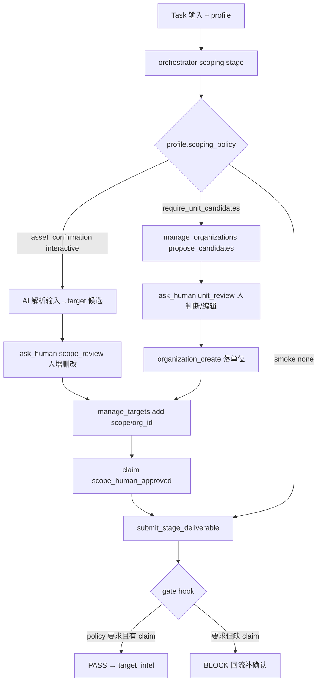

# Scoping 阶段 · 按 Task 模式分流 + 人工确认硬门禁 设计

> 目的：把 harness 的 **scoping（范围界定/ROE）阶段**从「6 个 task 模式共用一份硬编码 prompt、不停下来确认」改造成 **按 profile 分流 + 结构化人工确认（HITL）+ gate 硬门禁**：渗透先确认主体并让人确认/编辑 target 列表；红队先列「单位名称」候选给人判断、确认后写入组织与资产；其余模式按各自风险给差异化 scoping 策略。
>
> 关联背景：`docs/design/2026-06-03-task-mode-lead-agent-triage.md`（task 入口分诊）、`docs/design/2026-06-05-gate-rules-migration.md`（gate 规则数据化）、`docs/design/2026-05-26-stage-harness-mvp-external-attack-surface.md`（stage/profile 总纲）。
> 证据来源：本文件 §1 每条均为 2026-06-06 本会话亲自读真实代码核对（带文件:行号）。日期：2026-06-06。
> 关联 feature：`scoping-per-mode-gate-hitl-2026-06-06`（待加入 `feature_list.json`，状态 `not_started`）。
> 方案选型：用户 2026-06-06 拍板「**B + scoping gate 硬门禁**」（B = prompt 分流 + 结构化 HITL + 工具增强；硬门禁 = C 的核心约束搬进 B，但不引入子状态机 / DB schema）。

---

## 0. 决策（TL;DR）

- **问题**：scoping 阶段对全部 6 个 profile（assessment / pentest / bug_bounty / cloud_assessment / red_team / smoke）行为**完全相同**——同一份硬编码 prompt、`gate_rules: []`、不会停下来让人确认范围；AI 写 target 的工具也不支持 scope/组织。范围（scope）是法律/授权边界，「不经人确认就进入主动探测」在渗透平台里是风险。
- **方向（B + 硬门禁）**：
  1. **profile 驱动**：给 `profiles/*.json` 加一个 `scoping_policy` 块（profile 已有 `approval_policy` 先例），prompt 构造与 gate hook 都读它分流。差异集中在配置，声明式、不把逻辑散落 Rust。
  2. **结构化 HITL**：复用 `ask_human` 通道，新增 `input_type = "scope_review"`（和红队的 `"unit_review"`），`context` 携带 AI 提议的结构化清单 JSON，前端渲染**可增删改的确认表**，用户编辑后把结果 JSON 放回响应。
  3. **gate 硬门禁**：scoping 通过前，要求 deliverable 的 `claims` 里至少有 1 个 `kind = "scope_human_approved"` 的 claim，否则 Block、不许进 `target_intel`。用现有 `count_at_least` 数据积木**纯 JSON 声明**，无需改 Rust 引擎。
  4. **写入工具增强**：扩展 `manage_targets`（支持 `scope` / `organization_id`），并为红队新增 `manage_organizations` agent 工具（list / propose_candidates / create），复用既有 `organization_*` / `organization_candidates_*` 后端。
- **非目标**：不引入 scoping 子状态机；不改 DB schema（复用 `targets` / `organizations` / `organization.intel` 候选）；不动其他 stage 的 gate；不重写 orchestrator / agentic_loop。
- **分期**：P0 = profile policy + prompt 分流 + 硬门禁 gate_rule + `scope_review` HITL + 工具增强（pentest / red_team 跑通）；P1 = 防伪造（`scope_human_approved` 交叉验证真实 AskHuman 响应）、其余模式细化、可观测；P2 = 若需多轮/跨会话 scoping 再升级到状态机（即原 C，暂不做）。

---

## 1. 现状勘验（本会话亲自核对真实代码）

| 环节 | 现状 | 真实落点（已核 2026-06-06） | 缺口 |
|---|---|---|---|
| 模式选择 | UI 一个 id 拆成「引擎 + profile」 | `golish-agent-app/src/ai/commands/mode.rs:102-115`（`chat`→Chat 无 profile；profile id→Task + `set_harness_profile`）；`chat.rs:168` `orchestrator.set_profile_override(...)` | 选择链路完好，可直接用 |
| profile 定义 | 6 个 JSON | `resources/harness/profiles/*.json`：仅 `allowed_stage_kinds` / `max_authorization` / `approval_policy` / `cleanup_required` / `evidence_required` | **无 scoping 差异字段** |
| scoping spec | 近乎空壳 | `resources/harness/stages/scoping.json`：`gate_rules: []`、`human_approval.required_before:["scope_expansion"]`、`allowed_tool_types:[]` | 无证据门禁；`scope_expansion` 运行时未接线 |
| scoping prompt | 硬编码、不分模式 | `task_orchestrator/subtask_phases/execute.rs` `synthesize_stage_subtask` 的 `K::Scoping` 分支（约 L1820-1827）；`task_orchestrator/prompts/mod.rs` `stage_charter`（scoping 段约 L118-122）/ `stage_execution_prompt` / `stage_discipline_reminder` | **不读 profile，全模式同文** |
| HITL | 有通道、非结构化 | `tool_executors/ask_human.rs:56-62` `AiEvent::AskHumanRequest{request_id,question,input_type,options,context}`；返回仅 `approved + reason`（自由文本）（L72-96）；超时 600s | 不能承载「可编辑结构化表」，需新 `input_type` + 前端组件 |
| gate 框架 | 结构层恒跑 + 语义层 `gate_rules` 声明 | `harness/gate/mod.rs:128-170` `validate_stage_gate_with_context`；语义层 `rule_engine::eval_with_context` | scoping 当前无语义规则 |
| gate DSL | 数据积木 + named_check 逃生舱 | `harness/gate/rule_engine.rs`：`GateRule::CountAtLeast{over,where,min,on_fail}`（L23-29）、`Pred::Eq{field,value}`（L121）、`ItemField::Kind`（L130）、`Collection::Claims`（L108） | **足以声明硬门禁，无需改 Rust** |
| scoping 证据豁免 | scoping claim 免 tool evidence | `harness/gate/scope_check.rs:18` `evidence_optional = stage_id=="scoping"`；`execute.rs` `enforce_evidence_existence` 对 `StageKind::Scoping` 跳过 | 豁免与硬门禁不冲突（门禁查的是 claim 存在性，非 tool evidence） |
| target 写入(AI) | 弱 | `golish-pentest-app/src/pentest_bridge/manage_targets.rs`：action `add/list/update_status/update_recon`；`add` 调 `target_add` 时 scope/owner/org_id 全传 `None`（L156-169），强制 `scope='in'` | 不能设 scope/挂组织 |
| target 写入(GUI) | 字段齐全 | `golish-recon-app/src/targets/cmds.rs` `target_add`（L27-96）支持 `scope` / `organization_id` / `owner` / 时间窗 | 仅 GUI，可借后端 port |
| 组织模型 | 完整 | `golish-recon-app/src/organizations/mod.rs` CRUD（L73-197）+ `organization_candidates_list/upsert`（L199-221）；`migrations/20260517210000_organizations_profile_fields.sql`：`aliases/domains/ip_ranges/asns/scope_rules/...`；`migrations/20260601000001_evidence_ledger.sql:33` `scope_rules_version`（改 scope_rules → version+1，ledger 快照） | **agent 侧无组织工具** |
| 组织候选 | 现成机制 | `organizations/mod.rs:199-221` + `candidates::read_candidates_from_intel` / `upsert_organization_candidates_for_org`；候选存 `organization.intel` JSONB | 红队「列单位名称候选给人判断」可直接复用 |

> **核心洞察**：6 个模式共用 scoping 是历史 MVP 简化；改造所需的底座（profile 选择、gate DSL、HITL 通道、组织/候选模型）**全部已存在**，本设计是把它们按 profile 接起来 + 补两处缺口（结构化 HITL 前端、agent 组织工具），不需要新子系统。

---

## 2. 目标 / 非目标

**目标**
1. scoping 阶段按 profile（task 模式）走差异化逻辑（主体确认、资产/单位确认、写入策略）。
2. 渗透（pentest）：确认主体 + AI 提议 target 列表 → **人确认/编辑** → 写入。
3. 红队（red_team）：先列「单位名称」候选 → **人判断/编辑** → 确认后写入组织 + 关联资产。
4. **硬门禁**：除 smoke 外的模式，未经人工确认 scope 不得进入 `target_intel`（gate 强制）。
5. 差异**声明式可配**：集中在 `profiles/*.json` 的 `scoping_policy`，便于后续加模式/调策略。

**非目标**
- 不做 scoping 子状态机 / 新 DB 表（原方案 C，推迟到 P2，仅当出现多轮/跨天 scoping 需求）。
- 不动其他 stage 的 prompt / gate。
- 不改 `ExecutionMode`（Chat/Task）与 profile 选择链路。
- 不在本期实现 `scope_expansion` 的完整事件机（仅复用现有 approval 通道做 scoping 时的人工确认）。

---

## 3. 提议设计

### 3.1 总体流程

```
Task 模式输入（已带 profile）
 → orchestrator.run → 进入 scoping stage（DAG 入口）
 → 按 profile.scoping_policy 构造 scoping prompt（§3.3）
 → 主 agent 执行 scoping：
     1) （require_subject）确认主体：pentest=1 个主体；red_team=单位名称集合
     2) （asset_confirmation=interactive）AI 解析输入 → 提议清单
        → ask_human(input_type=scope_review|unit_review, context=提议 JSON)  ← 人增删改
     3) 用户确认后：写入 targets / organizations（§3.5），并产出
        claims:[{kind:"scope_human_approved", subject:<主体>, summary:<确认摘要>, ...}]
     4) submit_stage_deliverable(...)
 → gate hook：按 profile.scoping_policy.require_human_scope_approval 决定是否追加
   count_at_least(scope_human_approved>=1) 规则（§3.4）
     ├─ 有确认 claim → PASS → 进 target_intel
     └─ 无           → BLOCK（reason: "scope must be human-confirmed"）→ 回流让 agent 走确认
```

### 3.2 per-mode scoping 策略（`scoping_policy`）

每个 `profiles/*.json` 新增一个 `scoping_policy` 块：

| profile | require_subject | subject_kind | require_unit_candidates | asset_confirmation | require_human_scope_approval | write_organizations |
|---|---|---|---|---|---|---|
| **pentest** | true | organization | false | interactive | **true** | **true** |
| **red_team** | true | organization | **true** | interactive | **true** | **true** |
| **assessment** | false | freetext | false | interactive | true（建议） | false |
| **bug_bounty** | false | freetext | false | interactive（侧重 in/out 规则） | true | false（写 scope_rules） |
| **cloud_assessment** | true | cloud_tenant | false | interactive | true | optional |
| **smoke** | false | none | false | none | **false**（豁免） | false |

`scoping_policy` 字段语义：
- `require_subject` / `subject_kind`：是否、以何形态确认主体（organization=建/选组织；cloud_tenant=云租户/账号；freetext=自由文本记入 claim.subject；none=不要）。
- `require_unit_candidates`：红队专用——是否先产出「单位名称候选」让人判断（复用 `organization_candidates`）。
- `asset_confirmation`：`interactive`（列表给人编辑确认）/ `auto`（AI 直接写，仅记录）/ `none`。
- `require_human_scope_approval`：**硬门禁开关**（§3.4）。
- `write_organizations`：scoping 是否落组织（红队 true）。

> pentest 与 red_team 均 `subject_kind=organization`、`write_organizations=true`——与前端 `NewEngagementDialog`（org-first：组织名必填、target 永远挂 `organization_id`）一致；差别仅在 red_team 多一步 `require_unit_candidates`（先发现/列候选单位）。其余模式（assessment / bug_bounty / cloud）的细节是 §9 开放问题，表中为推荐默认，待用户逐个确认。

### 3.3 prompt 改造（profile 分流）

把现硬编码 scoping 文案改成读 `scoping_policy` 的模板：
- `execute.rs::synthesize_stage_subtask` 的 `K::Scoping` 分支与 `prompts/mod.rs::stage_charter` 的 scoping 段，**接收 `&Profile`（或 `scoping_policy`）参数**，按字段拼指令：
  - `require_subject=true` → 指令要求「先明确并确认主体（{subject_kind}）」；当 `subject_kind=organization` 且 `write_organizations=true` 但 `require_unit_candidates=false`（pentest）时，要求先 `manage_organizations(action=create|list)` **建/选组织**再确认（org-first，后续 target 必须挂该 `organization_id`）。
  - `require_unit_candidates=true`（red_team）→ 指令要求「先调 `manage_organizations(action=propose_candidates)` 列出候选单位名称，`ask_human(input_type=unit_review)` 交人判断，确认后 `manage_organizations(action=create)` 落组织」。
  - `asset_confirmation=interactive` → 指令要求「解析输入得到 target 候选，`ask_human(input_type=scope_review)` 交人增删改，**确认后**再 `manage_targets(add, scope/org_id)` 写入」。
  - `require_human_scope_approval=true` → 指令要求「人确认通过后，必须在 deliverable 写一条 `scope_confirmed`/`scope_human_approved` claim（携带本次 AskHuman 的 request_id 作为人工确认凭据）」。
- 线程化：`stage_charter(&spec)` → `stage_charter(&spec, &profile)`；`synthesize_stage_subtask(stage, task_input)` → `(stage, task_input, &profile)`。调用方 `execute_single_subtask` / `run_stage_subtasks` 已能拿到 `exec_ctx.harness_profile_id`，加载 `Profile` 后传入。

### 3.4 gate 硬门禁（纯 JSON 声明）

scoping 通过前必须有人工确认 claim。规则（数据积木，无需改引擎）：

```jsonc
{
  "op": "count_at_least",
  "over": "claims",
  "where": { "pred": "eq", "field": "kind", "value": "scope_human_approved" },
  "min": 1,
  "on_fail": {
    "reason": "scope must be confirmed by a human before leaving scoping",
    "hints": [
      "call ask_human(input_type=scope_review) and let the user confirm/edit the target list",
      "after confirmation, add a claim {kind:'scope_human_approved', subject:<engagement subject>} citing the ask_human request_id"
    ]
  }
}
```

**per-profile 启用**：scoping.json 全局共享，不能直接写死该规则（否则 smoke 也被卡）。两种接法：
- **(推荐) gate hook 注入**：`apply_harness_gate_hook` 加载 profile 后，若 `scoping_policy.require_human_scope_approval==true` 且 stage 为 scoping，则把上面这条规则追加进 `spec.gate_rules` 再 `validate_stage_gate_with_context`。改面最小、不增 spec 文件、不扩 DSL。
- (备选) per-profile scoping spec 文件（`scoping.smoke.json` 等）+ `load_embedded_stage_spec` 按 profile 选。更声明式但要改 spec 加载框架、增文件。

> 选 (推荐) 注入式；若后续 per-profile 差异变多，再演进到备选。

**与 scoping 证据豁免的关系**：`scope_check` / `enforce_evidence_existence` 对 scoping 豁免的是「claim 必须挂 tool evidence」；本门禁查的是「**存在**一条 `scope_human_approved` claim」，两者正交，不冲突。

**防伪造（P1）**：MVP 仅查 claim 存在性，AI 理论上可不问人就伪造该 claim。P1 在 gate hook 交叉验证该 claim 的 summary/字段里引用的 `ask_human` request_id 是否对应一条真实 `AskHumanResponse{approved:true}` 事件（参照 `enforce_evidence_existence` 的交叉验证模式），伪造即 Block。

### 3.5 写入：targets + organizations agent 工具

**(a) 扩展 `manage_targets`**（`pentest_bridge/manage_targets.rs`）：
- `add` 的 item 增加可选 `scope`（in/out，默认 in）与 `organization_id`；`execute` 把它们透传给 `PgReconTargetsAdapter::target_add`（现把这些位置传了 `None`，L156-169）。
- 新增 action `set_scope`（`target_id` + `scope`）映射 `target_update`（in/out 切换），供确认表里「移出范围」用。

**(b) 新增 `manage_organizations` agent 工具**（新文件 `pentest_bridge/manage_organizations.rs`）：复用既有后端，actions：
- `list` → `organization_list`
- `propose_candidates`（org_id + candidates[]）→ `organization_candidates_upsert`（红队列候选单位名称）
- `create`（name + parent_id?）→ `organization_create`（人确认后落单位）
- `update_profile`（域名/IP段/ASN/scope_rules 等）→ `organization_update_profile`
工具在 Task 模式 depth>0（specialist）与 scoping 阶段可用（按 `execution_mode` tool 策略接入）。

**(c) 写入时机**：严格在 `ask_human` 返回 `approved:true` 且拿到用户编辑后的清单**之后**。AI 用确认后的 JSON 调 `manage_targets`/`manage_organizations` 写库，再产出 `scope_human_approved` claim。

### 3.6 结构化 HITL（`scope_review` / `unit_review`）

- **后端**：`ask_human.rs` 已透传 `input_type` + `context`；无需改协议，只需约定两个新 `input_type` 值，`context` 放 AI 提议 JSON（target 候选 / 单位候选）。用户编辑结果经现有 `ApprovalDecision.reason` 以 JSON 字符串回传（前端把编辑后的表序列化进 reason）。
- **前端**：新增渲染分支（在现有 `AskHumanInline` 同级），当 `input_type∈{scope_review,unit_review}` 时渲染**可增删改的表格**（target：value/type/scope；unit：name/aliases/domains），「确认」把编辑后的数组序列化回 `reason`，「跳过」走 `approved:false`。
- 数据结构（wire，复用既有类型对齐）：target 行对齐 `manage_targets` add item（value/name/type/scope/organization_id）；unit 行对齐 `OrganizationCandidate`（`organizations/types.rs`）。

### 3.7 影响面 / 受影响文件

| 文件 | 改动 | 风险 |
|---|---|---|
| `resources/harness/profiles/*.json`（6 个） | 加 `scoping_policy` 块 | 低（加载需兼容旧无此字段→默认值） |
| `harness/profile.rs` | `Profile` 加 `scoping_policy: Option<ScopingPolicy>`（serde default） | 低 |
| `task_orchestrator/prompts/mod.rs` | `stage_charter` 等接 `&Profile`，scoping 段按 policy 拼 | 中（prompt 文案） |
| `task_orchestrator/subtask_phases/execute.rs` | `synthesize_stage_subtask` 接 profile；`apply_harness_gate_hook` 注入硬门禁规则 | 中（gate hook 是热点，注意与其它会话冲突） |
| `pentest_bridge/manage_targets.rs` | add 支持 scope/org_id；新增 set_scope | 中（IDOR：写 org_id 必须 project 归属校验） |
| `pentest_bridge/manage_organizations.rs`（新） | 组织 agent 工具 | 中 |
| `execution_mode/modes/task.rs` + `tool_list.rs` | 注册新工具到 Task specialist | 低 |
| 前端 `AskHumanInline`（+ 新表格组件） | scope_review/unit_review 渲染 | 中（纯 UI + 序列化回传） |
| `golish-prompts/src/system_prompt/task.rs` | 可选：补「scoping 必须人确认」总则 | 低 |

---

## 4. 数据流图



---

## 5. 错误处理 / 边界

- **用户跳过确认**（`ask_human` 返回 `approved:false`）：不写入、不产出 `scope_human_approved` claim → 硬门禁 Block → agent 据 hint 重新发起确认（或如实记录 blocked 并停在 scoping，不擅自推进）。
- **确认超时**（600s）：`ask_human` 返回 timeout → 同「跳过」，停在 scoping，不进 target_intel。
- **空输入 / 无可解析目标**：pentest/red_team 必须要主体，AI 应 `ask_human` 追问，而非硬塞空清单。
- **IDOR**：`manage_targets` 写 `organization_id`、`manage_organizations` 操作 org，必须按 `project_path` 校验归属（AGENTS.md I2），跨项目拒绝。
- **smoke**：`require_human_scope_approval=false` → 不注入门禁、不强制 HITL，保持冒烟最短路径。
- **旧 profile JSON 无 `scoping_policy`**：serde default 给「保守默认」（建议默认 `require_human_scope_approval=true` 以安全优先，smoke 显式置 false）。

---

## 6. 风险 / 回滚

- **R1 改 gate hook 热点冲突**：`execute.rs` 正被多处改。缓解：硬门禁逻辑集中在「加载 profile→若 policy 要求则 push 一条 rule」少量代码，且可 feature-flag（`scoping_human_gate_enabled`，默认灰度）。
- **R2 误伪造确认**：见 §3.4 P1 交叉验证；MVP 期以 prompt 强约束 + 审计日志缓解。
- **R3 体验回退**：HITL 让 scoping 多一次人工交互。对 smoke/auto 模式豁免；对必须确认的模式这是预期且安全的代价。
- **R4 前端序列化契约**：编辑结果经 `reason` 字符串回传，需前后端约定 JSON schema。缓解：wire 类型用 ts-rs 同步（AGENTS.md I5），不手维护两份。
- **回滚**：profile `scoping_policy` 缺省即回到「无门禁、无强制 HITL」；feature-flag 关闭即旧行为。

---

## 7. 验证策略（DoD 摘要，细化进实现计划）

- **单测（Rust）**：
  - `scoping_policy` serde（含旧 JSON 无此字段的默认）。
  - gate：scoping deliverable 有/无 `scope_human_approved` claim → PASS/BLOCK；smoke profile 不注入规则不 BLOCK；pentest/red_team 注入则 BLOCK。
  - `manage_targets` add 带 scope/org_id 透传；IDOR 跨项目拒绝。
- **集成**：pentest「给 3 个 target」→ AI 提议表 → 模拟确认 → 写入 + claim → gate PASS；red_team「给一个单位」→ 列候选 → 确认 → 建 org + 资产 → PASS；未确认 → BLOCK 停在 scoping。
- **前端**：`scope_review`/`unit_review` 表格增删改 + 序列化回传（Vitest）。
- **证据**：`just precommit` 全绿；trace 里能看到 scoping HITL 请求/响应与 gate 决策（AGENTS.md §3，不把「跑通一次」当「完成」，以命令+输出为准）。

---

## 8. 与 AGENTS.md 不变量对齐

- **I2 IDOR**：org_id / 组织写入按 project 校验。**I5 ts-rs**：HITL/policy wire 类型走 ts-rs。**I7 证据**：scoping 人工确认作为阶段交付的一部分（claim + AskHuman 凭据）。**I8 已检查≠未检查**：硬门禁区分「确认过」vs「没确认」。**I10 schema 兼容**：本期不改 schema；如 P1 引入凭据持久化，按「先扩字段再上代码」。

---

## 9. 开放问题（实现前需用户拍板）

> **2026-06-06 用户决议**：Q1 = **除 smoke 外全部启用硬门禁**（安全优先，已采纳）；Q2（**已修订**）= pentest **必须建/选 organization 作为主体**（`subject_kind=organization`、`write_organizations=true`）——与前端 `NewEngagementDialog` 现有设计一致（org-first：组织名必填、target 永远挂 `organization_id`）；先前「允许 freetext」的拍板已被用户 2026-06-06 推翻。pentest 与 red_team 都强制组织，差别仅是 red_team 多一步 `require_unit_candidates`（先列候选单位给人判断）。Q3–Q6 推 P1 细化，不阻塞 P0。

1. ~~assessment / bug_bounty / cloud_assessment 是否一律要硬门禁？~~ → **已定：除 smoke 外都要**（2026-06-06）。
2. ~~pentest 主体是否强制建 organization？~~ → **已定（2026-06-06 修订）：强制 organization（`subject_kind = organization`、`write_organizations = true`），与前端 `NewEngagementDialog` org-first 设计一致**。pentest 走前端 `customer_targets` 路径（建组织 + 导入客户 target），red_team 走 `discover_assets` 路径（建组织 + 单位候选发现）。
3. **bug_bounty** 的 scoping 重点是 in/out scope 规则（通配符、公开域），是否单独做 scope_rules 编辑卡？
4. **cloud_assessment** 的「主体=云租户/账号」如何采集（手填 vs 选已有 org 的 cloud_assets）？
5. feature-flag 命名与默认灰度（`scoping_human_gate_enabled`）。
6. `scope_human_approved` 的 claim kind 命名（沿用现有 `scope_confirmed` 加一字段，还是新 kind）。

---

## 10. 分期与后续

- **P0**：profile `scoping_policy` + prompt 分流（pentest/red_team 优先）+ 硬门禁 gate_rule（注入式 + flag）+ `scope_review` HITL 前端 + `manage_targets` 增强 + `manage_organizations` 工具 + 单测/集成。产出实现计划 `docs/superpowers/plans/2026-06-06-scoping-per-mode-gate-hitl-p0.md`（按 `.cursor/skills/writing-plans`）。
- **P1**：防伪造交叉验证、assessment/bug_bounty/cloud 细化、可观测（scoping HITL/gate 进 trace 面板）。
- **P2（=原方案 C，暂不做）**：仅当出现多轮 / 跨会话 / 反复修订的复杂 scoping（如大型红队资产测绘），再升级为 scoping 子状态机 + 持久化。

> 下一步：用户确认 §9 开放问题（至少问题 1、2）后，进入 writing-plans 产出 P0 实现计划，再 executing-plans 落地。本设计不覆盖旧文档，新增独立 markdown（AGENTS.md §2.4 / I6）。
