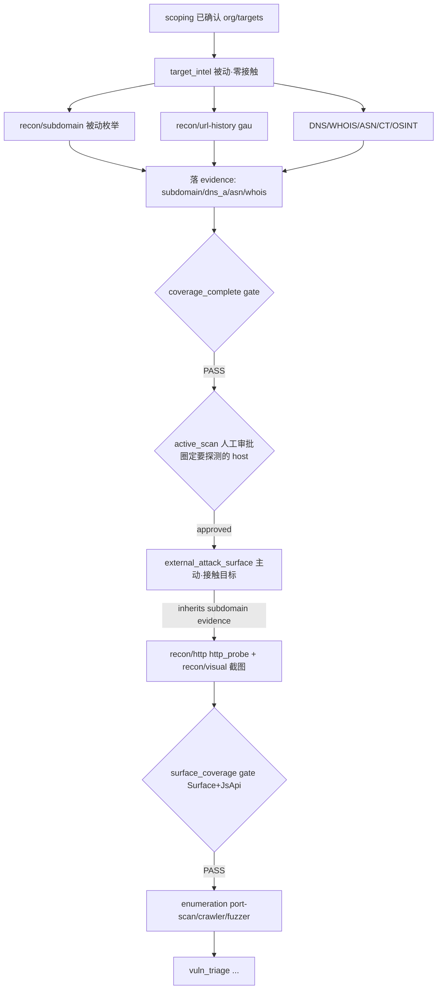

# harness 被动/主动阶段边界重构（按「是否接触目标」）设计

> 目的：把 harness 12 阶段管线的**被动/主动边界**从当前「按是否需要种子 + 配置零散重叠」改成**单一判据「是否接触目标主机」**。让 `target_intel` 成为名副其实的零接触被动情报阶段（独占 DNS/WHOIS/ASN/CT/被动子域名/url-history/OSINT），`external_attack_surface` 专做接触目标的主动测绘（HTTP 探测/指纹/截图），两者之间复用现有 `active_scan` 人工审批门。
>
> 关联背景：`docs/design/2026-06-06-intel-stage-ai-driven-per-mode.md`（intel 阶段 AI 驱动 + per-mode，本设计与其正交：那份管「谁来驱动 + 红队/渗透跑哪段」，本份管「被动/主动按什么判据分、哪些工具归哪个 stage」）、`docs/design/2026-06-03-two-level-phase-stage-model.md`（12 StageKind / 5 Phase 两级模型）、`docs/design/2026-05-26-stage-harness-mvp-external-attack-surface.md`（stage/profile 总纲）。
>
> 证据来源：本文件 §1 每条均为 2026-06-07 本会话亲自读真实代码核对（带文件:行号）。日期：2026-06-07。
>
> 方案选型：用户 2026-06-07 拍板 —— Q1 目标管线 = **A（harness 12 阶段，非 GUI organization_recon runner）**；Q2 判据 = **A（是否接触目标主机）**；Q3 被动发现的子域名晋级 = **A（复用现有 active_scan 审批门）**。

---

## 0. 决策（TL;DR）

- **问题**：harness 的「被动/主动」边界不名副其实——
  1. **被动子域名枚举跨界**：`recon/subdomain`（subfinder/amass `-passive`，零接触第三方源）同时出现在 `target_intel`（被动）和 `external_attack_surface`（主动）的 `allowed_tool_types`；且 `external_attack_surface.json` 的 `min_invocations` **强制要求** `subdomain_enum_passive:1`——把一个被动技术钉死在主动阶段。
  2. **url-history 跨界**：`recon/url-history`（gau/waybackurls，查 web 归档、零接触）同样两边都在。
  3. **charter↔spec 不一致**：`target_intel.json` 的 `expected_techniques` 已含 `GOLISH-INTEL-SUBDOMAIN`，但 prompt charter（`prompts/mod.rs:412-413`）却把子域名枚举写成 `external_attack_surface` 的活、`target_intel` 只写 whois/ASN/DNS/registrant。AI 收到的指令与 gate 期望矛盾。
- **判据（用户拍板，Q2-A）**：以**「是否接触目标主机」**作为被动/主动的唯一分界。
  - **被动**（`target_intel`，risk=low，零接触，只查第三方）：DNS / WHOIS / ASN / CT / **被动子域名** / **url-history** / OSINT。
  - **主动**（`external_attack_surface` + `enumeration`，risk=medium，真连目标）：http_probe / 指纹 / 截图 / port-scan / crawler / fuzzer。
  - `recon/dns`（dns_resolve）作为**公共工具**两阶段都保留（解析 host 是前置工具，不算「接触目标服务」）。
- **跨界处理（Q3-A）**：复用现有 `active_scan` 人工审批门。`target_intel` 被动发现的新子域名是**候选**，跨进 `external_attack_surface` 前由人在 active_scan 审批点确认「哪些发现的 host 要真探测」。守住「发现免费、触达要人确认」的 scope 纪律（I2/I7）。
- **范围**：**配置驱动改动为主**——2 个 stage JSON + 1 处 charter 文本；**0 条 Rust 业务逻辑改动**（gate 引擎、graph 引擎、stage_spec loader 全部按 JSON 参数化，无需动）。阶段顺序 / DAG **不变**。
- **非目标**：不改 12 阶段顺序 / DAG（`operation_graph.json` 零改动）；不动 `intel_policy` per-mode 分流（那是 2026-06-06 那份设计的范畴）；不新增 agent 工具 / provider；不动 scoping；不动 GUI `organization_recon` runner（另一套独立系统）。

---

## 1. 现状勘验（本会话亲自核对真实代码 2026-06-07）

| 环节 | 现状落点（已核） | 与「按接触目标分」的差距 |
|---|---|---|
| target_intel spec | `resources/harness/stages/target_intel.json`：`risk_level:low`；`allowed_tool_types:[recon/dns,recon/subdomain,recon/osint,recon/url-history]`；`expected_techniques:GOLISH-INTEL-{DNS,WHOIS,ASN,CT,SUBDOMAIN,OSINT}`；`coverage_complete` gate；`min_invocations:{dns_resolve:1}`；`human_approval.required_before:[active_scan]` | 已声明 owns subdomain+url-history（allowed+expected），**主体已就位**；缺 min_invocations 对 subdomain 的硬地板 |
| external_attack_surface spec | `stages/external_attack_surface.json`：`risk_level:medium`；`allowed_tool_types:[recon/dns,recon/subdomain,recon/http,recon/url-history,recon/visual]`；`min_invocations:{dns_resolve:1,http_probe:1,subdomain_enum_passive:1}`；`inherits_evidence_from:target_intel→[dns_a,asn,whois]`；`human_approval.required_before:[active_scan,exploit_validation]` | **要删** `recon/subdomain`+`recon/url-history`（移交 target_intel）、删 `min_invocations.subdomain_enum_passive`；**要加** 继承 `subdomain` evidence（拿要探测的 host） |
| enumeration spec | `stages/enumeration.json`：`allowed_tool_types:[recon/port-scan,recon/http,recon/crawler,web/fuzzer]`，risk=medium | 已是纯主动，**不动** |
| charter（prompt） | `task_orchestrator/prompts/mod.rs:412` target_intel=「whois, ASN, DNS records, registrant info」；L413 external_attack_surface=「subdomain enum (passive + CT logs), DNS resolution, HTTP probing, external port discovery」 | **charter↔spec 不一致**：target_intel charter 漏了 subdomain（spec 却 expect 它）；EAS charter 把 subdomain 当自己的活。要互换修正 |
| EAS「done」gate | `harness/gate/surface_coverage_check.rs`：硬要求 `Surface`(http_service/fingerprint) + `JsApi`(api_endpoint)；软要求 `Sitemap`。**不依赖 subdomain** | 删 subdomain **不破** EAS gate ✓ |
| min_invocations check | `harness/gate/min_invocations_check.rs`（named_check，按 spec.min_invocations 计数） | 删 EAS 的 subdomain_enum_passive 后仅验 dns_resolve+http_probe ✓ |
| 阶段顺序 / DAG | `resources/harness/graph/operation_graph.json`：`scoping→target_intel→external_attack_surface→enumeration→…`（edges 固定） | 边界重构**不改阶段顺序**，零改动 |
| Phase 分组 / 审批 | `resources/harness/graph/phases.json`：`prep[scoping,target_intel]` ｜ `active_recon[external_attack_surface,enumeration] entry_approval=active_scan` | active_scan 门**本就在** prep→active_recon 之间，Q3-A 直接复用 |
| 加载/校验/gate 引擎 | `harness/stage_spec.rs::load_stage_spec_from_json`、`harness/gate/mod.rs`（结构性 check 恒跑 + 语义层由 `spec.gate_rules` 声明驱动，2026-06-05 gate-rules-migration）、`harness/phase.rs::ALL_STAGES[12]` | 全部**配置驱动**，改 JSON 即生效，无需动 Rust 逻辑 |

> **核心洞察**：`target_intel.json` 其实**早就把 subdomain 列为 expected technique**，真正的「混」只在两处——① EAS 还重复允许并强制 subdomain；② charter 把 subdomain 派给了 EAS。所以本重构 = **删 EAS 的被动子域名/url-history + 修 charter + 让 EAS 继承 subdomain evidence**，主体改动落在配置层，风险小。

---

## 2. 目标 / 非目标

**目标**
1. harness 被动/主动边界 = 单一判据「是否接触目标主机」。
2. `target_intel` 独占零接触被动技术（DNS/WHOIS/ASN/CT/被动子域名/url-history/OSINT）。
3. `external_attack_surface` 专做接触目标的主动测绘（http_probe/指纹/截图），**通过继承 target_intel 的 subdomain evidence 拿到要探测的 host**，不再自己枚举子域名。
4. 顺手修掉现有 charter↔spec 不一致（subdomain 归属）。
5. 被动发现→主动探测之间，复用现有 `active_scan` 人工审批门。

**非目标**
- 不改 12 阶段顺序 / DAG（`operation_graph.json` 零改动）。
- 不动 `intel_policy` per-mode 分流（2026-06-06 设计；本份与其正交、改面不重叠）。
- 不新增 agent 工具 / provider / DB 表 / schema。
- 不动 scoping、不动 enumeration 语义。
- 不动 GUI `organization_recon` runner（独立系统，可作后续第二步对齐，本期不含）。

---

## 3. 提议设计

### 3.1 工具类型归属（before → after）

| tool type | 含义 | 接触目标? | before | after |
|---|---|---|---|---|
| `recon/dns` | dns_resolve | 否（查解析器）| target_intel + EAS | **两边保留**（公共前置工具）|
| `recon/subdomain` | 被动子域名枚举 | 否（查 CT/被动 DNS）| target_intel + EAS | **仅 target_intel** |
| `recon/url-history` | gau/waybackurls | 否（查 web 归档）| target_intel + EAS | **仅 target_intel** |
| `recon/osint` | OSINT | 否 | target_intel | target_intel（不变）|
| `recon/http` | http_probe | **是** | EAS | EAS（不变）|
| `recon/visual` | 截图 | **是** | EAS | EAS（不变）|
| `recon/port-scan` | 端口扫描 | **是** | enumeration | enumeration（不变）|
| `recon/crawler` `web/fuzzer` | 爬虫/模糊 | **是** | enumeration | enumeration（不变）|

### 3.2 改动文件清单（配置为主，0 Rust 逻辑改）

| 文件 | 改动 | 风险 |
|---|---|---|
| `resources/harness/stages/external_attack_surface.json` | `allowed_tool_types` 删 `recon/subdomain` + `recon/url-history`（保留 `recon/dns`,`recon/http`,`recon/visual`）；`min_invocations` 删 `subdomain_enum_passive`（保留 `dns_resolve`,`http_probe`）；`inherits_evidence_from.target_intel` 加 `subdomain`（让 EAS 拿到要探测的 host）| 低-中（继承 evidence_kind 名待核，见 §9）|
| `resources/harness/stages/target_intel.json` | allowed_tool_types/expected_techniques 已含 subdomain+url-history，**无需加**；可选在 `min_invocations` 加 `subdomain_enum_passive:1`，把被动子域名设为硬地板（与从 EAS 删除对称）| 低 |
| `task_orchestrator/prompts/mod.rs`（≈412-413）| charter 修正：`target_intel` 加「被动子域名枚举(passive + CT logs)、url-history」；`external_attack_surface` 删「subdomain enum」，改为「对**已发现/已批准的 host** 做 HTTP 探测、指纹、截图（子域名来自上游 target_intel）」| 中（纯文案，但要与 §3.1 一致）|

> 阶段顺序 / DAG / phase 分组 / gate 引擎 / stage_spec loader **均不改**。

### 3.3 数据流

```
target_intel（被动·零接触）
  recon/subdomain（subfinder/amass -passive）+ recon/url-history（gau）+ DNS/WHOIS/ASN/CT/OSINT
  → 落 evidence（subdomain / dns_a / asn / whois / …）→ findings(kind=subdomain 等)
  → coverage_complete gate（每 in-scope 资产 × 每类技术 终态+evidence）PASS
→ active_scan 人工审批（复用）：人审 target_intel 发现的 host 集，圈定哪些进主动
→ external_attack_surface（主动·接触目标）
  inherits target_intel 的 subdomain evidence（拿到 host 列表）
  → 对批准的 host 跑 recon/http(http_probe)+recon/visual(截图)
  → surface_coverage gate（Surface+JsApi）PASS
→ enumeration（port-scan/crawler/fuzzer）→ vuln_triage → …
```

---

## 4. 数据流图



---

## 5. 错误处理 / 边界

- **EAS 拿不到 host**：若 target_intel 没发现任何子域名/host，EAS 通过 `inherits_evidence_from` 只能拿到 scoping 已确认的 in-scope 根域/target，仍可对其 http_probe；coverage 据实记录，不伪造（I8）。
- **被动子域名为空**：target_intel 的 SUBDOMAIN coverage cell 记 `checked_empty`+evidence（≠ unchecked，I8），coverage_complete 接受终态。
- **active_scan 未批准**：phase 入口 `entry_approval=active_scan` 未通过 → 卡在 prep，进不了 EAS（既有行为，不变）。
- **dns_resolve 双阶段**：保留为公共工具；EAS 仍可解析继承来的 host（不算「接触目标服务」）。
- **url-history 归属争议**：按「接触目标」判据 url-history 属被动（查归档）。若后续希望 EAS 自行做 surface URL 发现，可把 `recon/url-history` 作为公共工具（同 dns）留在 EAS——列入 §9 开放问题，本期默认仅 target_intel。

---

## 6. 风险 / 回滚

- **R1 EAS 继承 evidence_kind 名不符**：`inherits_evidence_from` 用的是 evidence_kind（如 `dns_a`/`asn`/`whois`），而被动子域名实际落账的 evidence_kind 名需核（是 `subdomain` 还是别名）。缓解：写实现计划时实读 evidence ledger / 子域名工具落账点确认后再填（§9-1）。
- **R2 charter 与 spec 漂移**：改 charter 文案时若与 §3.1 归属不一致会误导 AI。缓解：单测断言 charter 渲染（target_intel 含 subdomain、EAS 不含）。
- **R3 EAS 行为回归**：EAS 不再自枚举子域名后，依赖「继承 host」正确性。缓解：端到端 MiMo 测，确认 EAS 从继承 evidence 拿到 host 并 http_probe。
- **回滚**：纯配置改动；还原 2 个 JSON + 1 处 charter 即回到旧行为。无 schema / DB / 类型链变更，回滚零副作用。

---

## 7. 验证策略（DoD 摘要）

- **单测**：
  - `external_attack_surface.json` / `target_intel.json` 解析 + `allowed_tool_types` / `min_invocations` 断言更新（EAS 不含 subdomain、target_intel 含）。
  - `prompts/mod.rs` charter 渲染断言：target_intel 含「subdomain」、external_attack_surface 不含「subdomain enum」。
  - 既有 `surface_coverage_check` / `min_invocations_check` 测试复跑全绿（确认删 subdomain 不破 EAS gate）。
- **端到端**（小米 MiMo，复用既有 `--stage-run`）：`red_team scoping→target_intel→(active_scan)→external_attack_surface`，日志确认：subdomain 在 target_intel 跑、EAS 不再枚举子域名、EAS 从继承 evidence 拿 host 后 http_probe。
- **证据**：`just precommit` 全绿；trace 可见各 stage gate PASS/BLOCK + 工具调用 + evidence id（AGENTS.md §3，命令+输出为准）。

---

## 8. 与 AGENTS.md 不变量对齐

- **I2 IDOR**：本期不新增写操作，被动/主动工具沿用既有归属校验。
- **I5 ts-rs**：本期不改跨 IPC 类型（纯 JSON 配置 + charter 文案）。
- **I6 设计走新文件**：本文件为新增设计，不覆盖 2026-06-06 intel 设计。
- **I7 证据**：每 stage gate 仍要求 claims/findings/coverage 引 evidence，未放宽。
- **I8 已检查≠未检查**：被动子域名为空记 `checked_empty`+evidence，不混同 unchecked。
- **I10 schema**：本期不改 schema / migration。

---

## 9. 开放问题（实现前需核 / 拍板）

1. **（必核）** `external_attack_surface.inherits_evidence_from.target_intel` 加的子域名 evidence_kind 名——实读子域名工具落账点（evidence ledger）确认是 `subdomain` 还是别名，再填 JSON。
2. **（可选）** `recon/url-history` 是否像 `recon/dns` 一样作为公共工具也留在 EAS？本期默认「仅 target_intel」，倾向保持单一判据。
3. **（可选）** target_intel 是否给 `min_invocations` 加 `subdomain_enum_passive:1` 硬地板（与从 EAS 删除对称）？建议加，保证被动阶段真跑一次子域名枚举。
4. **（后续）** GUI `organization_recon` runner 的 subfinder/amass 归位（独立系统）是否作为第二期对齐？本期不含。

---

## 10. 分期与后续

- **本期（单一 P0）**：改 `external_attack_surface.json` + `target_intel.json` + `prompts/mod.rs` charter；更新/新增单测；端到端 MiMo 复验；`just precommit` 收口。
- **后续（可选）**：GUI `organization_recon` runner 边界对齐（系统②）。

> 下一步：用户审查本设计 → 确认 §9-1（evidence_kind 名，实现时核）→ 进入 writing-plans 产出实现计划 `docs/superpowers/plans/2026-06-07-harness-passive-active-boundary.md` → executing-plans 落地。本设计不覆盖旧文档，新增独立 markdown（AGENTS.md §2.4 / I6）。
