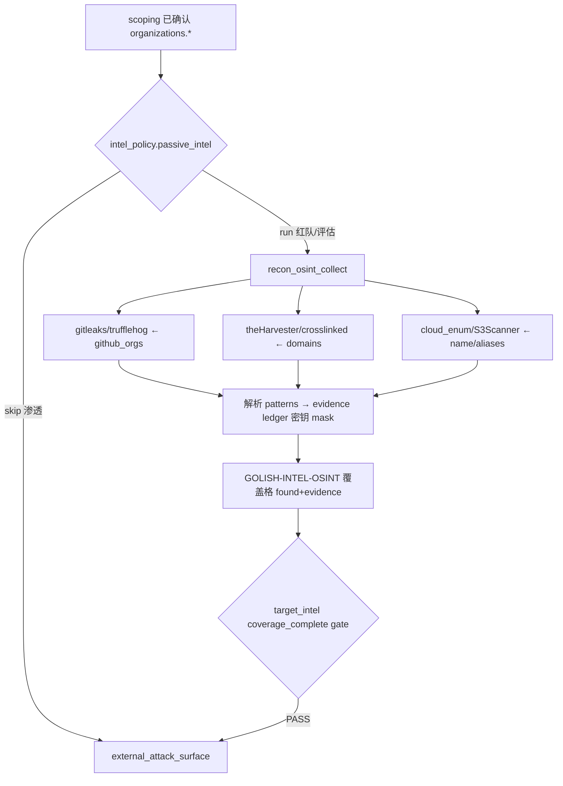

# target_intel OSINT 扩展（第一波）· 设计文档

> 目的：把 harness `target_intel`（被动情报）阶段里那个**空筐 `GOLISH-INTEL-OSINT`** 落地为真正能打的被动 OSINT 能力。第一波只接 **A 类纯 CLI 工具（零自研）**：代码/密钥泄露、人员/邮箱、云存储桶。复用现有 `toolsconfig` + `agent_tools` 接入范式，不重写引擎、不改 schema、不改 DAG。
>
> 关联背景：`docs/design/2026-06-06-intel-stage-ai-driven-per-mode.md`（intel 阶段 AI 驱动 + per-mode，Option B，本设计是其 OSINT 维度的补全）、`docs/design/2026-05-20-asm-intel-providers.md`（provider 5 步接入范式）、`docs/design/2026-06-03-two-level-phase-stage-model.md`（12 阶段 / 授权阶梯）。
> 证据来源：本文件 §1 每条均为 2026-06-08 本会话亲自读真实代码核对（带文件 / 行号）。日期：2026-06-08。
> 方案选型：第一波只做 A 类 CLI（成熟开源、`launchMode:cli`、Tool Manager 自动装），先喂现有 `GOLISH-INTEL-OSINT` 覆盖格、暂不扩 `expected_techniques`（避免 `coverage_complete` 立即 BLOCK），跑稳后再提升为一等技术。

---

## 0. 决策（TL;DR）

- **问题**：`target_intel` 的 6 类被动技术里，`GOLISH-INTEL-OSINT` 是个 catch-all 空筐——`resources/toolsconfig/` 32 个工具里**没有任何** dork / 代码泄露 / 人员 / 云桶 / breach 工具，OSINT「泄露·暴露」维度实际零落地。
- **方向**：第一波接 3 组成熟 CLI，**复用已存在的两套范式**（`toolsconfig` JSON + `agent_tools` 包装），不造新引擎：
  1. 代码/密钥泄露：`gitleaks` / `trufflehog`（+ `GitDorker`）
  2. 人员/邮箱：`theHarvester` / `crosslinked`（+ `maigret`）
  3. 云存储桶：`cloud_enum` / `S3Scanner`
- **gate 排序（关键）**：第一波**先不**把新技术加进 `target_intel.json` 的 `expected_techniques`，让三组产出归到现有 `GOLISH-INTEL-OSINT` 覆盖格；三组跑稳后第二步再提升为一等 `GOLISH-INTEL-{LEAK,PEOPLE,CLOUD}` 收紧 gate。
- **非目标**：不接付费 breach / 社工库（第二波 B 类，单独合规确认）；不做 Google dork（反爬重，归第三波 SearXNG / 搜索 API）；不改 DB schema / DAG / scoping。

---

## 1. 现状勘验（本会话亲自核对真实代码）

| 环节 | 现状 | 真实落点（已核 2026-06-08） | 缺口 |
|---|---|---|---|
| intel 技术分类 | 6 类，OSINT 是空筐 | `resources/harness/technique_taxonomy.json:22-27`：`GOLISH-INTEL-{DNS,WHOIS,ASN,CT,SUBDOMAIN,OSINT}`，OSINT 名为 "OSINT Exposure / Leaks" | OSINT 无任何具体子技术 / 工具 |
| target_intel spec | 被动 L1，coverage gate | `resources/harness/stages/target_intel.json`：`allowed_tool_types:[recon/dns,recon/subdomain,recon/osint,recon/url-history]`、`expected_techniques` 6 类、`coverage_complete` gate、`min_invocations{dns_resolve,subdomain_enum_passive}` | `recon/osint` 类型已开口，但无工具 |
| 已装工具 | 32 个，无 OSINT 泄露类 | `resources/toolsconfig/*.json`（amass/subfinder/nuclei/httpx/…） | 无 dork/leak/people/cloud 工具 |
| toolsconfig schema | 现成、清晰 | `resources/toolsconfig/amass.json`：`category/subcategory`(决定 tool_type)、`executable`、`install{linux/windows/method}`、`launchMode:cli`、`runtime:native`、`output{db_action,detect,format,patterns,produces}`、`params`、`skills`、`pentestPhase`、`tags` | — 复用即可 |
| 被动 agent 工具 | **已落地**（P0 完成） | `golish-recon-app/src/agent_tools/mod.rs`：`recon_discover_subsidiaries` / `recon_enrich_assets` 包 `run_passive_intel`，绑 `organization_id` + project-scope（IDOR）、产出落 evidence ledger 供 coverage 引证 | OSINT 收集工具缺一个同款 `recon_osint_collect` |
| 资产能力枚举 | 现成 | `golish-recon-app/src/asset_intel/capability.rs:17-28`：`Subsidiaries/Domains/Icp/Apps/MiniPrograms/SocialAccounts/Contacts` | 无 leak/people/cloud 维度（但本波走 CLI，不必扩此枚举）|
| per-mode 分流 | 现成 | `2026-06-06-intel-stage-ai-driven-per-mode` 的 `intel_policy`（red_team 全跑 / pentest skip）| 新 OSINT 工具挂同一 policy 即可 |
| 落库字段 | 现成 | organizations: `github_orgs / contacts / email_domains / name / aliases / domains`（asm 设计 §3.4）| OSINT 输入种子全部已有，天然衔接 |

> **核心洞察**：接入 OSINT 工具的**两套范式都已存在且经测试**（`toolsconfig` CLI + `agent_tools` 包装），P0 的 `recon_enrich_assets` 就是现成模板。本设计 = 加 3 组 CLI 的 toolsconfig + 一个 `recon_osint_collect` agent 工具 + 现有 `GOLISH-INTEL-OSINT` 覆盖格引证，**不造新引擎、不改 schema**。

---

## 2. 目标 / 非目标

**目标**
1. `target_intel` 阶段（red_team / assessment / bug_bounty，`intel_policy.passive_intel=run`）能驱动 3 组 OSINT CLI，AI 编排、无需点按钮。
2. 输入种子全部来自 scoping 已确认的 `organizations.*`（github_orgs / domains / name），scope 内、被动 L1。
3. 产出经 patterns 解析 → 落 evidence ledger → 喂 `GOLISH-INTEL-OSINT` 覆盖格（带证据，满足 I8）。
4. 密钥类产出一律 mask；公开桶 / 泄露命中升级为 finding。

**非目标**
- 不接付费 breach（HIBP/dehashed）/ 社工库（第二波，单独合规）。
- 不做 Google dork（反爬，第三波 SearXNG / 搜索 API）。
- 不改 DB schema / DAG / scoping / 现有 stage 语义 gate。
- 不在第一波扩 `expected_techniques`（见 §3.4 gate 排序）。

---

## 3. 提议设计

### 3.1 三组工具（A 类 CLI）

| 组 | 工具 | toolsconfig 要点 | 输入种子（已有字段）| 产出 |
|---|---|---|---|---|
| 代码/密钥泄露 | `gitleaks`、`trufflehog`（、`GitDorker`）| category=recon, subcategory=osint, `install.github`(gitleaks/gitleaks, trufflesecurity/trufflehog), launchMode=cli | `organizations.github_orgs` | secret(masked)/repo/commit |
| 人员/邮箱 | `theHarvester`、`crosslinked`（、`maigret`）| install pip(theHarvester, maigret)/github(m8sec/CrossLinked) | `domains` / `name` | email/person/source |
| 云存储桶 | `cloud_enum`、`S3Scanner` | install github(initstring/cloud_enum)/pip(s3scanner) | `name` / `aliases` / `domains` | bucket/access/url |

### 3.2 toolsconfig 模板（以 gitleaks 为例）

```json
{
  "tool": {
    "id": "gitleaks", "name": "gitleaks", "category": "recon", "subcategory": "osint",
    "description": "Scan git repos/orgs for leaked secrets (AK/SK/.env/tokens)",
    "executable": "gitleaks", "launchMode": "cli", "runtime": "native",
    "install": { "method": "github", "source": "gitleaks/gitleaks",
                 "windows": { "method": "github", "source": "gitleaks/gitleaks" } },
    "output": {
      "format": "json", "db_action": "finding_add",
      "produces": ["secret", "info"],
      "patterns": [{ "type": "secret",
        "fields": { "rule": "$.RuleID", "file": "$.File", "commit": "$.Commit", "secret": "$.Secret" } }]
    },
    "params": [{ "label": "Source", "flag": "--source", "type": "string", "required": true }],
    "skills": [{ "id": "detect-json", "name": "Detect secrets (JSON)",
                 "args": "detect --source {{source}} --report-format json --no-banner", "tags": ["passive","leak"] }],
    "pentestPhase": ["recon"], "tags": ["recon","osint","leak","secret"], "tier": "recommended"
  }
}
```

> 其余工具同构（theHarvester / cloud_enum / S3Scanner / trufflehog / crosslinked / maigret），各 1 文件。`subcategory=osint` → 命中 `target_intel.json` 的 `allowed_tool_types: recon/osint`。**Win 必须带 `install.windows` 分支**（本仓库正经历 Mac→Win 移植，此为已知坑）。

### 3.3 agent 工具 `recon_osint_collect`（仿 `recon_enrich_assets`）

在 `golish-recon-app/src/agent_tools/mod.rs` 旁新增（或同文件）一个 `recon_osint_collect` 工具：
- 入参：`organization_id`（已确认 org）+ `category`(leak/people/cloud) + 可选 `tools`（默认按 category 选）。
- 复用现有 CLI 执行链（同 `run_active_collection` 调工具的方式）跑选中工具，解析 `output.patterns`。
- project-scope + org 归属校验（IDOR，I2）；产出落 evidence ledger（I7），返回 JSON 摘要给 AI，coverage 引 evidence id。
- 按 `intel_policy.passive_intel` 决定是否在本 stage 暴露（red_team/assessment/bug_bounty 挂；pentest skip）。
- 注册进 Task specialist 工具集（同 `recon_enrich_assets` 注册点）。

### 3.4 gate 排序（关键，避免打断流程）

- **第一步（本波）**：**不**改 `target_intel.json` 的 `expected_techniques`。三组工具产出归到现有 `GOLISH-INTEL-OSINT` 覆盖格——AI 在该格 `status=found`+证据 / `checked_empty`+证据。`coverage_complete` 现有要求不变，不会因新增能力立即 BLOCK。
- **第二步（跑稳后，单独 PR）**：把 `GOLISH-INTEL-{LEAK,PEOPLE,CLOUD}` 加进 `technique_taxonomy.json` + `target_intel.json` 的 `expected_techniques`，coverage gate 自动开始要求每个 in-scope 资产覆盖这几类（收紧）。

---

## 4. 数据流图



---

## 5. 错误处理 / 边界

- **工具未装 / 装失败**：复用 Tool Manager 自动装 + 失败错误码；AI 据返回记 coverage `blocked`+note，不伪造 `found`（I8）。
- **无种子**（org 无 github_orgs / domains）：对应组记 `not_applicable`+note。
- **密钥泄露命中**：`Secret` 字段一律 mask 后入 evidence / 日志（I1 风格，对齐 asm 设计 §4 I1）。
- **scope 外**：输入种子只取已确认 `organizations.*`；云桶 / 人员结果回写前复用归属过滤。
- **限速 / 反爬**（theHarvester 的搜索源）：失败记 blocked，不阻断其他源。

---

## 6. 风险 / 回滚

| 风险 | 等级 | 缓解 |
|---|---|---|
| 误把新 technique 加进 expected_techniques 导致全 BLOCK | 中 | §3.4 两步走：本波不动 expected_techniques |
| 密钥泄露入库 / 日志泄密 | 高 | 入库前 mask；evidence 摘要不含明文；日志全 mask |
| Win 上工具装不上 | 中 | toolsconfig 带 `install.windows`；装不上记 blocked 不崩 |
| theHarvester/cloud_enum 被源限速 | 低 | 单源失败不影响整体；记 blocked |
| 合规越界（社工库 / 暗网）| 高 | 本波明确不接，留第二 / 三波单独确认 |
| 回滚 | — | 不注册 `recon_osint_collect` + 删 toolsconfig 文件即回到现状；无 schema / DAG 变更 |

---

## 7. 验证策略（DoD 摘要）

- **单测**：`recon_osint_collect` 的 `parameters()` schema 纯函数测试；各 toolsconfig `output.patterns` 解析样例（喂一段工具 JSON，断言抽出字段）；密钥 mask 单测。
- **集成**：red_team「给 org」→ `recon_osint_collect(category=leak)` 扫 github_orgs → 解析入 evidence → `GOLISH-INTEL-OSINT` 覆盖格 PASS；pentest skip 验证不暴露工具。
- **三平台**：每工具 `install` 在 linux/macos/windows 至少装得上、跑得出 JSON。
- **证据**：`just precommit` 全绿；trace 里能看到工具调用 + evidence 入 ledger + gate 决策（AGENTS.md §3，命令 + 输出为准）。

---

## 8. 与 AGENTS.md 不变量对齐

- **I1/密钥**：泄露密钥入库 / 日志一律 mask。**I2 IDOR**：`recon_osint_collect` 绑 `organization_id` + project_path 校验。**I5 ts-rs**：工具 wire 类型走 ts-rs。**I7 证据**：产出落 evidence ledger，coverage 引证。**I8 已检查≠未检查**：工具失败 / 无结果记 `blocked`/`checked_empty`+证据，不伪造 `found`。**I9 事务**：工具 HTTP / 子进程在事务外。**I10 schema**：本波不改 schema。

---

## 9. 开放问题（实现前需用户拍板）

1. `recon_osint_collect` 是**一个工具带 `category` 参数**，还是拆 `recon_leak_scan` / `recon_people_osint` / `recon_cloud_buckets` **三个工具**？（建议一个带 category，省注册）
2. 第一波每组**默认工具**：leak=gitleaks+trufflehog、people=theHarvester、cloud=cloud_enum，是否够？（crosslinked/maigret/S3Scanner/GitDorker 作为可选）
3. 公开桶 / 泄露密钥是直接升 `finding`（走 `finding_add`），还是先落 evidence 由 vuln_triage 再判定？
4. `db_action`：复用现有 `finding_add` / `target_update_recon`，还是新增 `osint_add`？
5. 第二波（提升为一等 technique + breach API）何时启动？

---

## 10. 分期

- **P0（本设计）**：3 组 toolsconfig（gitleaks/trufflehog/theHarvester/cloud_enum/S3Scanner）+ `recon_osint_collect` agent 工具 + 喂现有 OSINT 覆盖格 + 单测 / 集成。**red_team target_intel 能自动跑 OSINT**。
- **P1**：提升 `GOLISH-INTEL-{LEAK,PEOPLE,CLOUD}` 为一等 technique（taxonomy + expected_techniques）+ 收紧 coverage gate + 补 crosslinked/maigret/GitDorker。
- **P2**：第二波 B 类 API provider（SecurityTrails 被动 DNS / HIBP·dehashed breach / 搜索 API dork，走 `golish-intel-providers`）。
- **P3**：第三波半成品 / 合规敏感（网盘·文库包装、SearXNG dork、暗网谨慎）。

> 下一步：用户确认 §9（至少问题 1、2）后，进入 writing-plans 产出 P0 实现计划 `docs/superpowers/plans/2026-06-08-target-intel-osint-first-wave-p0.md`，再 executing-plans 落地。本设计不覆盖旧文档，新增独立 markdown（AGENTS.md §2.4 / I6）。
