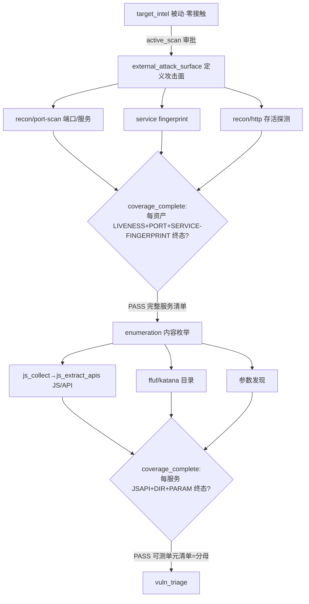

# 主动阶段重排 + verify-first gate 设计（EAS 定义攻击面 / enumeration 内容枚举）

> 目的：①修一个**阶段顺序缺陷**——原本 `external_attack_surface`(EAS) 在 gate 上硬要求 JS/API，却在 `enumeration` 做端口扫描**之后**才轮到端口；导致非标端口（如 8443）的 web 服务在 EAS 阶段不可见、其 JS/API 被漏。②把"每个资产都被实测核实"用**已有的 `coverage_complete` gate** 表达成过关硬标准（verify-first），杜绝拿情报源（FOFA/Shodan）旧数据当真。
>
> 重排后职责（用户 2026-06-09 拍板，对应正常渗透流"被动 → 端口 → 去重 → 抓 JS → 接口"）：
> - **EAS = 定义攻击面**：存活核实 + **端口扫描** + 服务/版本指纹 + HTTP 探测 + 截图（host × 端口 × 服务 × 活 web）。
> - **enumeration = 内容枚举**：在 EAS 摸清的**完整服务清单**上做 **JS/API 抽取** + 目录 + 参数。
>
> 设计哲学（用户拍板）：**「给 AI 工具 + 交付够对就行」**，gate 定义"够对"。能力工具（如 js_collect/js_extract_apis）+ 专用枚举工具（后续）做活、AI 高层编排、gate 把关。
>
> 关联背景：`2026-06-07-harness-passive-active-boundary.md`（被动/主动边界）、`2026-06-05-coverage-matrix.md` / `2026-06-05-vuln-triage-technique-matrix.md`（coverage 矩阵 + technique 词典）、`2026-06-03-two-level-phase-stage-model.md`、`2026-05-28-target-surface-workbench.md`。
>
> 证据来源：§1/§7 为 2026-06-09 本会话亲自读码 + 实跑核对。**本文件取代**同名旧草稿（先后经"确定性骨架版"→"纯配置版"两稿，最终落"重排 + 纯配置 + 1 处 D2 Rust"）。

---

## 0. 决策（TL;DR）

- **问题①（顺序缺陷）**：`operation_graph` 是 `target_intel → external_attack_surface → enumeration`。EAS 的 `allowed_tool_types` 无 `recon/port-scan`，却经 `surface_coverage` 硬要求 Surface+**JsApi**；端口扫描在更晚的 enumeration。→ EAS 只能摸到标准端口 web、就把 JS/API 交了；enumeration 扫出非标端口 web 服务时，JS/API 关已过 → **漏**。
- **问题②（核实缺口）**：两个主动阶段都没有"每个 in-scope 资产都被实测覆盖"的硬约束，AI 可拿情报旧数据糊一份过关。
- **方案**：
  1. **重排职责**：端口/服务指纹 **前移到 EAS**；JS/API **移到 enumeration**（在完整服务清单上跑）。
  2. **verify-first**：两阶段各加 `coverage_complete` + per-stage `expected_techniques`，对权威 `in_scope_assets` 逐资产核终态+证据（漏一个 = not_attempted = Block）。
  3. **D2 调整**：`surface_mapping.rs` 的 `D2_REQUIRED_CATEGORIES` 从 `[Surface, JsApi]` → `[Surface]`（EAS 不再硬要求 JS/API，JS/API 把关挪到 enumeration）。
- **保留代码名**（用户选 a）：`external_attack_surface` / `enumeration` 的 StageKind 标识符不改（重命名成本高、踩 schema），只改职责 + 描述 + 技术归属。
- **范围**：纯配置（3 JSON）+ **1 处 Rust 逻辑**（D2 常量）+ 配套测试 + 3 处描述文案。0 schema / 0 ts-rs。

---

## 1. 现状勘验（本会话读码 + 实跑核对 2026-06-09）

| 环节 | 重排前落点（已核） | 重排后（已实现） |
|---|---|---|
| EAS 工具面 | `external_attack_surface.json` allowed `[recon/dns, recon/http, recon/visual]`（**无 port-scan**） | 加 `recon/port-scan` → `[recon/dns, recon/port-scan, recon/http, recon/visual]` |
| EAS 技术/gate | gate_rules 含 `named_check surface_coverage`(要 Surface+JsApi) + min_invocations；无 expected_techniques | + `expected_techniques=[GOLISH-EAS-LIVENESS, PORT, SERVICE-FINGERPRINT]` + `coverage_complete`；`surface_coverage` 保留但只要 Surface（见 D2） |
| D2 硬要求 | `surface_mapping.rs::D2_REQUIRED_CATEGORIES = [Surface, JsApi]` | 改为 `[Surface]`（JsApi 移交 enumeration） |
| enumeration 工具面 | `enumeration.json` allowed `[recon/port-scan, recon/http, recon/crawler, web/fuzzer]` | 去 `recon/port-scan` → `[recon/http, recon/crawler, web/fuzzer]`（+ js_collect/js_extract_apis 元工具） |
| enumeration 技术/gate | gate_rules 仅 claims/findings/min_invocations；无 expected_techniques | + `expected_techniques=[GOLISH-ENUM-DIR, PARAM, JSAPI]` + `coverage_complete` |
| coverage_complete 引擎 | `rule_engine.rs::CoverageComplete`：对 `ctx.in_scope_assets`(权威) 否则自报 × `expected_techniques` 逐格核终态 | 现成，两阶段接入即生效，引擎 0 改 |
| 资产轴注入 | `execute.rs` GateContext `in_scope_assets`(来自 `targets.scope='in'`，DISTINCT) | 不变，两阶段共用 |
| 去重 | `merge.rs::dedupe_candidates`(跨provider按value小写折叠) + `targets insert` 前 `find_row_by_value_legacy` 查重 + `list_in_scope_values`=`SELECT DISTINCT value` | 三层已有，本设计 0 去重代码 |
| 词典守卫 | `technique_taxonomy.json` + `all_embedded_expected_techniques_are_recognized` fail-closed | 新增 6 个 `GOLISH-EAS-*`/`GOLISH-ENUM-*` 已登记 |
| charter | `stage_charter` 按 `expected_techniques` 自动渲染覆盖契约 | 不改代码，加技术即自动联动 |

---

## 2. 目标 / 非目标

**目标**
1. 端口/服务前移到 EAS，JS/API 移到 enumeration → 修非标端口 web 服务的 JS/API 漏测。
2. 两阶段各以 `coverage_complete` + per-stage 技术，强制"每个权威资产逐技术终态+证据"。
3. EAS `D2_REQUIRED` 改 `[Surface]`；enumeration 用 `GOLISH-ENUM-JSAPI` 接管 JS/API 把关。
4. 保留 StageKind 代码名，只改职责/描述/技术归属。

**非目标**
- 不重命名 StageKind；不改阶段顺序 / DAG（`operation_graph.json` 零改）。
- 不动 target_intel（被动）；不改 schema / ts-rs。
- 不写确定性编排骨架；专用枚举工具（enumerate_ports / discover_dirs / discover_params）列为后续（§10）。
- 分母联动（enumeration 单元 → vuln_triage total_units 真读取）列为 P1（§10）。

---

## 3. 提议设计（= 已实现）

### 3.1 两阶段职责（重排后）

| 阶段 | 定位 | allowed_tool_types | expected_techniques | 关键 gate |
|---|---|---|---|---|
| `external_attack_surface` | **定义攻击面**（host×端口×服务×活web）| recon/dns, **recon/port-scan**, recon/http, recon/visual | GOLISH-EAS-LIVENESS / **PORT** / **SERVICE-FINGERPRINT** | surface_coverage(只 Surface) + min_invocations + **coverage_complete** |
| `enumeration` | **内容枚举**（每个服务的 JS/API/目录/参数）| recon/http, recon/crawler, web/fuzzer (+ js_collect/js_extract_apis) | GOLISH-ENUM-DIR / PARAM / **JSAPI** | min_invocations + **coverage_complete** |

### 3.2 技术词典（`technique_taxonomy.json` 新增）

- EAS：`GOLISH-EAS-LIVENESS`（DNS+HTTP 存活）、`GOLISH-EAS-PORT`（端口/服务枚举）、`GOLISH-EAS-SERVICE-FINGERPRINT`（服务/版本指纹）
- enumeration：`GOLISH-ENUM-DIR`（目录/路径）、`GOLISH-ENUM-PARAM`（参数）、`GOLISH-ENUM-JSAPI`（JS 收集/API 抽取）

### 3.3 唯一 Rust 逻辑改动

`backend/crates/golish-agent-kit/src/harness/surface_mapping.rs`：
```rust
pub const D2_REQUIRED_CATEGORIES: &[SurfaceCategory] = &[SurfaceCategory::Surface]; // 原 [Surface, JsApi]
```
→ EAS 的 `surface_coverage` named_check 只硬要求 Surface（端口/服务/http/指纹），JS/API 不再压 EAS。JS/API 把关由 enumeration 的 `coverage_complete(GOLISH-ENUM-JSAPI)` 承担。

### 3.4 去重（0 新代码，2026-06-09 实读确认）

三层已有：① `asset_intel/merge.rs::dedupe_candidates`（跨 provider 按 value 小写折叠）；② `targets insert` 前 `find_row_by_value_legacy` 查重；③ `list_in_scope_values`=`SELECT DISTINCT value`。coverage_complete 量的是去重后的 distinct in-scope 集。

### 3.5 改动文件清单（= 已实现）

| 文件 | 改动 |
|---|---|
| `surface_mapping.rs` | D2_REQUIRED → [Surface]（+测） |
| `gate/surface_coverage_check.rs` | 测：only-Surface 现 Pass |
| `gate/rule_engine.rs` | 测：named_check surface_coverage only-Surface 现 Pass |
| `harness/stage_spec.rs` | 测：EAS 3 技术 / enum 3 技术 + 无 port-scan / EAS 含 port-scan |
| `task_orchestrator/prompts/mod.rs` | generator charter 的 EAS/enum 描述 + EAS charter 测 |
| `task_orchestrator/subtask_phases/execute.rs` | K::ExternalAttackSurface / K::Enumeration 子任务描述 |
| `technique_taxonomy.json` | 6 个 GOLISH-EAS-*/ENUM-* |
| `external_attack_surface.json` | +port-scan、3 EAS 技术、coverage_complete、描述 |
| `enumeration.json` | -port-scan、3 ENUM 技术、coverage_complete、描述 |

> gate 引擎 / coverage_complete / charter 渲染 / 资产轴注入 / DAG / phase / schema **均不改**。

---

## 4. 数据流图



---

## 5. 错误处理 / 边界

- **死/阻断资产**：coverage cell 记 `checked_empty`/`blocked` + 探测 evidence（≠ not_attempted，I8）。
- **静态站无参数**：PARAM cell 记 `not_applicable`+note。
- **in_scope_assets 为空**：`execute.rs` 非空才注入，否则回退自报集（现行为，不回归）。
- **非标端口 web**：EAS 端口扫描发现后纳入服务清单 → enumeration 在其上抓 JS/API（修复了原漏测）。
- **EAS/enum 不重复**：enumeration 描述明确"端口已在 EAS 做，勿重扫"。

---

## 6. 风险 / 回滚

- **R1**：D2 改 [Surface] 后，旧测「only_surface 应 block」已同步改为「应 pass」（surface_mapping / surface_coverage_check / rule_engine 三处测）。
- **R2 in_scope_assets 充盈度**：若运行时 `targets.scope='in'` 常空，coverage_complete 回退自报、强制力降；端到端需观察（§9）。
- **R3 AI 谎报 found**：found/checked_empty 强制 evidence_refs 非空（gate 校验）+ evidence 是真实落账 id（既有 fabricated-ref 防护）。
- **回滚**：D2 还原 1 行 + 3 JSON 还原 + 测试还原即回旧行为。无 schema/DB/类型链变更。

---

## 7. 验证（DoD · 已实跑证据 2026-06-09）

- `cargo nextest -p golish-agent-kit` → **528 passed / 0 failed**（含 EAS/enum 技术断言、coverage_complete 引擎、surface_coverage only-Surface、`all_embedded_expected_techniques_are_recognized` 词典守卫、charter 联动）。
- `cargo clippy -p golish-agent-kit --all-targets` → **零告警**。
- `cargo fmt -p golish-agent-kit --check` → clean。
- 3 个 JSON `json.load` → 合法。
- **顺带修**：`golish-pentest/src/handlers/env.rs` 预存编译错误（macOS conda 分支双赋值 E0384）→ 局部 mut 收集再单次赋值。
- ⏳ 待办：full `just precommit`（前端+全 workspace）、端到端 MiMo（red_team 到 EAS/enum，确认非标端口 web 的 JS/API 不漏 + gate BLOCK→PASS）。

---

## 8. 与 AGENTS.md 不变量对齐

- I2：仅对权威 in-scope 资产要求覆盖；越界资产不在轴。
- I5：0 ts-rs 改动。
- I6：本文件取代同会话未 commit 草稿（头部注明），不覆盖已 commit 设计。
- I7：每个 coverage cell 强制 evidence_refs。
- I8：死站 checked_empty+evidence，缺格 not_attempted=Block。
- I10：0 schema 改动。

---

## 9. 开放问题

1. **（CLOSED 2026-06-09）去重**：三层已有，0 代码。
2. **（P1）分母联动**：enumeration 的 JSAPI/DIR/PARAM 单元数 → vuln_triage `total_units` 真读取（不止配置，要让 vuln_triage 读 enumeration 产物），另一期。
3. **（可选）value 写法规范化**：去重按 value 字符串，不同源带/不带 scheme/port 可能漏折叠（边角，不影响正确性）。
4. **（可选）FRESHNESS / FINGERPRINT 细分**：显式 stale delta 列；本期 YAGNI 不做。
5. **（观察）in_scope_assets 充盈度**：端到端确认 recon 资产真进 `targets.scope='in'`。

---

## 10. 分期与后续

- **本期（已实现 + crate 级验证）**：重排 + verify-first（D2 + 6 技术 + 两阶段 coverage_complete + 工具面 + 描述 + 测试）。
- **P1**：专用枚举工具 `enumerate_ports` / `discover_dirs` / `discover_params`（对标 js_collect：跑扫描 + 结构化 + 落库 + 自动填 coverage，AI 只调不手搓）；分母联动（enumeration 单元 → vuln_triage total_units）。
- **后续**：FRESHNESS（stale delta 显式列）、value 归一、end-to-end MiMo 取行为证据。

> 下一步：用户审查 → full `just precommit` → 端到端 MiMo → 更新 progress/feature_list → commit。实现计划见 `docs/superpowers/plans/2026-06-09-active-stage-verify-first.md`（已同步重排）。
