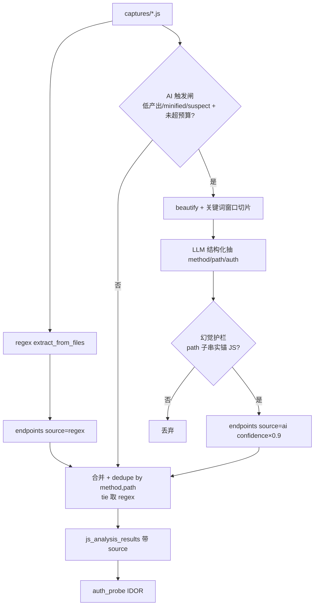

# JS→API 抽取 AI 增强（hybrid：regex 打底 + LLM 补难 case）设计

> 目的：现在 `js_extract_apis` 用 `golish_js_analyzer` 的**纯正则**扫 `fetch/axios/$.ajax/new Request`，在 **minified / webpack 混淆 / 动态拼接** 的 JS 上会漏端点（`fetch` 被改写成 `r.a.get(n(1234))`、路径常量折叠/拼接 → 正则抓瞎）。本设计加一层 **AI pass**：regex 抓得到的先抓（快、确定性、便宜），对正则**产出少/高度 minified/低 confidence** 的文件，喂给 LLM 语义理解、把漏的端点捞出来；两者合并去重，AI 结果过**幻觉护栏**（端点字符串必须真在 JS 里）才采信。
>
> 设计哲学：regex 管 80% 常规、AI 管 20% 硬骨头；AI 只在难 case 触发以控成本。输出沿用现有 `Endpoint` 契约 → 下游 `auth_probe`（IDOR）零改动消费。
>
> 关联背景：`2026-06-09-active-stage-verify-first.md`（enumeration 内容枚举含 JSAPI 技术）、`docs/design/2026-05-28-target-surface-workbench.md`（JS/API tab）。
>
> 证据来源：§1 为 2026-06-09 本会话读码核对（带文件:行号）。日期：2026-06-09。

---

## 0. 决策（TL;DR）

- **问题**：`js_extract_apis`（`golish-pentest-app/src/pentest_bridge/js_extract_apis.rs`）调 `golish_js_analyzer::extract_from_files`（**regex-based**，见该 crate `lib.rs`）。minified/混淆/动态拼接 JS 上漏报严重；`url_kind=Concatenated/TemplateLiteral` 拿不到真实路径。
- **方案**：**hybrid 抽取** = ① regex 打底（不变）② **AI pass**：对触发条件命中的文件，beautify + 切片喂 LLM，要求结构化吐 `{method, path, auth}`；过幻觉护栏（path 子串须在源码出现）后，并入 regex 结果、按 `(method, path)` 去重、标 `source`。
- **三道护栏**：① **触发闸**（控成本，只难 case 喂 AI + 全 run 上限）② **分块**（beautify + 网络调用关键词窗口，不灌整 bundle）③ **幻觉护栏**（AI 端点须在 JS 实锚 + 标 source/confidence）。
- **契约不变**：AI 产出同 `Endpoint` 结构（+ 新增 `source` 字段，serde default 向后兼容），落同一 `js_analysis_results` 表 → `auth_probe` 零改动。
- **范围**：改 `golish_js_analyzer`（加 `source` 字段 + 可选 AI 接口）+ `js_extract_apis`（AI pass 编排 + 护栏 + 合并）+ 接 LLM provider。**非纯配置**，是带 LLM 的真 feature。

---

## 1. 现状勘验（本会话读码 2026-06-09）

| 环节 | 落点（已核） | 缺口 |
|---|---|---|
| 抽取引擎 | `golish-js-analyzer/src/lib.rs::extract_from_files` → `extract_from_source`（**regex**） | minified/混淆/拼接漏报；无语义理解 |
| Endpoint 契约 | `Endpoint{ method, path, auth:AuthHint, url_kind:UrlKind, source_file, line, has_path_params, id_param_position, confidence }`；`ExtractReport{ endpoints, skipped, unique }` | 无 `source`(regex/ai) 区分位 |
| 工具 | `js_extract_apis.rs`：读 `.golish/captures/{host}/{port}/js/*.js` → `extract_from_files` → 过 min_confidence → 落 `js_analysis_results`（`PgReconScansAdapter::js_analysis_insert`）→ audit | 无 AI pass；低产出文件直接放过 |
| 上游 | `js_collect`（确定性 Tool，已抓 JS + 质量门 `judge_js_content` 启发式打分） | 已提供 JS 文件 + confidence/suspect 标记，可作 AI 触发输入 |
| 下游 | `auth_probe`（消费 endpoints 做 IDOR；用 `id_param_position` 等字段） | 契约不变即零改动 |
| UrlKind | `Literal / Concatenated / TemplateLiteral` | 后两者正则拿不到真实路径 → AI 重点补这块 |

> **核心洞察**：缺口不在"抓不抓得到 JS"（js_collect 已抓全、还标了 suspect），而在"从难读的 JS 里**理解**出端点"。这正是 LLM 强于 regex 的地方。AI 只需对 regex 啃不动的少数文件做语义补抽，且产出锚回源码防幻觉。

---

## 2. 目标 / 非目标

**目标**
1. js_extract_apis 变 hybrid：regex 打底 + AI 补难 case，提高 minified/混淆 JS 的端点召回。
2. AI pass 三护栏：触发闸（控成本）、分块（控上下文）、幻觉护栏（控误报）。
3. 输出沿用 `Endpoint`（+`source`），落同表，`auth_probe` 零改动。

**非目标**
- 不替换 regex（regex 是快/便宜的打底，保留）。
- 不对每个文件无脑喂 LLM（成本不可控）。
- 不做完整 JS 反混淆/AST 解释（超范围；本期 beautify + 关键词切片即可）。
- 不改 `auth_probe` / 不改 `js_collect`（只读它产出的 JS）。

---

## 3. 提议设计

### 3.1 hybrid 流程（在 js_extract_apis 内）

```
captures/*.js
  │ ① regex（现状）extract_from_files → endpoints(source=regex)
  ▼
对每个文件算「AI 触发分」（见 3.2）
  │ 命中触发 + 未超 run 预算
  ▼ ② AI pass（见 3.3）
  beautify → 关键词窗口切片 → LLM 结构化抽 {method,path,auth}
  → 幻觉护栏（path 子串实锚 JS）→ endpoints(source=ai, confidence)
  ▼
③ 合并：regex ∪ ai，按 (method,path) 去重（tie 取 regex）
  ▼
落 js_analysis_results（带 source）→ auth_probe 消费
```

### 3.2 护栏① 触发闸（控成本）

逐文件算是否喂 AI（任一命中且未超预算）：
- **低产出**：该文件 regex endpoints 数 / KB < 阈值（默认 < 0.2 个/KB）。
- **高度 minified**：平均行长 > 阈值（默认 > 2000 字符/行）或单行文件。
- **可疑**：js_collect 标了 `suspect`（confidence < 0.70）。
- **run 预算**：每次 run 至多 `MAX_AI_FILES`（默认 8）个文件、累计送 LLM 字节 ≤ `MAX_AI_BYTES`（默认 256KB）；超了停 AI（regex 结果照常）。
- `force_ai: true` 工具参数可显式全开（人工深挖时用）。

### 3.3 护栏② 分块（控上下文）

- 先 `beautify`（轻量格式化，把单行 minified 拆行；MVP 可用简单的 `;`/`}`/`,` 断行启发式，避免引重依赖）。
- 按**网络调用关键词**正则定位（`fetch|axios|XMLHttpRequest|\.ajax|\.(get|post|put|delete|request)\(|baseURL|api|endpoint|url\s*[:=]`），取命中点 ±`WINDOW`（默认 1500 字符）切片。
- 合并重叠窗口；每文件至多 `MAX_CHUNKS`（默认 12）个窗口；只把窗口（不是整 bundle）喂 LLM。

### 3.4 护栏③ LLM 调用 + 幻觉护栏

- **prompt**：低温、结构化输出。系统指令="你是 JS API 端点抽取器，只输出 JSON 数组 `[{method,path,auth}]`，method 大写、path 是请求路径/URL、auth∈{none,bearer,cookie,header,unknown}；只抽真实网络请求，别编。"输入=切片。
- **结构化解析**：解析 JSON；解析失败 → 跳过该文件（记 skipped，不污染）。
- **幻觉护栏（硬）**：每个 AI 端点的 `path`（去掉 `${...}` 模板占位后的**最长字面子串**，≥6 字符）必须**在该文件原始字节里出现**，否则丢弃。锚得到 → `source="ai"`、`confidence` 取 LLM 自报 ×0.9（永远低于 regex 的确定性 1.0）。
- **vehicle**：复用 agent 现有 LLM provider（与 sub_agents 同一接入路径）。MVP 可做成 js_extract_apis 内部一次 LLM 调用；后续可抽 `sub_agent_js_analyst`。

### 3.5 契约改动

- `golish_js_analyzer::Endpoint` 加 `#[serde(default)] pub source: EndpointSource`（`enum { Regex, Ai }`，default=Regex）→ 向后兼容，旧 JSON 解析为 Regex。
- `js_extract_apis` 输出/落库带 source；summary 加 `by_source: {regex, ai}` 计数。
- `auth_probe` 不变（多了 source 字段不影响其按 method/path/id_param_position 消费）。

---

## 4. 数据流图



---

## 5. 错误处理 / 边界

- **无 LLM provider / key**：AI pass 跳过，js_extract_apis 退化为纯 regex（不报错、不阻断）。
- **LLM 超时/报错**：该文件记 skipped(reason=ai_error)，regex 结果照常落库。
- **JSON 解析失败**：跳过该文件 AI 结果，不污染。
- **预算耗尽**：停 AI，summary 标 `ai_budget_exhausted`，剩余文件仅 regex。
- **幻觉**：锚不回源码 → 丢弃（宁可漏，不可编——pentest 端点编错会误导 auth_probe）。
- **成本上限**：MAX_AI_FILES / MAX_AI_BYTES / MAX_CHUNKS 三重 cap，避免烧爆。

---

## 6. 风险 / 回滚

- **R1 成本**：缓解 = 触发闸 + 三 cap + 默认只难 case；可配阈值。
- **R2 幻觉误导 auth_probe**：缓解 = 硬锚校验 + source/confidence 标记 + auth_probe 可按 source 加权（后续）。
- **R3 Endpoint 加字段破契约**：`#[serde(default)]` 向后兼容；旧 js_analysis_results 行解析为 source=Regex。
- **R4 beautify 引重依赖**：MVP 用启发式断行，不引完整 JS parser；不够再升级。
- **回滚**：AI pass 默认可关（feature flag / 无 provider 即关）→ 退回纯 regex，零副作用。

---

## 7. 验证策略（DoD）

- **单测**：
  - 触发闸：低产出/minified/suspect 各命中、预算耗尽停 AI。
  - 切片：关键词窗口提取 + 重叠合并 + MAX_CHUNKS cap。
  - 幻觉护栏：AI 编的端点（源码无锚）被丢；真锚端点保留 + source=ai。
  - 合并去重：regex∪ai dedupe by (method,path) tie 取 regex。
  - Endpoint `source` serde default 向后兼容（旧 JSON → Regex）。
  - 无 provider → 退化纯 regex（不 panic）。
- **集成**：拿一个真实 minified bundle 样本（fixture），regex 抽 N 个、hybrid 抽 > N（AI 补到的端点带 source=ai 且都能在源码锚到）。
- **证据**：`cargo nextest -p golish-js-analyzer -p golish-pentest-app` + clippy + fmt 全绿；`just precommit`。
- ⏳ 活体：真实 SPA（webpack）确认 hybrid 召回 > 纯 regex。

---

## 8. 与 AGENTS.md 不变量对齐

- **I3 后端独立校验**：AI 端点过硬锚校验，不信 LLM 自报。
- **I5 ts-rs**：若 Endpoint 进前端需同步（`source` 字段 ts-rs）；本期若仅后端用则不导出。
- **I6**：新增设计文件，不覆盖旧设计。
- **I7 证据**：AI 端点带 source/confidence + 锚回源码，可追溯。
- **I9 事务**：LLM 调用是长耗外部操作，**绝不**放 DB 事务内（抽取与落库分离，沿用现有 js_extract_apis 落库时序）。

---

## 9. 开放问题（实现前需核 / 拍板）

1. **（必核）LLM vehicle**：js_extract_apis 内部直接调 provider，还是抽 `sub_agent_js_analyst`？MVP 倾向内部调用（少一层），provider 接入点实读 sub_agents 的 LLM 路径确认。
2. **（拍板）触发阈值默认值**：低产出 0.2 个/KB、minified 2000 字符/行、MAX_AI_FILES=8、MAX_AI_BYTES=256KB、WINDOW=1500、MAX_CHUNKS=12 —— 用户可调。
3. **（可选）beautify 深度**：启发式断行（MVP）vs 引 JS 美化库（更准、更重）。
4. **（可选）auth_probe 按 source 加权**：ai 端点优先级/标注，后续。
5. **（可选）覆盖联动**：AI 补到的端点计入 enumeration 的 GOLISH-ENUM-JSAPI coverage + vuln_triage 分母。

---

## 10. 分期与后续

- **本期（P0）**：Endpoint +source；js_extract_apis 加 AI pass（触发闸 + 切片 + LLM + 幻觉护栏 + 合并）；单测 + minified fixture 集成；退化路径（无 provider→纯 regex）。
- **P1**：抽 `sub_agent_js_analyst`；beautify 升级；auth_probe 按 source 加权。
- **后续**：把同 hybrid 范式推广到其它"难读产物"（source map 重建、wasm 端点、混淆配置）。

> 下一步：用户审查 → 拍板 §9-1（vehicle）/§9-2（阈值）→ writing-plans 出实现计划 `docs/superpowers/plans/2026-06-09-js-api-extraction-ai-augmented.md` → executing-plans（TDD：触发闸/切片/护栏/合并逐个红绿）。本设计独立新增，不覆盖旧文档（I6）。
