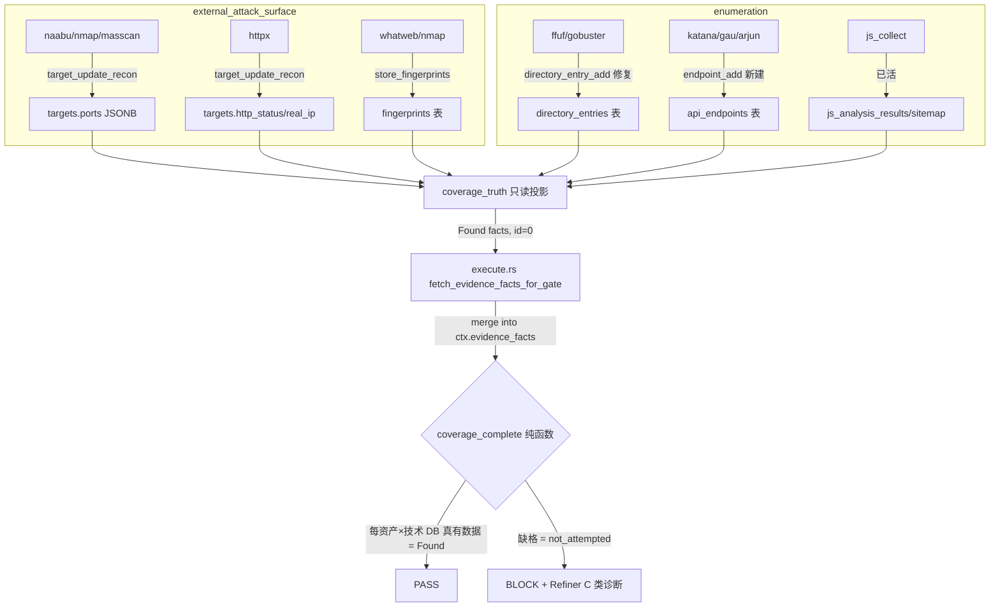

# 主动信息收集闭环：落库链路修复 + DB 真值投影扩展（EAS / enumeration）

> 目的：让两个主动信息收集阶段（`external_attack_surface` = 定义攻击面 / `enumeration` = 内容枚举）真正「全面」——把它们的工具产物**真实落库**，并把昨晚刚落的 **DB 真值投影**（`coverage_truth`，被动 6 类）**扩展到主动阶段**，使 coverage gate 的「每资产×技术终态」判定以 DB 业务表为准，而不是 agent 自报 / 命令派生。
>
> 触发背景：用户审计「主动阶段逻辑/工具/gate 字段是否全面」时，本会话实读代码发现**落库链路大面积断裂**——`enumeration` 的全部内容枚举工具（katana/ffuf/gobuster/arjun/gau/waybackurls）声明的 `db_action="endpoint_add"` 在 dispatch 表里**根本不存在**，输出全部走 `Unknown db_action` 丢弃；`masscan` 的 `host_add` 同款孤儿。这是与 2026-06-12 PR-B「dig 的 db_action 是个未接死 action」**同源、但面积大得多**的 bug。
>
> 关联设计：`2026-06-12-db-truth-driven-gate-and-diagnostic-reflector.md`（DB 真值投影 PR-A/B，被动阶段已落）、`2026-06-09-active-stage-verify-first.md`（EAS/enum 重排 + verify-first + 6 技术）、`2026-06-05-coverage-matrix.md`（coverage 引擎）。
>
> 证据来源：本会话（2026-06-12 BaJie MCP-agent-4）实读 `output_store/{mod,targets,findings}.rs`、`coverage_truth.rs`、`db_bridge/{mod,recon}.rs`、`tool_taxonomy.rs`、两个 stage JSON、4 张表 migration、全量 `toolsconfig/*.json` 的 `db_action` 盘点。

---

## 0. 决策（TL;DR）

| # | 问题（已实证） | 方案 | 优先级 |
|---|---|---|---|
| P0-A | `endpoint_add` 是孤儿 action：6 工具声明它、dispatch 表无此分支 → ENUM 全部内容枚举工具 + 2 被动 URL 工具输出**0 落库** | ffuf/gobuster 改用现成 `directory_entry_add`；katana/arjun/gau/waybackurls 新建 `endpoint_add` writer → 落 `api_endpoints` 表 + dispatch 分支 | P0 |
| P0-B | `masscan` 的 `host_add` 同款孤儿 | 改 `target_update_recon`（与 naabu 一致，端口 merge 进 `targets.ports`） | P0 |
| P1-C | `coverage_truth` 只投影被动 6 类，主动阶段（EAS/ENUM）**零 DB 真值锚**，弱模型谎报 found 时 gate 只能靠 fabricated-id 拦 | `coverage_truth` 扩 5 个技术维度：`targets.ports`→EAS-PORT、`fingerprints`→EAS-SERVICE-FINGERPRINT、`targets`(http 探活列)→EAS-LIVENESS、`directory_entries`→ENUM-DIR、`api_endpoints`/`js_analysis_results`→ENUM-PARAM/JSAPI | P1 |
| P2-D | coverage 资产轴是 **host 级**（`targets.scope='in'`），非「host×端口服务」级 → 非标端口 web（8443）可漏测 | 评估把 enumeration 轴升级为「`targets.ports` 展开的活 web 服务 host:port」 | P2（本设计仅记录，不实现） |
| P2-E | AI 手搓裸工具编排 + 手填 coverage cell，弱模型最易在此掉链 | 专用枚举元工具 `enumerate_ports`/`discover_dirs`/`discover_params`（对标 js_collect 一条龙） | P2（本设计仅记录） |

**本设计实现范围 = P0-A + P0-B + P1-C**。P2-D / P2-E 列入 §10 后续，本期不做（YAGNI + 影响面隔离）。

**红线（继承自 DB 真值设计 §4，不可破）**：
1. 落库 writer 只写**真实工具产物**；coverage_truth 只产 **Found** 语义；DB 无数据**绝不**推 `checked_empty`（I8）。
2. coverage gate 保持**纯函数**；DB 真值经 hook 注入 `EvidenceFact{outcome:Found, evidence_id:0}` 哨兵，不进 `evidence_refs`/claims（不破 fabricated 红线 I7）。
3. `findings` 永远只出自主 agent，落库链路**不**碰 findings。
4. migration 向后兼容（I10，`IF NOT EXISTS` 可重放）。

---

## 1. 现状勘验（本会话实读 2026-06-12）

### 1.1 db_action dispatch 表（`output_store/mod.rs:182`）

dispatch **只认 6 个 action**，其余一律 `errors.push("Unknown db_action")` + `continue`（丢弃该记录）：

```
target_add / target_update_recon / directory_entry_add / finding_add / dns_record_add / organization_update
```

### 1.2 全量 toolsconfig db_action 盘点（46 工具）

| db_action | 声明它的工具 | dispatch 有分支? | 落库表 | 状态 |
|---|---|---|---|---|
| `target_update_recon` | httpx, naabu, nmap, urlfinder, whatweb | ✅ | `targets`(ports/fingerprints) | **活** |
| `target_add` | amass, subfinder | ✅ | `targets`(scope='in') | **活** |
| `dns_record_add` | dig | ✅（PR-B 刚接） | `dns_records` | **活** |
| `finding_add` | dalfox, gitleaks, nikto, nuclei, sqlmap, trufflehog, wpscan | ✅ | `findings` | 活（后期阶段） |
| `directory_entry_add` | **（无工具声明它）** | ✅ | `directory_entries` | writer 在岗、无人用 |
| **`endpoint_add`** | **katana, ffuf, gobuster, arjun, gau, waybackurls** | ❌ **无分支** | — | ☠️ **6 工具全丢** |
| **`host_add`** | **masscan** | ❌ **无分支** | — | ☠️ **丢** |
| `credential_add` | hydra/john/hashcat/impacket/netexec/responder | ❌ 无分支 | — | ☠️（后期阶段，本期不修） |

> `grep -r endpoint_add backend/` = **0 命中**（连常量定义都没有）→ 坐实是 toolsconfig 里的纯字符串孤儿。

### 1.3 已存在但被旁路的落库表（migration 实读）

| 表 | 关键列 | 谁该写 | 现状 |
|---|---|---|---|
| `directory_entries` | url, status_code, content_length, tool, `UNIQUE(url,tool)` | ffuf/gobuster | writer 在岗（`findings.rs:9`），但工具声明 endpoint_add 够不到它 |
| `api_endpoints` | target_id(NOT NULL), url, method, path, params(JSONB), source('crawler'/'js_analysis'/…), tested | katana/arjun/gau | 表完整，**无任何 writer 写它** |
| `js_analysis_results` | url, endpoints_found, secrets_found, frameworks | js_collect 元工具 | js_collect 直接写 `sitemap_store`（JSAPI 链路另走，已活） |
| `fingerprints` | target_id, category, name, version, `UNIQUE(target_id,category,name)` | whatweb/nmap | `store_fingerprints` 已写（target_update_recon 内联，已活） |
| `targets.ports` | JSONB `[{port,proto,service,...}]` | naabu/nmap/httpx | `store_target_update_recon` 合并写（port+proto 去重，已活） |

### 1.4 coverage_truth 现状（`coverage_truth.rs`，PR-A/B 落）

- 单一查询入口 `coverage_truth_facts(pool, org_id, in_scope_assets)` → `Vec<(asset, &'static technique)>`，纯函数 `assemble_truth_facts` 组装。
- 现投影 **4 个被动技术**：`GOLISH-INTEL-{ASN,CT,SUBDOMAIN,DNS}`（来源 `organizations.asns/.certificates`、`target_assets(asset_type='subdomain')`、`dns_records`）。
- trait 链路：`DbRepoProvider::db_truth_facts`（默认空）→ `db_bridge/recon.rs::db_truth_facts_impl` 透传 → `execute.rs::fetch_evidence_facts_for_gate` 合并进 `ctx.evidence_facts`（哨兵 id=0，只 Found）。**扩展点干净，加技术维度只动 `coverage_truth.rs` + assemble 签名。**

### 1.5 工具白名单（`tool_taxonomy.rs`，已核实正确）

deny-by-default，wrapper 解包（pentest_run/run_pty_cmd 拆内层工具名再查 taxonomy）。4 个新工具（naabu/whatweb/cutycapt/arjun）已在硬表登记，EAS/ENUM 的每个 `allowed_tool_types` 至少 1 个在线工具。**此链路无 bug，本设计不改。**

---

## 2. 目标 / 非目标

**目标**
1. 修复 P0：`endpoint_add` + `host_add` 落库链路，让 ENUM 内容枚举工具与 masscan 的产物真正进库。
2. 扩展 P1：`coverage_truth` 覆盖 EAS/ENUM 的 5 个技术维度，使主动阶段 coverage gate 以 DB 真值为锚。
3. 全程守红线（只 Found / findings 永空 / gate 纯函数 / migration 兼容）。

**非目标**
- 不改阶段顺序 / DAG / schema 结构（仅可能加 1 个轻量索引）。
- 不改 coverage 引擎、不改 stage JSON 的 `expected_techniques`（6 技术维持 06-09）。
- 不动 `credential_add`（后期阶段，独立修）。
- 不实现 P2-D 轴粒度升级 / P2-E 专用枚举工具（§10）。
- 不碰工具白名单 taxonomy（已正确）。

---

## 3. 提议设计

### 3.1 P0-A：endpoint_add 落库链路

**分两类处理**（按工具产物语义）：

| 工具 | 产物语义 | 落点 | 做法 |
|---|---|---|---|
| ffuf, gobuster | 目录/路径爆破（status/size） | `directory_entries` | toolsconfig 改 `db_action: directory_entry_add`；writer 在岗但**当前写死 `target_id=NULL`**，而去重索引是 `UNIQUE(url,tool) WHERE target_id IS NOT NULL` → 现状去重失效。实现期补 `find_or_create_target(host_of(url))` 填 target_id 让 ON CONFLICT 生效（非纯零 Rust，需改 writer 一处） |
| katana, gau, waybackurls | URL/端点抓取 | `api_endpoints` | 新建 `endpoint_add` writer + dispatch 分支 |
| arjun | 参数发现 | `api_endpoints`(params JSONB) | 同上 `endpoint_add`，params 字段填发现的参数 |

> 注：`directory_entries` 与 `api_endpoints` 是两张表。目录爆破（路径+状态码）语义贴 `directory_entries`；端点/参数（method+params）语义贴 `api_endpoints`。两者都给 enumeration coverage 当真值来源（§3.3 DIR vs PARAM/JSAPI 分别投影）。

**新 `endpoint_add` writer**（`output_store/endpoints.rs`，对标 `dns_records.rs` PR-B 模式）：
- 入参 `fields: {url, method?, params?, source?}` + `tool_name` + `project_path`。
- `find_or_create_target(host_of(url))` 解析 url 的 host → target_id（复用 `targets.rs::find_or_create_target`，满足 api_endpoints.target_id NOT NULL）。
- `INSERT INTO api_endpoints (target_id, url, method, path, params, source, project_path) … ON CONFLICT DO NOTHING`（去重：同 url+method）。需补 `UNIQUE(target_id, url, method)` 索引（migration，`IF NOT EXISTS`）。
- 接 trait `OutputStore` + `pg_adapter` + `output_store/mod.rs` dispatch 的 `"endpoint_add" =>` 分支。

### 3.2 P0-B：masscan host_add → target_update_recon

`masscan.json` 的 `db_action` 改 `target_update_recon`（与 naabu 完全一致；masscan 输出 host:port，`build_port_entry`/`store_target_update_recon` 已能 merge 进 `targets.ports`）。**零 Rust，1 行 JSON。** 同时校验 masscan 的 output `patterns` 产出 `host`/`port` 字段名与 `store_target_update_recon` 期望一致（实测 naabu 用 `host`+`port`，masscan 需对齐）。

### 3.3 P1-C：coverage_truth 扩主动技术维度

在 `coverage_truth.rs` 加 5 个 `&'static str` 常量 + 对应只读查询 + `assemble_truth_facts` 加维度：

| 技术 id（已登记 taxonomy 06-09） | DB 真值来源 | 查询语义 |
|---|---|---|
| `GOLISH-EAS-LIVENESS` | `targets`(`http_status IS NOT NULL` 或 `real_ip != ''`) | 该 in-scope host 已被 http 探活/解析 IP |
| `GOLISH-EAS-PORT` | `targets.ports`(`jsonb_array_length(ports) > 0`) | 该 host 有端口扫描结果 |
| `GOLISH-EAS-SERVICE-FINGERPRINT` | `fingerprints`(EXISTS by target_id) | 该 host 有服务/版本指纹行 |
| `GOLISH-ENUM-DIR` | `directory_entries`(EXISTS by target host) | 该 host 有目录枚举产物 |
| `GOLISH-ENUM-PARAM` | `api_endpoints`(`jsonb_array_length(params) > 0` by target) | 该 host 有带参端点 |
| `GOLISH-ENUM-JSAPI` | `api_endpoints`(source IN js_analysis/crawler) 或 `js_analysis_results` EXISTS | 该 host 有 JS/API 抽取产物 |

> 6 个技术对齐 stage JSON 的 `expected_techniques`（EAS 3 + ENUM 3）。资产轴仍是 host 级 `in_scope_assets`（与现 coverage 引擎一致，零回归）。哨兵 id=0、只 Found，DB 无数据→不产 fact（缺格仍由 gate 正确 BLOCK = 真没测，I8 守住）。

**灰度隔离**：现 `db_truth_facts` 对所有 stage 合并、但 target_intel 只消费 INTEL-* 维度（technique 维度天然隔离——某 stage 的 expected_techniques 不含的 fact 不影响该 stage 判定）。扩主动维度后，EAS/ENUM 进入时自动消费对应维度，target_intel 不受影响。

### 3.4 改动文件清单

| 文件 | 改动 | crate |
|---|---|---|
| `resources/toolsconfig/{ffuf,gobuster}.json` | `endpoint_add`→`directory_entry_add` | resources |
| `output_store/findings.rs::store_directory_entry` | 填 `target_id`（让现有 UNIQUE 去重生效） | golish-pentest |
| `resources/toolsconfig/{katana,gau,waybackurls,arjun}.json` | 保留 `endpoint_add`（接新 writer） | resources |
| `resources/toolsconfig/masscan.json` | `host_add`→`target_update_recon` + 字段名对齐 | resources |
| `output_store/endpoints.rs`（新） | `store_endpoint` writer | golish-pentest |
| `output_store/{mod,store_trait,pg_adapter}.rs` | endpoint_add dispatch + trait + adapter | golish-pentest |
| `migrations/<ts>_api_endpoints_unique.sql`（新） | `UNIQUE(target_id,url,method)` IF NOT EXISTS | golish-db |
| `repo/coverage_truth.rs` | +5 技术常量 + 查询 + assemble 维度 + 单测 | golish-db |
| `db_bridge/recon.rs` | 透传不变（签名不变，零改或注释） | golish-agent-app |

> coverage 引擎 / stage JSON / tool_taxonomy / DAG / db_truth hook 接线**均不改**。

---

## 4. 数据流图



---

## 5. 错误处理 / 边界

- **url 无法解析 host**（endpoint writer）：跳过该记录 + warn，不 panic（与现 writer 一致）。
- **api_endpoints.target_id NOT NULL**：`find_or_create_target` 保证有 target 行（host 不在 targets 时创建，scope 默认沿用现逻辑）。
- **masscan 字段名**：若 masscan output pattern 产 `ip` 而非 `host`，writer 的 `host/ip/url` 兜底链已覆盖。
- **coverage_truth infra 失败**：现 hook 已 `warn + 不阻断`（gate 退回无 DB 投影），扩维度不改这层。
- **DB 无数据**：不产 fact → 缺格 BLOCK（真没测，正确），绝不推 checked_empty。
- **org_id=None（GUI/chat 路径）**：现逻辑 in_scope_assets 缺失即跳过 db_truth，零回归。

---

## 6. 风险 / 回滚

- **R1 endpoint writer 误去重**：`ON CONFLICT DO NOTHING` + UNIQUE(target_id,url,method) 保守去重，宁可重复 insert 失败也不覆盖。
- **R2 coverage 变严**：主动阶段接 DB 真值后，弱模型谎报 found 会因「DB 无数据→缺格」被正确 BLOCK（这是**预期收紧**，非回归）；但需活体确认 recon 产物真落库后 DB 投影补格，避免「真测了但工具没落库→误 BLOCK」——这正是 P0 落库修复的前置价值。
- **R3 masscan 字段漂移**：改 db_action 后需单测 masscan output parser 产 host/port 字段。
- **回滚**：P0-A/B 还原 toolsconfig + 删 endpoints.rs/dispatch 分支；P1-C 还原 coverage_truth.rs。无破坏性 schema 变更（仅加 UNIQUE 索引，可 DROP）。

---

## 7. 验证（DoD）

- `cargo nextest -p golish-db -E 'test(coverage_truth)'` → 新 5 维度 assemble 单测全绿（每维度 only-this / 多维度组合 / 空 in-scope）。
- `cargo nextest -p golish-pentest -E 'test(endpoint)'` → endpoint writer + output parser（katana/ffuf/masscan）单测。
- `rg endpoint_add backend/crates/golish-pentest/src/output_store/mod.rs` → dispatch 分支在岗。
- 6 个改动 toolsconfig `json.load` 合法 + db_action 值正确。
- `cargo clippy -p golish-db -p golish-pentest -- -D warnings` → 零告警。
- `cargo check --workspace` exit 0。
- `check_repo_ownership.py` → 0 新违规（coverage_truth 已在 SHARED_REPOS；新 endpoints repo owner=recon/pentest 按现归属）。
- **活体对照**（xiaomi/mimo × moresec.cn 到 enumeration）：日志出 `merged DB business-table truth facts`（主动维度 > 0）；EAS/ENUM coverage BLOCK 时 Refiner C 类诊断列出具体缺格 + 命令；落库后 `SELECT count(*) FROM api_endpoints/directory_entries` > 0。
- `just precommit` 全绿。

---

## 8. 与 AGENTS.md 不变量对齐

- I2：coverage 仅对权威 in-scope 资产；endpoint writer 经 find_or_create_target 落本 org 资产。
- I5：0 ts-rs 改动（纯后端落库 + 只读查询）。
- I6：本文件为新设计，不覆盖 06-09/06-12 既有设计（在头部引用）。
- I7：findings 链路不碰；DB 真值哨兵 id=0 不进 evidence_refs。
- I8：DB 无数据不推 checked_empty；缺格 BLOCK。
- I9：writer 不在事务里调外部；I10：migration `IF NOT EXISTS` 兼容。

---

## 9. 待用户拍板的决策点

1. **P0-A katana/gau/waybackurls 落点**：推荐 `api_endpoints`（结构化、给 vuln_triage 当分母）。备选：也落 `directory_entries`（简单但语义弱）。→ **推荐 api_endpoints**。
2. **P1-C 实现节奏**：推荐「P0 落库 + P1 真值投影」同一期做完（否则只修落库、gate 仍不锚 DB，价值打折）。备选：先 P0 验落库、P1 下一期。→ **推荐同期**。
3. **P2-D 轴粒度（host vs host:port）**：本期**不做**，仅记录。若用户认为 8443 漏测是硬伤需立即处理，则升级为本期 scope（影响面大：动 coverage 引擎资产轴注入）。→ **推荐本期不做**。

---

## 10. 分期与后续

- **本期（P0+P1）**：落库链路修复 + coverage_truth 主动维度投影。
- **P2-D**：enumeration coverage 轴从 host 升级为「`targets.ports` 展开的活 web 服务 host:port」，根除非标端口 web 漏测。
- **P2-E**：专用枚举元工具 `enumerate_ports`/`discover_dirs`/`discover_params`（对标 js_collect：跑扫描+结构化+落库+自动填 coverage，AI 只调不手搓）。
- **后续**：`credential_add` 落库链路（后期阶段）；enumeration 单元数 → vuln_triage `total_units` 分母联动。

> 下一步：用户审查本设计 → 调 writing-plans 写实现计划 `docs/superpowers/plans/2026-06-12-active-collection-db-truth-closure.md` → TDD 实现 → `just precommit` → 活体对照 → commit。
