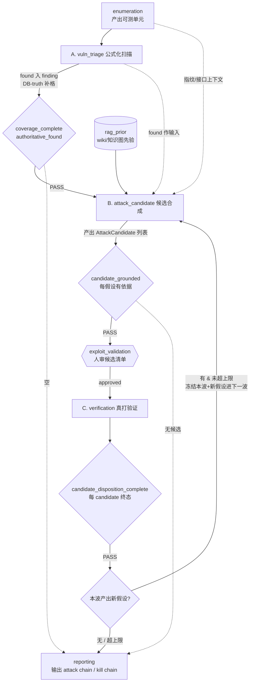

# 攻击阶段重构设计：公式化扫描 + 候选合成 + 真打验证（三阶段 + candidate 波次循环）

> **部分被替代（2026-07-12）：** 本文的三阶段拆分与 StageKind/DAG 骨架继续有效；Candidate 权威来源、逐 Candidate 审批、CandidateAttempt、Verification DB Gate、FactDelta 波次、per-worker 运行期记忆与长期知识边界，改以 `docs/design/2026-07-12-runtime-memory-candidate-pipeline-v2.md` 为准。

- **作者**: MCP-2 全栈工程师（BajieAsk 会话 qh43rp1d）
- **日期**: 2026-07-02
- **状态**: Discussion Draft（设计 only，不动代码；落地需用户点头 + 走 writing-plans + 过 `just precommit`）
- **读者**: Golish 平台后续的任何工程师 / AI agent
- **目的**: 把 harness 的**攻击段**（当前 `vuln_triage → verification → …` 一段空心占位）重构成语义清晰、可落地、可循环的三阶段：**① 公式化扫描 → ② 候选合成 → ③ 真打验证**，并支持「a→b→c 联动漏洞」的 candidate 波次循环。本文自包含，读完可直接进 writing-plans。

> 关联文档：
> - `docs/design/2026-05-26-stage-harness-mvp-external-attack-surface.md`（stage/profile/gate 总纲）
> - `docs/design/2026-06-03-two-level-phase-stage-model.md`（12 StageKind / 5 Phase 两级模型）
> - `docs/design/2026-06-05-vuln-triage-technique-matrix.md`（vuln_triage 15 类记分层 + 三层分离：执行/记分/证据）
> - `docs/design/2026-06-05-coverage-matrix.md`（coverage 矩阵数据结构 + gate 积木）
> - `docs/design/2026-06-28-stage-expansion-wave-barrier.md` / `docs/design/2026-06-28-eas-global-delta-expansion.md`（wave barrier 范式，本文循环设计的复用源）
> - `docs/design/2026-06-07-harness-passive-active-boundary.md`（被动/主动边界，「配置驱动、0 Rust 逻辑改」的先例）

---

## 0. 决策（TL;DR）

1. **问题**：攻击段的 `vuln_triage` 把两件语义相反的事塞进同一个 `coverage_complete` gate——「公式化广度扫描」（空是常态、可 DB 投影）和「针对性真打」（成功稀疏、要人判、路径依赖）。一个闸门包不住两种「完成」语义，所以 `vuln_triage` 怎么调都别扭；`verification` 及其后（`access_validation`…）则几乎是空占位（只有 2 条 for_all evidence 规则）。
2. **重构**：把攻击段切成**三个独立阶段**：
   - **A `vuln_triage`（重定义为公式化扫描）**：对 enumeration 产出的每个可测单元，套固定规则批量跑（接口未授权 / 越权替换 / nuclei PoC / 目录 / 弱口令 / TLS）。`found` 直接入 `finding`。**延用覆盖矩阵范式 + DB-truth 投影**。
   - **B `attack_candidate`（新增 StageKind）**：基于「信息收集上下文 + A 的 found + RAG 先验」推理，产出结构化**攻击假设清单**（`AttackCandidate`）。产物可审查，`exploit_validation` 人工审批门卡在本阶段出口。
   - **C `verification`（重定义为真打验证）**：对**被批准的 candidate** 逐个真打。gate 从「资产×技术覆盖」换成「**candidate 逐项终态状态机**」（verified / refuted / blocked）。
3. **循环**：candidate 需要循环（漏洞联动 a→b→c）。用**波次迭代**表达——`candidate ⇄ verification` 组成可迭代二元组，每跑完一波检查是否产出新的可拓展假设；有则开新波，无则收敛到 reporting。**复用已有的 `asset_wave_barrier` 范式**，DAG 层保持无环、零改校验。
4. **范围**：新增 1 个 `StageKind`（`attack_candidate`）+ 1 个数据结构（`AttackCandidate`）+ 2 个 gate op（`candidate_grounded` / `candidate_disposition_complete`）+ 1 张 DB 表（`attack_candidates`）+ 波次控制器（graph-flow 层）。`operation_graph.rs` 的无环校验 / 拓扑 / 切片逻辑**不改**。
5. **非目标**：不改信息收集四阶段（scoping/target_intel/EAS/enumeration）；不改 `operation_graph.rs` 的 DAG 无环不变量；本期不落地 post-exploit 段（access_validation…），但设计上让「打出新面→回 candidate」循环模型能自然延伸到它。

---

## 1. 背景与现状勘验（本会话亲自读真实代码核对 2026-07-02）

### 1.1 信息收集四阶段已沉淀出成熟范式（这是「模板」）

| 机制 | 落点（已核） |
|---|---|
| 覆盖矩阵三件套 | `harness/gate/rule_engine.rs` 的 `GateRule::{CoverageComplete, CoverageDenominator, CoverageCorroborated}` |
| DB-truth 投影 | `CoverageComplete { derive_from_evidence, authoritative_found, authoritative_techniques }`；EAS spec 开 `authoritative_found` + `facts_from_db_truth` + `freshness_window` |
| specialist 扇出 | `stage_spec.rs::specialist`（`target_intel→recon`、`external_attack_surface→prober`、`enumeration→enumerator`）+ `harness/stage_fanout.rs` |
| 证据契约 | `source_query_log`（`GateRule::SourceCoverage`）、`technique_outcomes`、`inherits_evidence_from` |
| 期望技术 | `GOLISH-INTEL-*` / `GOLISH-EAS-{LIVENESS,PORT,SERVICE-FINGERPRINT}` / `GOLISH-ENUM-{JS,DIR,PARAM,JSAPI}` |
| 波次冻结 | `stage_spec.rs::asset_wave_barrier`（EAS 开启，冻结本波覆盖分母到 stage 开始时的资产） |

### 1.2 攻击段现状是空心占位（对照表）

| 阶段 | spec 现有内容 | 缺什么（关键） |
|---|---|---|
| `vuln_triage` | 15 类 WSTG `expected_techniques`、`coverage_complete`、`coverage_denominator`（`resources/harness/stages/vuln_triage/spec.json`） | 无 `specialist`（`stage_run` 不能扇出）、无 DB-truth 投影（`authoritative_found`/`derive_from_evidence` 都没开）、无 `freshness_window`、`technique_outcomes` 没落库 → 只能靠模型自报 coverage cell = **假全面风险** |
| `verification` | `finding_verification`（min_severity=high + require_evidence_kinds=[poc,exploit_verified]）+ 3 条 for_all（`resources/harness/stages/verification/spec.json`） | 无 coverage、无 `expected_techniques`、无 `specialist`——**范式完全没定** |
| `access_validation` / `internal_discovery` / `objective_pathing` / `objective_simulation` | 仅 2 条 for_all（claim/finding 要 evidence） | 几乎全空白 |

### 1.3 根因：两种「完成」语义混在一个 gate

| 维度 | 信息收集（含公式化扫描） | 真打 / 验证 |
|---|---|---|
| 「完成」定义 | 广度全覆盖：每个 (资产×技术) 都有终态 | 深度 + 证据强度：高危假设验证到位 |
| 「空」的地位 | 常态、合法（`checked_empty` 是主体） | 例外；`found`（打成功）才是产物 |
| DB-truth 可投影? | 可——客观事实（端口/DNS/JS/目录命中） | 难——「漏洞证实」常要人判断 PoC 是否真证明影响 |
| 天然结构 | `资产 × 技术` 矩阵 | `finding × 终态` 状态机 / 攻击链图 |
| 路径依赖 | 线性 DAG | 强循环（打进去 → 发现新资产/新假设 → 再打） |

`vuln_triage` 现在同时承担「公式化扫描」（矩阵语义）和「真打入口」（状态机语义），所以 gate 永远两头不讨好。**拆开是唯一出路。**

### 1.4 用户核心诉求（2026-07-02 本会话）

> 「先分为两个部分：第一部分是可公式化的东西（接口越权、接口未授权、nuclei PoC 扫一遍，有 find 入 find）；第二部分搞一个 candidate，基于现有的来预设判断，然后再开始真的打。而且 candidate 可能需要循环——漏洞联动 a→b→c，b 拓展出新东西又要回 candidate。」

本设计把「第二部分」再拆成 **候选合成（B）** 与 **真打（C）** 两个阶段（用户已拍板 candidate 独立成阶段），并用波次迭代实现循环。

---

## 2. 核心模型

### 2.1 三阶段划分 + 两种范式

```
enumeration
  → A. vuln_triage      公式化扫描   【矩阵范式 · 沿用信息收集】
  → B. attack_candidate 候选合成     【推理范式 · 新增】
  →〔exploit_validation 人工审批〕
  → C. verification     真打验证     【finding 状态机范式 · 新增】
  → (波次循环回 B，或) reporting
```

- **A（公式化扫描）= 矩阵范式**：延用 `coverage_complete` + `coverage_denominator` + DB-truth 投影。判据：工具 + 字典/模板能覆盖、判定相对客观的技术类。
- **B（候选合成）= 推理范式**：产物是 `AttackCandidate` 假设清单，gate 是「每 candidate 有依据 + 高价值点被推理覆盖 + 人审」，**不是** coverage matrix（假设是动态的，没有固定矩阵列）。
- **C（真打验证）= 状态机范式**：输入是被批准的 candidate，gate 是「每 candidate 逐项终态」。

### 2.2 candidate 波次循环 + 攻击链图

漏洞联动（a→b→c）本质是 **C 的产出要喂回 B**。用波次迭代表达（不画环）：

```
第 1 波: B(candidate) →〔审批〕→ C(真打)
  └─ C 产出新的、未测过的假设? ── 有 → 第 2 波: B(只装新假设) →〔审批〕→ C
                              └─ 无 → 收敛 → reporting
```

- 每个 `AttackCandidate` 带 `parent_finding_id`（血缘）+ `wave`（第几波）。
- 循环产物天然是一张 **attack chain graph**：节点 = verified finding，边 = 「a 导致/开启 b」。`a→b→c` 就是图上一条路径，供 reporting 输出 kill chain。

### 2.3 为什么不破坏 DAG

`operation_graph.rs::validate()` 用 Kahn 拓扑排序，任何环都会被 `OperationGraphError::Cycle` 拒掉（`first_cyclic_stage` + `validate`）。所以**不能**在 `operation_graph.json` 加 `verification → attack_candidate` 回边。波次循环在 **graph-flow / orchestrator 层**实现：`verification` gate 过后，若存在下一波 candidate backlog，控制器把游标**重新指向 `attack_candidate`**（而非 DAG 的拓扑 next）。DAG 本身保持无环，`decide_transition`（`stage_transition.rs`）的纯拓扑语义不变。

---

## 3. 详细设计

### 3.1 StageKind / DAG / phases 改动

**新增 1 个 StageKind：`attack_candidate`。** 复用 `vuln_triage` / `verification` 旧名重新定义语义（避免大面改枚举）。

`resources/harness/graph/operation_graph.json` edges 调整（vuln 段）：

```json
{ "from": "enumeration",       "to": "vuln_triage" },
{ "from": "enumeration",       "to": "reporting" },
{ "from": "vuln_triage",       "to": "attack_candidate" },
{ "from": "vuln_triage",       "to": "reporting" },
{ "from": "attack_candidate",  "to": "verification" },
{ "from": "attack_candidate",  "to": "reporting" },
{ "from": "verification",      "to": "access_validation" },
{ "from": "verification",      "to": "reporting" }
```

> `attack_candidate → reporting` bail 边：候选为空（无可打假设）时可直接收尾。`verification → attack_candidate` **不加**（无环约束），波次回流走控制器。

`resources/harness/graph/phases.json`：把 `attack_candidate` 并入 `vuln` phase：

```json
{ "id": "vuln", "stages": ["vuln_triage", "attack_candidate", "verification"], "entry_approval": "active_scan" }
```

> `exploit_validation` 门**不放 phase 级**（那是「跨入 phase 前」），而放 **`verification` 的 stage 级 `human_approval.required_before=[exploit_validation]`**（已存在）——`stage_transition.rs::stage_entry_requires_approval` 保证每次进入 `verification`（含每一波）前触发人审。`vuln` phase 的 `entry_approval` 改为 `active_scan`（公式化扫描是主动扫描，进入前只需 active_scan 授权，不需 exploit_validation）。

### 3.2 阶段 A：`vuln_triage` = 公式化扫描

`resources/harness/stages/vuln_triage/spec.json` 关键改动：

| 字段 | 目标值 | 说明 |
|---|---|---|
| `specialist` | `"vuln_scanner"`（新增） | 让 `stage_run` 能 per-org 扇出（现在缺，是它享受不到并行的直接原因） |
| `coverage_axis` | `["UNAUTH","IDOR","NDAY","DIR","WEAKPW","TLS","INFO"]` | 展示用技术列 |
| `expected_techniques` | 只留**可机械批量跑**的类（见 §3.9） | 需推理的类移到 B/C |
| `findings_allowed` | `true` | 公式化 found 是确定性漏洞，直接入 finding |
| `facts_from_db_truth` | `true` | 交瘦交付物，DB-truth 补 found |
| `freshness_window` | `true` | 只认本波跑出的结果 |
| `gate_rules` | 保留 `coverage_complete`（加 `derive_from_evidence: true` + `authoritative_found: true` 收紧）+ `coverage_denominator` | found 从 `technique_outcomes` 投影，不认手写 |

**DB-truth 落库**：nuclei / sqlmap / 目录扫描 / 弱口令工具的结果，经工具执行层归一化写 `technique_outcomes`（对齐 EAS 的 httpx→targets / naabu→ports 模式），`coverage_complete` 的 `authoritative_found` 据此补 `found` 格，杜绝模型手写 found。

### 3.3 阶段 B：`attack_candidate` = 候选合成（新增）

**新 spec 文件** `resources/harness/stages/attack_candidate/spec.json`：

```json
{
  "id": "attack_candidate",
  "kind": "attack_candidate",
  "risk_level": "medium",
  "requires_stages": ["vuln_triage"],
  "allowed_next_stages": ["verification", "reporting"],
  "allowed_tool_types": [],
  "deliverable_schema": "StageDeliverable",
  "gate_validator": "validate_stage_gate",
  "specialist": "analyst",
  "coverage_axis": ["CANDIDATES"],
  "findings_allowed": false,
  "gate_rules": [
    { "op": "candidate_grounded",
      "require_evidence": true,
      "on_fail": { "reason": "every attack candidate must carry a rationale + observation evidence", "hints": ["cite the fingerprint/endpoint/finding that makes this hypothesis credible"] } }
  ],
  "human_approval": { "required_before": [] },
  "agent_continuity": "single_session",
  "inherits_evidence_from": [
    { "stage_kind": "vuln_triage", "evidence_kinds": ["vuln_finding"] },
    { "stage_kind": "enumeration", "evidence_kinds": ["http_service", "api_endpoint", "dir_entry"] }
  ]
}
```

**产物 = `AttackCandidate`**（现有 `StageDeliverable` 的 claims/findings/coverage 装不下「假设」），在 `StageDeliverable` 加 `candidates: Vec<AttackCandidate>`（`#[serde(default)]` 向后兼容）。gate 用新 op `candidate_grounded`：每个 candidate 必须有 `rationale` + 非空 `evidence_refs`（堵凭空假设）。完整性由控制器保证（每个高价值资产/接口都被推理覆盖：产出假设，或显式 no-candidate + 理由）。

**输入注入**：`harness/rag_prior.rs` 已有 `retrieve_wiki_prior` / `retrieve_graph_prior`（从 wiki 知识库 + 知识图检索先验 PoC，注释明确写「待注入 vuln_triage/verification 阶段」）——**本阶段是这个先验注入的落点**：把「信息收集上下文 + A 的 found + RAG 先验」拼进 analyst 的 charter。

**审批**：`exploit_validation` 门在本阶段**出口**触发（= 进入 `verification` 前，由 `verification` 的 stage 级 `human_approval` + `stage_entry_requires_approval` 保证）。人审的是一份具体的候选清单。

### 3.4 阶段 C：`verification` = 真打验证

`resources/harness/stages/verification/spec.json` 关键改动：

| 字段 | 目标值 | 说明 |
|---|---|---|
| `specialist` | `"exploiter"`（新增） | per-org / per-candidate 扇出 |
| `gate_rules` | 加 `candidate_disposition_complete`（新 op） | 每个 approved candidate 必须终态 |
| 保留 | `finding_verification`（min_severity=high + poc/exploit_verified） | verified 的强证据要求 |
| `human_approval.required_before` | `["exploit_validation"]`（保留） | 每波进入前人审 |

**gate 语义**：输入 = B 产出并被批准的 candidate 集（`disposition=approved`）。`candidate_disposition_complete` 要求每个 approved candidate 达到终态之一：
- `verified`：有 `poc` / `exploit_verified` evidence（ledger 校验，可 DB-truth 落库）→ 升为正式 `finding`
- `refuted`：判定假阳性 + 证据（≠「跳过」，I8）
- `blocked`：WAF / 权限 / 授权不足 + note

**约束**：沙箱 + 非破坏 + PoC 可复现（写进 methodology.md 正向指导 + gate 硬校验 verified 的证据强度）。

### 3.5 波次循环控制器（wave barrier 复用 + 收敛 + 防爆炸）

在 graph-flow 层（`task_orchestrator/subtask_phases/execute.rs` 的 harness loop，或 `stage_run_call.rs`）加一个 **chain-wave 控制器**：

```
在 verification gate PASS 后（决定下一 stage 前）：
  1. 收集本波 C 产出的「新的、未测过的」candidate（disposition∈{verified,refuted}
     衍生出的 parent_finding_id 新假设，且 hypothesis 未在既往波出现过 —— 去重）。
  2. 若存在新 candidate 且 未超上限:
       - 冻结本波（asset_wave_barrier 语义：本波 candidate 集已终态，不再动本波 gate）
       - 把新 candidate 写入下一波 backlog（wave = 当前波 + 1）
       - 覆写游标 → attack_candidate（开新一波），而不是走 DAG 拓扑 next
  3. 否则（无新假设 / 超上限）:
       - 走 DAG 拓扑 next（access_validation 或 reporting）
```

| 防爆炸机制 | 实现 |
|---|---|
| 停止条件 | 一波后无新的、未测过假设（`hypothesis` 归一化去重） |
| candidate 去重 | `attack_candidates` 表按 `(operation_id, target, hypothesis_hash)` 唯一，避免 a↔b 反复生成 |
| 深度上限 | 攻击链最长 N 跳（`parent_finding_id` 链深）；profile 可配 |
| 波次燃料 | 总波次上限（如 5），兜底防失控 |
| 每波人审 | `exploit_validation` 每波进 `verification` 前触发（`stage_entry_requires_approval`），人可喊停 |

> **与 EAS `asset_wave_barrier` 的异同**：EAS 是「单阶段内多波」（同一 stage 重跑，冻结资产分母）；本设计是「跨 B⇄C 二元组多波」（chain-wave）。复用 barrier 的「冻结当前波 + 新发现进下一波 backlog + 不阻塞当前波 gate」核心语义，但波次单位从「单 stage」升级为「candidate→verification 二元组」。

### 3.6 攻击链图（数据模型 + reporting 产物）

- `AttackCandidate.parent_finding_id` 建立血缘：candidate B 由 finding A 衍生 → B verified 成 finding → 又衍生 candidate C…
- 攻击链图 = 有向图：节点 = verified `HarnessFinding`，边 = `(parent_finding_id → finding_id)`。
- `reporting` 阶段从 `attack_candidates` + `findings` 重建这张图，输出 kill chain（比一堆孤立漏洞更有价值）。`reporting.spec.json` 的 `inherits_evidence_from` 增补 verification 的 `exploit_verified` / `attack_path`。

### 3.7 数据结构改动清单

**`harness/types.rs`**（新增）：

```rust
#[derive(Debug, Clone, Copy, PartialEq, Eq, Serialize, Deserialize)]
#[serde(rename_all = "snake_case")]
pub enum CandidatePriority { High, Medium, Low }

#[derive(Debug, Clone, Copy, PartialEq, Eq, Serialize, Deserialize)]
#[serde(rename_all = "snake_case")]
pub enum CandidateDisposition {
    Proposed,   // B 合成阶段产出
    Approved,   // 人审通过（放行真打）
    Rejected,   // 人审否决
    Verified,   // C 真打成功（升 finding）
    Refuted,    // C 判定假阳性
    Blocked,    // C 被 WAF/权限/授权阻断
}

#[derive(Debug, Clone, Serialize, Deserialize)]
pub struct AttackCandidate {
    pub candidate_id: Uuid,
    pub target: String,
    pub hypothesis: String,
    #[serde(default)] pub technique: Option<String>,   // WSTG/ATT&CK id（可选）
    pub rationale: String,
    #[serde(default, deserialize_with = "null_as_default")] pub evidence_refs: Vec<EvidenceAuditId>,
    #[serde(default)] pub prior_refs: Vec<String>,      // wiki writeup / CVE id
    #[serde(default)] pub suggested_approach: String,
    #[serde(default)] pub priority: CandidatePriority,  // 需 impl Default=Medium
    #[serde(default)] pub wave: u32,
    #[serde(default)] pub parent_finding_id: Option<Uuid>,
    #[serde(default)] pub disposition: CandidateDisposition, // 需 impl Default=Proposed
}
```

`StageDeliverable` 加字段：

```rust
    #[serde(default, deserialize_with = "null_as_default")]
    pub candidates: Vec<AttackCandidate>,
```

**DB**（`golish-db`，migration 新表，向后兼容——I10「先扩字段再上代码」）：`attack_candidates(candidate_id, operation_id, organization_id, target, hypothesis, hypothesis_hash, technique, rationale, prior_refs jsonb, priority, wave, parent_finding_id, disposition, created_at, updated_at)`，唯一约束 `(operation_id, target, hypothesis_hash)`。仓储 `repo/attack_candidates.rs`（create/list_by_operation/list_by_wave/update_disposition）。

### 3.8 gate 引擎改动（新 GateRule op）

`harness/gate/rule_engine.rs` 的 `GateRule` enum 加两个变体（tagged enum，写错名 serde fail-closed）：

```rust
    /// B 阶段：每个 candidate 必须有 rationale + 非空 evidence_refs（堵凭空假设）。
    CandidateGrounded {
        #[serde(default)] require_evidence: bool,
        on_fail: OnFail,
    },
    /// C 阶段：每个 disposition=approved 的 candidate 必须达终态
    /// verified/refuted/blocked；verified 的必须有强证据（poc/exploit_verified，
    /// ledger 校验交给 finding_verification / evidence_facts）。
    CandidateDispositionComplete {
        #[serde(default)] require_evidence_for_verified: bool,
        on_fail: OnFail,
    },
```

- 求值读 `deliverable.candidates`（B 阶段）/ 结合 `evidence_facts`（C 阶段 verified 的 ledger 佐证）。
- `Collection` enum 加 `Candidates` 变体（若要支持 `for_all over candidates` 通用积木，可选）。
- `op_name` / `summary` 相应补两臂。

### 3.9 技术清单重新分配（公式化 vs candidate）

**判据**：工具 + 字典/模板/规则能覆盖、判定相对客观 → 公式化层（A）；需 AI 理解业务语义构造针对性攻击 / 判定常需人看 → candidate 层（B/C）。横跨的（SQLi/XSS/命令注入）→ A 用工具扫低垂果实，剩余可疑点交 B 深挖。

| 现 vuln_triage 15 类 | 归属 | 理由 |
|---|---|---|
| `GOLISH-NDAY`（n-day PoC） | A 公式化 | nuclei + PoC 库按指纹批量跑 |
| `WSTG-CONF-05`（敏感目录/配置） | A | 目录字典批量 |
| `WSTG-ATHN-02`（弱口令/爆破） | A | hydra 字典批量 |
| `WSTG-CRYP-03`（TLS） | A | testssl 类批量 |
| `WSTG-INFO`（信息泄露/版本） | A | 指纹/报错批量 |
| `WSTG-SESS-02`（会话属性/CSRF 检查部分） | A | cookie 属性可自动 |
| 接口未授权（`WSTG-ATHN-04` 可自动部分） | A | 去认证批量试访 |
| `WSTG-ATHZ-04` IDOR（authz 替换可自动部分） | A（浅）→ B（深） | 浅层替换批量；深度越权需理解对象关系 |
| `WSTG-INPV-05` SQLi / `INPV-01` XSS / `INPV-12` 命令注入 | A（sqlmap/dalfox 扫）→ B（绕 WAF/深链） | 工具扫低垂；深度交 candidate |
| `WSTG-INPV-19` SSRF / `INPV-18` SSTI | B candidate | 需找外连点 + 构造 |
| `WSTG-ATHZ-01` 路径穿越/LFI | B | 半自动，深度需构造 |
| `WSTG-ATHN-04` 认证绕过（逻辑） | B | 需推理绕过逻辑 |
| `WSTG-BUSL` 业务逻辑 | B candidate | 纯创造性 |

> 这个分配是**可调的**（config-driven，改 spec 的 `expected_techniques` 即可，0 Rust 逻辑改，同 `2026-06-07-harness-passive-active-boundary.md` 的先例）。落地时按团队实际再调。

---

## 4. 数据流图



---

## 5. 改动文件清单（file:line 级）

| 文件 | 改动 | 类型 |
|---|---|---|
| `harness/types.rs` | 加 `StageKind::AttackCandidate` + `as_str`/`try_parse` 两臂；加 `AttackCandidate`/`CandidatePriority`/`CandidateDisposition`；`StageDeliverable.candidates` | Rust |
| `harness/phase.rs` | `ALL_STAGES[12]→[13]` 加 `AttackCandidate`；测试 `phases_cover_all_..` 计数 | Rust |
| `harness/resources.rs` | `stage_spec_json` match 加 `AttackCandidate` 臂；`all_twelve_stage_specs_load` → 13；（可选）methodology 臂 | Rust |
| `harness/gate/rule_engine.rs` | `GateRule::{CandidateGrounded, CandidateDispositionComplete}` + eval + `op_name`/`summary`；（可选）`Collection::Candidates` | Rust |
| `harness/stage_spec.rs` | 无需改结构（`specialist`/`gate_rules` 已是通用字段）；补测试 | Rust |
| `resources/harness/graph/operation_graph.json` | nodes 加 `attack_candidate`；edges 见 §3.1（12→13 nodes，边数相应变） | JSON |
| `resources/harness/graph/phases.json` | `vuln` phase 加 `attack_candidate`；`entry_approval` 调整 | JSON |
| `resources/harness/stages/attack_candidate/spec.json` | 新 spec（§3.3） | JSON |
| `resources/harness/stages/attack_candidate/methodology.md` | 新 playbook（正向指导：怎么基于上下文+先验生成高质量假设） | MD |
| `resources/harness/stages/vuln_triage/spec.json` | §3.2 改动（specialist + DB-truth + 技术清单收窄） | JSON |
| `resources/harness/stages/verification/spec.json` | §3.4 改动（specialist + candidate_disposition_complete） | JSON |
| `resources/harness/stages/reporting/spec.json` | `inherits_evidence_from` 增补 verification 的 attack_path/exploit_verified | JSON |
| `harness/operation_graph.rs` | **不改**（无环校验/拓扑/切片保持） | — |
| `harness/stage_transition.rs` | **不改**（纯拓扑）；波次回流在 graph-flow 层 | — |
| `task_orchestrator/subtask_phases/execute.rs`（或 `stage_run_call.rs`） | chain-wave 控制器（§3.5）：verification PASS 后判定是否覆写游标回 attack_candidate | Rust |
| `golish-db` migration + `repo/attack_candidates.rs` | 新表 + 仓储（§3.7） | SQL+Rust |
| `harness/rag_prior.rs` | live-wire：把 `retrieve_prior_knowledge` 注入 attack_candidate charter | Rust |
| `task_orchestrator/prompts/mod.rs` | 三阶段 charter 文本（A 公式化 / B 候选合成 / C 真打） | Rust |
| `docs/modules/backend/golish-agent-kit/harness.md` 等模块卡 | 同步（AGENTS.md §2.4） | MD |

---

## 6. 与 AGENTS.md 不变量对齐

- **I2 IDOR**：`attack_candidates` 表所有读写按 `operation_id` + `organization_id` 校验所有权；per-org 扇出复用 `stage_fanout` 的 org 隔离。
- **I5 ts-rs**：`AttackCandidate` / `CandidateDisposition` 若跨 IPC 到前端（攻击链图展示），加 `#[derive(ts_rs::TS)]` 同步；不手维护两份。
- **I6 设计走新文件**：本文件为新增，不覆盖旧设计。
- **I7 证据**：三阶段全部要求 claims/candidates/findings 引 evidence；verified 强证据（poc/exploit_verified）。
- **I8 已检查≠未检查**：C 阶段 `refuted`（假阳性）必须带证据，不等于「跳过」；候选去重不删「已判定无假设」的显式声明。
- **I10 schema**：新表 `attack_candidates` 是加性 migration；`StageDeliverable.candidates` 用 `#[serde(default)]` → 旧交付物解析不破。先上 migration，再上读它的代码。

---

## 7. 错误处理 / 边界

- **候选为空**：B 产出 0 candidate（无可打假设）→ `attack_candidate → reporting` bail 边直接收尾，不硬造假设。
- **审批未通过**：`exploit_validation` 人审否决 → candidate `disposition=rejected`，不进 C；C 的 gate 只对 `approved` 求终态。
- **真打全 blocked**：C 的 candidate 全 `blocked`（WAF/授权）→ 每个带 note，gate PASS（诚实终态），无新假设 → 收敛。
- **波次不收敛**：深度/燃料上限兜底；每波人审可手动喊停。
- **DB-truth 边界**：A 的 nuclei/目录/弱口令结果可投影 found（客观）；C 的 verified「影响评估/严重度」仍可人判，不强制 DB-truth（避免误把「工具报了」当「已证实影响」）。

---

## 8. 风险 / 回滚

| 风险 | 影响 | 缓解 |
|---|---|---|
| 新增 StageKind 牵动多处计数断言 | 编译/测试红 | 一次性改齐 §5 清单；`all_..stage_specs_load` / operation_graph node 计数测试同步 |
| 波次循环无限打 | 资源失控 | 深度/燃料上限 + 去重 + 每波人审（§3.5） |
| candidate 假设质量差（幻觉） | 浪费真打预算 | `candidate_grounded` 强制 rationale+evidence；RAG 先验提质；人审拦截 |
| DB-truth 投影误把「工具报了」当「已证实」 | 假阳性升 finding | A 用 nuclei 确定性命中；C 的 verified 要 PoC 强证据 + 人判影响 |
| graph-flow 游标覆写引入状态 bug | operation 卡死 | chain-wave 控制器纯函数化 + 单测覆盖「有新假设→回 B / 无→前进」 |

**回滚**：新增字段/表全 `#[serde(default)]` / 加性 migration；`attack_candidate` 阶段可用 profile `forbidden_stage_kinds` 关闭（退回旧两阶段行为）。gate 新 op 缺省不影响未声明它的 spec。

---

## 9. 验证策略（DoD 摘要）

- **单测**：
  - `operation_graph` 13 nodes + 新边拓扑（`enumeration→vuln_triage→attack_candidate→verification`）无环校验通过。
  - `phase.rs` 13 stage 全覆盖、`attack_candidate` 归 vuln phase。
  - `resources.rs::all_..stage_specs_load` 13 spec 全解析。
  - `rule_engine` 新 op：`candidate_grounded`（无 rationale/evidence → Block）、`candidate_disposition_complete`（approved 无终态 → Block；verified 无强证据 → Block）。
  - chain-wave 控制器：有新假设→游标回 attack_candidate；无→前进 reporting/access_validation；超上限→前进。
  - `attack_candidates` 仓储 CRUD + 去重唯一约束。
- **端到端**（mock 资产集 / 小米 MiMo `--stage-run`）：`enumeration → vuln_triage(公式化) → attack_candidate → (exploit_validation) → verification`，日志确认三阶段 gate PASS/BLOCK + candidate 波次回流。
- **证据**：`just precommit` 全绿；trace 可见各 stage gate + candidate disposition + wave 号（AGENTS.md §3，命令+输出为准）。

---

## 10. 分期实现路线

| 期 | 内容 | 交付 |
|---|---|---|
| **P0**（只读确认） | 实读 `technique_outcomes` / `evidence_facts` / `stage_run_call` 落库点，确认 A 的 DB-truth 投影落点 + 波次控制器接入点 | 勘验记录 |
| **P1**（骨架） | 加 `StageKind::AttackCandidate` + `AttackCandidate` 结构 + `attack_candidate/spec.json` + DAG/phases/resources 改；全部计数测试转绿 | 阶段可加载、DAG 通过 |
| **P2**（gate op） | `candidate_grounded` + `candidate_disposition_complete` + 单测（TDD 红→绿） | gate 可判 |
| **P3**（A 公式化） | vuln_triage 补 specialist + DB-truth 投影 + 技术清单收窄 + methodology | A 可扇出、found 从 DB 补格 |
| **P4**（波次循环） | chain-wave 控制器 + `attack_candidates` 表 + 血缘 + 去重/上限 | B⇄C 循环收敛 |
| **P5**（真打 + 攻击链图） | verification finding 状态机 + reporting kill chain 产物 + 前端 ts-rs | 端到端 + 攻击链可视 |

> 对齐项目「先样板再复制」历史：P3 把 A（vuln_triage）做成攻击段样板（就像当年 EAS），P4/P5 再推 candidate 循环与真打。

---

## 11. 开放问题（实现前需拍板）

1. **`exploit_validation` 门粒度**：放 `verification` stage 级（每波触发，本文默认）vs 只第一波触发？建议每波触发（人可持续把关攻击链扩张）。
2. **波次上限默认值**：深度 N 跳 / 总波次 M——建议 profile 可配，默认深度 3 / 总波次 5。
3. **A 的 `authoritative_found` 收紧范围**：哪些技术类的 found 只认 DB-truth（nuclei/目录/弱口令确定性强，SQLi/XSS 工具命中要不要也算权威）？建议先只对 NDAY/DIR/WEAKPW/TLS 收紧，注入类先非权威。
4. **candidate 去重的 `hypothesis_hash` 算法**：按 `(target + technique + 归一化 hypothesis 文本)` 还是语义相似度？MVP 用前者（确定性），语义去重 deferred。
5. **post-exploit 段是否本期纳入**：本文默认不落地 access_validation…，但循环模型可延伸。是否 P5 后追一期把内网段接上？

---

## 12. 关联文档

| 文件 | 作用 |
|---|---|
| 本文件 | 攻击段三阶段 + candidate 波次循环总设计 |
| `2026-06-05-vuln-triage-technique-matrix.md` | vuln_triage 记分层（A 的技术清单来源） |
| `2026-06-28-stage-expansion-wave-barrier.md` | wave barrier 范式（本文循环复用源） |
| `2026-06-03-two-level-phase-stage-model.md` | phase/stage 两级模型（新增 stage 归 phase 依据） |
| 待产出 `docs/superpowers/plans/2026-07-02-attack-stage-formulaic-candidate-exploit.md` | 本设计的实现计划（writing-plans 阶段产出） |

> 下一步：用户审查本设计 → 拍板 §11 开放问题 → 进 writing-plans 产出实现计划 → executing-plans 分期落地（P0→P5）。本设计不覆盖旧文档，新增独立 markdown（AGENTS.md §2.4 / I6）。
