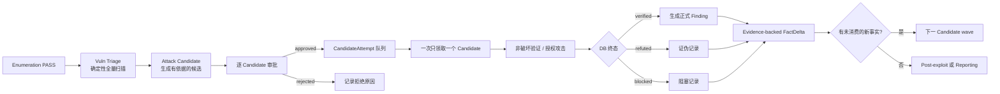

# Golish 运行期记忆与 Candidate 攻击流水线 V2 设计

- **日期**：2026-07-12
- **状态**：架构决策已确认；本文只冻结设计，不实施 schema、代码或真实扫描
- **范围**：operation 组织范围、stage/worker 短期记忆、Candidate 审批与逐条验证、FactDelta 波次、post-exploit/cleanup/reporting 的记忆边界、长期记忆/RAG/知识图谱投影
- **实施前置**：本文涉及新增 migration、修改 `golish-db` 以及新增 IPC；进入实现前必须按 `AGENTS.md` §2.7 再取得用户明确授权
- **V1 关系**：保留 `vuln_triage → attack_candidate → verification` 三阶段拆分；替代 2026-07-02 设计中关于 Candidate 权威来源、审批、验证、波次与运行期记忆的章节

关联文档：

- `docs/design/2026-07-02-attack-stage-formulaic-candidate-exploit.md`
- `docs/superpowers/plans/2026-07-02-attack-stage-formulaic-candidate-exploit.md`
- `docs/design/2026-05-20-agent-harness-strategy.md`
- `docs/superpowers/plans/2026-05-20-golish-agent-harness-architecture.md`

---

## 0. 最终决策

### 0.1 一句话结论

Golish 不建立一个叫“短期记忆”的大 JSON，而是建立一组有明确作用域、生命周期和权威级别的运行期记录：operation 冻结公司范围，stage 按公司拆运行单元，worker 各自持有 checkpoint，Candidate 各自持有审批和 Attempt；Gate 只读 canonical DB 与 evidence。长期记忆、RAG、知识图谱只能从这些权威事实异步投影，永远不能代替 Gate 真相。

### 0.2 攻击阶段的最终流水线



核心语义：

1. `vuln_triage` 负责把所有可公式化、可批量执行的检查跑完，并形成结构化 observation/outcome。
2. 确定性工具的命中先进入 Candidate 生命周期；只有 Verification 可以铸造最终 Finding。
3. 每个 Candidate 都必须有一条持久化审批记录。安全的机器验证可以由策略自动批准，但仍要产生可审计 approval；真实 exploit 必须由人明确批准。
4. Verification 默认全局一次只运行一个 exploit-class CandidateAttempt；确定性低风险校验可以配置有界并发，但 MVP 仍按逐条执行实现。
5. 每个 Attempt 独立 checkpoint、独立 evidence 归属、独立终态。一个 worker 崩溃只恢复该 Attempt，不重跑整个公司或整个 stage。
6. 下一波不能由模型一句“发现了新方向”触发；必须存在与 evidence 绑定、可去重、未消费的 `FactDelta`。
7. 最终 Gate 不信任 `StageDeliverable.candidates[]`、模型总结、RAG 或知识图谱，只信 DB 权威记录和 evidence ledger。

### 0.3 短期记忆的最终层级

| 层级 | 记录对象 | 作用域 | 解决的问题 | 是否 Gate 权威 |
|---|---|---|---|---|
| OperationState | 整次任务游标 | operation | 当前 stage、profile、immutable scope snapshot 指针 | 仅游标字段权威 |
| OperationOrgScope | 冻结的公司集合 | operation | 母公司/子公司到底谁被纳入 | 是 |
| StageRun | 一次 stage 进入 | operation + stage generation | 同一 stage 重跑/恢复身份 | 是 |
| StageRunUnit | 每公司 stage execution 单元 | operation + org + stage execution | 每家公司独立 PASS/BLOCK；内部 wave 由 worker/worklist 记录 | 是 |
| WorkerRun | 一个可恢复 worker | stage unit + specialist + generation | 每个 worker 独立 chain/checkpoint | checkpoint 权威，业务事实否 |
| CandidateApproval | 一个候选的授权决策 | operation + org + candidate + scope hash | 攻击前到底批准了什么 | 是 |
| CandidateAttempt | 一次真实验证执行 | candidate + approval + ordinal | 逐条打、恢复、重试、审计 | 是 |
| StageHandoff | final Gate PASS 后的交接 | operation + org + source stage execution | 下游得到精简事实引用 | 发布/依赖满足状态是权威；payload 仍须回查 canonical facts/evidence |
| Episode | 一次运行的不可变过程摘要 | worker/attempt/stage unit | 长期分析成功/失败经验 | 否，引用事实 |

结论：

- 不是“每个 runstage 放一个短期记忆”这么简单。
- 每个 stage 都有最小 StageRun/StageRunUnit 记忆。
- 每个真正可恢复 worker 都有独立 WorkerRun。
- 每个公司和纳入范围的子公司都有独立 StageRunUnit，但公司本身不拥有跨 operation 的可变“短期记忆”。
- 公司级上下文来自本 operation 冻结的 scope unit + 该公司的 canonical facts + 已 PASS handoff。
- 母公司只聚合子公司状态，不共享子公司的 worker chain、approval、evidence 或 Gate 证明。

---

## 1. 当前实现为什么不够

### 1.1 `operation_state.state_blob` 同时承担太多角色

当前运行时把两类数据塞在一个 JSON 中：

- `stage_run_workers[stage][org_id]`：保存 chain id、specialist、org name 等索引。
- `agent_run`：单槽 AgentRunCheckpoint。

问题不是 JSON 本身，而是身份和并发语义不成立：

- 多 org worker 会竞争同一个 `agent_run` 槽。
- `stage_attempt_id` 在 `stage_run` 路径仍为 `None`，无法证明 checkpoint 属于哪次 stage 进入。
- worker 与 message chain 的绑定存在崩溃窗口。
- stage、org、wave、worker generation 不能用数据库约束表达。
- 共享 deliverable sink 会把不同 worker 的结果混成“最后写入者获胜”。

因此 V2 将 `state_blob` 降回 coarse cursor/兼容用途，不再作为 stage worker 主写路径。

### 1.2 公司范围当前会随组织树漂移

当前 chat/task `stage_run` 会在运行时读取 engagement root 的实时递归子树：

- 模型漏写的子公司会被自动补入。
- 树外 org 会被丢弃。
- 运行中新增子公司会改变后续 stage 的分母。
- 子树查询失败会退回模型传入列表。

CLI 又使用另一套 `include_subsidiaries` 语义，导致 chat 与 CLI 的“本次 operation 包含哪些公司”不一致。

攻击阶段不能接受这种动态范围。授权必须是一个可复现的快照，而不是每次执行临时展开树。

### 1.3 Candidate 目前不是完整的工作队列

现有 `attack_candidates` 已经提供骨架，但还缺少 V2 必需语义：

- `operation_id` 是 TEXT，组织字段可空，唯一键不含 org 和 canonical target id。
- 没有 observation evidence 关联。
- 没有持久化 approval。
- 没有 CandidateAttempt。
- 没有 attempt evidence 归属。
- 没有 FactDelta 与 durable wave。
- upsert 可以把 terminal disposition 覆盖回别的状态。
- submit 可在 final Gate PASS 之前写 Candidate。
- Verification Gate 可被空 deliverable candidates 绕过。

V2 不删除已有表，而是 additive 扩展并把 DB 队列升级为唯一权威来源。

### 1.4 当前 memory/KG 不能承载客户事实

现有 `memories`、`graph_entities`、`graph_relations` 适合作为早期通用功能，但不满足 pentest 长期知识要求：

- scope 主要依赖 project path，存在 `NULL`/global 回退。
- 某些写入由模型决定 scope 或 fire-and-forget。
- 图谱会从 stdout/prose 正则提取实体和共现关系。
- 图实体唯一键缺 operation/org/evidence/有效期语义。
- 检索结果可能被直接拼入 prompt，却不能证明来源、时效和敏感等级。

所以不能把 `stage_run` 结果直接 embedding 后就称为长期记忆。需要先建立 evidence-backed Assertion 与 transactional outbox。

---

## 2. 权威级别与不可违反的边界

### 2.1 四级数据权威

| 级别 | 数据 | 用途 | 可否推动 Gate |
|---|---|---|---|
| L0 Authority | scope snapshot、canonical domain rows、evidence ledger、approval、attempt terminal、finding | 授权与事实判定 | 可以 |
| L1 Runtime | StageRunUnit、WorkerRun checkpoint、lease、watermark | 恢复和调度 | 只能证明执行状态 |
| L2 Projection | StageHandoff、Episode、KnowledgeAssertion、report read model | 交接、检索、报告 | 必须回指 L0 |
| L3 Prior | vector hit、KG path、wiki writeup、历史 technique outcome | 提示和排序 | 不可以 |

### 2.2 硬不变量

1. Gate 查询失败必须 fail closed；不得退回模型自报。
2. RAG/KG 故障只能降低建议质量，不能改变 PASS/BLOCK。
3. `checked_empty` 是有时间范围的事实，不是永久“没有”。
4. `blocked` 只说明本 Attempt 无法完成，不等于目标不存在漏洞。
5. Candidate 永远是 hypothesis；只有 terminal Verification 可以提升为 Finding。
6. 默认拒绝 sibling org prior；只有显式 `SiblingOrgPrior` class 同时通过 frozen-snapshot membership、actor authorization 与 stage policy 时才可作为提示，且永远不能成为本 org Gate proof。
7. scope hash 不一致时，approval、lease、checkpoint 和 handoff 都失效。
8. 任一外部 HTTP/LLM/embedding/KG 调用不得发生在 DB transaction 内。
9. credential/token/session value 只能保存在 vault；其它系统只保存 `vault_ref`。
10. 删除组织前必须先发布 invalidation；非终态 cleanup obligation 会阻止删除。runtime 临时行可清理，Episode/Assertion/final report/cleanup residual/evidence 使用冻结时 identity 保留，绝不随 live organization cascade。

---

## 3. Operation 组织范围模型

### 3.1 冻结时机

Scoping 的确定性 Gate PASS 后、进入 Target Intel 前，原子写入一份 `OperationOrgScopeSnapshot`：

```text
operation_id
project_scope_id
project_path
root_organization_id
scope_hash
decision_tool_call_id
frozen_at
schema_version
units[]
```

`project_scope_id` 是 authorization、RAG 与长期知识隔离的稳定身份；`project_path` 只作显示与 provenance，不能作为安全边界。

每个 unit 保存：

```text
organization_id
parent_organization_id
organization_name_at_freeze
role = root | subsidiary
depth
ordinal
ownership_percent_at_freeze
approval_source
```

### 3.2 纳入规则

- 用户选择仅母公司：只冻结 root。
- 用户选择纳入子公司：只冻结 review 中明确批准的 child 集合，不重新按照实时树或 ownership threshold 推导。
- CLI 单 org：冻结 root-only snapshot。
- CLI `--include-subsidiaries`：在 operation 创建前只解析一次完整 descendant 集合并应用显式 threshold，把结果作为 `approval_source=cli_flags` 冻结进同一个 operation；之后不再重读 mutable tree，也不为每个 child 创建语义不同的独立 operation。
- 旧 operation 没有 snapshot：仅允许一次显式 compatibility backfill，并记录 `legacy_subtree_backfill` provenance；攻击阶段默认 fail closed。

### 3.3 运行中发现新子公司

新子公司不会静默加入当前 immutable snapshot。流程固定为：

1. 创建 `scope_change_candidate`。
2. 展示新增公司、关系、ownership/evidence 与风险。
3. 用户批准后创建一个新的 supplemental operation；新 operation 可记录上一 operation 的 lineage，但不能改写原 operation 的 immutable snapshot。
4. supplemental operation 写入自己的 scope snapshot/hash，并只为新增或明确重跑的 org/stage 创建 generation。
5. 原 operation 的 approval/attempt 继续绑定旧 scope hash，不自动扩权，也不被新 operation 追溯修改。

---

## 4. Stage、公司与 Worker 的短期记忆

### 4.1 StageRun 与 StageRunUnit

`stage_runs` 继续表示一次 stage 进入（下文称 `stage_execution_id`）。新增 `stage_run_units` 表示该次进入中每个 org 的最终 Gate 单元；EAS/Enumeration 等内部 wave 继续使用 `stage_asset_waves`，并通过 WorkerRun 的 `work_item_kind/work_item_key` 绑定 exact wave。StageRunUnit 在中间 wave 关闭时仍为 running，只有 org-stage final seal 后才能 passed。

`stage_execution_id` 与交付提交身份必须拆开：同一次 stage execution 可以多次调用 `submit_stage_deliverable`，每次调用用 trusted `tool_call_id` 作为 `deliverable_submission_id`，但 server 都把 wire 兼容字段 `StageDeliverable.stage_run_id` 覆写为同一个 active `stage_execution_id`。unit、evidence、handoff 只引用 execution id，不能把每次提交生成的新 UUID 当 stage run。

推荐状态机：

```text
queued -> running -> gate_blocked -> running
                  -> passed
                  -> exhausted
                  -> superseded
```

约束：

- `(stage_execution_id, organization)` 唯一；`stage_execution_id` 必须与 operation/stage 完整匹配。
- terminal 状态不可退回 running；重试创建新 worker generation，而不是篡改历史。
- per-org final Gate PASS 与 StageHandoff 发布处于同一短事务；中间 wave PASS 不发布下游 Handoff。
- `org_stage_completions` 在兼容期 dual-write，但恢复与 Gate 真相改读 `stage_run_units`。

### 4.2 WorkerRun

每个可恢复的逻辑 worker 一条 `stage_worker_runs`：

```text
worker_run_id
stage_run_unit_id
worker_generation
specialist
work_item_kind
work_item_key
agent_path
parent_request_id
message_chain_id
status
gate_attempt
checkpoint
checkpoint_version
lease_token
lease_owner
lease_expires_at
heartbeat_at
attempt_epoch
evidence_watermark
started_at / updated_at / terminal_at
```

WorkerRun 只存恢复和调度需要的状态：

- 当前 turn、background job、repair mode、budget、watermark。
- message chain 的 durable id。
- 最后一个 provider-safe checkpoint。
- 不存 transcript 副本、不存思维链、不把自然语言总结当事实。

worker 必须先原子 claim lease，checkpoint/terminal update 同时校验 `lease_token + attempt_epoch + checkpoint_version`。只有 lease 过期才能被 reaper 接管；heartbeat 延长租约。两个进程既不能覆盖 checkpoint，也不能同时执行同一外部副作用。

fresh worker 先预分配 `message_chain_id`，在一笔 DB 事务中创建 message_chain 并绑定 WorkerRun；事务提交后才写首个 provider-safe checkpoint并发出 provider request。这样 create→bind 之间不存在 orphan 窗口，crash 后也能从已绑定的空/初始 chain 确定性恢复。

`work_item_kind/work_item_key` 是逻辑 worker 身份：当前信息收集阶段使用 `organization/<org_id>`；Candidate Verification 使用 `candidate_attempt/<attempt_id>`；Access Validation 使用 `foothold_candidate/<id>`（来源绑定 verified CandidateAttempt），后续 post-exploit 使用 `foothold/<id>`、`attack_path/<id>` 或 `objective_attempt/<id>`。因此同一 org/stage 可以安全拥有多个同 specialist worker，而不会靠数组顺序或 agent 名称猜身份。

### 4.3 StageHandoff

StageHandoff 只在 org-stage final authoritative Gate PASS 后发布，按 `(operation, org, from_stage, stage_execution_id)` 唯一，内容由服务器从 GateContext/canonical rows 构造，受限为：

```text
canonical_fact_refs
evidence_ids
coverage_watermark
scope_hash
unit_gate_decision_hash
aggregate_pass_token_hash (nullable)
typed_summary
schema_version
```

publish transaction 必须验证每个 evidence id 属于当前 operation/org/scope、每个 canonical ref 存在且处于允许的 current/fresh 状态。它不保存完整 tool stdout、transcript 或自由 prose。下游 stage 只读取 latest final-sealed handoff，并按 `inherits_evidence_from` 和 org 回查引用；母公司 worker不能读取子公司的 handoff 作为自己的证明。

### 4.4 各阶段到底记录什么

| 阶段 | Stage/Org 短期记忆 | Worker 粒度 | PASS handoff | 不应保存 |
|---|---|---|---|---|
| Scoping | trusted seed、scope decision、snapshot hash | operation/root review worker | frozen org units、授权边界 | 未批准的动态子树作为 scope |
| Target Intel | org profile worklist、provider terminal 状态 | 每 org | canonical Targets、WHOIS/ASN/OSINT refs | provider 大段原文 |
| EAS | asset wave、端口/服务/web origin coverage | 每 org/wave | live surface、terminal coverage refs | 模型自报“扫完” |
| Enumeration | exact origin、crawl/JS/API/dir worklist | 每 org/wave | endpoint/dir/JS/API refs | 无 evidence 的路径猜测 |
| Vuln Triage | deterministic technique matrix、scan outcome | 每 org/scan wave | observation/outcome refs、Candidate input facts | 直接写最终 Finding |
| Attack Candidate | 未消费 facts/deltas、候选批次 | 每 org/candidate wave analyst | accepted proposed candidates | 把 prior 当 proof |
| Verification | approved Candidate 队列 | 每 CandidateAttempt | terminal dispositions、Finding/FactDelta refs | 共用一个 verifier chain 打多条 |
| Access Validation | exact verified CandidateAttempt/foothold candidate workset | 每 foothold candidate；成功后才铸造 foothold | verified/refuted access 与 foothold refs | 明文凭据 |
| Internal Discovery | foothold/pivot observation workset | 每 foothold/pivot | internal asset refs | 跨 foothold 混合状态 |
| Objective Pathing | objective + foothold graph | 每 objective/path synthesis | approved path hypotheses | 把路径假设当已验证 |
| Objective Simulation | approved path attempt | 每 objective attempt | impact/outcome refs | 未授权动作计划 |
| Cleanup | obligation worklist | 每 resource/obligation group | cleanup attestation/residual refs | 删除历史 evidence |
| Reporting | operation 聚合 read model | operation + per-org section builder | validated revision + staged/hash-verified artifact refs；finalize 由用户命令完成 | 开放式扫描或新事实创造 |

---

## 5. Candidate V2 领域模型

### 5.1 Candidate 是 DB 权威队列

Candidate 的创建合同：

- 必须绑定 `operation_uuid + organization_id + target_id + scope_hash`。
- 必须有 hypothesis、rationale、technique/risk、observation evidence refs。
- 可引用 RAG prior，但 prior refs 不能代替 observation evidence。
- 只允许在 `attack_candidate` 的 final org Gate PASS 后事务性接受候选批次。
- Gate BLOCK/DB error 时不得留下半接受 Candidate。
- 同一 candidate identity 用 org-aware hash 去重。
- proposed upsert 不得覆盖 approval 或 terminal disposition。

Candidate disposition 保持简洁：

```text
proposed -> approved -> verified
                    -> refuted
                    -> blocked
         -> rejected
```

`queued/running/retrying` 属于 Attempt，不加入 Candidate disposition。

### 5.2 审批模型

每个 Candidate 一条 current approval，历史决策不可变保留：

```text
pending -> approved | rejected | expired
approved -> revoked
```

审批绑定：

- operation、org、candidate、scope hash。
- exact target 和允许的 verification approach。
- risk class、允许工具/动作、时间窗、预算。
- request id、decision version、decider、reason。

安全的 machine verification 也写 approval row，`decided_by=policy:<version>`；真实 exploit 使用 `decided_by=user:<id>`。scope revision、target identity 或 candidate plan 变化后，旧 approval 自动 `expired`。

UI 可以批量勾选，但数据库逐 candidate 写 decision，不能用“一次批准整个 vuln phase”替代。

### 5.3 CandidateAttempt

Attempt 状态机：

```text
queued -> leased -> running -> waiting_background -> submitted
                                    |                  |
                                    |                  +-> verified
                                    |                  +-> refuted
                                    |                  +-> blocked
                                    +-> retryable_failed
                                    +-> abandoned
```

关键规则：

- 同一 Candidate 同时最多一个 live attempt。
- 每次重试递增 ordinal，保留上一 attempt 及其 evidence。
- lease 到期可由 reaper 重新领取；恢复同 attempt，不创建重复攻击。
- verifier 只接收一个 exact candidate/attempt/approval。
- tool context 和 background job 都携带 trusted candidate/attempt identity。
- evidence append 后建立 `candidate_attempt_evidence` 关联，role 为 observation/proof/refutation/blocker/fact_delta。
- Candidate 只有在 terminal attempt 通过 DB validator 后才能同步 terminal disposition。
- `verified` 必须有 proof evidence 并原子创建/链接 Finding；`refuted` 必须有 refutation evidence；`blocked` 必须有 blocker evidence 或可验证的授权/环境终止原因。

### 5.4 调度策略

MVP 调度器在 Verification stage 内部运行，而不是暴露一个让主模型自由挑选的 `candidate_run` 工具：

```text
for each operation-org wave:
  claim highest-priority approved unresolved candidate
  create or resume exact CandidateAttempt
  dispatch verifier
  validate result against DB/evidence
  terminalize attempt and candidate
  continue with next candidate
```

优先级排序固定为：

1. 用户 pin。
2. risk/impact priority。
3. 有前置依赖已满足的 chain candidate。
4. 创建时间。

默认 exploit-class 全局并发 = 1。后续提高并发只能通过 operation policy，且不能让同 target 的冲突型 attempt 并行。

### 5.5 Verification Gate

`candidate_disposition_complete` 的输入从 deliverable 改为 DB truth：

- DB read error：BLOCK。
- deliverable candidates 为空但 DB 有 approved unresolved：BLOCK。
- approved candidate 没有 terminal attempt：BLOCK。
- verified 缺 proof evidence：BLOCK。
- refuted 缺 refutation evidence：BLOCK。
- blocked 缺原因/evidence：BLOCK。
- 全部 approved candidate terminal：PASS。
- 本 wave 没有 approved candidate：Verification 可 PASS/跳过，但 Attack Candidate stage 必须有明确 no-candidate bail 记录。

只有 Verification terminalizer 可以创建正式 Finding，并写 candidate/attempt lineage。

---

## 6. FactDelta 与波次循环

### 6.1 FactDelta 的定义

FactDelta 不复制业务记录正文，只引用“权威事实发生了什么变化”：

```text
source_candidate_id
source_attempt_id
source_finding_id
source_wave
fact_kind
subject_type / subject_id
change_kind = created | updated | refuted | new_surface
canonical_fact_ref
evidence_ids
dedupe_hash
status = recorded | accepted | rejected | consumed
consumer_wave
```

accepted 条件：

- 来源 Attempt 已 terminal。
- 与当前 operation/org/scope hash 一致。
- canonical row 实际存在或实际被终态更新。
- evidence_ids 可解析且属于该 Attempt。
- 不是仅措辞变化或重复观察。

### 6.2 Wave 状态机

```text
synthesizing -> awaiting_approval -> verifying -> consolidating -> closed
```

打开下一 wave 的唯一条件：

1. 当前 wave 所有 approved Candidates 已 terminal。
2. consolidation 接受至少一个未消费 FactDelta。
3. 未超过 operation policy 的 `max_waves`、`max_candidates_total`、`max_chain_depth`、`max_attempts_total`。
4. 下一 wave 原子创建并把 delta 标记为 consumed。

模型或 worker 只能提交 delta proposal，不能自行改游标打开下一波。

### 6.3 收敛与防爆炸

默认建议：

```text
max_waves = 4
max_chain_depth = 3
max_candidates_per_wave_per_org = 25
max_attempts_per_candidate = 2
max_exploit_attempts_total = 50
```

达到上限时不是假装 PASS，而是以 `exhausted` 结束 wave，写明未执行 Candidate 和残余风险，交给 Reporting。

---

## 7. Post-exploit、Cleanup 与 Reporting

### 7.1 为什么不能现在直接“接记忆”

`access_validation` 到 `reporting` 当前主要是通用 stage 壳，缺少 typed domain tables、专用 capability、methodology 和确定性 Gate。先把自然语言结果存长期记忆会把未验证内容永久化。

Memory Fabric Core 的通用 Episode/Assertion/outbox contract 可以先落地；但 post-exploit 的 promotion adapter 必须等下面的 canonical domain 稳定后再接。post-exploit 包内部顺序固定为：

1. 定义 post-exploit canonical domain。
2. 建 capability 与 evidence contract。
3. 建确定性 Gate。
4. 再发布 Episode/Assertion/KG projection。

### 7.2 Post-exploit canonical domain

建议最小实体：

| 实体 | 关键语义 |
|---|---|
| Foothold | exact target、access class、privilege、vault_ref、verified_at、expires_at、status、evidence |
| InternalAssetObservation | 从哪个 foothold/pivot 观察到哪个内部资产、可达性、有效期、evidence |
| AttackPath | path hypothesis、node/edge refs、status、scope、前置授权 |
| ObjectiveAttempt | approved objective/path 的一次执行、impact、disposition、evidence |
| PostExploitAction | 可能产生副作用的动作、授权、result、cleanup strategy |
| PostExploitApproval | exact subject/plan hash、allowed actions/capabilities、impact ceiling、decision version、expiry/revoke |

对应 worker 粒度：

- Access Validation：per verified CandidateAttempt/foothold candidate；成功后才铸造 Foothold。
- Internal Discovery：per foothold/pivot。
- Objective Pathing：per objective + foothold graph。
- Objective Simulation：per approved path attempt。

### 7.3 Cleanup obligation ledger

每个有副作用的 `PostExploitAction` 必须先以 `prepared` 状态与 cleanup obligation 在同一短事务提交，然后才允许执行外部动作：

```text
authorize exact plan/action hash
-> transaction: PostExploitAction(prepared) + CleanupObligation(pending)
-> commit
-> external action(action_id as idempotency key)
-> transaction: evidence + result + terminal event
```

崩溃恢复先 reconcile `prepared/running` 的外部状态，不能盲目重放。Gate 还必须反查所有 `side_effect_class != none` 的 action 都存在 obligation，不能只检查已有 obligation 的状态。

义务状态：

```text
pending -> running -> cleaned -> verified_absent
                   -> blocked
                   -> waived_by_user
```

`blocked` 和 `waived_by_user` 必须作为 residual risk 出现在报告，绝不能显示成“已清理”。cleanup 只关闭 active relationship、写 attestation 和 residual，不删除历史 evidence。

### 7.4 Reporting read model

Reporting 不做开放式 RAG。事实集合固定从以下来源构建：

- frozen scope snapshot。
- StageRunUnit PASS/BLOCK/EXHAUSTED。
- StageHandoff/Episode refs。
- current Findings。
- Candidate dispositions 与 Attempt lineage。
- foothold/objective outcomes。
- cleanup attestations/residuals。
- evidence ledger citations。

报告先冻结 exact `(source row id, version, content hash)` manifest，并建立 `report_claims` 与 `report_claim_citations`；每条叙述 claim 都必须回指冻结 source 和 evidence。LLM 只在无工具 renderer 中负责叙事与排版，不能增删 claim。Reporting stage 的 Gate 只把 revision 推到 `validated`；最终 `finalize/publish` 必须由可信用户命令显式执行。artifact 先写 content-addressed staging、验 hash，再在短事务绑定 revision；失败 staging 由 GC 清理。

---

## 8. 长期记忆、RAG 与知识图谱

### 8.1 什么可以进入长期记忆

允许提升：

- 有 canonical row + evidence 的稳定 observation。
- verified/refuted Candidate outcome。
- 有适用条件、失败模式和证据统计的脱敏 technique experience。
- 已 PASS stage 的 Episode/Handoff。
- cleanup attestation 和 residual risk。

禁止提升：

- raw chain-of-thought、自由模型总结。
- 未验证 Candidate 当事实。
- 明文 credential/token/session。
- 无 scope 的客户数据。
- 单次 blocked 被解释为“永久不可行”。
- 从 stdout/prose 正则抽取后直接成为可信图节点。

### 8.2 Assertion 是长期知识的事实源

长期知识使用与运行期不同的作用域类型：

- `OperationScope`：Episode/Handoff，要求 exact `project_scope_id + operation_id + organization_id_at_time + scope_hash`。
- `AssertionVisibility::OrganizationLongTerm`：跨 operation 检索，但必须绑定稳定 `project_scope_id + organization_id_at_time`，source operation 只作 provenance。
- `AssertionVisibility::GlobalSanitized`：禁止客户/target canonical ref，classification 只能 `public|internal`。

secret 的值类型是 `VaultRef(UUID)`，不是 classification，也不能用可伪造字符串代替。新增 `knowledge_assertions`，每条至少包含：

```text
visibility / project_scope_id / source_operation_id / organization_id_at_time / target_id
subject canonical ref
predicate
object
assertion_kind
status = active | superseded | refuted | expired
source_table / source_row_id / source_version
evidence_refs
valid_from / valid_to / fresh_until
classification
superseded_by
content_hash
```

Assertion 是可审计、可失效、可时间旅行的来源；embedding document 和 KG node/edge 都是可重建 projection。

长期检索分两种显式 scope，绝不把 `organization_id IS NULL` 当普通 fallback：

- `organization`：保存稳定 project scope/source operation/scope hash/org-at-time。当前 worker 只有在该 org 已出现在当前 frozen snapshot、actor 对该 org 有权且 project_scope_id 相同时，才能把历史 operation 的有效 Assertion 作为 `[PRIOR_HINT]` 读取。默认不读取 sibling org。
- `global_sanitized`：只保存经过脱敏和 promotion policy 验证的通用 technique experience，不含客户 canonical ref、secret 或可反查的 evidence 内容；查询必须显式允许此 class。

当前 operation 的 DB/runtime/handoff 仍要求 exact operation + scope hash；只有标为长期 prior 的 Assertion 才能跨 operation，且仍受 project/org authorization 约束。

### 8.3 Transactional outbox 与多 projector delivery

canonical source write 与不可变 `knowledge_outbox_events` event 必须同一短事务提交；event dedupe 只绑定 source identity/version，不绑定消费者。每个 projector/schema version 都有独立 `knowledge_projection_deliveries`：

```text
event dedupe = event_type:source_stream_key:source_row_id:source_version
delivery identity = event_id:projector_name:projector_schema_version
```

projector 只 claim 自己的 delivery，分别 ack/retry/DLQ；任一 projector 成功不能吞掉其它 projector 的事件。外部 embedding/Graphiti 仍在事务外，DB-global supervisor 管理 worker 生命周期，不按 AI session 重复启动。

必须支持：

- 重复投递幂等。
- 乱序旧版本不能覆盖新版本。
- 投影成功、ack 前崩溃可安全重放。
- 指数退避与 poison event/DLQ。
- invalidate/delete event 关闭 assertion/document/embedding/graph lineage 的有效期，不物理删除审计历史。
- rebuild 和 re-embed 不影响 canonical truth。

### 8.4 Versioned event catalog

Memory Core 先定义带 `event_type + schema_version` 的 catalog。每个 event 必须列 producer、payload schema、consumer 与兼容策略，至少覆盖：

| Event | Producer | Consumers |
|---|---|---|
| `EpisodeClosed.v1` | Stage/Attempt terminal transaction | document projector、reporting |
| `AssertionUpserted.v1` | promotion service | document、embedding、KG |
| `AssertionInvalidated.v1` | invalidation service/org delete | document、embedding、KG、RAG cache |
| `FindingVerified.v1` / `CandidateRefuted.v1` | Verification terminalizer | promotion、reporting |
| `CleanupVerified.v1` / `ResidualRecorded.v1` | Cleanup terminalizer | promotion、reporting、KG |
| `ReportFinalized.v1` | trusted finalize command | audit/projectors |

未知 major schema 必须 fail closed 到该 delivery 的 DLQ；新增兼容字段只用 additive minor evolution。catalog contract test 校验 producer fixture 能被每个声明 consumer 解码。

### 8.5 KG 投影

KG 只消费 typed outbox event：

- `knowledge_graph_entities` 只保存 `scope_key + canonical_ref` 的实体身份；一个实体可有多条 `knowledge_graph_entity_assertions` lineage。
- relation 逐 assertion 保存 source stream/version/evidence/validity/classification；source version 只在同一 `source_stream_key` 内 CAS。
- 失效一条 assertion 只关闭其 lineage；只有没有剩余 active lineage 时实体才变成 inactive。
- Finding 更新、credential revoke、scope revoke、cleanup 完成时关闭旧边，不物理改写历史。
- 关闭 runtime 中从 stdout/prose 自动提升图节点的路径。

### 8.6 Scoped RAG

每次检索由 runtime 私有构造 `TrustedAuthorizationContext`，模型/工具参数只能提供语义 query，不能传 actor、org、classification 或 freshness：

```text
trusted actor/data policy
project_scope_id/engagement/org from frozen snapshot
operation/stage/wave
target/foothold/candidate
scope_version/hash
classification ceiling from policy
freshness boundary = server_now
allowed classes = caller request INTERSECT stage policy
token budget <= server cap
```

顺序固定：

1. 当前 canonical DB truth。
2. 当前 operation runtime state。
3. 同 operation 已 PASS Handoff/Episode。
4. scoped Assertion/vector/KG/wiki prior。

hard scope/classification/validity filter 必须发生在 similarity ranking 之前。mandatory canonical DB facts 不能与 prior 一起被静默截断；超预算时对 canonical refs 做 deterministic compact，仍无法容纳则 BLOCK context construction。Prompt 中明确标注：

```text
[DB_FACT current]
[EPISODE pass|block]
[PRIOR_HINT must_revalidate]
[HYPOTHESIS unverified]
```

检索正文进入 data envelope，不进入 system/tool instruction 区；转义 role tag、tool-call 伪造块和 instruction-like 内容。这只是纵深防御：retrieval renderer 无工具权限，真实 dispatch 前的 `pre_action_authorizer` 必须重新验证 operation/org/candidate/approval/action hash。RAG 不能扩大 scope、授权或修改已批准 Candidate plan。

---

## 9. 数据库落地轮廓

### 9.1 Runtime foundation

新增：

- `project_scopes`（稳定 workspace security identity；path 仅 provenance）
- `operation_org_scope_snapshots`
- `operation_org_scope_units`
- `stage_run_units`
- `stage_worker_runs`
- `stage_handoffs`

兼容：

- `operation_state.state_blob.stage_run_workers` 和单槽 `agent_run` 只保留 legacy dual-read，V2 不再写入。
- `org_stage_completions` 暂时 dual-write；稳定后单独 contract migration 清理。

### 9.2 Attack execution

扩展：

- `attack_candidates` 增加 `operation_uuid`、canonical target、scope hash、row version、terminal attempt/finding link、terminal note。

新增：

- `attack_candidate_approvals`
- `candidate_attempts`
- `candidate_attempt_evidence`
- `attack_fact_deltas`
- `attack_waves`
- `finding_lineage`（Finding 与 operation/org/target/CandidateAttempt 的一对一权威归属）

### 9.3 Knowledge and closeout

新增：

- `stage_episodes`
- `knowledge_assertions`
- `knowledge_documents`
- `knowledge_embeddings`
- `knowledge_outbox_events`
- `knowledge_projection_deliveries`
- `knowledge_projector_registry`
- `knowledge_graph_entities` / `knowledge_graph_entity_assertions` / `knowledge_graph_relations` / `knowledge_graph_relation_assertions`
- post-exploit/cleanup/reporting 各自 canonical tables（按独立计划落地）

所有 migration 先 expand、再 dual-write/read、再切权威读、最后另开 contract migration 清理旧字段，符合 I10。

### 9.4 Retention 与组织删除矩阵

| 数据类 | live organization FK | 删除/保留策略 | 删除前条件 |
|---|---|---|---|
| Worker lease、未终态 StageRunUnit 等 runtime 临时行 | 可有，按 operation 生命周期管理 | operation close 后按 retention 清理；不得删 evidence | 先终止 lease、写 terminal reason |
| Frozen scope snapshot/unit | 不依赖 live FK；保存 `organization_id_at_time`/name | 随 operation 审计期保留 | 先写 `OrganizationDeleted` invalidation event |
| Episode、Assertion、graph/document/embedding lineage | 不依赖 live FK；可另有 nullable live ref | 关闭 validity，保留历史；projection 可重建 | invalidation delivery 已创建 |
| Approval、Attempt、Finding lineage、evidence/audit | 不 cascade | 永久按审计策略保留 | 不允许通过 org delete 绕过引用 |
| Cleanup obligation/residual | 不依赖 live FK | terminal residual 保留；非终态禁止删除组织 | 全部 `verified_absent|blocked|waived_by_user`，其中 residual 必须披露 |
| Validated/final report/revision/claim/citation/artifact manifest | 不 cascade | immutable 保留；draft staging 可按策略 GC | current revision ownership 已冻结 |

组织删除顺序固定为：验证无非终态 cleanup obligation → 同一删除事务写 `OrganizationDeleted.v1` source event 与各 projector delivery → 删除 live organization/runtime binding → projector 异步关闭 projection。evidence、approval、attempt、final report 与 residual 永不 cascade；projection 暂时失败不允许丢失 invalidation delivery。

---

## 10. 故障、恢复与幂等

| 故障点 | 恢复行为 |
|---|---|
| freeze scope 事务失败 | Scoping 不推进；不产生半 snapshot |
| worker 创建 chain 后崩溃 | 首 provider request 前已绑定 WorkerRun；exact resume |
| worker checkpoint CAS 冲突 | stale writer 失败并重新加载，不覆盖新 checkpoint |
| Candidate batch Gate BLOCK | 不接受 Candidate；可保留 deliverable/evidence 做调试 |
| approval 提交时 scope 变化 | version/hash conflict；决策不写入 current approval |
| Attempt 运行中进程退出 | lease 到期后恢复 exact Attempt/chain |
| background job 晚到 | trusted attempt identity 校验；terminal/stale attempt 不接受越权写 |
| terminalizer 重放 | CAS + evidence link unique；不重复 Finding |
| FactDelta 重放 | operation+org+dedupe hash 幂等 |
| wave open 重放 | unique operation+org+wave index；consume 与 create 同事务 |
| 单个 projector 崩溃 | 只释放/重放它自己的 delivery；其它 projector ack 状态不受影响 |
| post-exploit side effect 后进程崩溃 | action/obligation 已 durable prepared/running；按 idempotency key reconcile，不盲重放 |
| KG/vector 不可用 | ContextPack 降级；Gate 结果不变 |

---

## 11. 安全与隐私

1. 所有 CRUD 均验证 operation/org/candidate/attempt ownership，批量审批也逐项验证。
2. worker 的 org/candidate/attempt identity 来自 trusted runtime context，不接受模型参数覆盖。
3. scope snapshot hash 进入 approval、attempt、handoff、episode、assertion。
4. active/exploit action 必须匹配 authorization policy 和 approval time window。
5. evidence 关联按 exact Attempt 写入；不能把 sibling attempt 的 proof 借来终结当前 Candidate。
6. vault secret 不进入 message summary、embedding、KG、report prompt。
7. RAG 内容视为不可信数据，防 prompt injection。
8. report 默认按 org 分区，operation 聚合层只读取已授权 section。
9. 所有 side effect 创建 cleanup obligation。
10. trace/debug 可以显示 id/status/watermark，不显示 secret 或完整 exploit payload。

---

## 12. 迁移与发布策略

### Phase 1：运行期底座

- 冻结 operation org scope。
- 建 StageRunUnit/WorkerRun/Handoff。
- 修正 stage_run id 生命周期。
- 迁移 Target Intel、EAS、Enumeration、Vuln Triage 的 per-org worker。
- 新写路径不再使用共享 `agent_run`/deliverable sink。

### Phase 2：Candidate execution V2

- 升级 Candidate 权威队列。
- 建逐 candidate approval/Attempt/evidence。
- Verification 改 DB-authoritative Gate。
- 建 FactDelta/attack_waves 与逐条 scheduler。
- 接 UI 与 trace。

### Phase 3：Memory Fabric Core

- 建 Episode/Assertion、versioned event catalog、immutable outbox event 与 per-projector delivery。
- 先接 Stage/Candidate terminal source，关闭 prose/stdout 自动提升。
- 此阶段不启用 RAG，也不要求 Graphiti 可用。

### Phase 4：Structured KG 与 Post-exploit（可并行）

- P4 只从 typed Assertion event 建 KG lineage。
- P6 建 foothold/internal asset/path/objective/approval/action canonical domain；完成后再接其 promotion adapter。

### Phase 5：Scoped RAG 与 Cleanup

- P5 在 KG/Assertion scope、provenance 与 malicious-prior authorizer 测试通过后启用 ContextPack。
- P7 建 cleanup obligation、absence proof、residual 与 crash recovery；recovery 永远不因 feature flag 关闭。

### Phase 6：Reporting read model

- 从 frozen source manifest 建 section/claim/citation/revision。
- Reporting Gate 只到 `validated`；用户显式 finalize/publish。
- 开启组织删除 invalidation、projection rebuild 与 staging GC 的完整治理流程。

每一 Phase 都能单独部署和验证；不能先上 RAG 再补事实源。

---

## 13. 验收标准

### Runtime

- 同一 stage 两个 org worker 的 checkpoint 同时存在且互不覆盖。
- 重启后 exact resume 原 worker/chain，不重跑已 PASS org。
- 运行中新增子公司不会进入既有 operation scope。
- per-org handoff 重启后仍可读取，且 sibling org 不串。

### Attack

- 确定性扫描形成 observation/Candidate，不直接写最终 Finding。
- Candidate 在 final Gate PASS 前不会进入权威队列。
- 每个 approved Candidate 都有 approval 和至少一个 Attempt。
- verifier 一次只消费一个 exact Candidate。
- DB 有 unresolved approved Candidate 时 Verification 不能被空 deliverable 绕过。
- verified/refuted/blocked 各自必须有正确 evidence role。
- a→b→c 只有 evidence-backed FactDelta 才能打开新 wave。
- 达到 fuel 上限时报告 residual，不无限循环。

### Long-term knowledge

- 无 evidence/provenance 的 prose/stdout 不会成为 Assertion/KG fact。
- scope、classification、validity filter 先于 ranking。
- 关闭 memory/RAG/KG 后，Gate 和最终事实集合与开启时一致。
- outbox 重放幂等，乱序旧版本不能覆盖新投影。
- 每个 projector 独立 ack；一个消费者成功不会导致另一个消费者丢事件。
- secret 不进入 embedding/KG/report prompt。

### Closeout

- 每个 side effect 都有 cleanup obligation。
- side effect 前 action 与 obligation 已 durable；崩溃后可 reconcile。
- `blocked` cleanup 不会显示为 cleaned。
- 报告只含 current verified Finding，Candidate 不冒充 Finding。
- 每个 report claim 都有冻结 source version/hash 的 citation；scope 与 redaction 检查通过。
- Reporting stage PASS 只代表 validated，未经可信用户 finalize 不得标记 final/published。

---

## 14. 明确排除的做法

- 不给每个公司创建一个跨 operation、无限增长的“公司短期记忆 JSON”。
- 不让母公司 worker 共用子公司原始 chain。
- 不在运行时重新展开 mutable org subtree 决定攻击范围。
- 不让主模型自由选择下一条 exploit Candidate。
- 不用一次 vuln phase approval 覆盖尚未生成的 Candidate。
- 不让 `StageDeliverable.candidates[]` 成为 Verification Gate 权威输入。
- 不从模型 prose/stdout 直接建立可信长期知识或 KG 关系。
- 不把 RAG/KG 当 scope、authorization、Gate 或 Finding 的真相源。
- 不在同一事务中调用 LLM、embedding、HTTP 或 Graphiti。
- 不在本轮规划工作中实施任何 migration、IPC、扫描或代码改动。
