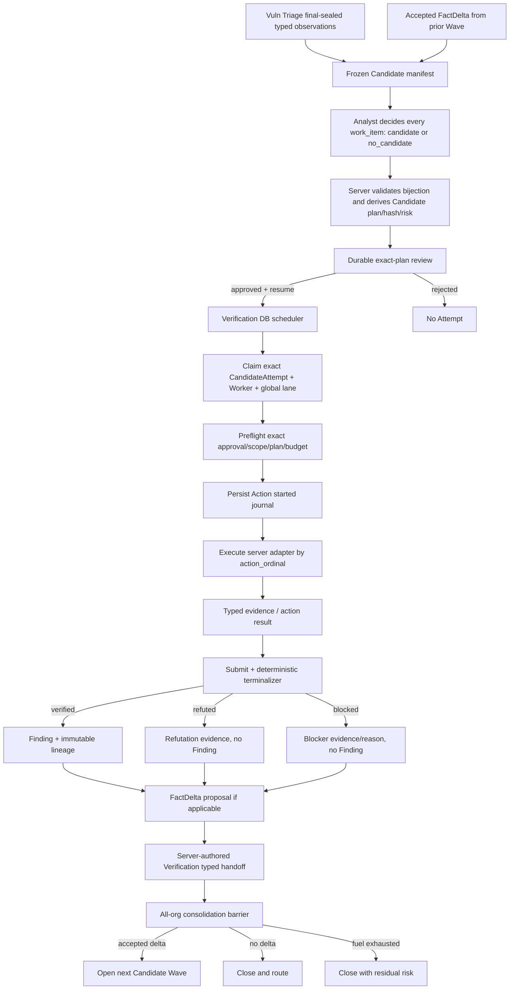

# Candidate 到 Verification：可恢复的逐条验证执行设计

- **日期**：2026-07-14
- **状态**：Working-tree implementation complete；恢复安全主链、typed follow-on 与 pending
  enrichment queue 已通过聚焦验证，live acceptance 依用户指令延后
- **适用范围**：`attack_candidate` → durable review → `verification` → FactDelta consolidation
- **核心问题**：Candidate 如何由前序信息形成，以及批准后如何安全、确定、可恢复地逐条验证
- **关联设计**：
  - `2026-07-02-attack-stage-formulaic-candidate-exploit.md`
  - `2026-07-12-runtime-memory-candidate-pipeline-v2.md`
  - `2026-07-13-verification-typed-stage-handoff.md`
  - `2026-07-14-stage-run-multi-agent-team-scheduler.md`

> **2026-07-14 实现记录**：用户已授权本设计进入实现。当前工作树已增加版本化 recipe/
> executor contract、approval `start_before`、action authorization receipt、TerminalIntent、
> checkpoint barrier、server terminalizer、outcome-unknown operator recovery、同 Attempt submit-only
> continuation，以及 typed FactDelta direct follow-on / refuted no-attack / fail-closed pending
> enrichment queue。信息不足时只形成 immutable pending authority，source Wave 不关闭、FactDelta
> 不消费，也不会伪装成已自动富化。本轮未运行外部验证、真实目标动作、`init.sh`、
> `just precommit` 或 live model acceptance，因此 feature 仍保持 `in_progress`。

> **聚焦验证**：TerminalIntent 四个 crash boundary、exact recovery replay、same-Attempt
> submit-only、approval expiry 均有定点 DB/runtime 测试；FactDelta direct/refuted、pending replay、
> recognized-unsupported rollback 与 cross-owner FK 各 1/1；orchestrator pending BLOCK 1/1；
> Verification queue UI 3/3、CandidateAttemptRows 5/5、ts-rs exact exports 通过。没有启动真实
> Golish run，不能把本地测试命令 session id 冒充产品 Run ID。

## 0. 最终结论

### 0.1 Candidate 阶段不是再扫描一次

`attack_candidate` 的职责是 **整理、关联和形成可验证假设**：

```text
前序 canonical facts / typed observations / evidence
  + 资产、服务、指纹、接口、参数和请求上下文
  + 当前 operation 内已经发生的历史事实
  + 有 provenance 的 scoped RAG / Memory 提示
  ↓
AI 对 frozen work item 做 candidate / no_candidate 判断
  ↓
服务端派生 immutable CandidateExecutionPlan、risk、budget、plan hash
```

它不应：

- 重新全量跑 Nuclei/sqlmap/wpscan；
- 调 raw shell 或任意网络工具；
- 直接创建 Finding；
- 用 RAG/Memory 里的“听说存在漏洞”代替当前 operation evidence；
- 自己决定批准、执行顺序或最终 Gate。

所以用户之前的理解是对的：AI 会综合前面收集的信息形成一批 Candidate；确定性 observation 也可以直接映射出 Candidate。后面进入 Verification，按照批准后的 exact plan 一条条验证。

### 0.2 下一阶段首先不是“多跑几个验证 Agent”

当前 Verification 已经有较完整的 DB 权威主干，但存在崩溃恢复、审批过期和 generic recipe 证据闭环缺口。推荐实施顺序是：

1. 先用 immutable TerminalIntent + post-tool barrier 消除 `submitted → terminalizer` 崩溃窗口；
2. 补 `outcome_unknown/recovery_required` 的 operator 闭环；
3. 明确 approval expiry 在 action 前后不同语义；
4. 暂停 V2 generic legacy recipe，逐个变成 typed adapter；
5. 修好 FactDelta follow-on Candidate；
6. 补 queue/recovery/action/Wave UI；
7. 最后做授权 live acceptance，再讨论并发。

### 0.3 Verification 默认仍是一条 CandidateAttempt 一个 verifier

Verification 与信息收集不同：一次执行可能有真实副作用。其执行单元固定为：

```text
一个 approved Candidate
  → 一个 exact CandidateAttempt
  → 一个独立 candidate_verifier WorkerRun/lease/chain
  → server-owned action ordinal wrapper
  → typed evidence
  → deterministic terminalizer
```

不允许一个 verifier 自己再委托多个 child Agent；也不允许多个 Agent 同时验证同一个 Candidate。大资产排队由 DB scheduler 解决，不靠递归 sub-agent。

## 1. 当前真实流水线



### 1.1 V2 的启用边界

当前代码只有在 operation 冻结的：

- runtime memory contract；
- attack execution contract

都选择 `v2_only` 时，才真正 dispatch Candidate V2 Verification。dual-write 只用于影子/兼容，不应被描述成“已经同时执行 V2 verifier”。入口在 `stage_run_call.rs::candidate_v2_stage_run_enabled`。

### 1.2 Candidate AI 当前能做什么

当前 Analyst 是 reasoning-only：

- 读取 frozen manifest；
- 读取 `query_target_data`、`list_recent_evidence` 等当前 operation 数据；
- 接收允许继承的 stage evidence/context；
- 可以使用带 provenance 的 scoped memory/RAG 作为线索；
- 对每个 exact `work_item_key` 给出 candidate/no-candidate 及引用证据。

但是 Candidate identity、canonical plan、risk、budget 和 plan hash 不由模型自由编写，而由 `attack_execution/decision.rs` 与 classifier/registry 服务端派生。

这个边界必须保留：**AI 提出假设和解释，服务端决定可以执行的精确计划。**

### 1.3 Verification 当前的确定性边界

当前已有以下正确约束：

- scheduler 从 DB 选择 Candidate，不让模型挑下一条；
- verifier 只看到一个 exact Candidate/Attempt；
- 工具只接受 `action_ordinal`，target/capability/args/budget 从 DB 重载；
- action 先写 `started` journal，再产生外部副作用；
- 当前所有 exploit execution 共用 `global:exploit` lane，实际串行；
- Gate 读取 Verification DB truth，忽略模型 summary/findings 自述；
- verified 才能原子创建 Finding + lineage；
- refuted/blocked 不创建 Finding；
- Verification close 写 server-authored typed handoff，不伪造模型 deliverable；
- FactDelta 只能 proposal，Wave consolidation 才能 accept/consume/开下一波。

## 2. 当前已做得扎实的部分

| 能力 | 当前状态 | 应保留的原则 |
|---|---|---|
| frozen manifest | 已有 exact work-item coverage | 每个 work item 恰好一个 candidate/no-candidate |
| Candidate 接受 | 服务端派生 identity/plan/hash/risk | 模型不能直接写可执行 action args |
| review | exact plan approval、CAS、durable resume | 未批准不能 claim |
| scheduler | CandidateAttempt + WorkerRun + chain + lease + lane 复合 claim | 模型不能跳队或扩大 target |
| exact Nuclei replay | template + exact URL + typed parse | 保留为 typed recipe |
| exact anonymous replay | exact GET/HEAD request plan | 保留为 typed recipe |
| action journal | side effect 前先持久化 `started` | response loss 不盲重放 |
| terminal truth | proof/refutation/blocker 三类证据语义 | 工具失败不能冒充 refuted |
| Finding lineage | verified-only、原子写入 | Candidate 本身不是 Finding |
| FactDelta | canonical ref/version/hash + evidence | verifier 不能决定 Wave cursor |
| Verification handoff | server-authored typed final seal | 不伪造 submission/tool/lease |
| zero-input org | 显式 terminal | 不能把未检查伪装为空 |

## 3. 当前关键缺口

以下不是“未来优化”，其中前三项会让已批准 Candidate 永久卡住，必须优先修。

### 3.1 P0：`submitted` 与 terminalizer 之间存在崩溃窗口

当前路径大致是：

```text
verifier 调 submit_candidate_attempt
  → transaction A: Attempt = submitted
  → 返回 scheduler
scheduler 再调用 terminalizer
  → transaction B: Candidate/Attempt terminal + Finding/FactDelta + Worker/lane release
```

若进程在 A commit 后、B 开始前退出：

- Attempt 已是 `submitted`；
- lane/Worker lease 最终过期；
- 当前 reclaim 主要处理 `running` Attempt；
- terminalizer 又要求当前 lease/lane authority；
- restart 后可能既不能 reclaim，也不能 terminalize。

涉及：

- `stage_run_call.rs` Candidate verification loop；
- `candidate_attempts.rs` claim/recovery；
- `finding_lineage.rs` terminalizer。

不能简单把 terminalizer 塞进模型-visible 的 submit 工具事务。当前 bound Worker 的顺序是：

```text
begin_bound_worker_tool（active-tool fence）
  → submit_candidate_attempt
  → finish_bound_worker_tool（清 active tool）
  → checkpoint 完整 assistant ToolCall + ToolResult
  → server terminalizer
```

terminalizer 当前要求 `active_tool_call_id IS NULL` 和 exact checkpoint version；如果 submit
工具内部先释放 Worker/lane，后面的 finish/checkpoint 反而会因 lease lost 失败。

**最终决定**：使用“immutable TerminalIntent + post-tool terminal barrier”协议：

```text
submit_candidate_attempt
  → 在有效 Worker/lease/active-tool 下验证并持久化 immutable TerminalIntent
  → 返回 deterministic ToolResult
finish_bound_worker_tool
  → 清 active tool
checkpoint terminal tool turn
  → 写 exact checkpoint/barrier receipt
server terminalizer
  → 原子消费 TerminalIntent
  → Candidate/Attempt terminal + Finding/lineage/FactDelta + Worker/lane release
```

关键修复是：一旦 TerminalIntent 在原授权 lease 下合法提交，后续 server terminalization
authority 来自 **immutable intent + completed tool lifecycle/checkpoint barrier**，不再要求原
executor lease/lane 在 crash 后仍未过期。若进程在 finish/checkpoint 前退出，recovery 只能
exact replay submit ToolResult、补齐 lifecycle/checkpoint barrier，再由服务端消费 intent；不
重新执行验证 Action。

### 3.2 P0：`outcome_unknown/recovery_required` 有检测，无处置闭环

当前 action `started` 后崩溃会正确地标记：

```text
Action = outcome_unknown
Worker = recovery_required
禁止自动重放
```

但生产路径还缺少：

- recovery case read model；
- operator 可执行的受限 CAS 决策；
- 补录外部已知结果的 evidence 验证路径；
- UI 上的解释和操作；
- scheduler 对 recovery case 的稳定停留/恢复语义。

**最终决定**：增加 `CandidateRecoveryCase`，只允许三种决策：

```text
terminalize_blocked_outcome_unknown
abandon_before_side_effect
accept_external_result_with_exact_evidence
```

其中：

- `abandon_before_side_effect` 只有 action journal 能证明副作用尚未开始时才允许；
- `accept_external_result_with_exact_evidence` 必须引用当前 Attempt 绑定、可验证来源的新 evidence；
- operator 不能修改 org、target、plan、capability、args、budget 或 evidence owner；
- exact request id + expected row versions 支持 response-loss replay；
- 未处理 recovery case 时 Gate 必须 BLOCK，不能自动判 refuted。

### 3.3 P0：approval expiry 可能制造永久未终态 Candidate

当前一个 `expires_at` 同时承担“还能否开始动作”和“还能否记录已经发生的结果”。如果 approval 在 action 执行中或 submit 前过期：

- 后续 action/submit/terminalizer 可能拒绝；
- Candidate 又因为历史上 approved 过，被 Gate 要求存在 terminal Attempt；
- 结果变成没有合法继续路径的永久 blocker。

**最终决定**：把时间语义改为：

```text
approval.start_before
action.authorization_receipt
attempt.execution_deadline
```

规则：

1. `start_before` 只控制能否开始新的外部 Action；
2. action 合法进入 `started` 时，同事务冻结 approval id/version/plan hash/scope hash/started_at 作为 authorization receipt；
3. `start_before` 在 action 已开始后到期，不得丢弃已发生的真实结果；允许写 completion evidence 和 terminal receipt；
4. action 尚未开始就过期：Attempt 安全 abandon，Candidate 回到 durable review；
5. outcome unknown 时过期：保持 recovery review，不自动重跑；
6. multi-action plan 不允许在 expiry 后开始下一 ordinal；
7. `execution_deadline` 只控制预算/等待，不修改已持久化的历史事实。

“action 前过期 → 回 review”必须是完整事务，不是只改 approval：

```text
expire_and_reopen_candidate_review(...)
  → lock current approval + Candidate + Attempt + Worker + lane + Wave review state
  → 仅允许 queued/leased 且没有 started action 的 Attempt
  → Attempt = abandoned(reason=approval_expired_before_action)
  → release Worker lease/lane
  → Candidate = proposed/review_required（plan hash 不变）
  → reopen durable review barrier
  → 下一次 approval 使用递增 decision_version 和新的 start_before
```

- 已有 `started` action 的 Attempt 禁止走 abandon，必须完成 terminal intent 或进入 recovery；
- `completed/submitted` 也禁止回退到 proposed，必须收口真实结果；
- 该 abandon 保留 Attempt ordinal 并计入 attempt 总量，防止无限 expiry/review 循环，但不消耗
  `actions_started`/外部执行预算；
- review 未再次 durable resume 前，整个 Wave 的新 Verification claim 保持暂停。

### 3.4 P0/P1：大多数 generic recipe 仍走 legacy action/evidence 语义

当前 classifier 有多类 capability，但只有至少以下两类已具备较强 typed 闭环：

- exact Nuclei template replay；
- exact anonymous request replay。

SQLi、XSS、CMDi、Auth、TLS 等 generic recipe 仍可能落到 `verification.legacy_action_v1`，以 whole target/broad tool tag 执行，主要保存 stdout/stderr hash。其问题是：

- 更像“重新扫描”，不是验证 exact hypothesis；
- action journal 不能自动派生本 Attempt 的 proof/refutation；
- 模型可能引用同 operation/org/target 的旧 evidence；
- ownership 相同不等于“这次 Attempt 产生”。

直接 quarantine 还存在一个兼容性问题：当前 plan hash 绑定 capability/action/args，却没有
明确冻结实际 adapter/executor contract version。如果部署后让同一个已批准 plan hash 从
legacy executor 变成 unsupported，就等于在 approval 不变时改变了执行语义。

**最终决定**：先把 `recipe_version + executor_contract_version` 纳入 plan/hash/approval，
然后 V2 对没有 typed adapter 的新 plan fail closed：

```text
blocked(reason = unsupported_typed_verification_recipe)
```

不再回退 broad tag scan/raw shell。对 cutover 前已经批准、尚未执行的 generic V1 plan：

- 默认进入 durable re-review，并以新 versioned plan/hash 重新批准；
- 不能在相同 plan hash 下静默切换 executor；
- 如果必须保留旧执行，只能由 persisted cutover contract 显式选择冻结的 legacy executor；
- 已经 started 的 V1 Attempt 按原 action journal/recovery contract 收口，不能中途换 adapter。

随后按优先级逐个实现 typed recipe。

### 3.5 P1：FactDelta follow-on 的 delta kind 与攻击 technique 混用

当前 follow-on WorkItem 可能把 `created/updated/refuted/new_surface` 这样的 `delta_kind` 放到 `technique`。而 classifier 接受的是注册过的 WSTG/GOLISH-NDAY technique，这导致真正生成 follow-on Candidate 时可能 `ATTACK_CAPABILITY_UNSUPPORTED`。

**最终决定**：分离：

```text
delta_kind          = 事实如何变化
observation_kind    = 这条输入是什么
allowed_techniques  = 服务端允许从它派生哪些验证类别
```

- `new_surface/created/updated` 生成 typed delta observation 或 `surface_analysis_v2`；
- 服务端根据 canonical subject 类型派生 `allowed_techniques`；
- `refuted` 默认用于撤销/降权旧假设，不直接生成新攻击；
- 信息不够时只做 delta-local enrichment，再回 Candidate，不重跑整个前序阶段。

### 3.6 P1：stage dependency 声明仍保留旧边界

当前：

- `attack_candidate/spec.json` 的下一阶段包括 Verification；
- 但 `verification/spec.json` 的 `requires_stages` 仍是 `vuln_triage`。

V2 的实际 phase boundary 已经是 Candidate review/resume → Verification，这个 declarative mismatch 会误导工具列表、DAG 检查和未来维护者。

**最终决定**：

- V2 cutover 后 `verification` 必须依赖 `attack_candidate`；
- legacy 兼容不能靠一份静态错误声明维持，应由 persisted execution contract 选择 legacy dependency；
- 在 cutover 前先补 DAG/contract-aware dependency tests，再改 spec。

### 3.7 P1：UI 还看不到真正的执行与恢复状态

Review/Attempt UI 还需要展示：

- Candidate observation、technique、evidence links；
- exact recipe/subject/control/expected signal；
- queue position 和 conflict lane；
- approval `start_before` 与处置建议；
- action journal、ordinal、预算消耗；
- Worker `recovery_required`；
- terminal proof/refutation/blocker lineage；
- FactDelta 和 Wave consolidation outcome。

## 4. 方案比较

| 方案 | 表面效果 | 问题 | 结论 |
|---|---|---|---|
| A. Candidate 后再跑一遍 broad scanner | 容易实现、覆盖看起来多 | 重复 Vuln Triage；无法验证 exact hypothesis；负结果语义弱 | 拒绝 |
| B. 给 verifier raw shell/HTTP，让 Agent 自由发挥 | 灵活 | approval 绑定不了 exact action；证据和恢复不可判定；风险过大 | 拒绝 |
| C. 每个 Candidate 派生 versioned typed recipe | exact、可审批、可恢复、可比较 | 需要逐类建设 adapter | **采用** |

## 5. Candidate V2 目标合同

### 5.1 AI Decision 与 Server Plan 分离

AI 对一个 frozen WorkItem 只提交：

```text
CandidateDecision
  work_item_key
  disposition = candidate | no_candidate
  hypothesis
  rationale
  suggested_technique
  observation_evidence_ids[]
  suggested_subject_refs[]
```

服务端校验 evidence/subject ownership 后，派生：

```text
CandidateExecutionPlanV2
  plan_schema_version
  candidate_id
  operation_id / scope_hash / organization_id
  target_id
  observation_refs[]
  verification_recipe_id / recipe_version / executor_contract_version
  subject_refs[]
  preconditions[]
  control_plan
  expected_signal
  actions[]
  risk_class
  conflict_key
  budget
  plan_hash
```

模型不能直接提交：

- raw command；
- arbitrary URL/host；
- 未经解析的 payload；
- credential secret；
- tool binary/path；
- org/operation/scope authority；
- approval 或 lease。

### 5.2 `subject_refs` 必须是 canonical 引用

一个可执行 Candidate 至少要能指出“验证谁的什么”：

```text
target_ref
service_or_origin_ref
endpoint_or_request_template_ref
parameter_or_form_ref (适用时)
identity_slot_ref (适用时，不含 secret)
source_observation_ref
```

如果只有“这个网站可能有 SQLi”而没有 exact endpoint/parameter/request template，则它可以作为 analysis Candidate，但不能进入 executable approved 状态。正确终态是：

```text
blocked: insufficient_exact_subject
```

或生成一个明确的 delta-local enrichment WorkItem，而不是把 whole target 交给 sqlmap。

### 5.3 control 与 expected signal 是 refutation 的基础

每个 typed recipe 必须定义：

- baseline/control 请求；
- mutation/verification 请求；
- 可比较字段；
- success signal；
- refutation signal；
- inconclusive/blocker signal；
- redaction 与最大 evidence 大小。

没有 control 的“没输出”不能判 refuted。

## 6. Typed Verification Recipe

### 6.1 Recipe 接口

```text
resolve(plan refs, approval, scope)
  → canonical bounded action args + action hash

preflight(canonical args)
  → authorization / target / budget / conflict assertions

execute(action ordinal)
  → bounded typed result

derive_evidence(result, journal)
  → proof | refutation | blocker evidence linked to this Attempt/Action

evaluate(all action receipts)
  → verified | refuted | blocked | recovery_required
```

三方必须一致：

```text
immutable plan action
= action journal canonical args/hash
= persisted typed result/evidence lineage
```

任何 drift 都 fail closed。

### 6.2 Recipe 分层

| 层级 | 例子 | V2 策略 |
|---|---|---|
| 已可用 exact replay | Nuclei exact template+URL、anonymous GET/HEAD exact request | 保留并补完整 crash/expiry tests |
| 优先新增 typed HTTP differential | 未授权/越权、认证差异、业务逻辑 control-vs-mutation | exact request template + identity slots + comparator |
| exact parameter adapter | SQLi/XSS/CMDi 等 | 只对 frozen request/parameter，禁止 whole-target broad scan |
| protocol/config adapter | TLS/header/config observation | typed probe + deterministic comparator |
| OAST/callback | SSRF/Blind injection 等 | 后续；涉及外部服务时必须另行取得用户授权 |
| 无 typed adapter | generic legacy shell/tag | V2 fail closed，不执行 |

### 6.3 Differential HTTP Recipe 示例

```text
subject:
  frozen request_template_ref
  identity_slot A / identity_slot B / anonymous
control:
  original authorized request
mutation:
  remove auth or substitute allowed object/identity slot
compare:
  status class, stable body features, object ownership markers, redirect/session effects
result:
  verified only when mutation violates declared authorization expectation
  refuted only when control succeeds and negative control is enforced
  blocked when identity/precondition/response comparability is missing
```

比较器输出 bounded feature，不把 secret、完整响应或敏感 body 放入模型上下文。

## 7. Verification 执行协议

### 7.1 Review barrier

approval 必须绑定：

```text
candidate_id
plan_hash / plan_schema_version
scope_hash
target + subject refs
recipe id/version + executor contract version
action hashes
risk class
budget
conflict key
start_before
decider / decision version / request id
```

上述任一项变化，旧 approval 不能继续使用。批量 UI 可以一次确认，但 DB 必须逐 Candidate 写 exact decision。

### 7.2 Claim

scheduler 复合领取：

- Candidate；
- current approved decision；
- CandidateAttempt；
- candidate_verifier WorkerRun；
- Worker lease；
- exact message chain；
- conflict/risk lane。

caller 不能提供“下一条 Candidate id”绕过 scheduler。

### 7.3 Preflight

每个 action ordinal 执行前服务端重新核对：

- operation/org/scope/generation；
- Candidate/Attempt/Worker/lease；
- plan hash 和 action hash；
- approval `start_before`；
- subject refs 当前仍属于 frozen scope；
- budget/fuel；
- conflict lane；
- adapter version 和 capability policy。

### 7.4 Action journal

外部动作前先提交：

```text
Action = started
authorization_receipt = exact approval/version/plan/action/scope/start time
```

只有 commit 成功后 adapter 才能发网络/工具请求。

动作结束后写：

```text
completed | blocked | outcome_unknown
typed_result_hash
evidence_ids[]
budget_consumed
```

同一 action ordinal 不允许二次产生副作用。重放只能读取 terminal journal/result。

### 7.5 TerminalIntent、tool barrier 与原子 terminalizer

模型-visible `submit_candidate_attempt` 只负责在当前 active-tool fence 下写 immutable
`CandidateAttemptTerminalIntent`：

```text
attempt_id / candidate_id / worker_run_id
submission_tool_call_id
checkpoint_before_version
plan_hash / recipe_version / executor_contract_version
requested_disposition
action_receipt_hashes[]
evidence_ids[] / result_hash
request_id / intent_hash
status = pending | consumed
```

submit 工具返回后必须先：

1. `finish_bound_worker_tool` 清 active tool；
2. checkpoint 完整 assistant ToolCall + deterministic ToolResult；
3. 写 terminal barrier receipt，绑定 intent hash 与 checkpoint-after version。

Intent 一旦存在，Attempt/Worker 对 scheduler 呈现 `terminalization_pending`：禁止再执行 Action、
禁止创建新 Attempt，也不能被普通 expired-lane recovery 当成 `running` 重排。原 risk lane 可由
server terminalizer/recovery 以专用 authority 收口，但不能释放后让旧 Attempt重新产生副作用。

只有随后运行的 server terminalizer 才固定锁序并重载 exact DB truth：

```text
Attempt
→ Candidate/current approval + action authorization receipts
→ Worker/lease/lane
→ action journals/results
→ evidence ownership/roles
→ optional Finding/lineage
→ optional FactDelta proposal
```

然后原子消费 TerminalIntent 并完成：

1. 验证 intent、tool lifecycle、checkpoint barrier、action receipts/evidence 完全一致；
2. 写 immutable terminal receipt，并把 intent 标为 consumed；
3. Attempt → verified/refuted/blocked；
4. Candidate 同步 terminal disposition；
5. verified 时创建 Finding + exact lineage；
6. 写 evidence-backed FactDelta proposal；
7. Worker terminal；
8. 释放 lease/lane；
9. 写 trace/outbox。

terminalizer 可以由原 scheduler、restart recovery job 或 exact replay 触发，但它的 authority
来自合法 intent/barrier，不依赖已过期的原 executor lease。仍有 active tool、缺 checkpoint
barrier、intent/hash 漂移时一律不 terminalize。响应丢失只允许 exact terminal receipt replay。

## 8. 结果语义

| 结果 | 必需条件 | Finding | 可否自动重试 |
|---|---|---|---|
| `verified` | typed proof + exact action lineage + expected signal | 创建 | 否 |
| `refuted` | valid control + typed refutation signal | 不创建 | 否 |
| `blocked` | blocker evidence 或 stable reason；不能得出真假 | 不创建 | 通常需 review/operator |
| `retryable_failed` | 明确证明未产生副作用的 provider/runtime failure | 不创建 | 同 policy 新 Attempt ordinal |
| `recovery_required` | action started，结果未知或 identity 不可安全 reconcile | 不创建 | 禁止自动重放 |

以下规则是硬约束：

- timeout、tool error、provider error、空 stdout 不是 refuted；
- “没发现”只有 recipe 的 control/negative signal 明确定义且 evidence 记录时才是 refuted；
- fuel 用尽是 blocked/exhausted + residual risk，不是假 PASS；
- proof 必须属于当前 Attempt/Action，不能只因 operation/org/target 相同就借用旧 evidence。

## 9. 失败与恢复矩阵

| 故障点 | 目标语义 |
|---|---|
| claim response 丢失 | exact lease-owner replay；不耗新 fuel |
| provider 在 action `started` 前失败 | safe release/requeue 同 Worker/Attempt；或 policy 创建新 ordinal |
| action `completed` 后、submit 前崩溃 | 恢复同 Attempt，读取 terminal journal/result；不重执行 action |
| TerminalIntent commit 后、tool finish/checkpoint 前崩溃 | exact replay submit ToolResult，补 lifecycle/checkpoint barrier；不重执行 Action |
| checkpoint barrier 后、terminalizer 前崩溃 | recovery job 从 immutable intent deterministic terminalize；不依赖旧 executor lease |
| action `started` 后结果未知 | `outcome_unknown + recovery_required`，等待 operator CAS |
| adapter 产生 evidence、模型未提交 | 同 chain 进入 submit-only recovery；不再发网络请求 |
| terminalizer 响应丢失 | exact receipt replay，不重复 Finding/FactDelta |
| approval 在 action 前过期 | 原子 abandon Attempt + release Worker/lane + Candidate 回 review + reopen durable review barrier |
| approval 在 action 后过期 | 允许保存结果并 terminalize；禁止开始下一 action |
| operator recovery 响应丢失 | request id + row-version exact replay |
| DB truth/hash/ownership mismatch | Gate BLOCK；无 prose fallback |
| consolidation 失败 | Wave 保持待 consolidation，可 deterministic retry |
| process restart | 从 CandidateAttempt/Worker/action journal/lane 恢复，不依赖模型记忆 |

## 10. 调度、顺序与并发

### 10.1 当前默认保持全局并发 1

在 typed evidence 和 recovery live acceptance 完成前，保持：

```text
global:exploit = 1
```

这会慢，但不会因为公司资产多而丢任务：Candidate 都在 durable queue，慢只代表排队，不代表 Main Agent 必须一次做完。

### 10.2 后续分层

只有验收通过后，才可引入：

| 风险层 | 并发建议 | conflict key |
|---|---|---|
| deterministic read-only | operation 2–4 | exact target/origin/provider quota |
| active-safe | 小并发 | origin + session/account + mutation class |
| exploit/state-changing | 继续全局 1 | global + target state |

共享 cookie、账号、session、目标可变状态或 cleanup obligation 的 Attempt 必须串行。

### 10.3 公平性

在多 org 时，优先级建议：

1. exact response-loss/recovery；
2. 用户 pin；
3. round-robin organization；
4. server-derived risk/impact；
5. 前置 FactDelta/chain 依赖满足；
6. created_at + id 稳定排序。

模型不能选择 lane 或改变 priority。

## 11. FactDelta 与下一 Wave

### 11.1 verifier 只 proposal

FactDelta 必须引用：

- source Candidate/Attempt/Finding；
- canonical fact ref；
- exact version/hash；
- 当前 Attempt evidence subset；
- delta kind；
- dedupe hash。

verifier 不能把 proposal 标为 accepted/consumed，也不能递增 Wave cursor。

### 11.2 consolidation 唯一决定下一步

全 org Verification Unit terminal 后，服务端 consolidation：

```text
validate canonical ref/version/hash/evidence
  → reject invalid/duplicate delta
  → accept material delta
  → check max_waves/candidates/depth/attempts
  → atomically consume accepted delta and open next Wave
```

结果只有：

- `opened_next_wave`；
- `closed_no_delta`；
- `pending_enrichment`；
- `exhausted`，并持久化 residual risk。

其中 `opened_next_wave` 只接受已经能映射成 classifier-supported typed observation 的
FactDelta：consolidation 在同一事务内冻结 Candidate manifest、消费该 delta 并打开目标 Wave。
`refuted` 仍是合法 accepted FactDelta，但只写 `no_attack` consolidation member，不创建攻击
WorkItem。若 evidence 看似属于已注册 Verification route、但 schema/identity/technique 不满足
typed adapter，整个 consolidation 事务回滚。

### 11.3 delta-local enrichment

若新 FactDelta 只说明“发现一个新 endpoint/内部对象”，还不足以生成 exact verification recipe：

- 只为该 canonical subject 写 immutable、bounded pending enrichment authority；
- 返回稳定 `pending_enrichment`，Verification orchestrator 显式 BLOCK；
- source Wave 保持原状态，FactDelta 保持 accepted-but-unconsumed，不创建 target Wave/Candidate
  WorkItem，也不提前关闭任何 source Unit；
- Verification queue 只展示安全的 subject、reason、allowed techniques 与 pending 数量，不返回
  raw evidence/output、request body、lease 或 secret；
- 将来必须由独立的 typed enrichment executor + additive result authority 形成 typed observation，
  才能重新进入同一个原子 consolidation；当前版本不宣称会自动执行 enrichment；
- 不重跑整个 EAS/Enumeration/Vuln Triage。

## 12. Gate、handoff 与路由

### 12.1 Verification Gate

Gate 只读 DB truth：

- frozen WorkItem decisions complete；
- 每个 ever-approved Candidate 有合法 terminal Attempt，或有被设计允许的 re-review/abandon terminal story；
- verified 有 proof + Finding + lineage；
- refuted 有 refutation；
- blocked 有 blocker evidence/reason；
- 无 live/recovery-unresolved Attempt；
- zero-input org 有显式 terminal truth；
- DB/read/hash mismatch 一律 BLOCK。

模型 deliverable、summary、memory/KG 和自报 Finding 都不构成 Gate authority。

### 12.2 Typed handoff

沿用 `2026-07-13-verification-typed-stage-handoff.md`：

- Verification close 由服务端 final seal；
- handoff 只含 terminal refs/hash/watermark，不复制 payload、proof body 或 secret；
- close 与 Unit/primary Worker/WaveUnit terminal 原子一致；
- response loss 只 exact replay。

### 12.3 下游路由

```text
存在 verified Finding 且需要后续 access/objective validation
  → access_validation

全部 refuted/blocked 或 no Candidate
  → reporting

fuel exhausted
  → reporting + residual risk

accepted FactDelta 且 fuel 可用
  → next attack_candidate Wave

accepted FactDelta 仍缺 typed observation
  → pending_enrichment + Verification BLOCK（source Wave 不推进）
```

## 13. API / Read Model 建议

内部 domain API：

```text
persist_candidate_terminal_intent(bound_context, result)
record_candidate_terminal_barrier(bound_context, intent_hash, checkpoint_version)
terminalize_candidate_attempt_from_intent(server_authority, intent_id)
release_candidate_execution(bound_context, safe_failure_reason)
resolve_candidate_recovery(authority, expected_versions, decision)
expire_and_reopen_candidate_review(authority, expected_versions)
reapprove_candidate(authority, candidate_id, exact_plan_hash, start_before)
```

Tauri API 建议按项目命名规则：

```text
attack_list_verification_queue
attack_get_candidate_recovery
attack_resolve_candidate_recovery
attack_reapprove_candidate
```

所有写 API：

- actor/operation/org/scope 从 trusted app context 加载；
- caller 不传 target/plan/action args/budget/lease；
- expected row versions + request id；
- IDOR 逐资源验证；
- error 返回统一 `code`；
- transaction 内不执行外部动作。

`VerificationQueueItem` read model 至少聚合：

```text
Candidate + observation/evidence
current approval/start_before
Attempt + Worker + lane
action journal summaries
budget consumed/remaining
terminal lineage
recovery case
Wave/consolidation status
```

## 14. 分期实施

### Phase 0：先写 RED characterization tests

- TerminalIntent commit、tool finish、chain checkpoint、terminalizer 四个边界分别 crash；
- approval 在 claim/begin/finish/submit/terminalize 各边界过期；
- outcome unknown 无 operator path；
- generic recipe 引用 pre-Attempt evidence；
- FactDelta follow-on 生成真实 Candidate 失败；
- static dependency 与 V2 phase boundary mismatch。

### Phase 1：可恢复 terminal protocol

- immutable TerminalIntent + tool lifecycle/checkpoint barrier + recoverable server terminalizer；
- production-safe release/requeue seam；
- action authorization receipt；
- `start_before` expiry 的 abandon/release/reopen-review 完整事务；
- `CandidateRecoveryCase` + operator CAS；
- exact response-loss replay。
- 增加 follow-on Wave fail-closed guard：如果 delta 不能映射到受支持的 observation/technique，
  consolidation 保持 blocked 且不消费 delta、不打开不可执行的新 Wave。

这一步完成前不增加 Verification 并发。

### Phase 2：quarantine generic recipe

- 先把 `recipe_version/executor_contract_version` 纳入 plan hash 与 approval；
- 对未执行的已批准 generic V1 plan 做 explicit cutover + durable re-review；
- V2 不再调用 `verification.legacy_action_v1`；
- unsupported recipe 稳定 blocked/review reason；
- exact Nuclei/anonymous recipe 补齐 typed evidence 和恢复测试；
- Gate 验证 proof/refutation 必须来自当前 action journal。

### Phase 3：CandidatePlanV2 + typed adapter catalog

- 增加 canonical subject/control/expected signal/conflict key；
- 优先实现 differential HTTP；
- 再实现 exact parameter injection 和 protocol/config adapter；
- 每加一个 recipe 都需独立 approval、evidence、recovery、budget tests。

任何 migration 在实施前单独请求用户确认。

### Phase 4：FactDelta follow-on 闭环

- delta kind/observation kind/allowed techniques 分离；
- delta-local enrichment；
- accepted delta → manifest → Candidate → review → Attempt → terminal 端到端测试；
- fuel exhaustion residual risk。

### Phase 5：UI 与授权 live acceptance

- queue/review/action/recovery/Wave UI；
- loading/error/empty 三态；
- 使用明确授权的测试 workspace；
- 同时核验 `run.log`、`transcript.json`、`run_tree.py --full --db` 和 durable DB rows；
- 不能只凭“工具调用成功”宣称 Gate 已通过。

### Phase 6：受控提高并发

- 仅从 deterministic read-only recipe 开始；
- target/origin/session conflict locks；
- K=1 与 K>1 的 terminal truth/Finding/FactDelta 集合 parity；
- exploit 继续全局 1，直到另一次安全设计批准。

## 15. 代码影响面

| 模块 | 变化方向 |
|---|---|
| `golish-agent-kit/harness/attack_execution/types.rs` | CandidatePlanV2、subject/control/expected signal/authorization receipt types |
| `attack_execution/classifier.rs` | technique/observation → versioned typed recipe；移除 V2 generic fallback |
| `attack_execution/decision.rs` | AI decision 与 server plan 严格分离、bijection/hash validation |
| `golish-db/candidate_attempts.rs` | claim/recovery/expiry/release semantics |
| `golish-db/finding_lineage.rs` | 从 immutable intent/barrier 原子 terminalize，exact replay |
| `golish-db/attack_candidate_approvals.rs` | `start_before`、reapproval、authorization receipt |
| `golish-db/attack_wave_consolidations.rs` | delta kind/technique 分离、follow-on typed manifest |
| `golish-pentest-app/verification_capabilities.rs` | typed adapter registry；禁止 V2 legacy action |
| `golish-agent-runtime/stage_run_call.rs` | scheduler dispatch outcome/recovery handling，不直接拆成多 verifier 并发 |
| `resources/harness/stages/verification/spec.json` | V2 dependency 改为 attack_candidate；legacy 由 contract 兼容 |
| `golish-agent-app` + frontend | queue/recovery/action/Wave read model 与命令/UI |
| `scripts/run_tree.py` | Attempt/action/lease/recovery/terminalizer/consolidation 时间线 |

## 16. 必须通过的测试

1. 分别 crash 在 TerminalIntent commit、tool finish、chain checkpoint、terminalizer 前后；restart 后恰好 terminal 一次。
2. intent/tool-result/barrier/terminalizer response loss 不重复 Finding、lineage、FactDelta 或 outbox。
3. 缺 active-tool finish 或 checkpoint barrier 时 terminalizer 必须拒绝；补齐 exact barrier 后可恢复。
4. approval 在 action 前过期：不发请求，原子 abandon/release/reopen review，保留 Attempt 历史。
5. approval 在 action 后过期：允许记录结果，禁止下一 action。
6. started/completed/submitted Attempt 不能错误回退到 proposed。
7. outcome unknown 不能自动重放；三种 operator 决策 exact CAS/replay。
8. provider 失败且无 side effect 时，production scheduler 确实 release/retry。
9. adapter cutover 前后，相同 plan hash 不能改变 executor 语义；V1 re-review 有 durable 证据。
10. generic recipe 不能在 V2 执行，也不能借旧 evidence 判 terminal。
11. 每个 typed recipe 的 action journal/result/evidence/submission 三方一致。
12. verified/refuted/blocked 三类缺失各自必需 evidence 时 Gate BLOCK。
13. tool error/timeout/empty output 不会变成 refuted。
14. unsupported follow-on mapping 不消费 delta、不打开不可执行 Wave。
15. FactDelta accepted → follow-on manifest → Candidate → approval → Attempt → terminal。
16. `refuted` delta 不会无条件生成新攻击。
17. zero-input org 与有 Candidate sibling 一起 close 正确。
18. multi-org restart/resume 和 global lane 公平性。
19. `verification` V2 不能绕过 Candidate review/resume 直接从 vuln_triage 进入。
20. UI 正确显示 observation/evidence/action/recovery/expiry/Wave 三态。
21. 授权 live run 的 transcript、run tree 与 DB terminal truth 一致。

## 17. 验收标准

只有满足以下条件，Candidate → Verification 才算真正闭环：

- Candidate 明确综合前序 canonical facts/evidence，而不是重复扫描；
- AI decision 和 server-authored executable plan 分离；
- approval 绑定 exact immutable plan 与 `start_before`；
- 一次 CandidateAttempt 只有一个 verifier/Worker/lease/chain；
- 每个外部 Action 先有 durable journal 和 authorization receipt；
- submit 与 terminalize 不存在不可恢复窗口；
- outcome unknown 有 operator recovery 闭环且不盲重放；
- 每个可执行 recipe 都产生当前 Attempt 的 typed evidence；
- verified/refuted/blocked 语义由 DB validator 决定；
- Finding 只来自 verified terminalizer；
- FactDelta 只由 consolidation 接受并打开下一 Wave；
- fuel 用尽如实报告 residual risk；
- Gate、handoff 和下游路由全部可从 durable truth 重放。

## 18. 明确不做

- 不把 Candidate 当 Finding。
- 不让 Candidate Analyst 扫描或执行 exploit。
- 不让 verifier 自由选择 target、command、payload、tool 或下一条 Candidate。
- 不用 broad scanner 代替 exact hypothesis verification。
- 不把旧 evidence 仅凭 scope 相同就标为当前 Attempt proof。
- 不把 tool error、timeout 或空输出解释为 refuted。
- 不让模型接受 FactDelta 或推进 Wave cursor。
- 不在 recovery 未闭环前增加 Verification 并发。
- 不因为 RAG/Memory 提示而绕过当前 evidence、scope 或 approval。
- 不在本设计稿中修改 schema、发起真实目标请求或声明 live acceptance 已完成。
