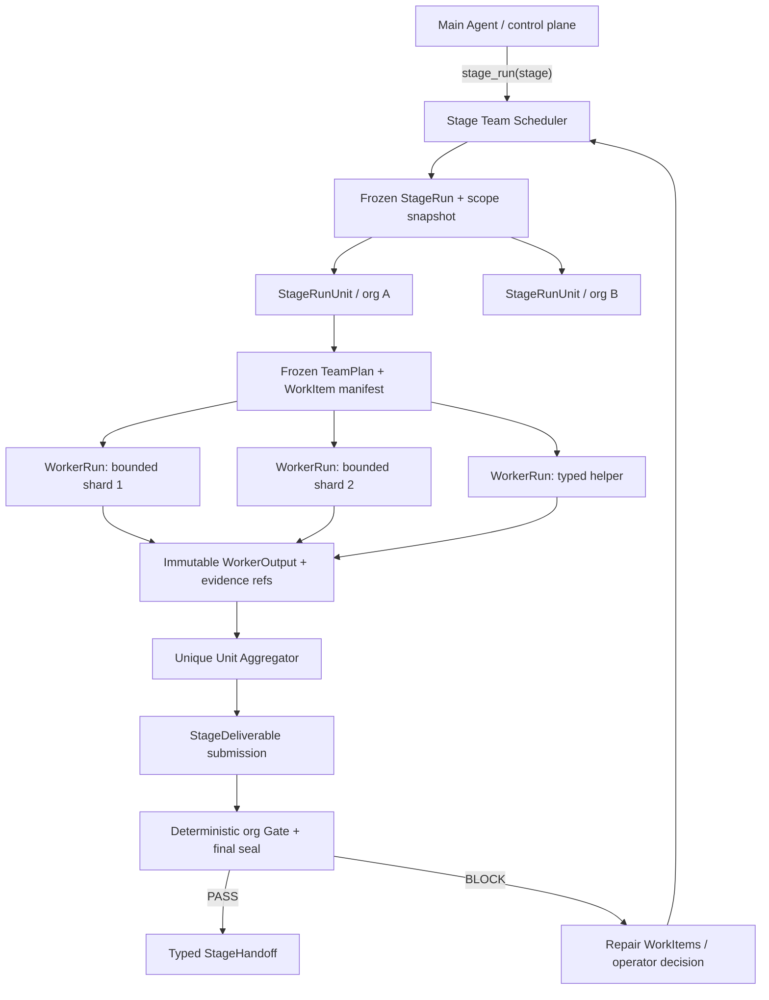

# Stage Run 多 Agent 协同与持久化 Team Scheduler 设计

> Superseded by `docs/design/2026-07-15-stage-run-company-controller-agent.md` for the
> `target_intel` V2 orchestration shape. The durable WorkItem/WorkerRun/lease/Gate foundation
> remains valid, but the fixed sibling producers plus a later Aggregator are no longer the target UX or
> dispatch contract.

- **日期**：2026-07-14
- **状态**：Working-tree implementation complete for durable foundation + `target_intel` V2 pilot；
  Phase 3–5 active-stage rollout 仍按设计 gate，等待 deferred live acceptance
- **适用范围**：harness 中由 `stage_run` 执行的组织级阶段；不改变普通 Chat/Task 的自由 sub-agent 能力
- **核心问题**：大公司资产很多时，既要让任务排队、恢复和限流，又不能丢掉多个专业 Agent 协同分析的能力
- **关系**：本文件以当前 checkout 为准，补充并修正
  `2026-06-13-stage-run-fanout-design.md` 中“stage 管理者嵌套 sub-agent”的早期设想；历史文件保留为决策演进记录

> **2026-07-14 实现记录**：用户已明确授权两份设计一次性进入实现。当前工作树已增加
> additive TeamPlan/WorkItem/WorkerOutput/WorkerRequest/barrier/recovery/repair schema、RuntimeMemory
> 事务、`stage_run` sibling scheduler、唯一 Aggregator/finalizer、operator exact-CAS recovery、DB
> read model 与队列 UI；Gate BLOCK 会终结旧 Aggregator、打开 bounded repair generation，并在
> 同一次 `stage_run` 运行 repair producer 后 claim 全新 Aggregator，不复用旧 Agent。首个
> 启用面仅为被动 `target_intel` V2 pilot。`external_attack_surface`、`enumeration`、
> `vuln_triage`、`attack_candidate` 仍保持 rollout gate，`verification` 按 Candidate 设计明确不走
> 通用 Team Scheduler。由于本轮按用户要求未跑 `init.sh`、`just precommit` 或 live acceptance，
> 本状态不等于 production promotion / feature passing。

> **聚焦验证**：runtime Gate repair 2/2（nextest run
> `bb422e47-e984-4c31-a4da-95eb1fe91742`）；DB exact repair epoch/current-Aggregator 1/1（nextest
> run `40955d8b-61cd-4c1f-b120-552815b5bdc8`）；operator recovery DB 1/1（nextest run
> `d468653c-88b8-4fd1-a90c-37b998eb8877`）；StageTeam UI 3/3。另有 Target Intel plan/lifetime
> budget 单测 1/1。这里记录的是定点证据，不替代 deferred 全量门禁。

## 0. 最终结论

### 0.1 外层保留一个主 Agent 就够了

在 **harness 自动执行路径**里，最外层不需要再常驻一组 Recon、Prober、Enumerator、Pentester 等 Agent。推荐结构是：

```text
一个 Main Agent
  └─ stage_run：持久化阶段调度器
       ├─ Unit(org A)
       │    ├─ Worker(recon/source-group-1)
       │    ├─ Worker(recon/source-group-2)
       │    └─ Worker(aggregator/finalizer)
       ├─ Unit(org B)
       │    └─ ...
       └─ Unit(org C)
            └─ ...
```

这里“一个主 Agent”不等于“系统只有一个 Agent”：

- Main Agent 是对话、授权、阶段推进和异常解释的 **control plane**；
- `stage_run` 是排队、认领、租约、恢复、重试、限流和 Gate 聚合的 **durable scheduler**；
- 具体工作仍由多个专业 Agent 完成，但它们是 `stage_run` 管理的 **sibling Worker**，不是 Main Agent 临时递归出来、只活在内存里的 child call。

普通非 harness 对话仍可保留现在的 `sub_agent_*`：例如用户让 Main Agent 临时做代码研究、文档分析或普通协作，不需要强制经过 `stage_run`。

### 0.2 不直接放开嵌套 sub-agent

不采用下面的做法：

```text
stage_run 绑定一个 Worker lease
  → 这个 Worker 自己调用 sub_agent_x
  → 多个 child 共用父 Worker 的 chain / lease / checkpoint
```

原因不是模型能力不够，而是当前执行权威不允许这样做：一个 `WorkerRun` 当前代表一个 exact chain、一个 lease owner、一个 active-tool fence 和一套 checkpoint。多个 child 共用它会破坏：

- 谁拥有工具副作用；
- 谁可以续租和恢复；
- 哪个 checkpoint 是最新真值；
- 哪个 Agent 的 evidence 可以用于最终 Gate；
- 某个 child 崩溃时是否应关闭整个 Unit。

正确做法是：每个协作 Agent 都有自己的 `StageWorkerRun + message_chain_id + lease`，由 scheduler 建立兄弟关系。

### 0.3 Unit 是 Gate 边界，WorkItem 才是排队边界

最终颗粒度固定为：

| 对象 | 负责什么 | 不负责什么 |
|---|---|---|
| `StageRun` | 一个 stage execution 的全局容器 | 不承载单个 Agent checkpoint |
| `StageRunUnit` | 一个 frozen organization 的授权、覆盖与最终 Gate 边界 | 不是“一位 Agent” |
| `StageWorkItem` | 一份可独立认领、重试、恢复的有界任务 | 不直接宣布组织 Gate PASS |
| `StageWorkerRun` | 一位专业 Agent 对一个 WorkItem 的 exact 执行尝试 | 不代表整个 Unit 完成 |
| `StageWorkerOutput` | immutable 结构化产物和 evidence refs | 不是最终 StageDeliverable |
| `Unit Aggregator` | 汇总所有 required WorkItem，唯一提交最终 deliverable | 不重新执行兄弟 Worker 的扫描 |
| deterministic Gate/final seal | 从 DB/evidence 真值判定 Unit terminal | 不相信 Agent 自述完成 |

## 1. 当前代码事实

本设计不是从抽象的“多 Agent 框架”出发，而是建立在当前实现的约束上。

| 当前事实 | 当前代码位置 | 对设计的含义 |
|---|---|---|
| `stage_run` 当前明确是 **per-org serial specialist fan-out**；`concurrency` 目前只是预留参数 | `golish-agent-runtime/src/agentic_loop/tool_execution/direct/stage_run_call.rs::execute_stage_run` | 现在不是多 org 并发，也不是一个 org 多 Agent team |
| active specialist stage 会从 depth-0 Main Agent 隐藏直接工作和 `sub_agent_*`，只保留 `stage_run` | `golish-agent-runtime/src/agentic_loop/tool_list.rs` | harness 内控制面已经朝“Main 只调 stage_run”收敛 |
| 普通同一 assistant turn 中多个 `sub_agent_*` 可并发执行 | `golish-agent-runtime/src/agentic_loop/tool_dispatch.rs` | 通用 sub-agent 并发能力存在，但不是 durable stage queue |
| `MAX_AGENT_DEPTH = 2`，只允许 Main → sub-agent | `golish-sub-agents/src/definition/mod.rs` | 当前没有 manager → specialist → helper 的递归层级 |
| bound Worker 遇到 nested delegation 会返回 `BOUND_WORKER_NESTED_DELEGATION_BLOCKED` | `golish-sub-agents/src/executor/response_parsing.rs` | 这是正确的 ownership fence，不能简单删除 |
| `StageSpec` 当前只有一个 `specialist` | `golish-agent-kit/src/harness/stage_spec.rs` | 当前配置只能描述“一 org 一主专业 Agent” |
| runtime seed 对每个 frozen org 创建一个 Unit 和一个 logical primary Worker | `golish-db/src/repo/runtime_memory_tx.rs::seed_stage_runtime` | 多 Worker team 尚未进入 seed contract |
| `stage_worker_runs` 已用 `(unit, work_item_kind, work_item_key, generation)` 唯一 | `golish-db/src/repo/stage_worker_runs.rs`、runtime foundation migration | 表结构允许一个 Unit 有多个逻辑 Worker，但上层生命周期仍未支持 |
| `finish_worker_attempt` 同时推进 Worker 与 Unit | `golish-db/src/repo/runtime_memory_tx.rs::finish_worker_attempt` | 直接创建多个 Worker 会导致任一 Worker误关 Unit |
| Verification final close 仍查找 organization primary Worker 并与 Unit 一起 PASS | `golish-db/src/repo/verification_truth.rs::close_verification_unit` | finalizer ownership 必须从普通 child Worker 中拆出来 |
| `stage_asset_wave` 冻结的是 coverage denominator；当前只有 EAS spec 开启该 barrier | `stage_run_call.rs`、stage-asset-wave repo、`external_attack_surface/spec.json` | 它不是 claim/lease 队列 |
| `stage_worklist_*` 是临时 DB coverage 投影 | stage worklist repository/bridge | 它没有 durable claim、lease、依赖和恢复游标，不能直接给多个 Agent 消费 |

因此，当前系统处在一个很清楚的中间态：

```text
DB 已经有 Worker 身份、租约、chain、checkpoint 的底座
但执行语义仍是“一 org = 一 Unit = 一 Worker”
```

## 2. 要解决的问题

大公司场景同时存在两种扩展压力：

1. **横向分片**：域名、IP、origin、endpoint、参数、技术矩阵太多，一个 Agent 在一个上下文里做不完；
2. **纵向协作**：同一问题可能需要 Recon、Browser、Enricher、Analyst 等不同角色共同判断。

如果全部依赖 Main Agent 的即时 `sub_agent_*`：

- 队列只存在于模型上下文；
- 进程重启后不知道哪些做完了；
- 一个大公司可能一次创建过多 Agent；
- provider 限流和公平性难以控制；
- Gate 无法确定某个子 Agent 是否属于 frozen scope；
- Main Agent context 会被所有细节淹没。

如果全部只跑现在的一 org 一个 `stage_run` specialist：

- 有 durable ownership，但并没有真正分摊大资产集合；
- 现有 sub-agent 的角色协作能力用不上；
- 一个 Worker 仍可能因上下文、时间或工具预算耗尽而失败。

所以需要的不是“二选一”，而是把 sub-agent 变成 `stage_run` 内部受调度、可持久化的 Worker。

## 3. 方案比较

| 方案 | 优点 | 根本问题 | 结论 |
|---|---|---|---|
| A. Main Agent 直接创建全部 sub-agent | 改动少、模型灵活 | 无 durable queue；Main 被执行细节淹没；重启和限流弱 | 仅保留给非 harness 普通任务 |
| B. 放开 bound Worker 的 nested `sub_agent_*` | 看起来最像“团队协作” | child 共用父 lease/chain；无法单独恢复、审计和 Gate | 拒绝 |
| C. `stage_run` 创建 durable sibling Workers | 队列、租约、恢复、证据和协作统一 | 需要补 work-item/team/finalizer 合同 | **采用** |

## 4. 目标架构



### 4.1 Main Agent 的职责

Main Agent 只保留：

- 解释用户目标、授权和 frozen scope；
- 启动/继续/暂停 `stage_run`；
- 处理需要用户判断的 blocker；
- 读取聚合状态并解释结果；
- 根据 deterministic stage outcome 推进 DAG。

Main Agent 不做：

- 为每个资产手工分派 Agent；
- 维护 Worker 列表和重试计数；
- 挑选哪个 Worker 先运行；
- 根据自然语言声称 Gate 已通过；
- 把所有 Worker 原始输出装回主上下文。

### 4.2 `stage_run` 的职责

`stage_run` 是唯一的 stage execution control plane，负责：

- 读取 frozen operation/stage/org scope；
- 冻结 team plan 和 WorkItem manifest；
- 用 DB claim/lease 分配 Worker；
- 限制 org、stage、operation、provider 和 risk 并发；
- 续租、超时、恢复、取消和 exact replay；
- 收集 terminal WorkerOutput；
- 满足 barrier 后启动唯一 Aggregator；
- 触发 deterministic Gate/final seal；
- 对 Gate 缺口生成 repair WorkItem，而不是重跑整个组织。

### 4.3 专业 Agent 的职责

每个专业 Agent：

- 只处理一个 bounded WorkItem；
- 只看到该 WorkItem 所需的 frozen refs、已有相关 evidence 和预算；
- 有独立 `WorkerRun`、message chain、lease、checkpoint；
- 使用 stage/capability allowlist 内工具；
- 输出结构化 `WorkerOutput`，原始事实落 canonical DB/evidence；
- 不能直接把 `StageRunUnit` 改为 PASS；
- 不能调用 `stage_run`；
- 不能把自己的 child 绑定到当前 lease。

### 4.4 Aggregator 的职责

一个 Unit 只能有一个 Aggregator/finalizer：

- 输入是 terminal WorkerOutput refs + canonical DB truth，不是把所有聊天全文拼进 prompt；
- 核对 required WorkItem 是否全部 terminal；
- 去重、合并和解释兄弟 Worker 的结果；
- 唯一有权调用 `submit_stage_deliverable`；
- 不能伪造兄弟 Worker 没产生的 evidence；
- Gate BLOCK 后只请求明确的 repair WorkItem。

若某阶段最终交付完全可由服务端从 DB 投影生成，则可使用 deterministic Aggregator，不必额外调用 LLM。

## 5. 持久化合同

### 5.1 逻辑对象

以下是逻辑合同；物理表名可在实现计划中确认。

#### `StageTeamPlan`

一 Unit 一份 frozen plan，至少包含：

```text
unit_id
schema_version
plan_version
plan_hash
leader_role
aggregator_role | deterministic
allowed_worker_roles[]
max_workers_total
max_workers_active
dynamic_requests_allowed
dispatch_epoch
requests_closed_at
final_submitter_kind
created_from_stage_spec_hash
```

一旦任何 Worker 被 claim，plan 不允许原地修改。动态 request 只允许追加到当前
`dispatch_epoch`；准备聚合时，scheduler 必须先原子写 `requests_closed_at`，从此拒绝该
epoch 的新 request，再检查 sibling barrier。需要改变职责、分片或补 Gate 缺口时创建新的
repair generation/epoch，不能重新打开旧 manifest。

#### `StageWorkItem`

```text
id
unit_id
kind
stable_key
role
input_manifest_hash
input_refs[]
required_for_barrier
dependency_ids[]
conflict_key
priority
status
attempt_policy
budget
created_by = server_seed | accepted_worker_request | gate_repair
```

关键规则：

- `stable_key` 由服务端生成，不能由模型随意命名；
- 一个 frozen manifest 内 `(unit_id, kind, stable_key)` 唯一；
- accepted dynamic helper 也必须进入 durable manifest；
- 所有 accepted WorkItem 都必须达到 terminal，不能悄悄消失；
- `required_for_barrier=false` 只表示结果不是 coverage 必需项，不表示可以永久 running；
- WorkItem 状态和资产 coverage 状态是两件事。

#### `StageWorkerRun`

现有 `stage_worker_runs` 继续作为执行实例权威，但语义调整为：

- 一个 WorkerRun 只绑定一个 WorkItem；
- 一个 WorkItem 同时最多一个 live WorkerRun；
- safe resume 复用同一 WorkerRun 并增加 `attempt_epoch`；
- replacement 使用新 generation，旧 Worker 永久保留；
- 每个 Worker 有独立 chain/lease/checkpoint/active-tool fence；
- Worker terminal 不再直接 terminalize Unit。

#### `StageWorkerOutput`

```text
worker_run_id
work_item_id
output_schema
output_version
business_disposition = found | checked_empty | blocked
canonical_fact_refs[]
evidence_ids[]
checked_empty_cells[]
blocker_codes[]
output_hash
created_at
```

`checkpoint` 只保存恢复执行所需的短期状态，不能被当作业务产物或最终 Gate 输入。

### 5.2 需要拆开的两个事务接口

当前 `finish_worker_attempt` 同时改变 Worker 和 Unit。新设计必须拆成：

```text
complete_stage_worker(...)  // 只用于 producer/helper
  → fence exact worker lease/epoch/tool state
  → persist immutable WorkerOutput
  → terminalize Worker + WorkItem
  → 不修改 Unit terminal state

finalize_stage_unit(...)  // Aggregator 专用
  → lock TeamPlan + all required WorkItems + outputs
  → verify requests_closed_at + no live sibling
  → verify unique running Aggregator，或 unique deterministic server finalizer authority
  → accept deliverable / run deterministic Gate
  → PASS 时在同一事务关闭可选 Aggregator Worker + Unit + handoff
  → BLOCK 时关闭可选 Aggregator 为 gate_blocked，记录 Unit gap
```

LLM Aggregator 不能先调用普通 `complete_stage_worker`：它必须保持 exact running lease，直到
`finalize_stage_unit` 一次性关闭 Aggregator、Unit 与 handoff。Gate BLOCK 后旧 TeamPlan/
Aggregator 保持 immutable；scheduler 只能显式开启新的 repair epoch/generation，不能把旧
Aggregator 重新变成 running。若 TeamPlan 指定 deterministic Aggregator，则不伪造 Worker，
由 server finalizer identity 和 transaction fence 直接承担唯一提交者。

这是多 Agent team 能否安全落地的首要前提。

## 6. 协作不是递归调用，而是 durable WorkerRequest

专业 Agent 确实可能在执行中发现“我需要 Browser 帮我解析一批 JS”或“需要 Enricher 补一个来源”。它不直接调用 child Agent，而提交：

```text
StageWorkerRequest
  parent_work_item_id
  requested_role
  request_kind
  bounded_subject_refs[]
  reason_code
  expected_output_schema
  budget_hint
  dedupe_key
```

scheduler 只在以下条件全部满足时接受：

1. role 在 frozen TeamPlan allowlist；
2. subject refs 属于同一 operation/org/scope；
3. request kind 在 stage capability contract 内；
4. 未超过 worker、token、tool、时间和风险预算；
5. `dedupe_key` 没有现存 WorkItem；
6. 不形成依赖环；
7. 不要求 child 继承父 Worker lease。

接受后创建 sibling WorkItem/WorkerRun；拒绝则返回稳定 reason code。父 Worker可以继续完成自己的部分，也可以进入 `waiting_dependency`，但不能忙等。

`WorkerRequest` 的幂等身份与执行权限必须分开：`(plan, dispatch_epoch, parent_work_item_id,
dedupe_key, semantic payload)` 在父 WorkItem 合法 retry/re-lease 后保持不变，因而 response loss
重放仍返回第一次的 Request/accepted WorkItem；`worker_run_id`、`lease_token`、`attempt_epoch` 和
`checkpoint_version` 不进入 request payload hash。每一次创建或重放仍须独立校验调用方当前 exact
WorkerRun/lease/checkpoint fence，旧 lease 只能得到 `LeaseLost`，不能借稳定幂等键恢复权限。

## 7. 分片策略

不能把“资产多”机械理解成“每个资产一个 Agent”。正确目标是让每个 WorkItem：

- 在一个上下文窗口内可完成；
- 工具预算可预测；
- 失败影响范围小；
- 又不产生几千个 LLM 会话。

建议默认分片：

| 阶段 | Unit | 推荐 primary WorkItem | 可选 helper | 备注 |
|---|---|---|---|---|
| `target_intel` | org | provider/source group、root-domain batch | Enricher/Researcher | 首个 pilot；被动、风险最低 |
| `external_attack_surface` | org | capability × target batch | Fingerprint/Enricher | 按目标冲突键和 provider 限流 |
| `enumeration` | org | exact web-origin batch | Browser（仅 JS-heavy） | 不为每条 URL 单独创建 Agent |
| `vuln_triage` | org | formulaic capability × target batch | deterministic analyzer | 扫描工具输出先落 typed observation |
| `attack_candidate` | org/wave | frozen manifest shard | Analyst helper | 最后由唯一 aggregator 完成 manifest bijection |
| `verification` | org/wave | **一个 CandidateAttempt** | 默认无 helper | 高风险路径按另一份设计保持 scheduler 串行 |

默认 batch size 不能写死成全局常量，应由 stage capability 的：

- 预计工具调用数；
- 最大输入 refs；
- 最大运行时间；
- provider quota；
- response 大小；
- risk class

共同决定，并进入 frozen manifest/hash。

## 8. 调度算法

### 8.1 启动

```text
stage_run(stage)
  1. load exact operation + frozen scope + stage execution
  2. idempotently create/read StageRun
  3. per frozen org create/read StageRunUnit
  4. server derives and freezes TeamPlan + primary WorkItem manifest
  5. zero-input Unit writes explicit terminal-no-input truth
  6. enqueue claimable WorkItems
```

### 8.2 Claim 与公平性

调度顺序建议：

1. 先处理已有 lease owner 的 exact response-loss replay；
2. recovery/repair WorkItem；
3. round-robin 选择 organization，防止大 org 饿死小 org；
4. 同 org 内按 dependency、priority、stable key；
5. 获取 WorkItem + Worker + conflict lane 的复合 lease；
6. 绑定独立 chain 后才调用模型/provider。

并发限制至少有五层：

```text
operation_max_active_workers
stage_max_active_workers
organization_max_active_workers
provider_or_tool_quota
conflict_key / risk_lane
```

任何一层满都只是“排队”，不是失败或 Gate BLOCK。

### 8.3 Barrier 与最终提交

Aggregator 只有在以下条件满足时可运行：

- TeamPlan hash 仍 exact；
- scheduler 已原子关闭当前 `dispatch_epoch` 的 WorkerRequest 入口；
- 所有 required primary WorkItem terminal；
- 所有 accepted dynamic WorkItem terminal；
- 无 live sibling lease/active tool；
- WorkerOutput hash 和 evidence ownership 可解析；
- 当前 Aggregator 是唯一 accepted final submitter。

Gate BLOCK 之后：

- deterministic rule 生成结构化 gap；
- scheduler 将 gap 映射为 repair WorkItem；
- 已 PASS 的 WorkItem 不重跑；
- 不把自然语言 blocker 直接当新任务参数；
- repair fuel 用尽时 Unit 进入 `gate_blocked|exhausted`，交给 Main/用户决策。

## 9. 状态机

### 9.1 WorkItem / Worker

```text
WorkItem:
queued -> claimed -> running
running -> waiting_dependency -> running
running -> completed
running -> retry_pending -> queued
running -> recovery_required -> queued | completed | exhausted
running -> exhausted | superseded

WorkerRun:
queued -> running -> waiting_background -> passed
        |          |                  -> failed
        |          |                  -> exhausted
        |          |                  -> recovery_required
        |          └-----------------> superseded
        └----------------------------> ...

WorkerOutput business disposition:
found | checked_empty | blocked
```

执行状态与业务结果必须分离：

- `failed_retryable` 使 WorkItem 进入非终态 `retry_pending`，不能满足 barrier；
- producer 合法发现 blocker 时，Worker 可以执行成功并 `passed`，而 WorkerOutput 的业务
  disposition 是 `blocked`；
- `gate_blocked` 只用于 Aggregator/Unit 的 deterministic Gate，不用于普通 producer；
- `checked_empty` 是 WorkerOutput 的有效业务结果，不等于 Worker “没做”。它必须有方法、
  时间、subject refs 和 evidence/absence attestation。

### 9.2 Unit

```text
queued
  -> running
  -> aggregating
  -> gate_blocked -> repair_pending -> running
  -> passed
  -> exhausted
  -> superseded
```

普通 Worker 无权直接从 `running` 推进到 `passed`。

## 10. 故障、恢复与取消

| 场景 | 正确语义 |
|---|---|
| provider 在任何工具前失败 | 同 Worker/chain safe resume；增加 epoch，不创建重复 WorkItem |
| 工具已 `started` 后进程退出 | `recovery_required`；按工具幂等合同 reconcile，不盲重放 |
| WorkerOutput 已提交但响应丢失 | 用 exact output hash 幂等返回，不重复写 evidence |
| 单个 sibling 失败 | 只影响对应 WorkItem；Unit 保持 running/repairable |
| Aggregator 崩溃 | 重启唯一 Aggregator，复用 terminal WorkerOutput，不重跑生产 Worker |
| final seal 提交后响应丢失 | exact TeamPlan/deliverable/handoff hash replay |
| scheduler 重启 | 从 DB 的 WorkItem/Worker/lease 恢复，不从 Main Agent 对话重建队列 |
| 用户暂停 | 停止新 claim；现有 active tool 按 capability contract 安全收口 |
| 用户取消 | durable cancel intent；逐 Worker fence/terminalize，不能只 cancel 内存 Future |
| scope/generation 改变 | 当前 generation fail closed 或 supersede；不能把旧 output 接到新 Unit |

## 11. 证据与安全不变量

1. 每个工具调用都绑定 exact operation/stage/unit/work-item/worker/lease identity。
2. Worker 只能引用同 scope 且允许继承的 evidence；不能借 sibling org 证据。
3. WorkerOutput 只引用 canonical facts/evidence，不把 prose 提升为真值。
4. Aggregator 只能合并 refs，不能重写原始 observation。
5. `checked_empty` 与 `not_run` 永远分离。
6. 一个 Unit 只能有一个 final submitter 和一个 final seal。
7. 事务内不执行 LLM、HTTP、MQ 或长耗工具。
8. active/exploit WorkItem 还必须经过 stage policy、approval 与 conflict lane；team scheduler 不扩大授权。
9. WorkerRequest 不接受模型提供 org/operation/lease/actor authority。
10. 提升并发不改变 Gate 结果集合；只允许改变完成顺序和耗时。

## 12. UI 与可观测性

现有 Stage Run 卡片应从“一 org 一 Agent”升级为三层读模型：

```text
Stage
  └─ Organization Unit
       ├─ WorkItems: queued/running/terminal/blocked
       ├─ Workers: role, activity, lease, recovery
       └─ Gate: coverage gaps, repair wave, final handoff
```

必须展示：

- frozen denominator 与已生成 WorkItem 数；
- active/queued/terminal/recovery-required 数；
- 每个 org 的公平排队位置，而非虚假的百分比；
- Worker role、bounded subject、当前 capability；
- retry/epoch 和恢复原因；
- Aggregator 是否已满足 barrier；
- Gate gap 是未检查、已检查为空、blocked 还是 failed；
- final handoff/evidence watermark。

`run.log` / transcript / `run_tree.py --full --db` 应能显示：

```text
stage_run
  unit(org)
    work_item(stable_key)
      worker(chain/lease/epoch)
        tools/evidence
      output(hash)
    aggregator
    gate/final-seal
```

## 13. 分期落地

### Phase 0：锁定当前行为

- 为“当前 per-org 串行、一个 primary Worker”补 characterization tests；
- 明确 `asset_wave != work queue`、`worklist projection != claim authority`；
- 保留 bound Worker 禁止 nested delegation 的 fence。

### Phase 1：一 Worker 兼容模式下补 TeamPlan/WorkItem

- 每个 Unit 仍只 seed 一个 primary WorkItem；
- 引入 frozen TeamPlan、WorkItem 和 immutable WorkerOutput；
- 拆开 `complete_worker` 与 `finalize_unit`；
- 旧 `specialist` 自动投影为单角色 TeamPlan，行为不变。

这是后续所有并发前必须完成的迁移。

### Phase 2：被动 `target_intel` pilot

- 按 provider/source group 创建少量 sibling Workers；
- 每个 Worker 独立 lease/chain；
- deterministic/唯一 Aggregator；
- 先保持 org 间低并发，验证重启、证据和 Gate parity。

选择该阶段的原因是被动、低风险，适合验证 scheduler，而不是因为它最耗时。

### Phase 3：扩到 EAS / Enumeration

- 引入 target/origin batch；
- 加 provider quota、conflict key 和 round-robin org fairness；
- Browser 等 helper 通过 typed WorkerRequest 创建；
- 验证大资产公司不会生成“一资产一 LLM”。

### Phase 4：Candidate 合成 team

- frozen Candidate manifest 分片给多个 Analyst；
- deterministic merge 检查每个 work item 恰好一个 candidate/no-candidate；
- 只有唯一 Aggregator 接受 Candidate batch。

### Phase 5：风险分层并发

- `vuln_triage` 只按公式化 capability 的安全合同并发；
- Verification 继续遵循 CandidateAttempt 专用 scheduler，不继承通用 team 并发；
- 只有 Gate parity、recovery 和 live acceptance 通过后才提高 K。

## 14. 代码影响面

实现时预计涉及：

| 模块 | 变化方向 |
|---|---|
| `golish-agent-kit/harness/stage_spec.rs` | 增加向后兼容的 team execution contract；保留 `specialist` |
| `golish-agent-kit/db_traits/runtime_memory.rs` | TeamPlan/WorkItem/WorkerOutput/worker-only finish contracts |
| `golish-db/runtime_memory_tx.rs` | seed manifest、claim、complete worker、barrier/finalize transactions |
| runtime foundation migration / additive migration | durable team/work-item/output authority；实施前需用户确认 |
| `golish-agent-runtime/stage_run_call.rs` | 从串行 `for org` 演进为 DB scheduler pump |
| `golish-sub-agents` | 新的 bound WorkItem context；保留 nested-delegation block |
| stage capability wrappers | 接受 exact work-item subject refs，不接受模型扩大 scope |
| frontend Stage Run read model | Unit/WorkItem/Worker/Gate 三层展示 |
| `scripts/run_tree.py` | 输出 work-item、team plan、worker output 和 barrier |

不建议一开始修改 `MAX_AGENT_DEPTH`；如果普通非 harness Agent 将来需要更深层级，应作为独立能力设计，不能借此绕过 stage Worker ownership。

## 15. 必须先写的测试

1. 同一 Unit 两个 WorkItem 有不同 WorkerRun、chain、lease 和 checkpoint。
2. sibling A PASS 不会把 Unit 或 sibling B 标为 PASS。
3. 同一 WorkItem 不能被两个 live Worker 同时 claim。
4. frozen shard union 精确等于输入 manifest：不重叠、不漏项、不跨 org、不随运行中资产漂移。
5. dynamic WorkerRequest exact replay 只创建一个 WorkItem。
6. `requests_closed_at` 与并发 WorkerRequest race：关门后不能插入同 epoch 新任务。
7. 非 allowlist role、跨 org refs、超预算请求 fail closed。
8. 任一 accepted sibling live 或 retry_pending 时 Aggregator 不能 final submit。
9. 非 Aggregator submission 被拒；两个 Aggregator race 只能一个成功，其余 exact replay/conflict。
10. Aggregator PASS 由同一事务关闭自身 Worker、Unit 与 handoff；BLOCK 不产生 handoff。
11. Aggregator crash/restart 不重跑 terminal siblings。
12. active tool crash 进入 recovery，不盲重放。
13. org round-robin：大 org 不饿死小 org。
14. cancel/pause/restart 后 DB 队列和 UI 状态一致，取消不能写假 PASS/GateBlocked。
15. 并发 K=1 与 K>1 的 canonical DB/evidence/Gate 集合一致。
16. legacy single-specialist stage 行为保持不变。
17. Main Agent 在 active specialist stage 仍不能直接绕过 `stage_run` 调 `sub_agent_*`。

## 16. 验收标准

只有同时满足以下条件，才可以称“`stage_run` 支持多 Agent 协同”：

- 大资产 org 的工作被拆成 durable bounded WorkItems，而不是一个超长 prompt；
- 每位协作 Agent 有独立 Worker identity、chain、lease、checkpoint 和 evidence lineage；
- 重启后从 DB 恢复 exact queue，不依赖 Main Agent 记忆；
- sibling 完成与 Unit 完成完全解耦；
- 只有唯一 Aggregator/finalizer 可以提交最终交付；
- Gate 仍只读 canonical DB/evidence truth；
- 并发受 operation/stage/org/provider/risk 多层限流；
- 普通 Chat 的 sub-agent 协作不被破坏；
- Verification 高风险执行没有被通用并发意外放开。

## 17. 明确不做

- 不把 Main Agent 完全删除；它仍是用户交互与 control plane。
- 不为每个资产启动一个 LLM Agent。
- 不让 child Agent 共用父 Worker lease/message chain。
- 不让 Worker 递归调用 `stage_run`。
- 不把 `stage_asset_wave` 或临时 `stage_worklist` 冒充 durable queue。
- 不用 checkpoint JSON 承载最终业务输出。
- 不让多个 Agent 都能提交 Unit final deliverable。
- 不因为“协作”而放宽 scope、approval、tool capability 或 Gate。
- 不在本设计稿中修改 DB schema、运行时代码或并发配置。
