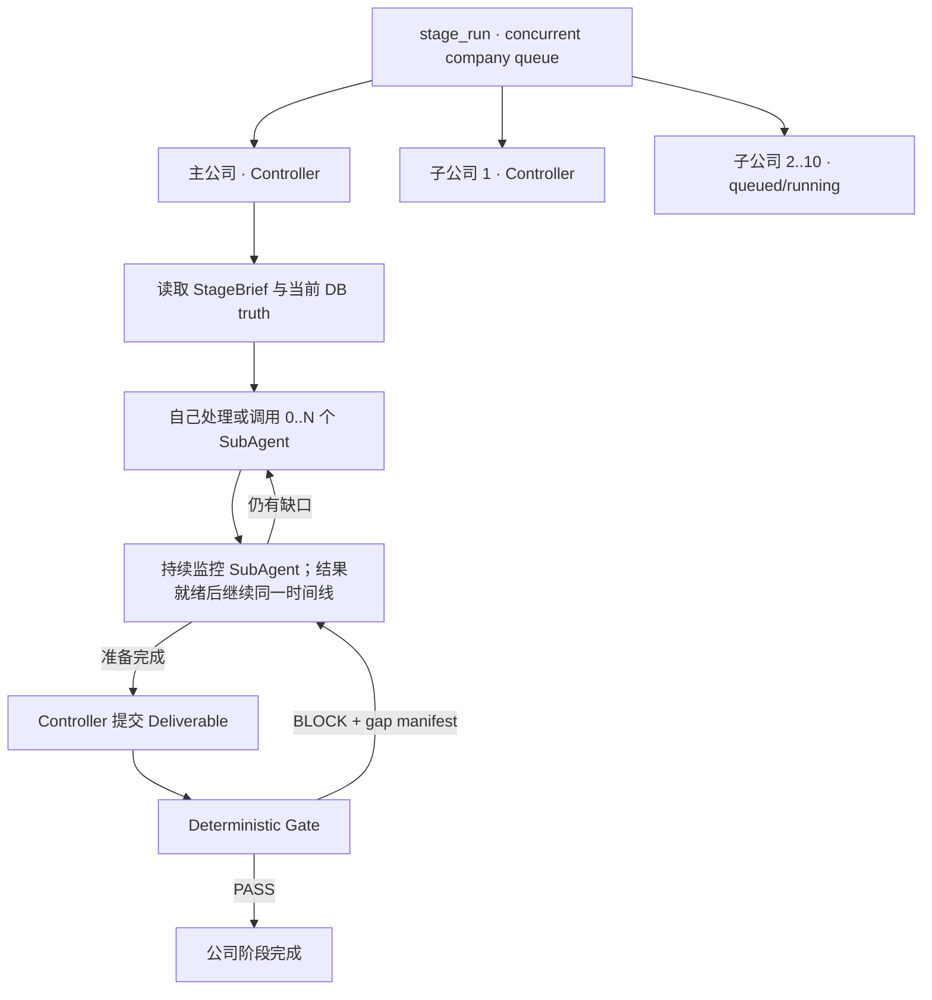

# Stage Run 每公司一个 Controller Agent 设计

- **日期**：2026-07-15
- **状态**：Approved by the user's explicit Codex-style controller request；implementation in progress
- **首个启用面**：`target_intel` + V2-only
- **替代范围**：替代 2026-07-14 设计中的“服务端固定 Producer 清单 + 事后 Aggregator”编排形态；
  WorkItem、WorkerRun、lease、checkpoint、evidence、Gate 和 recovery 底座继续复用
- **非目标**：普通 Chat/Task 的自由 sub-agent、不受控递归 Agent、跳过服务端授权/Gate

## 0. 用户看到的合同

`stage_run` 首先是一个可并发的公司 Unit 队列。若 engagement包含一个主公司和十个子公司，运行时
冻结为十一个独立 Unit；scheduler在公司级并发上限内启动每个 Unit的真实 Company Controller。
用户打开 `stage_run` 首屏看到公司队列，点进某家公司后看到该 Controller 的完整时间线，而不是
六个服务器预制 Worker，也不是所有 Worker 都结束后才出现的 Aggregator。



每家公司独立拥有自己的 Controller、子 Agent、scope、预算、Gate 和恢复状态；不能串流、串 scope
或相互阻塞。

### 0.1 两级队列与三级限流

```text
stage_run company queue
  ├─ Unit(org parent)      → Controller → child queue
  ├─ Unit(org subsidiary1) → Controller → child queue
  └─ Unit(org subsidiaryN) → Controller → child queue
```

- **公司队列**：Unit可处于 queued/running/waiting/gate/terminal；父公司可获得稳定首轮优先级，
  但不能饿死子公司。队列与状态必须 durable，重启后继续。
- **公司级并发**：同一 `stage_run` 同时运行有限个 Controller，不能再使用当前 per-org serial循环。
- **公司内并发**：每个 Controller有自己的 child并发上限。
- **运行级全局上限**：限制所有公司当前 Controller + child总数；实际可启动数量取公司级、公司内、
  operation/provider/risk lane各上限的最小值，避免 `公司数 × child上限` 爆发。
- **隔离收敛**：一家公司 waiting或Gate BLOCK不阻塞其他公司继续；`stage_run`只有在所有 Unit
  terminal，或明确存在需要用户处理的 durable blocker时才整体返回。

## 1. 核心语义

### 1.1 Controller 就是唯一 final submitter

不再存在“Producer 都结束以后才启动的第二个 Aggregator Agent”。数据库中的
`leader_role`、`aggregator_role` 和 final-submitter fence 在新模式中指向同一个逻辑角色：
`company_stage_controller`。保留 aggregator 字段仅是 schema 兼容，不代表产品里还有另一个 Agent。

### 1.2 Coverage obligation 不是固定 WorkItem

DNS、WHOIS、ASN、CT、SUBDOMAIN、OSINT 是 Target Intel 最终必须交代的 coverage obligations；
它们不再一一对应六个服务器预制 Agent。Controller 可以：

- 不开子 Agent，自己补齐简单缺口；
- 一个子 Agent覆盖多个 obligation；
- 同一 obligation 拆给多个子 Agent；
- 先探索，再根据真实结果补派下一轮。

只有 Gate 可以从权威 DB/evidence 判定 obligation 是否闭合。Controller 或子 Agent 的自然语言
`found/checked_empty` 都不是 Gate truth。

### 1.3 子 Agent 是 durable sibling，不共享 Controller lease

UI 表现为 Controller 调用 SubAgent；执行层仍为 scheduler 创建独立的 WorkItem、WorkerRun、
message chain、lease 和 checkpoint。这样既得到 Codex 式协作体验，又不破坏工具副作用所有权和
崩溃恢复。

子 Agent 默认不能继续组队，也不能提交 Unit deliverable。只有 Controller 能动态请求 sibling、
等待结果并最终提交。

## 2. Controller 生命周期

### 2.1 Seed 与首轮运行

新 Unit 初始只创建一个 `leader:primary` WorkItem。服务器给 Controller 一份冻结的 `StageBrief`：

- operation/stage/unit/organization 和 frozen scope；
- 当前 coverage/DB truth；
- Gate obligations；
- stage allowlisted tools 和 worker roles；
- 最大并发、总 worker、Controller round、tool/token/time 与 repair fuel；
- evidence、checked-empty 和权限边界。

Controller 可以直接使用本 stage 的安全工具，也可以调用 Team 工具创建子 Agent。

Controller还必须拥有与 Codex同名同形的 `update_plan`工具。它不是单独的 Planner Agent，也不是全局
Stage计划：每家公司 Controller在自己的 durable message chain里维护 1..12 个步骤，状态只允许
`pending | in_progress | completed`，同时最多一个 `in_progress`。复杂 Unit首轮先建立计划；执行工具、
派发 child、收到 immutable child output或 Gate gap后可整表重写计划并说明原因。`update_plan`是普通
非终止工具，调用后继续同一 Controller turn；只有 `stage_team_dispatch_workers`和
`stage_team_prepare_final_submission`会把控制权交回 scheduler。计划更新作为 exact Controller chain的
tool-call item随 checkpoint持久化和恢复，不写入/切换主 Agent的全局 Stage plan bucket，也不跨公司共享。

### 2.2 动态派发

首版暴露一个批量的 `stage_team_dispatch_workers`，由服务端逐项验证：

- role/kind 在 frozen allowlist；
- objective 与 subject refs不能越出当前公司和 frozen scope；
- output schema、budget 和工具边界由服务端生成，模型不能任意放宽；
- dedupe key + semantic hash 可重放；
- 并发、总量、轮次和 repair fuel 均未耗尽；
- parent 必须是当前 exact Controller fence；普通 Producer 不能获得第二调度权。

请求 durable 落库后，Controller WorkItem 进入 `waiting_dependency`，WorkerRun 进入
`waiting_background` 并释放 provider调用并发槽。这个名字只是崩溃恢复所需的内部状态；产品语义是
`waiting_for_subagents`：Controller 生命周期和 `stage_run` scheduler 都仍在持续运行并监控 children，
不是任务中断，也不是等外层全部完成后再重新启动 Controller。

### 2.3 等待与同一 Controller 恢复

只有相关 children terminal、immutable output齐全且没有 unknown active tool 时，服务端才恢复
Controller。继续执行必须返回相同 logical Controller、WorkerRun 和 message chain；prompt只追加服务器
生成的 immutable output manifest 和最新 DB truth。Controller 可以继续派发另一轮，形成：

```text
Controller → dispatch → waiting_for_subagents/monitor → continue same chain → dispatch/补缺口 → ... → submit
```

崩溃发生在 spawn response 之前时，dedupe replay返回原 WorkItems，不重复创建。崩溃发生在 park
以后时，从 durable dependency/barrier继续，不重放未知外部工具。

### 2.4 Gate 与 repair

Controller 准备提交时，服务端关闭当前 request epoch，并把 exact Controller WorkerRun绑定为唯一
final submitter；随后只有它能调用 `submit_stage_deliverable`。Gate 仍为确定性规则。

Gate BLOCK 已有 compound transaction可以持久化 exact gap、完整 Controller checkpoint和 repair fuel，
并恢复同一个 leader WorkItem/WorkerRun/message chain；不得创建 fresh Aggregator。但现有数据库 trigger
禁止 same-epoch reopen，而推进 epoch又会让原 Controller WorkItem无法作为新 child的合法 parent；同时 gap
表对同一 finalizer WorkerRun有唯一约束。因此，在不改 schema时，同一 Controller只能恢复后自己补工作，
不能安全追加新 SubAgent。要实现本设计要求的“Gate退回后继续监控、继续派人、再次提交”，必须增加一条
向前 migration：只给 exact Company Controller repair开放受限 same-epoch reopen，并把 gap来源 WorkerRun从
唯一约束改为普通索引，以 gap条数作为 bounded repair fuel。该 migration未获用户明确授权前不得实施。

## 3. UI 与 identity 合同

`stage_run` 第一层就是公司队列，按公司显示：

```text
广州有创网络科技有限公司
Controller 检查结果 · 3 个 SubAgent 已完成 · 1 个运行中 · Gate 未完成
[查看 Controller 运行流]

某子公司
队列中 · 前方 2 家 · 并发 3/3
```

- 点击公司进入 Controller 时间线；SubAgent tool calls内联，并可继续 drill-in。
- child 的持久化 `parent_request_id` 必须关联到 Controller 发起派发的 tool-call identity；不能靠
  `sub_agent_*` 名称猜父子关系。
- Controller运行流把 `update_plan`渲染成 Codex式计划卡，显示 explanation、步骤和当前状态；后续更新
  替换当前可见计划，同时历史 tool-call仍留在时间线供审计。计划卡不是完成 truth，Unit/Gate仍只读 DB。
- 新运行只支持 Company Controller identity；旧 fixed Team不再提供继续执行或 Aggregator运行流入口，
  明确提示用户重新运行本阶段。
- 没有 transcript 时显示“Controller 运行流正在恢复”，不能显示“没有运行”或跳到其他 Agent。
- 外层完成状态只读权威 Team/Gate read model；SubAgent自报不能提前显示阶段完成。

## 4. 安全与所有权不变量

1. Controller 与 children 固定绑定 operation/stage/unit/org/scope snapshot。
2. 服务端拥有 role/kind/tool/output schema/budget allowlist与所有计数器。
3. 子 Agent不能 spawn、不能提交 Unit deliverable、不能修改 TeamPlan。
4. 子 Agent不能调用 `update_plan`；每个 company Unit只有 exact Controller Worker fence拥有计划写权。
5. 每个 child拥有独立 WorkerRun/chain/lease/checkpoint；不能共用 Controller lease。
6. WorkerOutput immutable；evidence必须能回到 exact tool/target/fact。
7. Gate 只相信 DB/evidence；“已查空”与“未检查”严格区分。
8. unknown active-tool split state只能进入 recovery，不自动重放。
9. 取消/过期后 Controller不能继续创建 Worker。

## 4.1 记忆合同

Controller和每个 child都有独立、持久化的 `message_chain_id` 与 checkpoint，作为自己的短期连续
记忆；park/resume只能恢复原 chain，不能把另一家公司或另一 Worker的消息拼进来。

每次 Controller/child provider turn前，还要按服务端持有的
`operation + stage_execution + unit + organization + worker` identity读取 scoped ContextPack。可注入：

- canonical DB facts与当前 runtime state；
- 已 final-sealed 的 stage handoff；
- 历史 StageEpisode；
- 当前有效且满足分类/有效期策略的 assertions/documents；
- 当前公司的 temporal graph；
- 配置 query embedding provider以后才可用的 vector priors。

当前实现已经为 harness sub-agent注入这套 ContextPack，并在检索失败时拒绝回退到 global/sibling
customer memory；新 Controller必须复用同一入口。当前 `PgKnowledgeContextAdapter` 尚未配置 query
embedding provider，因此 vector similarity层实际为空，不能声称已经启用。无论哪层记忆，均不能
替代 canonical DB/evidence ledger或 deterministic Gate。

## 5. Rollout 与删除边界

首版只在 `target_intel` V2-only启用；默认公司级并发与每公司 child并发均为有界配置，并另受
operation级总 live-agent budget约束。其他 stage与 Verification CandidateAttempt scheduler不改变。
用户已明确授权删除 fixed Producer/Aggregator运行兼容；旧 session只显示不支持并要求重跑，不得进入
旧执行路径，也不得回写或伪造 Controller。

实现分三步：

1. 无 migration：Controller-only seed、durable dispatch/wait/continue、多轮 PASS和真实 UI树。
2. 删除 fixed Producer/Aggregator scheduler、资源配置、派工权限和前端运行流兼容分支。
3. 需用户明确授权的向前 migration：Gate BLOCK后沿同一 WorkerRun/message chain继续派 SubAgent；repair
   fuel耗尽后明确终止。

## 6. 验收场景

1. 主公司 + 十个子公司形成十一项 durable队列，公司级并发上限真实生效且无饥饿。
2. RunStage启动后、任何 child产生前即可打开已启动公司的 Controller；queued公司显示真实队列态。
3. 简单公司由 Controller 以 0 child完成。
4. Controller首轮开 2 个 child，读取结果后再补派第 3 个。
5. 多家公司并发时拥有隔离的 Controller时间线和不同 child数量；一家 waiting不阻塞其他公司。
6. spawn response丢失后 replay不重复创建 child。
7. 应用关闭再打开，parked Controller恢复同一 WorkerRun/message chain和公司队列位置。
8. child未 terminal或 output不完整时 Controller不能 resume。
9. Gate BLOCK在同一 logical Controller界面继续，不出现新的 Aggregator。
10. 越权 subject/role/tool与超预算请求稳定拒绝且不创建 WorkItem。
11. children全部自报完成但 DB coverage不满足时，外层仍显示 Gate未通过。
12. 每个 Controller可调用 Codex合同的 `update_plan`，同一时刻最多一个 in-progress；两个公司并发更新
    计划互不覆盖，child看不到该工具，Controller恢复后仍能从原 chain看到最近计划。
