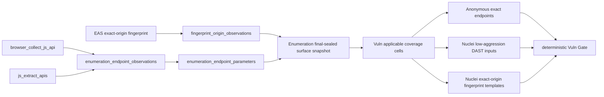

# Enumeration 攻击面清单与 Vuln 适用性设计

**日期**：2026-07-17
**状态**：Approved（用户已确认整体方向，并明确授权必要的数据库变更）

## 1. 问题

当前 Enumeration 的 Gate 能确定每个 exact web origin 的 JS、目录、参数、JS/API 四个轴是否完成，
但没有形成一个供下游直接消费的、带 operation 边界的攻击面清单。Vuln Triage 因而对每个 origin 固定生成
SQLi、XSS、命令注入、匿名访问、弱口令、会话、配置、TLS、信息泄露和 N-day 十个格子。

这会造成三类错误：

1. 没有参数的站点也被要求跑 SQLi/XSS/命令注入，Nuclei 只能扫根 URL，不能证明参数注入已检查。
2. 目标级 fingerprint 被错误地当成 exact-origin fingerprint，可能把某台主机另一端口的 POC 扫到当前 origin。
3. Enumeration 已发现的 endpoint/parameter 没有成为匿名访问和 DAST 的确定性输入，Gate 的分母与真正执行面不一致。

此外，用户提供的 `adysec/nuclei_poc` 会持续更新。扫描必须使用 Golish 管理的最新已验证快照，而不能覆写
当前本地已修改的模板目录，也不能因为一次网络更新失败就悄悄改变扫描语义。

## 2. 目标

- Enumeration 对每个 operation + exact origin 发布结构化 endpoint/parameter manifest。
- EAS/Enumeration 把 fingerprint 绑定到 exact web origin，而不是只绑定 target。
- Vuln coverage 分母由结构化 surface 决定；不适用项由后端确定性写入 `not_applicable`，不是由 Agent 自述。
- SQLi/XSS/命令注入只在有可执行参数输入时运行低攻击强度 DAST。
- 匿名访问只消费当前 Enumeration operation 发布的 exact-origin endpoint。
- N-day 只消费当前 exact origin 的 fingerprint，并选择匹配模板。
- 每次 Nuclei 执行前刷新 Golish 管理的 `adysec/nuclei_poc/poc_gold_13`；失败时显式记录并只允许使用上一次已验证快照。
- 所有执行继续保留 organization、target、operation、stage、exact-origin、速率、协议和危险模板边界。

## 3. 非目标

- 不用 Nuclei 替代业务逻辑、越权、复杂认证流程和手工验证。
- 本轮不自动构造登录态，不回放捕获到的 secret/cookie/raw value。
- 本轮不对 JSON/XML/GraphQL body 做猜测式 fuzz；body/form 参数会被结构化保存，但在没有安全 request model 前不作为可执行 DAST 输入。
- 不重写历史 operation、历史 evidence 或历史 technique outcome。
- 不删除、reset 或 pull 用户现有的 `/Users/christopherzheng/nuclei-templates/adysec-nuclei_poc` 工作树。

## 4. 数据模型

新增三组关系，均通过 migration 创建：

### 4.1 `fingerprint_origin_observations`

把现有 `fingerprints.id` 绑定到 `web_origins.id`，同时冗余 organization、target、project_path 和 source，
以便所有查询都能执行所有权校验。唯一键为 `(fingerprint_id, web_origin_id)`。

### 4.2 `enumeration_endpoint_observations`

把当前 Enumeration `operation_id`、exact `web_origin_id` 与现有 `api_endpoints.id` 绑定。唯一键为
`(operation_id, web_origin_id, endpoint_id)`。只有 active Enumeration operation、同一 owner/current target、
同一 exact origin 的 endpoint 才能发布。

### 4.3 `enumeration_endpoint_parameters`

参数属于 endpoint observation，字段包括 `name`、`location`、`value_type`、`required`、`source`。
`location` 仅允许 `query|body_or_form|path|header|unknown`。唯一键为
`(endpoint_observation_id, location, name)`。不保存捕获值，避免把 secret 带入后续扫描。

## 5. 数据流

只有 Enumeration final-sealed handoff 对应的 operation 能成为 Vuln snapshot 的来源。原始业务表中的孤立行不
会自动扩大或关闭 Gate。

## 6. 适用性规则

| Technique | 后端确定性适用条件 | 执行输入 |
|---|---|---|
| SQLi / XSS / Command Injection | 至少一个当前 operation、当前 exact origin 的 GET query parameter | 规范化 endpoint URL + 惰性占位值，`-dast -fa low` |
| Anonymous Access | 至少一个当前 operation、当前 exact origin 的 HTTP endpoint | endpoint method + URL |
| N-day | 至少一个绑定当前 exact origin 的 fingerprint | 该 fingerprint 匹配出的 exact template IDs |
| Weak Credentials / Session / Config / TLS / Info | exact origin 存在 | exact origin 根 URL；保留现有专用工具/基线策略 |

不满足适用条件的格子由 coverage snapshot 生成可信 `not_applicable`，source 固定为
`enumeration_surface_manifest`，并带数量与原因。Gate 只信任这个后端生成来源；Agent 文本或普通 tool output
不能自行声明 N/A。

## 7. Nuclei 执行边界

### 7.1 注入 DAST

- 调用中包含注入 technique 时，只允许单一注入 surface class；混合根 URL 基线 technique 时 fail closed。
- 输入来自结构化 manifest，仅 GET query；参数值使用无害占位值，不回放已捕获原值。
- 使用 `-dast -fa low`，并继续固定 exact-origin scope、`-dr`、`-ni`、HTTP/SSL protocol、无 OAST、无
  code/headless/file、低速率、低并发、零重试和响应大小上限。
- proof/list 阶段必须使用与 active 相同的 DAST/tag/exclusion 语义；没有 runnable template 时写 blocked，不能写 empty。

### 7.2 指纹 POC

- template selector 只查询当前 `web_origin_id` 的 fingerprint observation；没有 origin mapping 时不回退到 target-global。
- 仍由服务端返回 exact template IDs，客户端不能自由指定模板路径或 ID。

### 7.3 `adysec/nuclei_poc` 新鲜度

- 专用管理目录：`~/.golish/nuclei-template-sources/adysec-nuclei_poc`。
- 每次正式 Nuclei 执行前在进程级互斥锁内做有超时的 shallow fetch/sparse checkout，只取 `poc_gold_13`。
- 新 commit 必须通过本地模板可列举验证才成为 last-known-good；记录 commit、刷新时间和是否 stale。
- fetch/验证失败且已有 last-known-good 时继续使用该快照，但结果/evidence 明确标记 stale 和失败原因；没有
  last-known-good 时在任何目标网络请求前失败。
- updater 只操作 Golish 管理目录，不触碰用户模板工作树。

## 8. 失败语义与证据

- manifest 持久化失败会阻止对应 Enumeration JSAPI/PARAM 轴声明完整。
- surface snapshot 缺失、owner 不匹配、operation 不一致或 final seal 缺失均 fail closed。
- 每次 Nuclei evidence 记录：operation、stage run、exact origin、输入摘要、template roots/commit、模板 witness、
  DAST aggression、选中 technique/template IDs、进程退出状态和结果计数。
- `checked empty` 只表示适用输入上的 runnable templates 已实际完成且零发现；无输入、无模板、刷新失败且无快照
  均不是 empty。

## 9. 兼容与迁移

新增表不改变既有 `api_endpoints`、`fingerprints` 与 `technique_outcomes` 的历史含义。历史 Enumeration 没有
manifest 时，新的 Vuln operation 不得猜测；需重新运行 Enumeration 或明确 blocked。现有 target-global
fingerprint 仍保留供展示与非安全查询使用，但不再用于 exact-origin N-day 执行。

## 10. 验证策略

- migration fresh install + FK/owner/unique/location constraint 测试。
- repo TDD：跨 owner、跨 operation、跨 origin 拒绝；同一 endpoint 参数合并幂等；不保存 raw value。
- snapshot/gate TDD：有/无 query 参数、endpoint、origin fingerprint 时分母与 N/A 精确变化。
- producer TDD：browser/JS extraction 发布正确 location，持久化失败不能虚假闭环。
- Nuclei planner TDD：注入只使用 manifest GET query 输入、`-dast -fa low`、exact origin；target-global fingerprint 不再选择模板。
- updater 使用本地临时 Git remote 测试成功更新、并发串行、验证失败回退和无快照 fail closed；不依赖外网单测。
- anonymous access TDD：只加载当前 operation + exact origin 的 endpoints。
