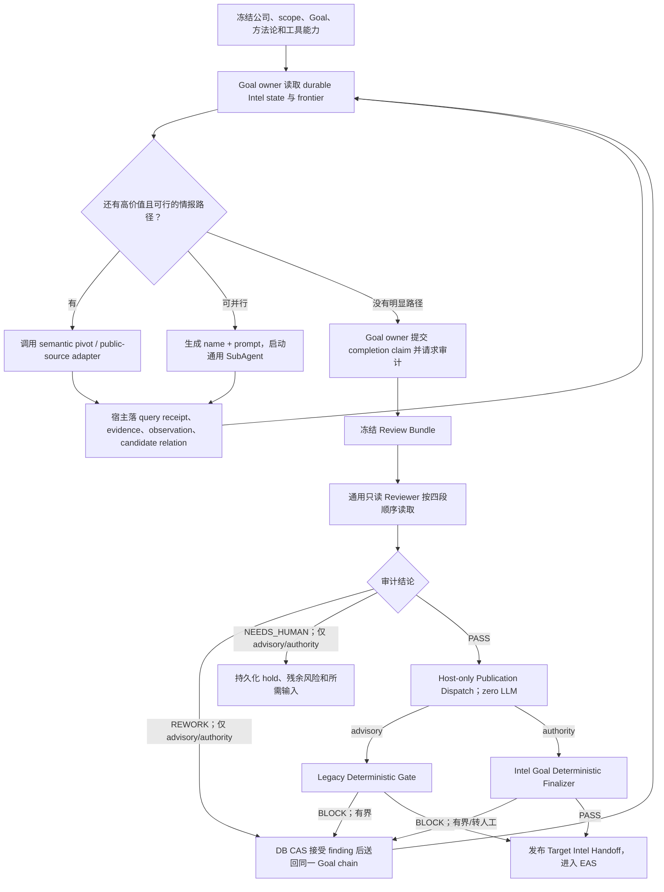

# Target Intel Goal Loop、通用 SubAgent 与审计闭环设计

> Superseded by `2026-08-04-scoping-and-autonomous-corporate-asset-discovery.md` for Scoping, Target Intel completion, reachability promotion, and six-axis retirement.

> **状态**：Approved for implementation planning（用户于 2026-08-02 确认）
>
> **日期**：2026-08-02
>
> **范围**：只改造 Red Team 的 `target_intel`。Scoping、External Attack Surface、Enumeration、Vuln、Application Understanding、Candidate、Verification 与 Reporting 保持现行阶段语义；Pentest 的 Target Intel hard-skip 保持不变。
>
> **授权边界**：本文和配套计划只记录设计与实施步骤。本轮不授权修改 schema/migration、生成 IPC 类型、切换 rollout、调用真实 provider、浏览真实目标或执行扫描。实施 Plan B 前必须再次取得用户对 additive migration、generated IPC 与 Red Team cutover 的明确确认。

## 1. 决策摘要

Target Intel 不再以 DNS、WHOIS、ASN、CT、SUBDOMAIN、OSINT 六个固定格子是否闭合来定义“情报工作完成”。这六类事实仍然可以被采集、落账和展示，但在新模式下只是情报结果的若干投影，不再是智能探索的穷举清单。

新结构为：

1. 每家公司只有一个持续存在的 Intel Goal owner。它拿到 Outcome、Constraints、Verification、方法论和完整的受控工具面，在同一 durable chain 内自主规划、搜索、观察结果、生成新 pivot、调用通用 SubAgent，并持续自检。
2. SubAgent 不注册成“ICP备案员”“ASN Agent”“审计 Agent”等固定业务角色。Goal owner 每次只给出动态 `name + prompt + subject_refs`；宿主给它绑定同一个通用、最小权限的执行器。名字是本轮任务标签，不是权限、能力或数据模型。
3. 所有外部搜索都从一个 semantic pivot 契约进入。模型提交公司、品牌、域名、hostname、IP、CIDR、ASN、证书、ICP备案、邮箱域、GitHub organization、repository 或 app id；模型不能提交 provider DSL、凭证、scope authority 或 evidence id。宿主负责归一化、授权、provider 选择、DSL 编译、费用/速率控制和落账。
4. Goal owner 认为不存在明显的高价值可行路径后，不能直接通过阶段，而是调用 review barrier。
5. 审计由一个新启动的通用、只读 SubAgent 完成，不新增固定 `intel_auditor` 角色。宿主使用中性的审计问题生成 prompt，不向模型暗示期望 verdict；它必须按宿主控制的顺序读取：durable state → observable actions → frozen Goal/methodology/capabilities → completion claim。
6. 审计只可返回 `PASS`、`REWORK` 或 `NEEDS_HUMAN`。在真正的 `observe_shadow` 中三态只用于记录和比较，绝不能 REWORK、hold、改变工具计划或阻止 legacy Gate；只有另行冻结的 `advisory_rework` 和最终 `intel_goal_v1` 才允许把 `REWORK` 送回同一个 Goal owner chain。`NEEDS_HUMAN` 用于缺授权、缺凭证、冲突无法判定或有界重试无增量，不能无限打回。
7. 在会影响生产路径的 `advisory_rework` / `intel_goal_v1` 中，审计 `PASS` 后不再调用任何 LLM。宿主直接生成 compatibility deliverable并执行 deterministic publication：advisory模式运行 legacy Gate，authority模式运行新finalizer；后者除审计身份/快照未过期外，还确定性检查本 run非空有效receipt/evidence、material frontier和contradiction均已终结、没有越权promotion或活跃写入、重大finding已显式终结，并把exact review hash绑定final submission、Handoff与final seal。
8. Rollout 分成三个 operation-frozen 模式：`observe_shadow` 只观测；`advisory_rework` 才允许有界补查但 legacy Gate 仍是 publication authority；最后才是 `intel_goal_v1`。任何 profile 变更前必须先具备 immutable per-operation contract，历史 operation 永远按原 frozen mode 运行。只有观测/补查证据通过评估、用户再次批准 additive schema/generated IPC/cutover 后，才启用 `intel_goal_v1` authority。

这不是把 Gate 全部交给 AI。AI 决定“情报是否充分、还有没有值得继续的路径”，确定性内核决定“这次审计是否真实发生、看的是不是同一份状态、证据是否存在、是否越权、是否允许发布 Handoff”。

## 2. 为什么只改 Target Intel

Target Intel 的搜索空间天然开放：公司别名可能导向新域名；域名可能导向证书、历史解析和代码仓库；IP 可能导向同网段、ASN、反向解析和共享基础设施；证书和 ICP 又可能反向导出主体关系。预先写死的矩阵只能表达已知维度，无法表达下一步应该根据新事实改变。

后续阶段的动作集合更固定，且风险和授权边界更强：

- EAS 需要针对已授权执行身份做 liveness、port、service 等受控检查；
- Enumeration 围绕已确认 Web origin 做 JS、API、directory、parameter 等收集；
- Vuln、Verification 和 exploitation 需要 typed adapter、action authority、预算和 oracle；
- Reporting 消费 sealed authority，不应自由探索目标。

因此本设计只把 Intel 阶段内部改成 Goal Loop，外层阶段 DAG、scope、evidence、Handoff 和后续主动动作审批全部保留。

## 3. 参考方法论与取舍

### 3.1 Codex Goal 映射

Codex 的 Goal 模式把目标文本同时作为首个 prompt 和 completion criteria；适合多步骤工作，并要求明确 Outcome、Constraints 和 Verification。Goal 保持在同一 chat/thread 中，可暂停、恢复和接受后续约束；启动 Goal 不扩大 sandbox 或 approval。SubAgent 用于独立、边界清楚的探索，并把结果汇总回主 Agent。

Golish 借用的是这些运行语义，而不是依赖一个名为 `/goal` 的私有实现：

| Codex 概念 | Golish Target Intel 映射 |
|---|---|
| persisted goal | operation/org-scoped frozen Intel Goal contract |
| same thread continuation | 同一 Company Controller message chain 与 runtime memory |
| outcome + constraints + verification | Intel Goal prompt、scope/passive policy、review criteria |
| generic subagent delegation | 动态 `name + prompt + subject_refs`，宿主绑定通用执行器 |
| pause / resume / steer | durable hold、same-chain resume、用户补充 scope/凭证 |
| same sandbox/approval | Goal 不扩大工具、网络、scope 或 active-scan 权限 |

参考：<https://learn.chatgpt.com/docs/long-running-work>、<https://learn.chatgpt.com/docs/agent-configuration/subagents>。

### 3.2 CyberStrike 方法论映射

用户提供的 `https://cyberstrike.io/models/` 是模型选择入口，不是完整的 Recon 完成方法论。对本设计真正有帮助的是 CyberStrike 的 Recon、Custom Skills 和 MCP 文档：Recon 文档把 subdomain、DNS、Web 和 OSINT 工具组合成可串联能力；Custom Skills 把可复用 prompt 和参数写成技能；MCP 文档强调工具直接可调用和插件化接入。

本设计只借鉴：

- AI 根据当前事实自行选择和串联工具；
- 方法论通过 Skill/Prompt 注入，而不是固化成一个程序顺序；
- 工具能力可扩展，模型不需要知道每个 provider 的底层协议。

不照搬：

- 不把“某工具调用过”当成完成证明；
- 不给模型 raw shell、raw provider DSL 或无审计 browser；
- 不用 `minDeliverables`、标签计数或固定工具表代替证据和归属判断；
- 不让发现的 IP、ASN、证书或第三方域名自动成为主动扫描授权。

参考：<https://docs.cyberstrike.io/docs/reconnaissance/>、<https://docs.cyberstrike.io/docs/slash-commands/custom-skills/>、<https://docs.cyberstrike.io/docs/mcp>。

## 4. 目标与非目标

### 4.1 目标

- 让 AI 围绕一家公司自主扩展公司名、别名、品牌、域名、IP、CIDR、ASN、证书、ICP、代码平台、App 和关联主体等 pivot；
- 允许主 Agent 并行委派通用 SubAgent，但保持一个 owner 汇总事实和决定下一步；
- 每次搜索、浏览、provider 调用、归一化、候选关系、落库结果和失败都有可追溯 receipt；
- 区分“发现了候选关系”“确认属于客户”“已获主动动作授权”；
- 让独立审计读取真实存储、真实动作和冻结方法论后判断信息是否充分；
- 允许有根据地打回补查，同时有界收敛并能转人工；
- 在不破坏旧 operation、Pentest hard-skip 和下游阶段的前提下渐进切换。

### 4.2 非目标

- 不改造所有阶段为 Goal Loop；
- 不把固定六轴换成另一个更大的固定矩阵；
- 不为不同来源创建一套固定 Agent 角色注册表；
- 不让 reviewer 的自然语言 `PASS` 直接写 stage pass token；
- 不让模型自报 confidence 数字成为归属或 scope authority；
- 不在 Target Intel 进行 liveness、port scan、service probe、login、表单提交、漏洞扫描或 exploit；
- 不把 CDN/shared IP、云 ASN、公共证书 SAN、供应商域名自动归给客户；
- 不重解释已经冻结或完成的历史 operation；
- 不在本设计任务中修改 schema、运行 provider 或访问真实目标。

## 5. 核心术语

| 术语 | 含义 |
|---|---|
| Goal owner | 每家公司一个持续主 Agent；不是可由模型选择的 role |
| Goal contract | operation-frozen Outcome、Constraints、Verification、methodology、tool/provider capability、browser mode 和预算 |
| Pivot | AI 想继续调查的语义主体；不包含 provider DSL |
| Query receipt | exact provider/source、semantic pivot、server-compiled query type、状态、时间、结果数、evidence/artifact refs |
| Observation | provider/browser 返回的归一化事实，不等于客户归属或 scope |
| Attribution claim | observation 与组织之间的候选关系及其 corroboration/disposition |
| Frontier | 尚未处理、已处理、阻塞、跳过或待人工的 pivot 集合 |
| Generic task | Goal owner 动态创建的 `name + prompt + subject_refs` 子任务 |
| Review bundle | 对一个 exact revision 冻结的四段审计输入 |
| Review finding | reviewer 指出的缺口、建议动作和关闭条件 |
| Finalizer | AI PASS 后执行的确定性身份、证据、scope、freshness 与状态检查 |

## 6. 新流程：一家公司进入 Target Intel 后发生什么

下图描述 `advisory_rework` / `intel_goal_v1` 的有界 Goal 闭环。`observe_shadow` 只在同一 frozen revision 上旁路生成 reviewer verdict：无论 verdict 是什么，生产路径都继续执行原 legacy Goal/Gate，不把 finding 回灌 Controller，也不创建 hold。只有这样才能比较同一状态上的 `reviewer verdict × legacy Gate verdict`，而不是让 Shadow 先改变被比较对象。



具体例子：

1. Goal owner 先读公司正式名、别名、已批准根域、已有 targets、历史组织资料、当前 run 的 query receipts 和 frontier。
2. 它以 `company_name=甲公司` 调 `recon_search_intel`。宿主选择支持 organization/company 的 provider，记录每个 provider 的 found/empty/error/blocked。
3. 结果出现 `example.com`、品牌 B 和 ICP 主体 C。`example.com` 先是带 provenance 的 candidate，不因 provider 说“属于”就得到主动扫描权。
4. Goal owner 生成三个可并行通用任务，例如 `核对 example.com 归属`、`追踪品牌 B 的公开资产`、`验证 ICP 主体 C 与甲公司的关系`。每个任务只有动态名字和 prompt，能力来自宿主绑定。
5. 域名搜索又发现证书和 IP。证书/IP 可以成为新 pivot；共享 CDN IP 只保留 relation，不提升成客户 IP root。
6. Goal owner 发现所有高价值可行 frontier 已终结，剩下来源因无凭证 blocked，便请求 review。
7. Reviewer 先看落库事实，再看这一轮到底调用了什么，然后看 Goal/方法论/可用工具，最后看主 Agent 的完成声明。若发现 GitHub organization 已知且 frozen capability snapshot 中存在可用 adapter、但从未查询，它返回可执行 `REWORK`；若唯一缺口是需要客户确认 C 是否为子公司，它返回 `NEEDS_HUMAN`；没有 material gap 才返回 `PASS`。在 `observe_shadow` 中这些 verdict 仅被记录；在 `advisory_rework` / `intel_goal_v1` 中才按各自 authority 处理。

## 7. Goal Contract 与 Skill/Prompt

Goal contract 必须是 operation-frozen、可哈希、可回放的服务端对象，至少包含：

```json
{
  "schema_version": 1,
  "mode": "observe_shadow|advisory_rework|intel_goal_v1",
  "outcome": "形成尽可能完整、证据可追溯、归属明确的客户互联网资产与关系图",
  "constraints": {
    "risk_lane": "passive",
    "browser_mode": "strict_passive",
    "candidate_does_not_authorize_active_scan": true,
    "raw_provider_dsl_forbidden": true
  },
  "verification": {
    "review_required": true,
    "review_schema": "intel_review.v1",
    "finalizer_required": true,
    "max_review_rounds": 3
  },
  "methodology_sha256": "sha256:computed-by-server",
  "tool_manifest_sha256": "sha256:computed-by-server",
  "provider_capability_sha256": "sha256:computed-by-server"
}
```

这三个摘要值均由服务器在运行时计算，不是模型输入。

`tool_manifest_sha256` 和 `provider_capability_sha256` 不能只哈希工具名称或 provider 配置文件。冻结内容必须逐项列出本 operation 当时真实可执行的 adapter、支持的 semantic pivot kind、query type、browser/public-source mode、credential availability class、quota/cost 上限、版本和 policy decision。声称支持但没有可调用 adapter 的能力必须记为 `unsupported`，不能出现在“可行能力”集合中。

这个 contract 必须在任何把 repository profile 从 legacy 改成 `observe_shadow`、`advisory_rework` 或 `intel_goal_v1` 之前，随 operation creation 原子持久化为 immutable snapshot；仅保存 `profile="red_team"` 或运行时重新读取当前 profile/spec 不算冻结。语义为：

- 旧 operation 没有该 snapshot，永久走 legacy 路径，不因资源文件更新而获得 Goal/reviewer/tool；
- 新 operation 原子冻结 mode、Goal/methodology/tool/provider/browser manifests、review fuel 和 hashes，resume 只读这份 snapshot；
- profile 只决定以后新建 operation 的初始 snapshot，不能重解释已经存在的 operation；
- 明确标记的历史 legacy operation 可没有新 contract；一旦某 operation 冻结了新 mode，contract 缺失、hash 漂移或无法回放时必须 fail closed 到人工诊断，不能回退 legacy，也不能临时读取最新 profile 补齐。

Skill/Prompt 负责告诉 Goal owner如何思考，不负责授予能力。核心指令为：

- 先读 durable state 和未闭合 frontier；
- 从当前事实提出最有信息增益的下一批 pivot；
- 能并行且边界清楚时才调用通用 SubAgent；
- 每次工具结果后更新计划，区分 observation、attribution 和 authorization；
- 不因单源 found、无结果、工具 exit 0 或模型 confidence 自称而下结论；
- 对失败、无凭证、超额、禁止访问和需要人工确认分别记录 terminal reason；
- 只有在不存在明显未探索的高价值可行路径、没有未解释矛盾、所有 material frontier 已终结时才能请求 review；
- 不得自行生成 stage pass 或规避 reviewer/finalizer。

方法论可以列出搜索启发式，但不能把它们变成“每项必须勾选”的新矩阵：

- 公司名 → 别名、品牌、子公司、ICP、App、代码组织、邮箱域；
- domain/hostname → CT、DNS、历史解析、证书、代码引用、测绘平台；
- IP → rDNS、证书、服务归属线索、CIDR/ASN 关系；
- ASN/CIDR → 注册主体、路由对象、已知域名交叉验证；
- certificate → SAN/issuer/subject 关系和 sibling candidate；
- GitHub org/repo → 域名、邮箱域、配置和公开资产引用；
- candidate → 至少一个独立 corroboration 路径或明确的 ambiguous/third_party disposition。

## 8. Semantic Pivot 工具

### 8.1 模型可见请求

模型只看到一个主要搜索工具：

```json
{
  "organization_id": "uuid",
  "pivot": {
    "kind": "company_name|brand|domain|hostname|ip|cidr|asn|certificate|icp|email_domain|github_org|repository|app_id",
    "value": "normalized by host"
  },
  "intent": "discover_related_assets|verify_attribution|enrich_known_asset"
}
```

模型不能传：

- provider id 或 provider query type；
- FOFA/Hunter/Shodan/Quake/0.zone DSL；
- API key、cookie 或 vault reference；
- `scope=in`、active authorization 或 promotion 决策；
- evidence id、confidence authority 或 query success 状态。

### 8.2 宿主处理顺序

```text
canonicalize pivot
  -> bind exact operation / org / project / stage
  -> classify seed vs derived candidate
  -> check passive/browser policy
  -> enumerate configured provider capabilities
  -> compile provider-specific safe query
  -> enforce credential/quota/rate/cost limits
  -> execute
  -> persist raw artifact + query receipt
  -> normalize observations
  -> derive candidate relations/dispositions
  -> call ProjectionAuthorization against the frozen scope snapshot
  -> land only deterministically authorized organization-profile / Target projections
  -> return bounded exact refs, not unbounded raw prose
```

`ProjectionAuthorization` 是模型不可见的 host decision，必须在任何 organization profile、`targets`、`dns_records`、`target_assets` 或 Handoff authority 写入之前运行，并把输入、规则版本、decision 和 scope snapshot hash 落 receipt。默认结果是 candidate-only：observation/evidence/frontier 可以保存，但不能写入 authorized projection。

授权匹配必须保持 scope 语义精确：

- exact domain root 只授权该 exact identity，不等于 wildcard，也不自动授权任意子域；
- 只有用户明确冻结的 wildcard rule 才可按其边界授权 strict child；
- exact IP 不等于 CIDR，ASN ownership、rDNS、证书 SAN、CDN/shared IP 和相邻地址均不产生 scope；
- derived candidate 即使多源 corroborated，也只能得到 attribution disposition，除非它独立满足 frozen ProjectionAuthorization rule 或后来获得 human scope confirmation；
- planner、provider mapper、reviewer 和模型 confidence 都不能写入或覆盖 ProjectionAuthorization decision。

第一批 provider 执行只放行 frozen capability snapshot 中真实存在、能正确映射并保留 query provenance 的 `company_name|brand|domain|hostname` adapter。`ip|cidr|asn|certificate|icp|github_org|repository|app_id` 在 adapter 未完成前必须返回 typed `unsupported` receipt并保留在 frontier；不能为了“支持类型”把它们错误映射成 broad site query。在 `intel_goal_v1` 中，任何被方法论或当前 facts 判定为 material、但 snapshot 中只有 `unsupported`/不可用 adapter 的 frontier，不能因 reviewer 接受一句 residual 而 PASS，必须进入 `NEEDS_HUMAN`，或由 operation-frozen policy / 有身份的operator decision及其evidence明确waive；模型和reviewer不能创建waiver。

### 8.3 Public web 模式

浏览器不作为 raw escape hatch 暴露。Public search/fetch 必须是 host-owned evidence adapter：模型只能提交受限 semantic query 或明确 public URL，不能选择搜索后端、凭证、cookie、redirect policy、HTTP method 或 evidence status。Target Intel 禁止使用 provider/LLM 内置、宿主看不到 query/response/receipt 的 server-side search 或 browsing；无法在结果对模型可见前完成 host evidence booking 的搜索能力一律不进入工具面。

Goal contract 冻结两种模式：

| 模式 | 允许 | 禁止 |
|---|---|---|
| `strict_passive` | provider API、RDAP、CT、公开 registry、搜索/代码平台 adapter | 访问目标自有 host、表单、登录、下载执行、主动探测 |
| `public_web_readonly` | 在上项基础上，对明确 public URL 做受限 GET/HEAD、页面文本/标题/链接/截图取证 | POST/PUT/PATCH/DELETE、表单提交、认证、文件上传、点击触发副作用、跨 scope crawl |

所有页面内容视为不可信数据，不能改变 Goal、工具策略或 scope。宿主必须先完成 policy check、请求、raw artifact/content hash 与 evidence receipt 的原子/可恢复落账，再向模型返回 bounded content 和 exact refs；evidence append 失败时结果不得对模型可见，动作保持 retryable，不能记为 empty/complete。浏览 receipt 至少绑定 operation/org/run、semantic query 或 URL、搜索 backend/redirect chain、method、status、timestamp、content hash、artifact/evidence refs 和 policy decision。

### 8.4 查询回执

`source_query_log.query` 使用稳定 semantic key，而不是粗粒度 `map_assets`：

```text
pivot:v1:<kind>:<value_sha256>:<provider>:<query_type>
```

每个 provider/query 独立记录 `found|empty|error|blocked|unsupported`。`empty` 只表示 exact query 成功且没有结果；`blocked` 表示无凭证、policy、quota 或权限阻止；`error` 保持可重试但不能冒充 checked-empty。

工具返回 exact landing refs：target id/type/value、DNS edge、target-asset key、artifact/evidence id、discovered pivot。`observedTargets`、模型 prose 或 count-only summary 不再足以证明业务落地。

## 9. 通用 SubAgent，而不是角色系统

Goal owner 的模型可见接口：

```json
{
  "agents": [
    {
      "name": "核对 example.com 归属",
      "prompt": "读取当前公司事实，围绕 example.com 寻找独立归属证据；只使用被动工具，返回新 evidence/pivot refs 和未解决矛盾。",
      "subject_refs": ["pivot:domain:example.com"]
    }
  ]
}
```

约束：

- 模型不能提交 `role`、`kind`、tool allowlist、execution profile 或 terminal schema；
- 宿主为普通 Intel task 绑定同一个通用 `recon` 执行 profile；
- `name` 只是 UI/log 标签，`prompt` 才定义本轮任务；
- 宿主用中性的固定 wrapper 注入 frozen Goal/scope/evidence 规则，不把 `provider specialist`、`auditor`、预期 PASS/REWORK 或某个搜索结论写进系统提示；动态名字也不能被解释成 role/authority；
- 子任务不能发布 stage、授予 scope、创建 active action 或再定义权限；
- 子任务结果必须落成 evidence/pivot/query/action refs，再汇总回 Goal owner；
- 主 Agent 保持最终计划所有权，不能把“是否完成”委托给某个子任务；
- 相同 normalized prompt/subject 在同一 request epoch 内幂等去重；独立任务可并行，写入仍受 org/project/fence 约束。

底层 runtime 若为了兼容现有 `stage_team_plans.allowed_roles` 必须保留一个 server-stamped technical identity，该 identity 不进入模型 schema、不决定业务方法论，也不能被调用方选择。切换到 Plan B 后由 host-owned execution profile 代替模型可见 role taxonomy；普通执行与 review 的 prompt 模板都由宿主按 execution profile 中性生成，不能通过隐藏 role 名把固定业务方法论重新引入。

## 10. Durable State、Evidence 与 Frontier

### 10.1 Shadow 可复用存储

Plan A 不改 schema，复用：

| 现有存储 | 新用途 | 限制 |
|---|---|---|
| `audit_log` / evidence ledger | 工具原始 artifact、normalized observation、landing receipt、shadow review event | 不是独立 review CAS authority |
| `source_query_log` | exact semantic pivot × provider/query receipt | 不能把 source found 当客户归属 |
| `expansion_queue` | legacy compatibility/read-only signal | 保持现行 unique、status 和旧写路径，不改造成 Goal authority，也不承担新 CAS |
| `targets` / `dns_records` / `target_assets` | 确定性已授权 identity/relation projection | 不接收 broad candidate 自动 promotion |
| organizations profile | 公司级注册/OSINT事实投影 | 历史 profile 不能冒充本 run freshness |
| StageTeam plan/work item/worker/chain | observe reviewer；后续 advisory/authority 的 Goal owner与动态任务 | `observe_shadow`不得派生改变生产路径的Goal work；现有role/kind仅作隐藏技术兼容 |

在 `observe_shadow` 的真实 operation 中，新增持久化仅限 non-authoritative review input/output/audit refs；semantic pivot、动态 Goal task和provider实验只可在fake/隔离shadow namespace运行，不能借上述“复用”写入legacy business truth。

Plan B 新增独立的 `target_intel_goal_frontier_v2`（或等价新表）承载 operation/org/stage/unit-scoped frontier、materiality、disposition、claim/lease、row version、provenance 和 terminal reason。迁移按 expand → deploy/backfill/read-compare → cutover → cleanup 顺序进行：先纯新增且 inert，再双写/核对，最后仅对 frozen 新 mode 读取 v2；不得在同一 migration 中 drop/改写 legacy `expansion_queue` unique 或收窄其约束。旧表的任何清理都必须另立后续设计和授权。

### 10.2 三种不同结论

必须永久区分：

```text
observation: 某来源返回了 X
attribution: X 与客户可能/已被多源证明有关
authorization: X 是否可进入后续主动动作执行集合
```

推荐 disposition：

- `authorized_by_existing_root`：严格落在用户已授权 wildcard/CIDR/exact root 内，可进入现行 scope 投影；
- `corroborated_candidate`：多源支持归属，但没有 scope authority；
- `ambiguous_shared_infrastructure`：CDN/shared IP/shared certificate/cloud ASN；
- `third_party_relationship`：供应商、SaaS、外包或合作方；
- `rejected_noise`：解析错误、PTR 噪声、无关同名主体；
- `needs_human_scope`：归属较强但必须由客户/操作员确认。

Reviewer 可以评估 attribution，但不能把 candidate 变成 active authorization。EAS 仍消费 operation-frozen scope 和自己的 active-scan approval。

## 11. Review Bundle 与审计顺序

### 11.1 为什么不能只看 completion manifest

如果 reviewer 先看“我已经做完”的声明，它容易被主 Agent 的叙事锚定。审计必须先独立理解真实状态和真实动作，再用当时的完整方法论判断遗漏，最后才核对 completion claim。

### 11.2 四段冻结输入

| 顺序 | section | 内容 |
|---|---|---|
| 1 | `durable_state` | org/scope seeds、facts、candidate relations、evidence、query receipts、frontier、contradictions、blocked capability |
| 2 | `observable_actions` | 本 run 的工具调用、semantic pivots、动态 SubAgent name/prompt/result refs、provider/browser receipts、失败/重试；不含隐藏 CoT |
| 3 | `frozen_contract` | exact Goal、methodology、tool/provider capability manifest、browser mode、policy、budget、hash/version |
| 4 | `completion_claim` | Goal owner 声称已完成的原因、主动保留的 residual、未使用来源及理由 |

Plan A 的 Shadow reviewer 可以把四段按顺序放入独立 prompt，但这只能形成软约束。Plan B 必须提供 host-controlled `read_review_section` cursor：只有 reviewer 读完并持久化前一段 receipt 后才解锁后一段；completion claim 永远最后开放。

Bundle 绑定 exact operation、stage execution、unit、organization、team plan、controller worker/chain、review round、四段 hash，以及一个 host-computed MVCC/revision vector。该 vector 至少覆盖：operation epoch、scope snapshot/hash、Goal contract hash、StageTeam plan/work-item/worker generations、query/action receipt watermark、evidence ledger watermark、authorized projection revision、candidate/attribution revision、frontier-v2 revision、contradiction revision和finding generation。冻结必须在一个可重复读/串行化事务中读取这些 material rows并写入 vector；不能用单个“最后更新时间”或模型提交的 state revision代替。

Finalizer 在 publication transaction 中重新读取并比较同一 vector。任一 material source 出现新增、删除、状态迁移、worker/tool继续执行或 contract漂移都会让旧 verdict stale；纯 UI/audit-render 等明确列入 non-material allowlist 的写入才可忽略。新增 material source时必须同时扩展 vector和 stale tests，否则不得接入 authoritative mode。

### 11.3 Reviewer 不是固定角色

Reviewer 仍使用通用 SubAgent executor，但宿主给该次动态 work item绑定：

- `execution_profile=read_only_reviewer`；
- `terminal_contract=intel_review.v1`；
- 只允许 `read_review_section` 和 `submit_result`；
- 禁止 semantic search、browser、provider、spawn、target mutation、stage submit 和 approval 工具。

这是每次调用的 host-owned execution profile，不是一个可注册、可被 Goal owner选择的业务角色。Reviewer prompt 必须由宿主从 frozen contract生成中性审计问题，只描述判断标准和输出 schema，不预告 Goal owner 的结论、不要求“找问题”或“尽量 PASS”，也不使用固定 `intel_auditor` persona；completion claim 仍只能在最后一段读取。

### 11.4 Verdict 契约

```json
{
  "schema_version": 1,
  "verdict": "pass|rework|needs_human",
  "summary": "reviewer conclusion",
  "findings": [
    {
      "materiality": "critical|major|minor|advisory",
      "subject_refs": ["pivot:domain:example.com"],
      "reason": "why current evidence/action is insufficient",
      "recommended_action": "an action possible with the frozen tool/policy set",
      "close_condition": "what durable delta would close this finding"
    }
  ],
  "inherited_findings": [
    {
      "finding_id": "host-issued-id",
      "disposition": "resolved|still_open|needs_human",
      "resolution_refs": ["evidence-or-receipt-ref"]
    }
  ],
  "residuals": [
    {
      "reason": "known limitation",
      "requires": "credential|scope_confirmation|provider_recovery|none"
    }
  ]
}
```

宿主重算 finding fingerprint；模型不能自报 hash。语义为：

- `PASS`：没有 open critical/major finding，没有明显未探索的高价值可行路径；minor/advisory residual 已明确记录；
- `REWORK`：存在 material gap，且 frozen capability/policy 内有具体可行动作；必须提供 close condition；
- `NEEDS_HUMAN`：缺 scope、凭证、主体确认、费用授权，或同一 finding 在无 material delta 的情况下重复出现；阶段持久化 hold，不伪造 PASS。

从第二轮开始，reviewer 必须逐条处置宿主提供的 inherited critical/major finding，不能通过省略让旧 finding 消失：

- `resolved` 必须携带 exact current-run resolution evidence/receipt/action refs，宿主验证这些 refs 在上一轮之后产生并满足 close condition；
- `still_open` 保留同一 host fingerprint，并在 capability 内仍可行动时只能导向 `REWORK`；
- `needs_human` 必须给出 typed requirement，并导向 `NEEDS_HUMAN`；
- host 无法验证 resolution refs、subject/fingerprint 漂移或 inherited finding 未逐条出现时，拒绝 verdict，不得 PASS。

## 12. 有界重做与固定点

“一直打回直到 reviewer 满意”不能实现成无界循环。否则 provider 永久失败、证据冲突或 reviewer 偏好会消耗无限预算。

规则：

1. REWORK 回到同一个 Goal owner chain，携带 exact finding、建议动作和关闭条件；不重新创建目标，不丢历史。
2. 新 review 必须基于 material state/action digest 变化；仅改自然语言 completion claim 不算进展。
3. finding fingerprint、material digest、round 和 operation-frozen review fuel 必须由 DB transaction在同一 CAS 中重算/扣减；scheduler内存计数和模型自报 round不具 authority。
4. 同一 inherited finding fingerprint 第二次出现且相关 state/action digest 未变，DB CAS直接记录 `NEEDS_HUMAN(review_fixed_point)`，不得再创建 REWORK epoch。
5. operation-frozen review fuel 用完仍有 major finding时，DB CAS原子记录 `NEEDS_HUMAN(review_fuel_exhausted)`，不能以预算耗尽改写为 PASS，也不能因进程重启重置 fuel。
6. 每轮 verdict 必须按上一节显式处置全部 inherited material findings；resolution refs 验证失败、遗漏或伪造都拒绝 transition。
7. source/provider `blocked` 可以成为诚实 residual，但必须证明已经检查 capability、凭证/policy 状态和替代路径；blocked 不等于 checked-empty。material capability 只有 `unsupported` 时不能 authoritative PASS。
8. 用户补充凭证、scope 或主体确认后，resume 同一 Goal，并创建新 review round；旧 verdict 保持不可变历史。

## 13. Deterministic Finalizer

Plan B 中，AI reviewer PASS 后宿主不再创建“final submitter”、不再给 Goal owner 一个总结/提交 turn，也不再调用任何 LLM。宿主从 DB rows生成 slim compatibility deliverable，并在同一 deterministic publication transaction 中运行 finalizer、写 submission、Handoff 和 final seal。Finalizer 至少验证：

- operation 的 frozen mode 是 `intel_goal_v1`，且仅适用于 Red Team Target Intel；
- review 属于 exact operation/stage execution/unit/org/team plan/controller chain；
- reviewer work item使用 host-owned read-only profile和 `intel_review.v1` terminal contract；
- 四段 section 的 hash、读取顺序和 final bundle hash 一致；
- verdict 为 latest fresh PASS，MVCC/revision vector逐项一致，review 后没有 material DB 写入或活跃 Worker/tool；
- non-vacuity：本 run 至少存在 policy允许且真实执行的有效 query/action receipt，并绑定同 run/org/project 的新鲜 evidence/artifact；仅有 completion claim、模型 prose、provider count、`observedTargets` summary、exit 0或无 landing refs 的结果一律不算；
- 每个计入事实/归属/完成依据的 receipt都有 exact status、semantic pivot、adapter/query type和evidence/landing refs；`error`、写入失败或 count-only结果不能冒充 `empty`/`found`/terminal；
- 所有 material frontier 均为 host-validated terminal disposition，所有 material contradiction均有 evidence-backed resolution或 typed human hold；pending、retryable error、material unsupported/blocked但无 waiver的 frontier不得 PASS；
- frozen capability snapshot列出的真实 adapters与实际 receipts一致；方法论/事实产生的 material pivot没有 adapter时必须 `NEEDS_HUMAN` 或绑定明确 human policy waiver，不能由 reviewer一句 residual消除；
- normalized observation、attribution disposition、ProjectionAuthorization 和 scope authorization 没有被混写；任何 organization profile/Target/Handoff projection都有 exact host decision receipt，且 exact root从未被当成 wildcard；
- 每个 inherited critical/major finding都有 `resolved|still_open|needs_human` disposition；PASS只接受带已验证 resolution refs 的 `resolved`，没有未终结或被遗漏的 material finding；
- completion claim 不参与事实 authority；
- exact review id/hash/verdict hash 被写入 final submission、Handoff catalog 和 final-seal attestation；
- response-loss replay 只能返回同一 review/final seal，任何 hash drift fail closed。

Finalizer 不再问：

- 是否恰好跑过 DNS/WHOIS/ASN/CT/OSINT；
- coverage matrix 是否 100%；
- evidence 数是否超过某个阈值；
- 模型 confidence 是否大于 0.85。

六轴 projection 可以继续服务旧 UI、报告和 Shadow divergence 分析，但在 `intel_goal_v1` 中不产生 pass token。

Finalizer BLOCK 必须区分：可通过新 material work修复的 stale/frontier finding、需要 operator处理的 authority/contract/storage错误，以及不可恢复的 invariant violation。只有第一类可以通过 DB CAS消耗剩余 review fuel、恢复同一 Goal chain并强制冻结全新 Review Bundle；后两类直接 `NEEDS_HUMAN`/system hold，不能进入无界 Gate repair。任何 BLOCK 后都禁止复用旧 reviewer PASS。

## 14. Shadow 与 Cutover

### 14.1 Phase A：True Observe Shadow

- 只在 immutable operation contract明确冻结 `mode=observe_shadow` 的新 Red Team operation启用；仅修改当前 profile文件而没有 per-operation snapshot时不得上线；
- Pentest `passive_intel=skip` 路径完全不创建 Goal owner、SubAgent 或 reviewer；
- reviewer针对 legacy Target Intel 的 exact frozen state/actions/contract/claim做旁路审计，产生 PASS/REWORK/NEEDS_HUMAN；
- 三种 verdict和findings只进入带 `non_authoritative=true` 的 evidence/audit/run tree，不回灌Controller、不创建新pivot/worker、不hold、不延迟或阻止 legacy submit/Gate/Handoff；
- legacy Gate在同一 material revision上独立运行并独自决定生产路径，因此可以真实记录 reviewer verdict × legacy Gate 的全部组合；若两者无法绑定同一 revision，该样本标记 invalid，不能用于promotion统计；
- 如需试验 Goal owner/semantic pivot，可在明确隔离的 shadow namespace/fake provider corpus中运行；其 receipts/observations不得写入 legacy Gate business truth、organization profile、authorized Target或Handoff；
- 无 schema、无 generated IPC、无真实 provider smoke，除非用户另行授权。

### 14.2 Phase B：Operation-frozen Advisory Rework

`advisory_rework` 是独立 rollout mode，不能借 `observe_shadow` 名义暗中启用。它要求 immutable contract、v2 frontier、DB-backed review bundle/finding/CAS和完整 evidence adapter 已经就绪：

- reviewer `REWORK`可以通过 DB CAS消耗 frozen fuel并回到同一 Goal chain；`NEEDS_HUMAN`可以形成显式可恢复 hold；
- 补查可以写 evidence/observation/candidate，但任何 profile/Target/Handoff projection仍必须通过 ProjectionAuthorization；
- reviewer PASS后不再调用LLM；宿主生成compatibility deliverable并直接运行legacy六轴Gate。legacy Gate仍是最终publication authority，reviewer PASS不产生pass token；
- 每次补查前后都记录 material delta、成本和legacy Gate变化，用来证明rework是否真正增加信息；
- 只有用户明确批准新的 operation profile cohort后才启用，不改变 `observe_shadow`/legacy历史operation。

### 14.3 Phase C：`intel_goal_v1` Audit Authority Cutover

开始前需要用户明确批准：

1. additive review/frontier migration；
2. generated IPC/read-model 变更；
3. Red Team 新 operation 的 operation-frozen `intel_goal_v1` promotion；
4. 如需实体验收，批准 exact 测试 workspace、组织、provider/browser 来源和费用边界。

Cutover 只作用于批准后新建的 Red Team operation。`observe_shadow`、`advisory_rework`、legacy和historical operation继续按各自 frozen mode运行，不允许中途重解释。Reviewer PASS后直接进入host-only deterministic publication，不再调用LLM或现有模型 final submit turn。

### 14.4 Promotion 报告

系统不得自动 promotion。Promotion 报告必须至少证明：

- fixture corpus 中不存在 candidate 自动获得 active scope 的反例；
- reviewer 所有 PASS/REWORK/NEEDS_HUMAN 都能回放到 exact bundle/action/evidence；
- `observe_shadow` verdict从未改变、hold或阻塞legacy生产路径，且两种verdict绑定同一revision；
- REWORK 确实带来 material delta，重复无增量会转人工；
- DB CAS在restart/concurrency下仍执行finding inheritance、fingerprint和frozen fuel；
- crash/response-loss/stale verdict/concurrent write 均 fail closed；
- Pentest hard-skip 和其它阶段回归不变；
- Shadow reviewer 与 legacy Gate 的分歧已逐例解释，而不是只比较通过率；
- 用户接受测得的 token、provider cost 和 wall-clock 预算。

## 15. 兼容与边界

- `recon_map_assets` 在 Plan A 保持 legacy alias，内部适配 organization/domain pivot；新 Goal prompt 使用 `recon_search_intel`。
- 现有 `intel_query_provider` 没有 exact task-local org authority，不进入 Goal 工具面。
- 任何 provider/模型内建 server-side search/browser只要不能由宿主执行、限权并在结果可见前落 exact evidence receipt，就不进入 Target Intel工具面。
- 现有 `source_query_log`、evidence、targets、DNS/asset relations和 StageTeam runtime尽量复用。
- Hunter/Shodan 当前 mapper 可能把不同请求都经 `map_site` 投影；query receipt必须独立保存 requested semantic pivot/query type，不能信 mapper 输出反推调用意图。
- legacy `expansion_queue` 保持原表、原unique和旧消费者语义；新闭环使用独立 frontier v2并按expand→deploy/read-compare→cutover→另行cleanup推进，不能在同一个migration中替换legacy约束。
- 旧六轴 technique outcome 不删除；它们是 compatibility projection，不是 Goal completion authority。
- `findings_allowed=false` 的旧 Target Intel deliverable会丢 stage finding；review finding 必须走独立 review storage/read model，不能塞回 vulnerability findings。
- EAS Handoff 只包含当前 operation允许交接的 authorized identities和明确 candidate references；active execution仍需 EAS 的 human approval。
- 任何organization profile、Target或authorized Handoff写入前必须有ProjectionAuthorization receipt；exact root、wildcard、CIDR和candidate语义保持可回放，不能通过兼容alias放宽。
- mode和contract按operation冻结；profile资源只影响以后新operation，resume历史operation不重新读取当前profile决定authority。

## 16. 风险

| 风险 | 约束 |
|---|---|
| AI 为“更完整”无限扩展 | material information gain、review fuel、same-finding fixed-point、NEEDS_HUMAN |
| reviewer 被 completion claim 锚定 | 四段顺序读取，claim 最后解锁 |
| reviewer 自己查资料或改状态 | read-only execution profile，只给 section reader + submit_result |
| reviewer/动态 Agent 被隐藏角色或prompt引导 | 模型 schema只含 name/prompt/subject refs；host使用中性prompt，technical identity不可选择且不含业务persona |
| provider DSL 注入/费用失控 | semantic pivot → server planner；凭证、query、quota/rate/cost都由 host |
| server-side search绕过evidence | Target Intel禁用不可host审计的内建search/browser；host先落evidence再向模型返回 |
| 页面 prompt injection | public web content永远是 untrusted data，不能改 Goal/policy/tool authority |
| CDN/shared IP 被错归属 | observation/attribution/authorization三分，ambiguous disposition不 promotion |
| exact root被当wildcard或candidate被写入scope | 所有profile/Target/Handoff写前调用ProjectionAuthorization并落decision receipt |
| Shadow 被误当生产 Gate | `observe_shadow` verdict不得REWORK/hold/改路径；补查必须使用另一个frozen `advisory_rework` mode |
| reviewer对空状态直接PASS | deterministic non-vacuity、有效current-run receipt/evidence、material frontier/contradiction closure |
| PASS 后状态变化 | bundle MVCC/revision vector + publication事务重验；stale verdict fail closed |
| finding被省略或无限换皮重试 | inherited finding逐条disposition、host fingerprint、DB CAS digest/fuel/fixed-point |
| 配置宣称能力但没有adapter | operation-frozen capability snapshot列真实adapter；material unsupported转人工/waiver，不能PASS |
| 历史 operation 行为变化 | profile切换前先具备immutable per-operation contract，切换只适用新 Red Team operation |
| frontier升级破坏legacy消费者 | 新建v2表，expand→deploy→cutover→cleanup；不原地改legacy `expansion_queue` |

## 17. 验收标准

### 17.1 Phase A0 Fixture/Dev Shadow（Plan A）

- production Red Team/Pentest profile、Target Intel spec、历史operation和旧Gate逐字保持原行为；
- 只有显式fixture/dev selector可以构造Goal、semantic pivot、通用SubAgent和reviewer，所有external transport均为fake；
- semantic provider在fake namespace证明collect→ProjectionAuthorization→project顺序，candidate不会污染organization profile或active Target；
- host-owned public adapter证明evidence-before-model并封死server-side search绕过；`public_web_readonly`保持显式disabled；
- reviewer能产生三态verdict，但不回灌Controller、不创建hold、不写pass token；同快照divergence可重放；
- Plan A passing只证明architecture/safety fixture成立，不代表production Shadow上线。

### 17.2 Phase A1 True Observe Shadow（Plan B Approval 1）

- profile变化前已有immutable per-operation contract；旧 Red Team operation继续legacy，新operation才冻结`observe_shadow`；
- reviewer在exact frozen revision上看到durable state、actions、真实capability snapshot和最后才开放的claim，能返回三态verdict；
- reviewer prompt由host中性生成，不注册固定auditor role，也不暗示期望verdict；
- 任意Shadow verdict都不回灌Controller、不创建worker/pivot/hold、不延迟submit，不改变legacy Gate或Handoff；
- Shadow verdict和同revision legacy Gate均在run tree可见，可形成有效四象限；
- semantic pivot/通用SubAgent在fake/隔离shadow namespace已验证，模型payload不存在role/kind/tool policy/provider DSL字段；
- public search/fetch完全host-owned并先evidence后model；Target Intel没有不可审计server-side search；
- Pentest hard-skip零Goal/reviewer/provider/web dispatch，其他stage工具和Gate不变；
- 所有focused tests、Clippy、rustfmt、JSON/diff checks通过。

### 17.3 Phase B Advisory Rework

- new operation显式冻结`advisory_rework`，不能把`observe_shadow`原地升级；
- company/domain semantic pivot端到端生成exact query receipt、evidence和landing refs；unsupported pivot不被broad query伪支持；
- 所有profile/Target/Handoff projection经过ProjectionAuthorization，exact root不等于wildcard，candidate/shared infrastructure不获得active authority；
- v2 frontier独立于legacy `expansion_queue`并按expand/deploy/read-compare路径上线；
- REWORK通过DB CAS回同一chain；inherited finding逐条`resolved|still_open|needs_human`且resolution refs可验证；
- 同fingerprint无material delta或frozen fuel耗尽由DB原子转NEEDS_HUMAN，restart/concurrency不能重置；
- legacy Gate仍是publication authority，补查前后material delta和成本可比较。

### 17.4 Phase C `intel_goal_v1` Cutover

- Review bundle、section reads、verdict和finding是immutable/CAS/fenced authority，bundle拥有完整MVCC/revision vector；
- reviewer只能顺序读取四段且没有写/搜索工具；
- PASS/REWORK/NEEDS_HUMAN、finding inheritance、stale verdict、crash recovery和response-loss exact replay均有数据库集成测试；
- reviewer PASS后零LLM调用，host直接执行deterministic publication；
- finalizer不读取六轴矩阵决定PASS，但严格验证current-run non-vacuous receipt/evidence、exact landing、material frontier/contradiction terminal、真实capability、ProjectionAuthorization、fresh review hash和finding resolutions；count-only/prose不算证据；
- material unsupported没有human policy waiver时不能authoritative PASS；
- final submission、final seal和Handoff绑定exact review/MVCC vector；
- new Red Team operation按frozen mode cutover，旧operation/observe/advisory/Pentest/其它阶段不变；
- promotion前完成fixture、shadow divergence、成本和安全报告，并由用户明确批准。

## 18. 配套实施计划

- Plan A（fixture/dev-only architecture Shadow，production不变）：[`../superpowers/plans/2026-08-02-target-intel-goal-loop-shadow.md`](../superpowers/plans/2026-08-02-target-intel-goal-loop-shadow.md)
- Plan B（先经Approval 1启用`observe_shadow`；`advisory_rework`只在显式cohort验证；再经Approval 2 cutover）：[`../superpowers/plans/2026-08-02-target-intel-goal-loop-audit-cutover.md`](../superpowers/plans/2026-08-02-target-intel-goal-loop-audit-cutover.md)

两份实施计划在执行前必须与本文最终语义同步；尤其不得执行任何“Shadow verdict回灌/hold”、原地修改legacy `expansion_queue`、Reviewer PASS后再调用LLM final submitter或缺少per-operation contract的profile切换步骤。本文是这些冲突项的设计authority。
