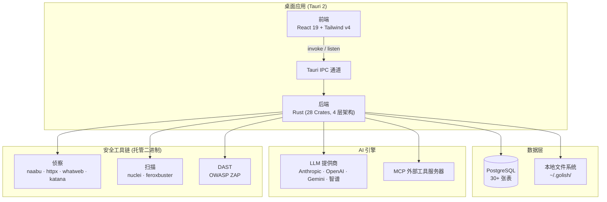
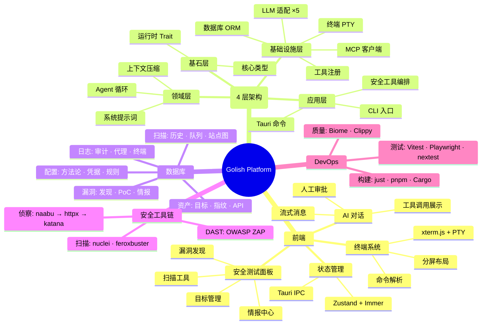
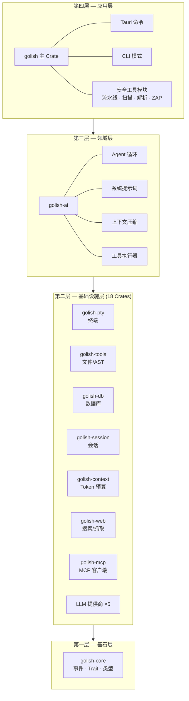
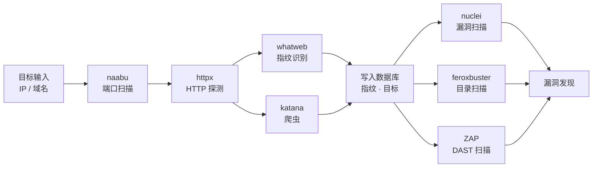

# Golish Platform — 架构脑图

> AI 驱动的安全测试终端 | Tauri 2 桌面应用 | Rust + React 19

---

## 系统架构总览

## 项目脑图

## 后端分层架构

## 安全测试流水线

## 技术栈

| 领域 | 技术选型 | 说明 |
|------|---------|------|
| 桌面框架 | **Tauri 2** | Rust 后端 + WebView 前端 |
| 前端 | **React 19** + Vite + Tailwind v4 | shadcn/ui 组件库 |
| 后端 | **Rust** (28 Crates) | 4 层模块化架构 |
| 数据库 | **PostgreSQL** + sqlx | 30+ 张表，编译期 SQL 检查 |
| AI | **rig-core** | 5 个 LLM 适配器 (Anthropic/OpenAI/Gemini/智谱) |
| 终端 | **portable-pty** + xterm.js | 真实 PTY 会话 |
| 安全工具 | naabu / httpx / nuclei / ZAP 等 | 7 个外部二进制 |
| 测试 | Vitest + Playwright + nextest | 前端 + E2E + Rust |
