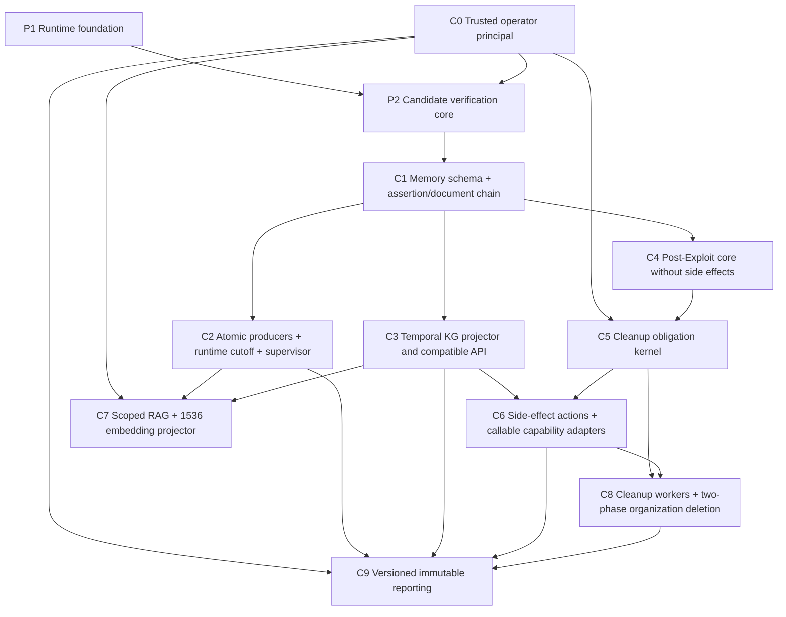

# Memory / Post-Exploit Closeout V2 纠偏实现计划

> **面向 AI 代理的工作者：** 必需子技能：使用 superpowers:subagent-driven-development（推荐）或 superpowers:executing-plans 逐任务实现此计划。

**目标：** 在不修改 2026-07-12 既有 P3-P8 计划历史的前提下，给出可编译、可恢复、可并行交付的纠偏执行顺序，完成 evidence-backed Memory Fabric、Scoped RAG、Post-Exploit、Cleanup 与不可变 Reporting 闭环。

**架构：** 运行事实只从 canonical transaction 进入 immutable event/outbox；每个 projector 使用独立 delivery，严格按 assertion → document → embedding 依赖运行。Post-Exploit 被拆成无副作用领域核心、Cleanup obligation kernel、带副作用 action 三段；Reporting 使用完整 source-set snapshot、单调版本、内容寻址 blob 与 revision 关联表完成可重复 finalization。

**技术栈：** Rust 2021、Tokio、sqlx/PostgreSQL、pgvector 1536 维、Tauri 2、React 19、TypeScript 6、Vitest、cargo-nextest。

### 全局 migration 编号 ledger

| 数字前缀 | 唯一归属 |
|---|---|
| `20260712000001` | P1 runtime-memory foundation |
| `20260712000002` | P1 runtime-memory V2 cutover |
| `20260712000003` | Trusted operator principal |
| `20260712000004` | P2 attack-execution V2 foundation |
| `20260712000005` | P2 attack-execution V2 cutover |
| `20260712000006` | Memory Fabric core |
| `20260712000007` | Structured temporal graph |
| `20260712000008` | Post-Exploit core |
| `20260712000009` | Cleanup obligation ledger |
| `20260712000010` | Cleanup closeout |
| `20260712000011` | Reporting read model |

开工及新建任何 migration 前先执行 numeric-prefix 冲突预检：

```bash
duplicate_prefixes="$(find backend/crates/golish-db/migrations -maxdepth 1 -type f -name '*.sql' -exec basename {} \; | cut -d_ -f1 | sort | uniq -d)"
test -z "$duplicate_prefixes" || { printf 'duplicate migration numeric prefix(es):\n%s\n' "$duplicate_prefixes"; exit 1; }
```

---

## 0. 本计划的效力与开工门禁

本文件是以下计划的**增量纠偏执行入口**，旧文件保留为历史，不覆盖、不删除：

- `docs/superpowers/plans/2026-07-12-memory-fabric-core.md`
- `docs/superpowers/plans/2026-07-12-structured-knowledge-graph-projector.md`
- `docs/superpowers/plans/2026-07-12-scoped-rag-context-pack.md`
- `docs/superpowers/plans/2026-07-12-post-exploit-domain.md`
- `docs/superpowers/plans/2026-07-12-cleanup-obligation-ledger.md`
- `docs/superpowers/plans/2026-07-12-reporting-read-model.md`

发生冲突时，P3-P8 的依赖、类型、migration 顺序、worker ownership、IPC 兼容和最终验收以本文件为准；未冲突的测试矩阵与领域不变量继续沿用原计划。

实现者开始 C0 前必须执行：

```bash
git status --short
jq -r '.features[] | select(.status == "in_progress") | [.id, .status] | @tsv' feature_list.json
test ! -e backend/crates/golish-db/migrations/20260712000003_trusted_operator_principal.sql
test ! -e backend/crates/golish-db/migrations/20260712000006_memory_fabric_core.sql
```

预期：只有本 V2 父功能或当前执行包是 `in_progress`；工作树没有不属于本包的重叠修改；两个纠偏 migration 文件尚未存在。若旧编号 migration 已经进入某个共享分支，不重命名已落地 migration，而是在该分支的最新时间戳后追加等价 corrective migration，并把实际文件名记录到 `agent-progress.md`。

每个包开始前还必须读对应模块卡；新 crate 在写代码前先创建模块卡并登记 `docs/modules/INDEX.md`。每个包结束时只提交本包文件，最后才运行全仓 `just precommit`。

---

## 1. 十个必须纠正的契约

| 原缺口 | 纠正后的不可变契约 | 落地包 |
|---|---|---|
| Document Projector 未实现，Embedding delivery 永久等待 | 所有可检索事实都走 `assertion-promoter@1 → document-projector@1 → embedding-projector@1`；后继 delivery 只在前驱 `succeeded` 后 claim | C1、C7 |
| `SourceRef.row_id = UUID` 无法引用 BIGSERIAL | 领域使用 `CanonicalRowId::{Uuid, Int64, Text}`；SQL 存 `source_id_kind + source_id_value`，repo 负责规范化与反解析 | C1 |
| P3 固定 1536，P5 使用 1024 | V2 只有 `EMBEDDING_DIMENSION_V1 = 1536`；provider 维度不匹配时 fail closed，不写零向量、不截断 | C1、C7 |
| P6 action 依赖尚未存在的 P7 obligation | P6a 只允许 `SideEffectClass::None`；先交付 P7a obligation kernel，再开放 P6b side-effect action | C4、C5、C6 |
| approval/waiver/finalize actor 可由请求伪造 | actor 来自 DB-backed `TrustedOperatorPrincipalProvider`；请求 DTO 不含 actor 字段，opaque principal 不实现 `Deserialize` | C0 |
| 计划漏掉实际 auto-memory 写入口 | 在 `single_tool_call.rs` 的 `maybe_store_tool_memory` chokepoint 依据 server-owned harness context 禁写客户事实；显式 general-memory 工具保留 | C2 |
| capability 只有 metadata，没有可调用工具 | 每项能力必须同时通过 metadata、Tool 实现/注册、runtime 路由/可见性、canonical evidence 四层测试 | C6、C8 |
| 组织删除先删文件后做 DB 检查 | DB 事务先锁 scope、验证 obligation、写 invalidation/outbox 与 deletion job；提交后 worker 执行幂等文件清理；最终 DB hard-delete 单独提交 | C8 |
| P4 直接改 legacy GraphClient/IPC | 保留 `GraphClient` 与现有 `kg_*` 调用；新增 `TemporalGraphClient` 和新的 scoped command/API，迁移完成前两套并存 | C3 |
| Reporting 漏检新增事实、无 CAS、blob 不能复用、immutability 仅靠约定 | finalize 重跑完整 canonical query 并比较 source-set hash；revision 有 `row_version`；blob 与 revision 引用分表；DB trigger 阻止 finalized 内容更新 | C9 |

---

## 2. 纠正后的依赖 DAG



可并行边界：

- C3 与 C4 可在 C1 合并后使用独立 worktree 并行；二者不得各自修改对方领域 crate。
- C7 的纯 redaction/ranking 可在 C3 末期开发，但 integration tests 必须等 C2、C3、C0 合并。
- C8 的 UI 可与 C6 的领域实现并行，但 deletion worker、tool registry 和 bootstrap wiring 必须等 C5/C6 合并。
- C9 的纯 renderer 可提前开发；source adapter、finalizer、Gate 和 artifact GC 必须最后集成。

共享热点只允许一名集成 owner 串行修改：

- `backend/Cargo.toml`
- `backend/crates/golish-db/src/repo/mod.rs`
- `backend/crates/golish-memory-domain/src/event_catalog.rs`
- `backend/crates/golish-memory-app/src/supervisor.rs`
- `backend/crates/golish-agent-app/src/ai/commands/bridge_config.rs`
- `backend/crates/golish-agent-runtime/src/agentic_loop/tool_execution/direct/mod.rs`
- `backend/crates/golish/src/pentest_tool_factory.rs`
- `docs/modules/INDEX.md`

---

## 3. 可执行 package 边界

| 包 | 单一职责 | 允许依赖 | 明确禁止 |
|---|---|---|---|
| C0 | 从本地 DB/CLI bootstrap 解析可信操作者 | app-core、golish-db、composition root | DTO/LLM 提供 actor id |
| C1 | Memory 领域、schema、outbox、Assertion/Document projector | P1/P2 canonical types | runtime、Tauri、Graph API |
| C2 | canonical producer 原子入队、全局 supervisor、legacy writer cutoff | C1、agent runtime/app | per-session 启 worker |
| C3 | temporal graph projection 与 scoped read API | C1 | 改变 legacy `GraphClient`/`kg_*` 签名 |
| C4 | Post-Exploit 纯模型、无副作用服务与 stage identity | C1 | 执行 action、创建 cleanup attempt |
| C5 | Cleanup obligation/attempt/absence 状态机与事务 port | C0、C4 | 工具路由、文件 I/O |
| C6 | side-effect action、obligation 原子创建、真实 Tool adapter | C3、C4、C5 | 没有 obligation 的副作用 |
| C7 | scoped retrieval、redaction、ContextPack、1536 embedding | C0、C2、C3 | global fallback、1024 向量 |
| C8 | cleanup worker/Gate/UI、两阶段组织删除与恢复 | C5、C6 | transaction 内文件 I/O |
| C9 | deterministic report snapshot、render、blob、finalize | C0、C2、C3、C6、C8 | 仅检查旧 manifest、更新 finalized 内容 |

模块卡也是对应 package 的文件边界；在该 package commit 前同步更新并与代码一起 stage：

| 包 | 模块卡 |
|---|---|
| C0 | `docs/modules/backend/golish-app-core.md`、`docs/modules/backend/golish-app-core/domain.md`、`docs/modules/backend/golish-agent-app.md`、`docs/modules/backend/golish-db/repo.md` |
| C1 | 新建 `docs/modules/backend/{golish-memory-domain.md,golish-memory-app.md}`，更新 `docs/modules/backend/golish-db/repo.md` |
| C2 | `docs/modules/backend/golish-agent-kit/db_tracking.md`、`docs/modules/backend/golish-agent-runtime/agentic_loop.md`、`docs/modules/backend/golish-agent-app/ai.md` |
| C3 | `docs/modules/backend/golish-graphiti.md`、`docs/modules/backend/golish-agent-app/ai.md` |
| C4 | 新建 `docs/modules/backend/{golish-post-exploit-domain.md,golish-post-exploit-app.md}`，更新 `docs/modules/backend/golish-agent-kit/harness.md` |
| C5 | 新建 `docs/modules/backend/{golish-cleanup-domain.md,golish-cleanup-app.md}`，更新 `docs/modules/backend/golish-db/repo.md` |
| C6 | `docs/modules/backend/golish-agent-kit/harness.md`、`docs/modules/backend/golish-agent-kit/tool_execution.md`、`docs/modules/backend/golish-agent-runtime/agentic_loop.md` |
| C7 | `docs/modules/backend/golish-memory-app.md`、`docs/modules/backend/golish-agent-kit/harness.md`、`docs/modules/backend/golish-agent-app/ai.md` |
| C8 | `docs/modules/backend/golish-cleanup-app.md`、`docs/modules/backend/golish-recon-app/organizations.md`、`docs/modules/backend/golish-agent-app/ai.md` |
| C9 | 新建 `docs/modules/backend/{golish-reporting-domain.md,golish-reporting-app.md}`，更新 `docs/modules/backend/golish-projects/file_storage.md`、`docs/modules/backend/golish-agent-app/ai.md` |

每个 package 都同步 `docs/modules/INDEX.md` 的状态列。若新 crate 的模块卡尚不存在，先提交 module-card checkpoint，再写该 crate 代码；package 最终 commit 再更新公开接口、依赖、坑和验证入口。

---

## Task C0：建立不可由请求伪造的 Trusted Operator Principal

**文件：**

- 创建 `backend/crates/golish-app-core/src/domain/operator.rs`
- 创建 `backend/crates/golish-db/migrations/20260712000003_trusted_operator_principal.sql`
- 创建 `backend/crates/golish-db/src/repo/operator_principals.rs`
- 创建 `backend/crates/golish-agent-app/src/operator_principal.rs`
- 修改 `backend/crates/golish-db/src/repo/mod.rs`
- 修改 `backend/crates/golish-app-core/src/domain/mod.rs`
- 修改 `backend/crates/golish-app-core/src/state.rs`
- 修改 `backend/crates/golish-agent-app/src/state.rs`
- 修改 `backend/crates/golish/src/state/mod.rs`
- 修改 `backend/crates/golish/src/cli/bootstrap/{mod.rs,agent_init.rs}`
- 修改 P2 的 `backend/crates/golish-agent-app/src/ai/commands/attack.rs`

### 步骤 1：写 RED 类型与命令契约

测试必须证明 principal 没有 `Deserialize`，字段不可见，Candidate review request、Cleanup waiver request、Report finalize request 都没有 `actor_id`/`decided_by`/`finalized_by` 字段。

```rust
#[test]
fn untrusted_review_payload_has_no_actor_field() {
    let value = serde_json::to_value(ReviewCandidateRequest {
        candidate_id: uuid::Uuid::nil(),
        decision: CandidateDecision::Approve,
        expected_row_version: 1,
    }).unwrap();
    assert!(value.get("actor_id").is_none());
    assert!(value.get("decided_by").is_none());
}
```

### 步骤 2：实现 opaque principal 与 DB-backed provider

```rust
#[derive(Clone, Copy, Debug, Eq, PartialEq, Hash)]
pub struct OperatorId(uuid::Uuid);

#[derive(Clone, Copy, Debug, Eq, PartialEq)]
pub enum OperatorChannel {
    LocalDesktop,
    LocalCli,
}

#[derive(Clone, Debug)]
pub struct TrustedOperatorPrincipal {
    id: OperatorId,
    channel: OperatorChannel,
}

impl TrustedOperatorPrincipal {
    pub fn from_server_record(id: uuid::Uuid, channel: OperatorChannel) -> Self;
    pub fn id(&self) -> OperatorId;
    pub fn channel(&self) -> OperatorChannel;
}

#[async_trait::async_trait]
pub trait TrustedOperatorPrincipalProvider: Send + Sync {
    async fn current(
        &self,
        channel: OperatorChannel,
    ) -> Result<TrustedOperatorPrincipal, GolishError>;
}
```

`TrustedOperatorPrincipal` 不 derive `Serialize`/`Deserialize`。`operator_principals` 表只创建一个 active local principal；provider 从 DB record 构造 principal。Tauri/CLI command 在服务端解析 principal，再把 `OperatorId` 写入审批、waiver、action 和 finalization audit 字段。

### 步骤 3：GREEN、验证与提交

```bash
cd backend && cargo nextest run -p golish-app-core -p golish-db -p golish-agent-app --status-level fail
cd backend && cargo clippy -p golish-app-core -p golish-db -p golish-agent-app --all-targets -- -D warnings
git diff --check
git add -- \
  backend/crates/golish-app-core/src/domain/operator.rs \
  backend/crates/golish-app-core/src/domain/mod.rs \
  backend/crates/golish-app-core/src/state.rs \
  backend/crates/golish-db/migrations/20260712000003_trusted_operator_principal.sql \
  backend/crates/golish-db/src/repo/operator_principals.rs \
  backend/crates/golish-db/src/repo/mod.rs \
  backend/crates/golish-agent-app/src/operator_principal.rs \
  backend/crates/golish-agent-app/src/state.rs \
  backend/crates/golish-agent-app/src/ai/commands/attack.rs \
  backend/crates/golish/src/state/mod.rs \
  backend/crates/golish/src/cli/bootstrap/mod.rs \
  backend/crates/golish/src/cli/bootstrap/agent_init.rs
git commit -m "feat(operator): add trusted local principal"
```

预期：测试通过；所有 audit actor 均来自 provider；序列化请求中没有 actor 字段。

---

## Task C1：修正 Memory Core 的 ID、Document Projector 与 delivery DAG

**文件：**

- 创建 `backend/crates/golish-memory-domain/{Cargo.toml,src/lib.rs}`
- 创建 `backend/crates/golish-memory-domain/src/{scope.rs,episode.rs,assertion.rs,classification.rs,event_catalog.rs,source_ref.rs,embedding.rs}`
- 创建 `backend/crates/golish-memory-app/{Cargo.toml,src/lib.rs}`
- 创建 `backend/crates/golish-memory-app/src/{ports.rs,promotion.rs,invalidation.rs,outbox.rs,supervisor.rs}`
- 创建 `backend/crates/golish-memory-app/src/projectors/{mod.rs,assertion.rs,document.rs}`
- 创建 `backend/crates/golish-db/migrations/20260712000006_memory_fabric_core.sql`
- 创建 `backend/crates/golish-db/src/repo/{stage_episodes.rs,knowledge_assertions.rs,knowledge_documents.rs,knowledge_embeddings.rs,knowledge_outbox.rs}`
- 修改 `backend/Cargo.toml`、`backend/Cargo.lock`
- 修改 `backend/crates/golish-db/src/repo/mod.rs`

### 步骤 1：写 RED CanonicalRowId round-trip 与 assertion identity

```rust
#[derive(Clone, Debug, Eq, PartialEq, Hash)]
pub enum CanonicalRowId {
    Uuid(uuid::Uuid),
    Int64(i64),
    Text(String),
}

#[test]
fn technique_outcome_bigserial_round_trips() {
    let id = CanonicalRowId::Int64(42);
    let stored = StoredCanonicalRowId::from_domain(&id).unwrap();
    assert_eq!(stored.kind, "int64");
    assert_eq!(stored.value, "42");
    assert_eq!(stored.into_domain().unwrap(), id);
}
```

Assertion 幂等键必须包含 `subject_key + predicate + object_hash`，不能只用 `(source_stream_key, source_version, predicate)`，从而允许同一 source version 对同一 predicate 产生多个不同 object。

### 步骤 2：实现规范化 SQL source reference

```sql
source_id_kind TEXT NOT NULL
  CHECK (source_id_kind IN ('uuid', 'int64', 'text')),
source_id_value TEXT NOT NULL CHECK (length(source_id_value) BETWEEN 1 AND 512),
source_stream_key TEXT NOT NULL,
source_version BIGINT NOT NULL CHECK (source_version > 0),
subject_key TEXT NOT NULL,
predicate TEXT NOT NULL,
object_hash TEXT NOT NULL CHECK (length(object_hash) = 64),
UNIQUE (
  project_scope_id,
  source_stream_key,
  source_version,
  subject_key,
  predicate,
  object_hash
)
```

repo 写入前执行：UUID 使用小写连字符格式；Int64 使用十进制且不允许前导 `+`；Text 去除首尾空白后不得为空。读取时任何 kind/value 不匹配都返回带 `code` 的 corruption error，不降级为 Text。

### 步骤 3：先写失败的三段 delivery 测试

```rust
#[tokio::test]
async fn embedding_cannot_claim_before_document_succeeds() {
    let event = fixture_assertion_source_event().await;
    assert!(claim("assertion-promoter@1", event.id).await.is_some());
    assert!(claim("document-projector@1", event.id).await.is_none());
    succeed("assertion-promoter@1", event.id).await;
    assert!(claim("document-projector@1", event.id).await.is_some());
    assert!(claim("embedding-projector@1", event.id).await.is_none());
    succeed("document-projector@1", event.id).await;
    assert!(claim("embedding-projector@1", event.id).await.is_some());
}
```

`StageEpisodeClosed`、CandidateAttempt terminal、FactDelta accepted 以及 P6/P7/P8 中声明为可检索的事件都必须创建三条 delivery；若 classification/policy 禁止 embedding，embedding projector 以 `succeeded_suppressed` 终态记录原因，不能永久 pending。Delivery status CHECK 必须显式包含 `succeeded_suppressed`，且该状态与 `succeeded` 一样满足后继 dependency。

### 步骤 4：实现 deterministic Document Projector

```rust
#[async_trait::async_trait]
pub trait DocumentProjectionPort: Send + Sync {
    async fn load_promoted_assertions(
        &self,
        event_id: uuid::Uuid,
    ) -> Result<Vec<KnowledgeAssertion>, MemoryError>;

    async fn upsert_document(
        &self,
        document: ProjectedDocument,
    ) -> Result<DocumentId, MemoryError>;
}
```

Document key 固定由 `(project_scope_id, source_stream_key, source_version, redaction_policy_version)` 派生。正文只来自结构化 assertion/episode 字段；不读取模型 prose、tool stdout 或 transcript 自由文本。Replay 必须覆盖同 key，source invalidation 必须使 document 与 embedding 同步 invalid。

### 步骤 5：锁定 V1 embedding schema

```rust
pub const EMBEDDING_DIMENSION_V1: usize = 1536;
```

```sql
embedding VECTOR(1536) NOT NULL,
embedding_dimension INTEGER NOT NULL CHECK (embedding_dimension = 1536),
embedding_schema_version INTEGER NOT NULL CHECK (embedding_schema_version = 1)
```

### 步骤 6：GREEN、验证与提交

```bash
cd backend && cargo nextest run -p golish-memory-domain -p golish-memory-app -p golish-db --status-level fail
cd backend && cargo clippy -p golish-memory-domain -p golish-memory-app -p golish-db --all-targets -- -D warnings
git diff --check
git add -- \
  backend/Cargo.toml backend/Cargo.lock \
  backend/crates/golish-memory-domain \
  backend/crates/golish-memory-app \
  backend/crates/golish-db/migrations/20260712000006_memory_fabric_core.sql \
  backend/crates/golish-db/src/repo/stage_episodes.rs \
  backend/crates/golish-db/src/repo/knowledge_assertions.rs \
  backend/crates/golish-db/src/repo/knowledge_documents.rs \
  backend/crates/golish-db/src/repo/knowledge_embeddings.rs \
  backend/crates/golish-db/src/repo/knowledge_outbox.rs \
  backend/crates/golish-db/src/repo/mod.rs
git commit -m "feat(memory): add typed sources and document delivery chain"
```

预期：UUID、BIGINT、Text source id 均 round-trip；document delivery 未成功前 embedding 无法 claim；1536 以外维度不能写入。

---

## Task C2：接真实 auto-memory chokepoint 与进程级 supervisor

**文件：**

- 创建 `backend/crates/golish-agent-kit/src/db_tracking/memory/policy.rs`
- 修改 `backend/crates/golish-agent-kit/src/db_tracking/memory/{mod.rs,store.rs}`
- 修改 `backend/crates/golish-agent-runtime/src/agentic_loop/single_tool_call.rs`
- 审计 `backend/crates/golish-agent-runtime/src/agentic_loop/tool_execution/direct/sub_agent_call.rs`
- 创建 `backend/crates/golish-agent-app/src/ai/db_bridge/knowledge_memory.rs`
- 修改 `backend/crates/golish-agent-app/src/ai/db_bridge/{mod.rs,runtime_memory.rs,attack_execution.rs}`
- 修改 `backend/crates/golish-agent-app/src/ai/harness_submit_tool.rs`
- 修改 `backend/crates/golish-agent-app/Cargo.toml`
- 修改 `backend/crates/golish/src/app/bootstrap.rs`
- 修改 `backend/crates/golish/src/state/mod.rs`
- 修改 `backend/crates/golish/Cargo.toml`
- 修改 `backend/Cargo.lock`
- 修改 `backend/crates/golish/src/cli/bootstrap/{mod.rs,agent_init.rs}`
- 修改 `backend/crates/golish-agent-app/src/ai/commands/bridge_config.rs`

### 步骤 1：写 RED memory policy 与原子性测试

```rust
#[derive(Clone, Copy, Debug, Eq, PartialEq)]
pub enum LegacyToolMemoryContext {
    GeneralConversation,
    HarnessCustomerFact,
}

#[test]
fn harness_tool_result_never_enters_legacy_memory() {
    assert!(!should_store_legacy_tool_memory(
        LegacyToolMemoryContext::HarnessCustomerFact
    ));
    assert!(should_store_legacy_tool_memory(
        LegacyToolMemoryContext::GeneralConversation
    ));
}
```

另写故障注入测试：canonical terminal update 成功但 outbox insert 失败时整个事务回滚；outbox 成功但 projector 崩溃时 canonical row 保留且 delivery 可重试。

### 步骤 2：修正真实写入口

`single_tool_call.rs` 当前调用 `tracker.maybe_store_tool_memory(...)`。调用前必须从 server-owned `ctx.harness_stage`/trusted execution context 计算 policy：任何 harness stage，包括 sub-agent，均为 `HarnessCustomerFact`。不得依赖 tool name 黑名单；显式 `memory_store_general` 一类 general-memory tool 走独立用户授权路径。

运行以下审计并把结果记录到 progress：

```bash
rg -n 'maybe_store_tool_memory|store_memory_with_|insert_memory' backend/crates/golish-agent-runtime backend/crates/golish-agent-kit backend/crates/golish-agent-app
```

预期：自动 tool-result 写路径只有受 policy 控制的一处；harness customer fact 没有旁路 writer。

### 步骤 3：把 supervisor ownership 移到 composition root

桌面端在 `golish/src/app/bootstrap.rs` 等 DB ready 后只启动一次 Memory Supervisor，并把 cancellation/join handle 存入 AppState lifecycle；CLI 在 `cli/bootstrap` 使用同一 constructor 并在 `shutdown()` await worker。`bridge_config.rs` 只注入 repo/provider handle，不启动 worker，避免每个 AI session 重复运行 projector。

### 步骤 4：GREEN、验证与提交

```bash
cd backend && cargo nextest run -p golish-agent-kit -p golish-agent-runtime -p golish-agent-app -p golish --status-level fail
cd backend && cargo clippy -p golish-agent-kit -p golish-agent-runtime -p golish-agent-app -p golish --all-targets -- -D warnings
git diff --check
git add -- \
  backend/crates/golish-agent-kit/src/db_tracking/memory/policy.rs \
  backend/crates/golish-agent-kit/src/db_tracking/memory/mod.rs \
  backend/crates/golish-agent-kit/src/db_tracking/memory/store.rs \
  backend/crates/golish-agent-runtime/src/agentic_loop/single_tool_call.rs \
  backend/crates/golish-agent-runtime/src/agentic_loop/tool_execution/direct/sub_agent_call.rs \
  backend/crates/golish-agent-app/src/ai/db_bridge/runtime_memory.rs \
  backend/crates/golish-agent-app/src/ai/db_bridge/attack_execution.rs \
  backend/crates/golish-agent-app/src/ai/db_bridge/knowledge_memory.rs \
  backend/crates/golish-agent-app/src/ai/db_bridge/mod.rs \
  backend/crates/golish-agent-app/src/ai/harness_submit_tool.rs \
  backend/crates/golish-agent-app/src/ai/commands/bridge_config.rs \
  backend/crates/golish-agent-app/Cargo.toml \
  backend/crates/golish/src/app/bootstrap.rs \
  backend/crates/golish/src/state/mod.rs \
  backend/crates/golish/Cargo.toml \
  backend/Cargo.lock \
  backend/crates/golish/src/cli/bootstrap/mod.rs \
  backend/crates/golish/src/cli/bootstrap/agent_init.rs
git commit -m "fix(memory): close runtime writer and own global supervisor"
```

预期：两个 AI session 只观察到一个 supervisor owner；CLI shutdown 等待 worker；harness tool result 不进入 legacy `memories`。

---

## Task C3：新增 Temporal KG，保持 legacy Graph API 完全兼容

**文件：**

- 创建 `backend/crates/golish-graphiti/src/temporal_client.rs`
- 创建 `backend/crates/golish-memory-app/src/projectors/graph.rs`
- 创建 `backend/crates/golish-db/migrations/20260712000007_structured_temporal_graph.sql`
- 创建 `backend/crates/golish-agent-app/src/ai/commands/temporal_graph.rs`
- 创建 `backend/crates/golish/src/commands_facade/temporal_graph.rs`
- 创建 `frontend/lib/api/temporal-graph.ts`
- 修改 `backend/crates/golish-graphiti/src/lib.rs`
- 修改 `backend/crates/golish-memory-app/Cargo.toml`
- 修改 `backend/crates/golish-agent-app/Cargo.toml`
- 修改 `backend/crates/golish/Cargo.toml`、`backend/Cargo.lock`
- 修改 `backend/crates/golish-agent-app/src/ai/commands/mod.rs`
- 修改 `backend/crates/golish/src/commands_facade/mod.rs`
- 修改 `backend/crates/golish/src/commands_registry.rs`
- 不改变 `backend/crates/golish-agent-app/src/ai/commands/graph.rs` 的既有签名

### 步骤 1：写 RED compatibility 与 lineage 测试

```rust
#[tokio::test]
async fn legacy_and_temporal_clients_coexist() {
    let legacy = GraphClient::new(pool.clone());
    let temporal = TemporalGraphClient::new(pool.clone());
    let _legacy_result = legacy.search_entities("project", "query").await.unwrap();
    let scoped = temporal.query(ScopedGraphQuery::for_project(scope_id, "query")).await.unwrap();
    assert!(scoped.iter().all(|row| row.project_scope_id == scope_id));
}
```

另写 assertion lineage 测试：两个 assertion 支撑同一 node/edge 时，失效其中一个 assertion 不得关闭仍有有效来源的 node/edge。

### 步骤 2：实现独立 client 与新命令

```rust
pub struct TemporalGraphClient {
    pool: sqlx::PgPool,
}

impl TemporalGraphClient {
    pub async fn query(
        &self,
        query: ScopedGraphQuery,
    ) -> Result<Vec<TemporalGraphFact>, GraphError>;
}
```

新 Tauri command 使用 `knowledge_graph_query_scoped`、`knowledge_graph_rebuild_scope`；请求必须含稳定 `project_scope_id`，server 再做 ownership 检查。旧 `GraphClient`、`frontend/lib/ai/kg.ts` 和既有 `kg_*` command 不改签名、不把 DB error 吞成 scoped empty result。

### 步骤 3：实现 graph projector 与 rebuild

Graph projector 只消费有效 Assertion；node identity、assertion lineage、temporal validity 分表。Rebuild 使用新的 generation，在成功切换前旧 generation 继续服务；失败 generation 可删除且不影响 active generation。

### 步骤 4：GREEN、验证与提交

```bash
cd backend && cargo nextest run -p golish-graphiti -p golish-memory-app -p golish-agent-app --status-level fail
cd backend && cargo clippy -p golish-graphiti -p golish-memory-app -p golish-agent-app --all-targets -- -D warnings
pnpm --dir frontend exec vitest run lib/api
git diff --check
git add -- \
  backend/crates/golish-graphiti/src/temporal_client.rs \
  backend/crates/golish-graphiti/src/lib.rs \
  backend/crates/golish-memory-app/src/projectors/graph.rs \
  backend/crates/golish-memory-app/Cargo.toml \
  backend/crates/golish-db/migrations/20260712000007_structured_temporal_graph.sql \
  backend/crates/golish-agent-app/src/ai/commands/temporal_graph.rs \
  backend/crates/golish-agent-app/src/ai/commands/mod.rs \
  backend/crates/golish-agent-app/Cargo.toml \
  backend/crates/golish/Cargo.toml backend/Cargo.lock \
  backend/crates/golish/src/commands_facade/temporal_graph.rs \
  backend/crates/golish/src/commands_facade/mod.rs \
  backend/crates/golish/src/commands_registry.rs \
  frontend/lib/api/temporal-graph.ts
git commit -m "feat(graph): add scoped temporal projector without breaking legacy api"
```

---

## Task C4：交付无副作用的 Post-Exploit 核心 P6a

**文件：**

- 创建 `backend/crates/golish-post-exploit-domain/{Cargo.toml,src/lib.rs}`
- 创建 `backend/crates/golish-post-exploit-domain/src/{foothold.rs,internal_asset.rs,attack_path.rs,objective.rs,approval.rs,action.rs,events.rs}`
- 创建 `backend/crates/golish-post-exploit-app/{Cargo.toml,src/lib.rs}`
- 创建 `backend/crates/golish-post-exploit-app/src/{ports.rs,approval.rs,access_validation.rs,internal_discovery.rs,objective_pathing.rs,objective_simulation.rs,capabilities.rs,reconcile.rs}`
- 创建 `backend/crates/golish-db/migrations/20260712000008_post_exploit_core.sql`
- 创建 `backend/crates/golish-db/src/repo/{foothold_candidates.rs,footholds.rs,internal_asset_observations.rs,attack_paths.rs,post_exploit_approvals.rs,objective_attempts.rs,post_exploit_actions.rs}`
- 创建 `resources/harness/stages/{access_validation,internal_discovery,objective_pathing,objective_simulation}/{spec.json,methodology.md}`
- 修改 `backend/crates/golish-agent-kit/src/harness/{resources.rs,stage_spec.rs}`
- 修改 `backend/crates/golish-memory-domain/src/event_catalog.rs`
- 修改 `backend/Cargo.toml`、`backend/Cargo.lock`、`backend/crates/golish-db/src/repo/mod.rs`
- 不创建 action Tool adapter，不开放 side-effect capability

### 步骤 1：修正领域类型并写 RED

```rust
pub enum AccessValidationUnit {
    CandidateAttempt(CandidateAttemptId),
    FootholdCandidate(FootholdCandidateId),
}

pub struct VaultCredentialRef(uuid::Uuid);

#[test]
fn access_validation_does_not_start_from_existing_foothold() {
    assert!(AccessValidationUnit::try_from_work_key("foothold/7").is_err());
    assert!(AccessValidationUnit::try_from_work_key("candidate_attempt/7").is_ok());
}
```

Access Validation 成功后才创建 Foothold；Internal Discovery 才以 `foothold/<uuid>` 为 work key。`VaultCredentialRef` 存 UUID 外键并验证 project/org ownership，禁止 `vault://...` 自由字符串。

### 步骤 2：统一 source taxonomy 与 Memory event catalog

`FootholdCandidateSource` 固定为 `CandidateAttempt | InternalObservation | AttackPathEdge`，domain enum、SQL CHECK、event payload 使用同一名字。每个 producer event 都必须在 C1 catalog 有精确版本和 projector routing fixture；未知 event 进入 DLQ 并让测试失败，不静默丢弃。

### 步骤 3：限制 P6a 执行面

P6a service 对 `SideEffectClass::None` 返回可执行结果；任何有副作用 action 返回结构化 `cleanup_kernel_unavailable`。Objective Simulation 在 C6 前只能产生计划/模拟，不得触发真实 mutation。

### 步骤 4：GREEN、验证与提交

```bash
cd backend && cargo nextest run -p golish-post-exploit-domain -p golish-post-exploit-app -p golish-db --status-level fail
cd backend && cargo clippy -p golish-post-exploit-domain -p golish-post-exploit-app -p golish-db --all-targets -- -D warnings
git diff --check
git add -- \
  backend/Cargo.toml backend/Cargo.lock \
  backend/crates/golish-post-exploit-domain \
  backend/crates/golish-post-exploit-app \
  backend/crates/golish-db/migrations/20260712000008_post_exploit_core.sql \
  backend/crates/golish-db/src/repo/foothold_candidates.rs \
  backend/crates/golish-db/src/repo/footholds.rs \
  backend/crates/golish-db/src/repo/internal_asset_observations.rs \
  backend/crates/golish-db/src/repo/attack_paths.rs \
  backend/crates/golish-db/src/repo/post_exploit_approvals.rs \
  backend/crates/golish-db/src/repo/objective_attempts.rs \
  backend/crates/golish-db/src/repo/post_exploit_actions.rs \
  backend/crates/golish-db/src/repo/mod.rs \
  backend/crates/golish-agent-kit/src/harness/resources.rs \
  backend/crates/golish-agent-kit/src/harness/stage_spec.rs \
  backend/crates/golish-memory-domain/src/event_catalog.rs \
  resources/harness/stages/access_validation \
  resources/harness/stages/internal_discovery \
  resources/harness/stages/objective_pathing \
  resources/harness/stages/objective_simulation
git commit -m "feat(post-exploit): add side-effect-free canonical core"
```

---

## Task C5：先交付 Cleanup Obligation Kernel P7a，打破 P6/P7 循环

**文件：**

- 创建 `backend/crates/golish-cleanup-domain/{Cargo.toml,src/lib.rs}`
- 创建 `backend/crates/golish-cleanup-domain/src/{obligation.rs,attempt.rs,residual.rs,events.rs}`
- 创建 `backend/crates/golish-cleanup-app/{Cargo.toml,src/lib.rs}`
- 创建 `backend/crates/golish-cleanup-app/src/{ports.rs,service.rs,capabilities.rs,absence_verifier.rs,reconcile.rs,recovery.rs}`
- 创建 `backend/crates/golish-db/migrations/20260712000009_cleanup_obligation_ledger.sql`
- 创建 `backend/crates/golish-db/src/repo/{cleanup_obligations.rs,cleanup_attempts.rs,cleanup_absence_checks.rs,cleanup_waivers.rs}`
- 修改 `backend/Cargo.toml`、`backend/Cargo.lock`、`backend/crates/golish-db/src/repo/mod.rs`
- 暂不修改 organization filesystem cleanup，不注册 AI Tool

### 步骤 1：修正 attempt 生命周期并写 RED

```rust
pub enum CleanupAttemptStatus {
    Claimed,
    Executing,
    CleanedPendingVerification,
    VerifiedAbsent,
    VerificationFailed,
    ExecutionFailed,
}

#[test]
fn inconclusive_absence_closes_attempt_but_keeps_obligation_retryable() {
    let next = apply_absence_result(
        CleanupAttemptStatus::CleanedPendingVerification,
        AbsenceResult::Inconclusive,
    ).unwrap();
    assert_eq!(next.attempt, CleanupAttemptStatus::VerificationFailed);
    assert_eq!(next.obligation, CleanupObligationStatus::Open);
    assert!(next.may_create_next_attempt);
}
```

live-attempt 唯一索引只包含 `claimed`、`executing`、`cleaned_pending_verification`。`verified_absent` 与 `verification_failed` 都关闭当前 attempt；后者保持 obligation open，从而允许下一 ordinal。

### 步骤 2：定义 action + obligation 原子端口

```rust
#[async_trait::async_trait]
pub trait CleanupObligationPort: Send + Sync {
    async fn record_action_and_obligation(
        &self,
        action: PendingSideEffectAction,
        obligation: NewCleanupObligation,
        actor: &TrustedOperatorPrincipal,
    ) -> Result<(ActionId, CleanupObligationId), CleanupError>;
}
```

repo transaction 必须验证一项有副作用 action 恰好对应一项 obligation；任一 insert 失败均回滚。Waiver service 接收 trusted principal，而不是请求 DTO 的 actor string。

### 步骤 3：GREEN、验证与提交

```bash
cd backend && cargo nextest run -p golish-cleanup-domain -p golish-cleanup-app -p golish-db --status-level fail
cd backend && cargo clippy -p golish-cleanup-domain -p golish-cleanup-app -p golish-db --all-targets -- -D warnings
git diff --check
git add -- \
  backend/Cargo.toml backend/Cargo.lock \
  backend/crates/golish-cleanup-domain \
  backend/crates/golish-cleanup-app \
  backend/crates/golish-db/migrations/20260712000009_cleanup_obligation_ledger.sql \
  backend/crates/golish-db/src/repo/cleanup_obligations.rs \
  backend/crates/golish-db/src/repo/cleanup_attempts.rs \
  backend/crates/golish-db/src/repo/cleanup_absence_checks.rs \
  backend/crates/golish-db/src/repo/cleanup_waivers.rs \
  backend/crates/golish-db/src/repo/mod.rs
git commit -m "feat(cleanup): add retry-safe obligation kernel"
```

---

## Task C6：开放 P6b Side-Effect Action，并补齐 capability/router 四层

**文件：**

- 创建 `backend/crates/golish-pentest-app/src/pentest_bridge/post_exploit.rs`
- 修改 `backend/crates/golish-pentest-app/Cargo.toml`
- 修改 `backend/crates/golish-pentest-app/src/pentest_bridge/mod.rs`
- 修改 `backend/crates/golish/Cargo.toml`
- 修改 `backend/crates/golish/src/pentest_tool_factory.rs`
- 修改 `backend/crates/golish-agent-app/src/ai/commands/bridge_config.rs`
- 修改 `backend/crates/golish-agent-kit/src/harness/stage_capability.rs`
- 修改 `backend/crates/golish-agent-runtime/src/agentic_loop/{tool_list.rs,single_tool_call.rs}`
- 修改 `backend/crates/golish-agent-runtime/src/agentic_loop/tool_execution/direct/mod.rs`
- 修改 `backend/crates/golish-sub-agents/src/defaults/builder/{mod.rs,registry.rs}`
- 创建 `backend/crates/golish-post-exploit-app/src/action.rs`
- 修改 `backend/crates/golish-post-exploit-app/{Cargo.toml,src/lib.rs}`
- 修改 `backend/crates/golish-post-exploit-app/src/{reconcile.rs,capabilities.rs}`
- 修改 `backend/crates/golish-memory-app/src/graph_projection.rs`
- 修改四个 Post-Exploit stage 的 `spec.json`/`methodology.md`
- 修改 `backend/Cargo.lock`

### 步骤 1：写失败的四层 contract test

```rust
#[tokio::test]
async fn post_exploit_capability_is_declared_routed_and_persisted() {
    assert!(stage_capabilities(StageKind::ObjectiveSimulation)
        .contains(&"post_exploit_execute_action"));
    let tool = registry.get("post_exploit_execute_action").unwrap();
    assert!(visible_tools(StageKind::ObjectiveSimulation)
        .iter().any(|definition| definition.name == tool.name()));
    let result = dispatch(tool.name(), approved_action_args()).await.unwrap();
    assert_eq!(result.action_rows, 1);
    assert_eq!(result.cleanup_obligation_rows, 1);
    assert_eq!(result.evidence_rows, 1);
}
```

同一测试矩阵覆盖 Access Validation、Internal Discovery、Objective Pathing、Objective Simulation 所有新增工具，并证明非允许 stage 看不到/调用不了工具。

### 步骤 2：实现 composition seam

`golish-post-exploit-app` 只拥有 service；`golish-pentest-app` adapter 实现 `golish_core::Tool`；`golish/src/pentest_tool_factory.rs` 是唯一同时依赖 agent 与 domain app 的 composition root；`bridge_config.rs` 只注册 factory 返回的工具。Runtime 对 registry 中的命名工具走 generic direct route，不复制业务逻辑。

### 步骤 3：原子执行与 KG vocabulary

有副作用 action 在同一 DB transaction 写 `post_exploit_actions + cleanup_obligations + evidence + memory outbox`，外部动作本身使用 prepare/execute/reconcile 状态机且不在 DB transaction 内执行。新增 foothold/internal asset/attack path/objective graph predicate 必须通过 C3 的显式 vocabulary migration/fixture；不支持的 predicate fail closed 到 DLQ。

### 步骤 4：GREEN、验证与提交

```bash
cd backend && cargo nextest run -p golish-post-exploit-app -p golish-cleanup-app -p golish-pentest-app -p golish-agent-runtime -p golish-sub-agents --status-level fail
cd backend && cargo clippy -p golish-post-exploit-app -p golish-cleanup-app -p golish-pentest-app -p golish-agent-runtime -p golish-sub-agents --all-targets -- -D warnings
git diff --check
git add -- \
  backend/crates/golish-pentest-app/Cargo.toml \
  backend/crates/golish-pentest-app/src/pentest_bridge/post_exploit.rs \
  backend/crates/golish-pentest-app/src/pentest_bridge/mod.rs \
  backend/crates/golish/Cargo.toml \
  backend/crates/golish/src/pentest_tool_factory.rs \
  backend/crates/golish-agent-app/src/ai/commands/bridge_config.rs \
  backend/crates/golish-agent-kit/src/harness/stage_capability.rs \
  backend/crates/golish-agent-runtime/src/agentic_loop/tool_list.rs \
  backend/crates/golish-agent-runtime/src/agentic_loop/single_tool_call.rs \
  backend/crates/golish-agent-runtime/src/agentic_loop/tool_execution/direct/mod.rs \
  backend/crates/golish-sub-agents/src/defaults/builder/mod.rs \
  backend/crates/golish-sub-agents/src/defaults/builder/registry.rs \
  backend/crates/golish-post-exploit-app/src/action.rs \
  backend/crates/golish-post-exploit-app/Cargo.toml \
  backend/crates/golish-post-exploit-app/src/lib.rs \
  backend/crates/golish-post-exploit-app/src/reconcile.rs \
  backend/crates/golish-post-exploit-app/src/capabilities.rs \
  backend/crates/golish-memory-app/src/graph_projection.rs \
  backend/Cargo.lock \
  resources/harness/stages/access_validation \
  resources/harness/stages/internal_discovery \
  resources/harness/stages/objective_pathing \
  resources/harness/stages/objective_simulation
git commit -m "feat(post-exploit): route side effects through cleanup obligations"
```

---

## Task C7：实现 Scoped RAG，并强制 1536 维 ContextPack

**文件：**

- 创建 `backend/crates/golish-db/src/repo/knowledge_context.rs`
- 创建 `backend/crates/golish-memory-domain/src/context.rs`
- 创建 `backend/crates/golish-memory-app/src/{retrieval.rs,ranking.rs,redaction.rs,embedding_projector.rs,context_pack.rs}`
- 创建 `backend/crates/golish-agent-kit/src/harness/knowledge_context.rs`
- 创建 `backend/crates/golish-agent-app/src/ai/db_bridge/knowledge_context.rs`
- 创建 `backend/crates/golish-agent-app/src/ai/knowledge_policy_adapter.rs`
- 创建 `backend/crates/golish-memory-app/tests/ui/{trusted_context_is_private.rs,trusted_context_is_private.stderr}`
- 修改 `backend/crates/golish-memory-{domain,app}/src/lib.rs`
- 修改 `backend/crates/golish-memory-app/src/ports.rs`
- 修改 `backend/crates/golish-agent-kit/src/harness/{mod.rs,rag_prior.rs,pre_action_authorizer.rs}`
- 修改 `backend/crates/golish-agent-bridge/src/agent_bridge/{backends.rs,config.rs,mod.rs,prepare.rs}`
- 修改 `backend/crates/golish-agent-runtime/src/agentic_loop/{context.rs,sub_agent_dispatch.rs,single_tool_call.rs}`
- 修改 `backend/crates/golish-agent-runtime/src/agentic_loop/turn/phases/tool_dispatch.rs`
- 修改 `backend/crates/golish-agent-runtime/src/agentic_loop/tool_execution/direct/sub_agent_call.rs`
- 修改 `backend/crates/golish-agent-app/src/ai/db_bridge/mod.rs`
- 修改 `backend/crates/golish-agent-app/src/ai/commands/bridge_config.rs`
- 修改 `backend/crates/golish-memory-app/Cargo.toml`
- 修改 `backend/crates/golish-agent-kit/Cargo.toml`
- 修改 `backend/crates/golish-agent-bridge/Cargo.toml`
- 修改 `backend/crates/golish-agent-runtime/Cargo.toml`
- 修改 `backend/crates/golish-agent-app/Cargo.toml`
- 修改 `backend/Cargo.lock`

### 步骤 1：写 RED provider dimension 与 trusted context 测试

```rust
#[tokio::test]
async fn v1_projector_rejects_1024_dimension_provider() {
    let provider = FakeEmbeddingProvider::with_dimensions(1024);
    let error = EmbeddingProjector::new(provider).unwrap_err();
    assert_eq!(error.code(), "embedding_dimension_mismatch");
}
```

compile-fail UI test证明 `TrustedAuthorizationContext` 不能由 runtime/model 构造。该类型放在 `golish-memory-app` 的公开 opaque API 中，字段私有，由 `knowledge_policy_adapter.rs` 根据 C0 principal、operation ownership、server policy 构造；不要用跨 crate 不可访问的 `pub(crate)` constructor。

### 步骤 2：固定 classification 与 VaultRef 语义

`KnowledgeClassification` 只有 P3 定义的 Public/Internal/CustomerConfidential/Restricted。`SecretReference` 是 document object/value kind，不是 classification；renderer 测试使用 `KnowledgeValue::VaultRef(VaultCredentialRef)`，且输出中不得出现 secret material。

### 步骤 3：实现 retrieval 与 embedding chain

Embedding projector 只 claim C1 document succeeded 后的 delivery，启动时验证 provider dimension 等于 `EMBEDDING_DIMENSION_V1`。检索顺序固定为 scope hard-filter → classification/policy filter → canonical/runtime/handoff → valid assertion/document → scoped temporal graph → vector ranking；不得查询 `project_path IS NULL` 的 legacy global fallback。

### 步骤 4：GREEN、验证与提交

```bash
cd backend && cargo nextest run -p golish-memory-domain -p golish-memory-app -p golish-agent-kit -p golish-agent-bridge -p golish-agent-runtime -p golish-agent-app --status-level fail
cd backend && cargo clippy -p golish-memory-domain -p golish-memory-app -p golish-agent-kit -p golish-agent-bridge -p golish-agent-runtime -p golish-agent-app --all-targets -- -D warnings
git diff --check
git add -- \
  backend/crates/golish-db/src/repo/knowledge_context.rs \
  backend/crates/golish-db/src/repo/mod.rs \
  backend/crates/golish-memory-domain/src/context.rs \
  backend/crates/golish-memory-domain/src/lib.rs \
  backend/crates/golish-memory-app/src/retrieval.rs \
  backend/crates/golish-memory-app/src/ranking.rs \
  backend/crates/golish-memory-app/src/redaction.rs \
  backend/crates/golish-memory-app/src/embedding_projector.rs \
  backend/crates/golish-memory-app/src/context_pack.rs \
  backend/crates/golish-memory-app/src/lib.rs \
  backend/crates/golish-memory-app/src/ports.rs \
  backend/crates/golish-memory-app/Cargo.toml \
  backend/crates/golish-memory-app/tests/ui \
  backend/crates/golish-agent-kit/src/harness/knowledge_context.rs \
  backend/crates/golish-agent-kit/src/harness/mod.rs \
  backend/crates/golish-agent-kit/src/harness/rag_prior.rs \
  backend/crates/golish-agent-kit/src/harness/pre_action_authorizer.rs \
  backend/crates/golish-agent-kit/Cargo.toml \
  backend/crates/golish-agent-bridge/src/agent_bridge/backends.rs \
  backend/crates/golish-agent-bridge/src/agent_bridge/config.rs \
  backend/crates/golish-agent-bridge/src/agent_bridge/mod.rs \
  backend/crates/golish-agent-bridge/src/agent_bridge/prepare.rs \
  backend/crates/golish-agent-bridge/Cargo.toml \
  backend/crates/golish-agent-runtime/src/agentic_loop/context.rs \
  backend/crates/golish-agent-runtime/src/agentic_loop/sub_agent_dispatch.rs \
  backend/crates/golish-agent-runtime/src/agentic_loop/single_tool_call.rs \
  backend/crates/golish-agent-runtime/src/agentic_loop/turn/phases/tool_dispatch.rs \
  backend/crates/golish-agent-runtime/src/agentic_loop/tool_execution/direct/sub_agent_call.rs \
  backend/crates/golish-agent-runtime/Cargo.toml \
  backend/crates/golish-agent-app/src/ai/db_bridge/knowledge_context.rs \
  backend/crates/golish-agent-app/src/ai/db_bridge/mod.rs \
  backend/crates/golish-agent-app/src/ai/knowledge_policy_adapter.rs \
  backend/crates/golish-agent-app/src/ai/commands/bridge_config.rs \
  backend/crates/golish-agent-app/Cargo.toml \
  backend/Cargo.lock
git commit -m "feat(rag): add scoped context packs on v1 embeddings"
```

---

## Task C8：完成 P7b Cleanup worker、可调用工具与两阶段组织删除

**文件：**

- 创建 `backend/crates/golish-db/migrations/20260712000010_cleanup_closeout.sql`
- 创建 `backend/crates/golish-db/src/repo/organization_deletion_jobs.rs`
- 修改 `backend/crates/golish-db/src/repo/{attack_candidates.rs,attack_candidate_approvals.rs,finding_lineage.rs,mod.rs}`
- 创建 `backend/crates/golish-pentest-app/src/pentest_bridge/cleanup.rs`
- 修改 `backend/crates/golish-pentest-app/src/pentest_bridge/mod.rs`
- 创建 `backend/crates/golish-agent-app/src/ai/commands/cleanup.rs`
- 创建 `backend/crates/golish/src/commands_facade/cleanup.rs`
- 创建 `frontend/lib/api/cleanup.ts`
- 创建 `frontend/components/Engagement/{CleanupObligationList.tsx,CleanupObligationList.test.tsx}`
- 修改 `frontend/components/Engagement/index.ts`
- 修改 `backend/crates/golish-recon-app/src/organizations/{mod.rs,artifact_cleanup.rs}`
- 修改 `backend/crates/golish/src/app/bootstrap.rs`
- 修改 `backend/crates/golish/src/state/mod.rs`
- 修改 `backend/crates/golish/src/cli/bootstrap/{mod.rs,agent_init.rs}`
- 修改 `backend/crates/golish/src/{pentest_tool_factory.rs,commands_registry.rs}`
- 修改 `backend/crates/golish/src/commands_facade/mod.rs`
- 修改 `backend/crates/golish-agent-app/src/ai/commands/{mod.rs,bridge_config.rs}`
- 修改 `backend/crates/golish-agent-runtime/src/agentic_loop/{tool_list.rs,single_tool_call.rs}`
- 修改 `backend/crates/golish-agent-runtime/src/agentic_loop/tool_execution/direct/mod.rs`

### 步骤 1：写 RED 两阶段 deletion 测试

```rust
#[tokio::test]
async fn filesystem_cleanup_never_runs_before_db_precheck_commits() {
    let fs = RecordingArtifactCleaner::default();
    repo.fail_next_invalidation_insert();
    let result = service.request_organization_delete(org_id, &principal).await;
    assert!(result.is_err());
    assert_eq!(fs.calls(), 0);
    assert!(repo.organization_exists(org_id).await);
}
```

另写重启恢复测试：DB 已有 `pending_artifact_cleanup` job 时，桌面端和 CLI bootstrap 都启动一个 DB-global worker；worker 崩溃后 lease 到期可被重新 claim。

### 步骤 2：实现 deletion state machine

```text
active
  -> deleting_db_committed
  -> waiting_for_invalidation_delivery
  -> pending_artifact_cleanup
  -> artifact_cleanup_succeeded
  -> hard_delete_committed
```

第一事务：锁 organization subtree，拒绝 open/missing obligation，写 scope invalidation event 与 projector deliveries，创建 deletion job，将组织设为只读 deleting，然后提交。Worker 等所有 required invalidation delivery 成功后，才进入 `pending_artifact_cleanup` 并在事务外执行幂等文件清理。第三事务确认 cleanup 结果与 retention-safe FK，再 hard-delete live organization rows。任何一步失败都保留 durable job/error，允许重试。

历史表的 target 引用必须在 P2 落地时直接使用以下双字段；如果 P2 已按旧 schema 落地，则由 `20260712000010_cleanup_closeout.sql` backfill 并切换：

```sql
target_id_at_time UUID NOT NULL,
live_target_id UUID NULL REFERENCES targets(id) ON DELETE SET NULL,
canonical_target_snapshot JSONB NOT NULL
```

至少覆盖 `attack_candidates`、`attack_candidate_approvals`、`finding_lineage`。删除测试必须证明 target/org 消失后历史 decision、lineage、citation 仍可读取，而 live ownership 查询不再返回已删 target。

### 步骤 3：补齐 Cleanup capability 四层

Cleanup inspect/execute/verify tools 使用 C6 同一 factory/registry/direct-route contract。AI 只能建议 waiver；真正 waiver command 从 C0 provider 取 principal 并要求 expected row version。Gate 只读 DB authoritative obligation/residual/waiver 状态。

### 步骤 4：GREEN、验证与提交

```bash
cd backend && cargo nextest run -p golish-cleanup-domain -p golish-cleanup-app -p golish-recon-app -p golish-pentest-app -p golish-agent-runtime -p golish --status-level fail
just check-fe
just test-fe
git diff --check
git add -- \
  backend/crates/golish-db/migrations/20260712000010_cleanup_closeout.sql \
  backend/crates/golish-db/src/repo/organization_deletion_jobs.rs \
  backend/crates/golish-db/src/repo/attack_candidates.rs \
  backend/crates/golish-db/src/repo/attack_candidate_approvals.rs \
  backend/crates/golish-db/src/repo/finding_lineage.rs \
  backend/crates/golish-db/src/repo/mod.rs \
  backend/crates/golish-pentest-app/src/pentest_bridge/cleanup.rs \
  backend/crates/golish-pentest-app/src/pentest_bridge/mod.rs \
  backend/crates/golish-agent-app/src/ai/commands/cleanup.rs \
  backend/crates/golish-agent-app/src/ai/commands/mod.rs \
  backend/crates/golish-agent-app/src/ai/commands/bridge_config.rs \
  backend/crates/golish/src/commands_facade/cleanup.rs \
  backend/crates/golish/src/commands_facade/mod.rs \
  backend/crates/golish/src/commands_registry.rs \
  backend/crates/golish/src/pentest_tool_factory.rs \
  backend/crates/golish/src/app/bootstrap.rs \
  backend/crates/golish/src/state/mod.rs \
  backend/crates/golish/src/cli/bootstrap/mod.rs \
  backend/crates/golish/src/cli/bootstrap/agent_init.rs \
  backend/crates/golish-recon-app/src/organizations/mod.rs \
  backend/crates/golish-recon-app/src/organizations/artifact_cleanup.rs \
  backend/crates/golish-agent-runtime/src/agentic_loop/tool_list.rs \
  backend/crates/golish-agent-runtime/src/agentic_loop/single_tool_call.rs \
  backend/crates/golish-agent-runtime/src/agentic_loop/tool_execution/direct/mod.rs \
  frontend/lib/api/cleanup.ts \
  frontend/components/Engagement/CleanupObligationList.tsx \
  frontend/components/Engagement/CleanupObligationList.test.tsx \
  frontend/components/Engagement/index.ts
git commit -m "feat(cleanup): add recoverable closeout and two-phase deletion"
```

---

## Task C9：建立完整 source snapshot、CAS 与不可变 Report blob

**文件：**

- 创建 `backend/crates/golish-reporting-domain/{Cargo.toml,src/lib.rs}`
- 创建 `backend/crates/golish-reporting-domain/src/{report.rs,section.rs,citation.rs,revision.rs,validation.rs}`
- 创建 `backend/crates/golish-reporting-app/{Cargo.toml,src/lib.rs}`
- 创建 `backend/crates/golish-reporting-app/src/{ports.rs,read_model.rs,renderer.rs,redaction.rs,finalizer.rs}`
- 创建 `backend/crates/golish-db/migrations/20260712000011_reporting_read_model.sql`
- 创建 `backend/crates/golish-db/src/repo/{reports.rs,report_revisions.rs,report_sections.rs,report_claims.rs,report_claim_citations.rs,report_source_manifest.rs,report_artifact_blobs.rs,report_revision_artifacts.rs}`
- 修改 `backend/crates/golish-db/src/repo/{findings.rs,technique_outcomes.rs,attack_candidates.rs,candidate_attempts.rs,finding_lineage.rs,footholds.rs,internal_asset_observations.rs,attack_paths.rs,objective_attempts.rs,cleanup_obligations.rs,cleanup_waivers.rs}`，读取/写入 `row_version`
- 修改 `backend/crates/golish-projects/src/file_storage/{mod.rs,crud_ops.rs}`，复用其路径校验/原子写 seam
- 创建 `backend/crates/golish-agent-app/src/ai/commands/reporting.rs`
- 创建 `backend/crates/golish-agent-app/src/ai/db_bridge/reporting.rs`
- 创建 `backend/crates/golish/src/reporting_artifact_store.rs`
- 创建 `backend/crates/golish/src/commands_facade/reporting.rs`
- 创建 `frontend/lib/api/reporting.ts`
- 创建 `frontend/components/Engagement/{ReportReadModelView.tsx,ReportReadModelView.test.tsx}`
- 修改 `frontend/components/Engagement/index.ts`
- 修改 `backend/crates/golish/src/{commands_registry.rs,app/bootstrap.rs}`
- 修改 `backend/crates/golish/src/{lib.rs,state/mod.rs}`
- 修改 `backend/crates/golish/src/commands_facade/mod.rs`
- 修改 `backend/crates/golish/src/cli/bootstrap/{mod.rs,agent_init.rs}`，注册 orphan blob GC lifecycle
- 修改 `backend/crates/golish-agent-app/src/ai/commands/mod.rs`
- 修改 `backend/crates/golish-agent-app/src/ai/db_bridge/mod.rs`
- 修改 `backend/crates/golish-agent-app/Cargo.toml`
- 修改 `backend/crates/golish/Cargo.toml`
- 修改 `backend/Cargo.toml`、`backend/Cargo.lock`、`backend/crates/golish-db/src/repo/mod.rs`

### 步骤 1：先定义统一 ReportSourceVersion

```rust
#[derive(Clone, Debug, Eq, PartialEq)]
pub struct ReportSourceVersion {
    pub kind: ReportSourceKind,
    pub id: CanonicalRowId,
    pub row_version: i64,
    pub content_hash: [u8; 32],
}

pub struct ReportSourceSnapshot {
    pub ordered_sources: Vec<ReportSourceVersion>,
    pub source_set_hash: [u8; 32],
}
```

Finding、TechniqueOutcome、CandidateAttempt/FindingLineage、Foothold/InternalAsset/AttackPath/Objective、Cleanup residual/waiver 均提供单调 `row_version` 与 canonical content hash。source-set hash 对按 `(kind, canonical_id)` 排序后的完整 source list 编码；不能只 hash 已消费 manifest 行。

### 步骤 2：写 RED stale snapshot 测试

```rust
#[tokio::test]
async fn newly_inserted_source_rejects_finalize() {
    let draft = builder.build(scope_id).await.unwrap();
    fixtures.insert_new_finding(scope_id).await;
    let error = finalizer.finalize(draft.id, draft.row_version, &principal).await.unwrap_err();
    assert_eq!(error.code(), "report_source_snapshot_stale");
}
```

再覆盖：现有 source 更新 row_version、source 删除/失效、并发 finalize CAS、两个 revision 引用相同 blob、UPDATE finalized claim/revision 被 DB 拒绝。

### 步骤 3：修正 schema

```sql
ALTER TABLE report_revisions
  ADD COLUMN row_version BIGINT NOT NULL DEFAULT 1 CHECK (row_version > 0),
  ADD COLUMN source_set_hash TEXT NOT NULL CHECK (length(source_set_hash) = 64);

CREATE TABLE report_artifact_blobs (
  content_key TEXT PRIMARY KEY,
  sha256 TEXT NOT NULL UNIQUE CHECK (length(sha256) = 64),
  storage_path TEXT NOT NULL UNIQUE,
  byte_len BIGINT NOT NULL CHECK (byte_len >= 0),
  created_at TIMESTAMPTZ NOT NULL DEFAULT now()
);

CREATE TABLE report_revision_artifacts (
  revision_id UUID NOT NULL REFERENCES report_revisions(id),
  artifact_kind TEXT NOT NULL,
  content_key TEXT NOT NULL REFERENCES report_artifact_blobs(content_key),
  PRIMARY KEY (revision_id, artifact_kind)
);

CREATE OR REPLACE FUNCTION bump_reportable_row_version()
RETURNS trigger LANGUAGE plpgsql AS $$
BEGIN
  NEW.row_version := OLD.row_version + 1;
  RETURN NEW;
END;
$$;
```

把 `bump_reportable_row_version` trigger 挂到本节列出的每一种 canonical source table。另用 immutability trigger 阻止 finalized revision 及其 section/claim/citation/manifest/revision-artifact 的 UPDATE/DELETE；trigger 只允许 draft → finalized 的单次状态迁移。Draft 只能通过 repo CAS 修改；finalize 使用 `WHERE id = $1 AND row_version = $2 AND status = 'draft'`。

### 步骤 4：实现完整重读 finalization

Build transaction 使用 `REPEATABLE READ` 查询完整 canonical source set、持久化 manifest 与 source-set hash，然后提交。Renderer 在 DB transaction 外写 `.golish/reports/blobs/<content_key>` 临时文件并原子 rename。Finalize transaction 重跑**同一个完整查询**，比较 ordered source list 与 hash；完全一致才 attach blob reference、写 audit actor、CAS 标记 finalized。

若 finalize 失败，blob 成为带 grace period 的 orphan；GUI 与 CLI 共用 GC worker。`golish-reporting-app` 只定义 artifact port，`golish/src/reporting_artifact_store.rs` 作为 composition adapter 复用 `golish-projects/file_storage`，不得在 agent-app 复制路径 sanitization。P3 catalog 不创建没有 consumer 的 `report-artifact-indexer@1` placeholder delivery；若 P8 不实现 indexer，该 route 固定为 disabled 且不生成 pending row。

### 步骤 5：GREEN、验证与提交

```bash
cd backend && cargo nextest run -p golish-reporting-domain -p golish-reporting-app -p golish-projects -p golish-db -p golish-agent-app -p golish --status-level fail
cd backend && cargo clippy -p golish-reporting-domain -p golish-reporting-app -p golish-projects -p golish-db -p golish-agent-app -p golish --all-targets -- -D warnings
just check-fe
just test-fe
git diff --check
git add -- \
  backend/Cargo.toml backend/Cargo.lock \
  backend/crates/golish-reporting-domain \
  backend/crates/golish-reporting-app \
  backend/crates/golish-db/migrations/20260712000011_reporting_read_model.sql \
  backend/crates/golish-db/src/repo/reports.rs \
  backend/crates/golish-db/src/repo/report_revisions.rs \
  backend/crates/golish-db/src/repo/report_sections.rs \
  backend/crates/golish-db/src/repo/report_claims.rs \
  backend/crates/golish-db/src/repo/report_claim_citations.rs \
  backend/crates/golish-db/src/repo/report_source_manifest.rs \
  backend/crates/golish-db/src/repo/report_artifact_blobs.rs \
  backend/crates/golish-db/src/repo/report_revision_artifacts.rs \
  backend/crates/golish-db/src/repo/findings.rs \
  backend/crates/golish-db/src/repo/technique_outcomes.rs \
  backend/crates/golish-db/src/repo/attack_candidates.rs \
  backend/crates/golish-db/src/repo/candidate_attempts.rs \
  backend/crates/golish-db/src/repo/finding_lineage.rs \
  backend/crates/golish-db/src/repo/footholds.rs \
  backend/crates/golish-db/src/repo/internal_asset_observations.rs \
  backend/crates/golish-db/src/repo/attack_paths.rs \
  backend/crates/golish-db/src/repo/objective_attempts.rs \
  backend/crates/golish-db/src/repo/cleanup_obligations.rs \
  backend/crates/golish-db/src/repo/cleanup_waivers.rs \
  backend/crates/golish-db/src/repo/mod.rs \
  backend/crates/golish-projects/src/file_storage/mod.rs \
  backend/crates/golish-projects/src/file_storage/crud_ops.rs \
  backend/crates/golish-agent-app/src/ai/commands/reporting.rs \
  backend/crates/golish-agent-app/src/ai/commands/mod.rs \
  backend/crates/golish-agent-app/src/ai/db_bridge/reporting.rs \
  backend/crates/golish-agent-app/src/ai/db_bridge/mod.rs \
  backend/crates/golish-agent-app/Cargo.toml \
  backend/crates/golish/src/reporting_artifact_store.rs \
  backend/crates/golish/src/commands_facade/reporting.rs \
  backend/crates/golish/src/commands_facade/mod.rs \
  backend/crates/golish/src/commands_registry.rs \
  backend/crates/golish/src/lib.rs \
  backend/crates/golish/src/state/mod.rs \
  backend/crates/golish/src/app/bootstrap.rs \
  backend/crates/golish/Cargo.toml \
  backend/crates/golish/src/cli/bootstrap/mod.rs \
  backend/crates/golish/src/cli/bootstrap/agent_init.rs \
  frontend/lib/api/reporting.ts \
  frontend/components/Engagement/ReportReadModelView.tsx \
  frontend/components/Engagement/ReportReadModelView.test.tsx \
  frontend/components/Engagement/index.ts
git commit -m "feat(reporting): finalize versioned snapshots with immutable blobs"
```

---

## 4. 跨包 contract tests

所有 C0-C9 合并后创建一组跨包测试，禁止只靠各 crate 单测声明闭环成立：

```rust
#[tokio::test]
async fn candidate_to_report_closeout_is_replay_safe() {
    // CandidateAttempt terminal + Memory event 同事务。
    // Assertion -> Document -> Embedding 三段 delivery 完成。
    // Post-Exploit side effect 同时产生 Cleanup obligation。
    // Cleanup independent absence check 使 obligation terminal。
    // Report snapshot 引用 canonical source + evidence，finalize 后不可变。
    // 重放所有 projector 不产生重复 active truth/blob reference。
}
```

必须覆盖以下故障点：

1. canonical terminal row 与 outbox 任一写入失败时全事务回滚。
2. Assertion、Document、Embedding、Graph projector 在 ack 前崩溃均可重放。
3. 1024 维 provider 不能启动 V1 embedding worker。
4. 模型/前端 payload 不能指定 approval、waiver、action、finalize actor。
5. side-effect action 没有 obligation 时不能进入 executed。
6. cleanup absence inconclusive 后允许下一 attempt，但不能并发 live attempt。
7. DB invalidation 未提交时文件删除调用次数为零。
8. Legacy GraphClient 和旧前端 kg API 继续通过原 contract tests。
9. snapshot 后新增、更新、失效任一 source 都使 finalize 返回 stale code。
10. 相同 content blob 可被两个 revision 引用，finalized revision 无法 UPDATE/DELETE。

---

## 5. 最终门禁与状态更新

### 步骤 1：包级回放

```bash
cd backend && cargo nextest run \
  -p golish-memory-domain \
  -p golish-memory-app \
  -p golish-graphiti \
  -p golish-post-exploit-domain \
  -p golish-post-exploit-app \
  -p golish-cleanup-domain \
  -p golish-cleanup-app \
  -p golish-reporting-domain \
  -p golish-reporting-app \
  --status-level fail
```

预期：退出码 0，无 skipped mandatory contract test。

### 步骤 2：全仓门禁

```bash
just precommit
```

预期：fmt、前端检查/测试、Rust clippy/nextest 全绿且 clippy 零 warning。

### 步骤 3：收尾证据

```bash
git diff --check
jq empty feature_list.json
rg -n 'maybe_store_tool_memory|project_path IS NULL' \
  backend/crates/golish-agent-runtime \
  backend/crates/golish-agent-app \
  backend/crates/golish-memory-app
```

把每条命令、退出码与关键输出写入 `agent-progress.md`，逐条填写 `feature_list.json.verification[].evidence`。只有 C0-C9、跨包 tests、`just precommit`、模块卡与 clean-state-checklist 全部满足时，V2 父功能才能从 `in_progress` 切为 `passing`。

---

## 6. 计划自检

- **规格覆盖：** Document Projector、CanonicalRowId、1536 维、P6/P7 解环、Trusted Operator、真实 memory writer cutoff、capability/router、组织删除顺序、KG 兼容、Report snapshot/version/blob/immutability 均映射到 C0-C9。
- **类型一致：** `CanonicalRowId` 同时用于 Memory source 与 Report source；`TrustedOperatorPrincipal` 只由 server provider 构造；Vault 使用 UUID typed reference；Embedding V1 始终为 1536。
- **恢复一致：** Memory、Cleanup、Report GC 都由桌面与 CLI 的 process-global lifecycle 所有，不由 AI session 创建。
- **事务一致：** 外部 action、filesystem、renderer 均不在 DB transaction 内；需要原子性的 canonical row、outbox、obligation、audit 在单一 DB transaction 内完成。
- **兼容一致：** legacy GraphClient/IPC 保留；新 scoped API 使用新名字；历史计划保留且未被覆盖。
