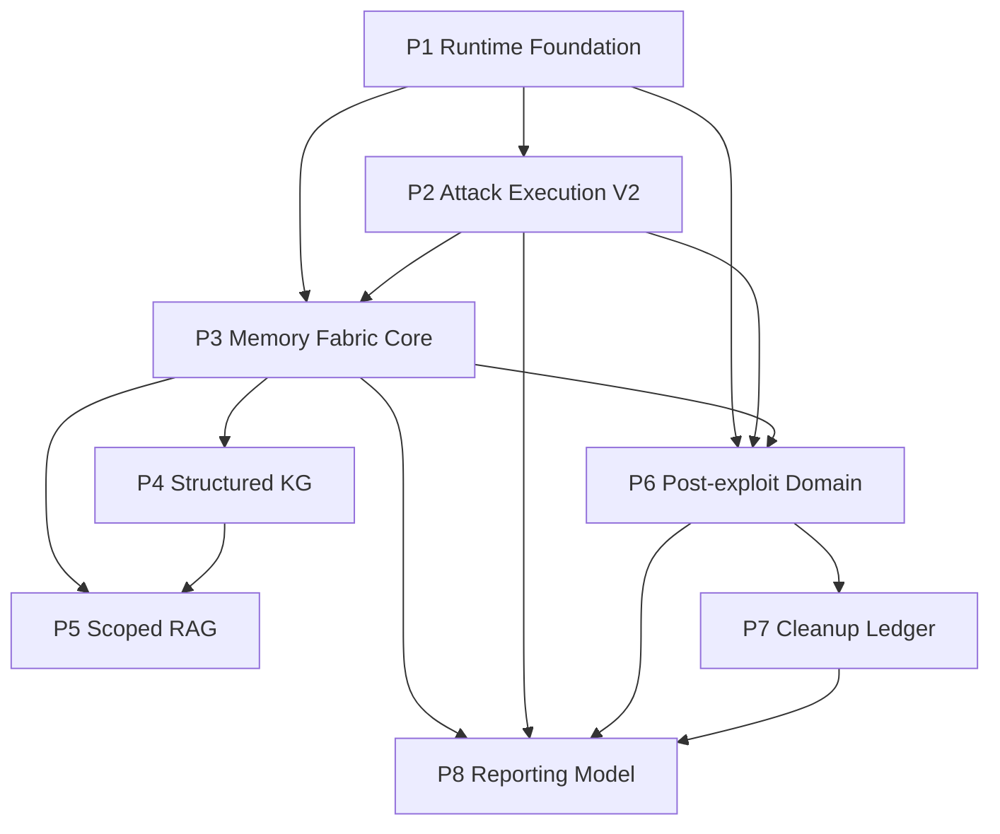

# Golish 运行期记忆与 Candidate 攻击流水线 V2 总路线图实现计划

> **面向 AI 代理的工作者：** 必需子技能：使用 superpowers:subagent-driven-development（推荐）或 superpowers:executing-plans 逐任务实现此计划。

**目标：** 按可独立验证的发布包，把 Golish 从共享 `state_blob`/模型交付驱动升级为 operation scope 冻结、per-org/per-worker 可恢复运行、逐 Candidate 审批和 Attempt、FactDelta 波次，以及 evidence-backed 长期知识、post-exploit、cleanup 和 reporting 闭环。

**架构：** canonical DB/evidence 是唯一事实源；runtime memory 只负责作用域、调度和恢复；StageHandoff/Episode/Assertion 是带来源的派生层；KG/vector/RAG 是可重建投影。攻击阶段沿用 `vuln_triage → attack_candidate → verification`，但 Candidate、approval、Attempt、wave 全部改为 DB 权威。

**技术栈：** Rust 2021、sqlx/PostgreSQL/pgvector、Tauri 2、React 19/TypeScript、rig-core、Graphiti-compatible projector、Vitest、cargo-nextest。

**设计来源：** `docs/design/2026-07-12-runtime-memory-candidate-pipeline-v2.md`

---

## 1. 为什么拆成八个实施包

本需求跨越运行时、攻击领域、知识投影、后渗透和报告。把它写进一个执行计划会导致三类风险：

- 任一 migration/IPC 变更会阻塞整条大分支，无法独立回滚。
- RAG/KG 可能在 canonical truth 尚未稳定时抢先成为事实源。
- post-exploit、cleanup、reporting 会继续依赖自由 prose，而不是 typed domain。

因此每个包都必须能独立产生可工作、可测试、默认关闭或兼容的增量：

| 包 | 详细计划 | 独立产物 |
|---|---|---|
| P1 Runtime Foundation | `2026-07-12-runtime-memory-foundation.md` | frozen org scope、StageRunUnit、WorkerRun、Handoff、exact resume |
| P2 Attack Execution V2 | `2026-07-12-candidate-verification-pipeline-v2.md` | Candidate approval、Attempt、DB Gate、FactDelta/wave、UI |
| P3 Memory Fabric Core | `2026-07-12-memory-fabric-core.md` | Episode、Assertion、Document、Outbox、invalidation |
| P4 Structured KG | `2026-07-12-structured-knowledge-graph-projector.md` | typed outbox → temporal graph，关闭 prose/stdout 提升 |
| P5 Scoped RAG | `2026-07-12-scoped-rag-context-pack.md` | ContextQuery/ContextPack、hard filters、prompt security |
| P6 Post-exploit Domain | `2026-07-12-post-exploit-domain.md` | foothold/internal asset/path/objective typed domain + stage capability |
| P7 Cleanup Ledger | `2026-07-12-cleanup-obligation-ledger.md` | side-effect obligation、attempt、absence proof、residual |
| P8 Reporting Model | `2026-07-12-reporting-read-model.md` | cited/scoped/redacted/versioned report read model |

---

## 2. 依赖顺序



硬顺序：

1. P1 必须先完成，因为所有后续 worker/attempt 都需要可信 operation/org/stage identity。
2. P2 的 schema/terminalizer 必须在 P3 前完成，因为 Episode 需要 exact CandidateAttempt lineage；P2 全包也必须在 P6 前完成，因为 post-exploit 入口必须来自 verified Candidate/Finding，而不是自由文本。
3. P3 必须在 P4/P5/P6 前完成：KG/vector/RAG 需要 Assertion/outbox，P6 也要用 versioned event catalog 发布 post-exploit promotion event。
4. P7 必须在 P8 validation/finalization 前完成，否则报告无法确定残余清理风险。

可并行：

- P3 可在 P2 的 UI/集成阶段并行，但只能在 P2 migration、repo 与 terminalizer contract 已落地后开始。
- P4 与 P6 可并行。
- P5 只能在 P3/P4 的 scope 和 provenance 测试通过后开始。

---

## 3. 统一 feature 与兼容策略

### 3.1 Feature registry

执行 P1 前，在 `feature_list.json` 新建父条目：

```json
{
  "id": "runtime-memory-candidate-pipeline-v2-2026-07-12",
  "priority": 1,
  "area": "runtime memory + attack execution + knowledge + post-exploit closeout",
  "title": "Operation-scoped runtime memory and DB-authoritative candidate execution V2",
  "user_visible_behavior": "Every in-scope organization and worker resumes independently; approved attack candidates are verified one at a time; only evidence-backed deltas open new waves; long-term knowledge and reports remain scoped and cited.",
  "status": "not_started",
  "design": "docs/design/2026-07-12-runtime-memory-candidate-pipeline-v2.md",
  "plan": "docs/superpowers/plans/2026-07-12-runtime-memory-candidate-pipeline-roadmap.md",
  "verification": [
    "just check-fe",
    "just test-fe",
    "just lint-rust",
    "just test-rust",
    "just precommit"
  ],
  "evidence": "Planning package created on 2026-07-12; implementation has not started.",
  "notes": "Schema/migration and IPC work require explicit user approval before P1/P2/P3/P6/P7/P8 implementation."
}
```

开始实施时遵守一次一个 `in_progress`：当前已有 feature 未完成时，不得擅自切换。父条目只跟踪全局状态，各包的进度写入 `notes`，避免同时创建多个 `in_progress`。

### 3.2 Runtime switches

新增统一 config，不把开关散落到环境变量判断：

```rust
pub struct HarnessRuntimeV2Config {
    pub runtime_memory_reads: RuntimeMemoryReadMode,
    pub runtime_memory_writes: RuntimeMemoryWriteMode,
    pub candidate_execution_v2: bool,
    pub document_projection: bool,
    pub embedding_projection: bool,
    pub graph_projection: bool,
    pub scoped_rag: bool,
    pub post_exploit_domain: bool,
    pub reporting_read_model: bool,
}

pub enum RuntimeMemoryReadMode {
    Legacy,
    PreferV2WithLegacyFallback,
    V2Only,
}

pub enum RuntimeMemoryWriteMode {
    LegacyOnly,
    DualWrite,
    V2Only,
}
```

放置：

- `backend/crates/golish-agent-bridge/src/agent_bridge/config.rs`
- 通过现有 Bridge/AgenticLoop context 传播。

默认发布顺序：

```text
read=Legacy, write=LegacyOnly
-> read=PreferV2WithLegacyFallback, write=DualWrite
-> read=V2Only, write=DualWrite
-> read=V2Only, write=V2Only
```

不要在同一 release 删除 legacy schema；清理由独立 contract migration 完成。

这些开关只控制新工作或可重建 projection：

- `graph_projection=false` 不影响 document/embedding delivery，反之亦然。
- 每个 operation 在创建时冻结 execution contract version，运行中不得在 Candidate V1/V2 间切换。
- `post_exploit_domain=false` 只禁止创建新副作用 action；已存在的 `prepared|running` action reconcile 与 cleanup recovery 始终启动，不能被 feature flag 关闭。
- `reporting_read_model=false` 时旧 renderer 最多生成 draft，不能 finalize/publish。

---

## 4. 每包通用执行循环

每个详细计划均按以下循环执行：

计划中的 `Task` 是可回滚交付单元，不等于一次编辑动作。Task 若包含多张表或多个 repo，执行者必须按“一个失败测试/fixture → 一个 migration fragment 或一个函数 → 运行该精确测试 → 记录结果”的 2–5 分钟微步推进；不得一次写完整个目录后才测试。

1. 读对应模块卡。
2. 把父 feature 切为 `in_progress`，在 `agent-progress.md` 新建本包会话记录。
3. 对 schema/IPC 高风险步骤取得当次用户确认。
4. 写最小失败测试。
5. 运行精确测试并记录 RED 输出。
6. 实现最小代码。
7. 运行精确测试并记录 GREEN 输出。
8. 每个可独立回滚的 task 在 scoped tests 通过后，先运行并记录 `just precommit`；只有全绿才可单独 commit。若不准备为中间 task 跑完整门禁，就保留未提交状态，等包级门禁后一次提交。
9. 更新模块卡和 `docs/modules/INDEX.md`。
10. 跑包级门禁，并在任何 commit 前再次确认最近一次 `just precommit` 对当前 tree 有效。
11. 将命令、exit code、关键输出写入 `agent-progress.md` 和 feature evidence。

真实 LLM、扫描、exploit、Graphiti/embedding 外部请求不属于默认自动验证。需要 live acceptance 时，单独向用户说明目标、scope、外部影响并取得授权。

当前工作树若非 clean，commit 前必须用精确文件列表 staging，并执行 `git diff --cached --name-only` 确认没有混入用户既有改动；禁止 `git add frontend`、`git add backend/crates/<crate>`、`git add docs/modules` 这类目录级 staging。

---

## 5. 发布里程碑

### M1：可恢复的信息收集 runtime

包含 P1，先迁移：

- Target Intel
- External Attack Surface
- Enumeration
- Vuln Triage

验收：

- 两 org worker checkpoint 并存。
- kill/restart 后 exact resume。
- 已 PASS org 不重跑。
- org tree 后改不影响 frozen operation scope。
- workspace path 只作 provenance；稳定 `project_scope_id` 在 path 显示变更后仍保持 authorization identity。

### M2：逐 Candidate 攻击

包含 P2。

验收：

- `vuln_triage` 全量扫描完成后才生成 Candidate。
- UI 从 DB 加载候选并逐项审批。
- verifier 一次一个 CandidateAttempt。
- DB unresolved candidate 无法被空 deliverable 绕过。
- verified 才生成 Finding。
- FactDelta 驱动 a→b→c wave。

### M3：Evidence-backed knowledge

包含 P3、P4、P5。

验收：

- prose/stdout 不会成为可信图事实。
- assertion/outbox event 可幂等重放和失效，Graph/Document/Embedding 各自 delivery 独立 ack。
- RAG 先 scope filter 再 ranking。
- trusted authorization context 只能由 runtime 从 frozen scope/data policy/server time 构造。
- 关闭知识功能后 Gate/事实集合完全一致。

### M4：Post-exploit 与安全收尾

包含 P6、P7、P8。

验收：

- verified foothold 有 evidence 与 vault ref。
- side effect 前先在同一短事务创建 prepared action 与 cleanup obligation。
- cleanup blocked/waived 作为 residual 披露。
- 报告每个 claim 只引用冻结 version/hash 的 current canonical fact 与 evidence；stage 只到 validated，用户显式 finalize。

---

## 6. 整体回归矩阵

| 场景 | 必须证明 |
|---|---|
| root-only operation | 只创建 root units；后来新增 child 不会加入 |
| approved subsidiaries | 每 org 独立 StageRunUnit/WorkerRun/Handoff |
| sibling org | candidate/evidence/knowledge/report section 不串 |
| worker crash | 恢复 exact chain/checkpoint，不重复副作用 |
| stale scope | approval/attempt/handoff 被拒绝 |
| candidate retry | 新 ordinal；旧 Attempt/evidence 保留 |
| background completion | 仍归原 attempt；terminal stale 写被拒绝 |
| DB outage | Gate BLOCK，不用 deliverable/RAG 兜底 |
| wave replay | delta/wave 幂等，不重复 Candidate |
| projector replay | 不重复 graph/document/vector；一个 projector ack 不吞掉其它 delivery |
| prompt injection | malicious prior 即使请求越权 tool，也被 pre-action authorizer 拒绝 |
| secret handling | 只出现 vault_ref，不进 embedding/report prompt |
| cleanup failure | Gate 同时检查非终态义务和“副作用 action 缺 obligation”；报告披露 residual，不显示 cleaned |
| report snapshot | 每个 claim 固定 source version/hash；source build 中变化导致 conflict |
| knowledge disabled | Gate 和事实输出不变 |

---

## 7. 包级验证命令

每包详细命令见子计划。总体验证顺序：

```bash
cd backend && cargo fmt --all -- --check
cd backend && cargo nextest run -p golish-db --no-tests=fail --status-level fail
cd backend && cargo nextest run -p golish-agent-kit --no-tests=fail --status-level fail
cd backend && cargo nextest run -p golish-agent-runtime --no-tests=fail --status-level fail
cd backend && cargo nextest run -p golish-sub-agents --no-tests=fail --status-level fail
cd backend && cargo nextest run -p golish-agent-app --no-tests=fail --status-level fail
cd backend && cargo nextest run -p golish --no-tests=fail --status-level fail
pnpm typecheck
pnpm test -- --run
just lint-rust
just precommit
```

预期：所有命令 exit 0；nextest 无 failed；Clippy 零 warning；TypeScript 零 error。

live acceptance 只在用户明确给出已授权 workspace、允许启动本地 runtime，并确认本次不会触发未批准的扫描/攻击后另行执行：

```bash
export AUTHORIZED_WORKSPACE='/absolute/path/from-user'
test -n "$AUTHORIZED_WORKSPACE" && test -d "$AUTHORIZED_WORKSPACE"
python3 scripts/run_tree.py --workspace "$AUTHORIZED_WORKSPACE" --full --db
```

必须从输出证明：scope snapshot、stage unit、worker/attempt id、Gate verdict、evidence、handoff、wave lineage 与 DB 行一致。仅有“工具运行过”不算通过。

---

## 8. 回滚策略

- P1：切回 legacy read/write；保留 additive 表，不删数据。
- P2：关闭 `candidate_execution_v2`；旧三阶段骨架仍可读，但不得继续真实 exploit，直到 V2 queue 恢复。
- P3：分别停止 document/embedding/graph delivery consumer；canonical runtime/attack 和未 ack delivery 不受影响。
- P4：停止 KG projector并从 outbox 重建；不改 source truth。
- P5：关闭 scoped RAG；agent 只用 DB truth/handoff。
- P6：关闭 post-exploit domain stage，Verification 后直达 Reporting。
- P7：不能通过开关绕过已有 cleanup obligations；只能停止新增 post-exploit action。
- P8：回退旧 renderer 只允许生成 draft，不能标记 final。

任何回滚都不物理删除 evidence、approval、attempt、cleanup obligation 或 report revision。

---

## 9. 最终完成定义

父 feature 只有在以下全部成立时才可 `passing`：

1. P1-P8 的包级验收全部有新鲜命令证据。
2. migration 在空库和包含 legacy rows 的升级库都验证成功。
3. CLI/chat 使用相同 frozen scope semantics。
4. 一次授权 live run 证明多 org、restart、逐 Candidate、FactDelta wave 和 reporting lineage。
5. knowledge on/off 的事实集合等价测试通过。
6. 模块卡、设计、计划、feature、agent-progress 同步。
7. `just precommit` 全绿。
8. 无未记录的 schema/IPC 兼容风险、未清理 side effect 或未披露 residual。
